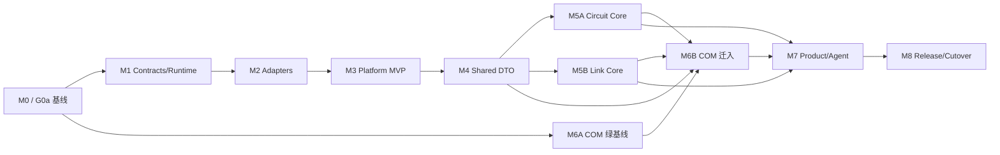

# SIPI-sim-agent 实施计划 v0.1

> 状态：未开始  
> 日期：2026-08-04  
> 依据：[SPEC.md](SPEC.md)  
> 估算口径：工程周，按一名熟悉 Python/Rust/SI 数值算法的工程师串行计算

## 1. 实施策略

采用“目标 monorepo、黑盒先行、门禁迁入”的顺序：

```text
冻结证据
  -> 建平台控制面和运行信封
  -> 用三个旧引擎完成黑盒闭环
  -> 建共享语义 DTO
  -> 带历史迁入 Circuit/Link core
  -> 原样迁入 COM 域包
  -> 接产品 UI/Agent
  -> 两个 RC 后切 source of truth
```

任何阶段都不得：

- 从带本地修改的工作树复制源码作为迁入基线。
- 用 sibling editable/path dependency 作为 release 方案。
- 在迁移行为的同时修正数值算法。
- 为了减少文件数删除 reference backend、oracle、旧结果 reader 或 compatibility CLI。
- 因函数同名就合并 COM、PyBERT 和 Agent-Spice 的物理语义。

## 2. 里程碑总览

| 里程碑 | 目标 | 估算 | 关键退出条件 |
| --- | --- | ---: | --- |
| M0 | 基线、许可、工具链和工件冻结 | 1-2 周 | 三仓有可解释 baseline；迁入来源可追溯 |
| M1 | 平台 contracts/runtime 骨架 | 2-3 周 | 运行信封和 consumer conformance 通过 |
| M2 | 三个黑盒 adapter | 2-3 周 | 旧 CLI 经平台运行且领域结果等价 |
| M3 | 统一项目、持久 supervisor 和首个跨引擎闭环 | 4-6 周 | Platform MVP 与 G2b 通过 |
| M4 | 共享 Axis/Network/Waveform DTO | 3-4 周 | Shared Data MVP 通过 |
| M5 | Circuit/Link core 与生产兼容包迁入 | 6-10 周 | Native Workspace MVP 通过 |
| M6 | COM 域包迁入与平台化 | 2-4 周 | COM 全 golden/预算不退化 |
| M7 | 本地服务、报告和 Agent 工具 | 3-4 周 | Agent MVP 通过 |
| M8 | 发布、双跑、切换和旧仓降级 | 2-3 周 + 两个 RC | G6 通过；一键回滚演练通过 |

串行 ROM 总量约 **25-39 工程周**，M0 完成后必须按真实 baseline 和认证矩阵重新估算。其中：

- 可用的统一平台壳（M0-M3）：约 9-14 工程周。
- 共享数据、原生 core 和生产兼容包收敛（M4-M6）：约 11-18 工程周。
- 产品化、Agent 和正式切换（M7-M8）：约 5-7 工程周，加两个 RC 观察周期。

两到三名工程师可并行 Circuit、Link、COM 和平台控制面，但 gate 不能因并行而跳过。
以上是工程投入，不包含法律授权、第三方许可证、外部模型获取或采购等待时间；这些外部阻断必须单独进入项目排期。

### 2.1 Gate 责任映射

`SPEC.md` 第 12 节是唯一 gate 定义，`quality/severity-policy.yaml` 是实施时的机器可读权威。映射固定为：`G0a -> M0 并前置 M1`；`G0b -> M0-M2，按 engine 独立关闭`；`G0c -> M5-M8，按资产独立关闭`；`G1 -> M1`；`G2a -> M2 adapter`；`G2b -> M3 lifecycle`；`G3 -> M4`；`G4 -> M3-M6 的每条 vertical slice`；`G5 -> M5/M6 历史迁入`；`G6 -> M8 发布与 source-of-truth 切换`。未知许可不会阻断独立的 M1 contract 工作，但会阻断对应 bundle、历史迁入和分发。M5 的 Native Workspace MVP 不包含两个 RC；两个 RC 只属于 G6/M8。

## 3. 依赖关系



M5A 和 M5B 可以并行。M6A 可从 M0 后独立开展；M6B 的准备工作可在 M4 后开始，但正式历史迁入和 source-of-truth 切换必须等 M5 证明迁入流程、DTO 和 runtime 边界稳定，因此“COM 最后迁入”是硬顺序。M7 的工具 schema 和只读原型可在 M3 后并行，完整验收仍依赖 M5/M6。

## 4. M0：基线与治理

### 4.1 目标

把“当前能运行什么、在哪个环境运行、哪些失败已知、哪些数据可分发”变为可审计事实。M0 不做平台功能。

### 4.2 任务

| ID | 任务 | 产物 |
| --- | --- | --- |
| M0-01 | 记录三仓 HEAD/tree hash、branch、dirty diff 清单、remote、依赖锁和构建工具 | `docs/baselines/source-inventory.md` |
| M0-02 | 为未提交修改建立非破坏性备份，并逐 diff 标记 `keep/drop/port`、owner 和目标任务；迁入只接受后续 clean tag | `dirty-disposition.v1.yaml`、备份记录和恢复演练 |
| M0-03 | 安装并锁定 Python、Rust、Node/GitNexus 和外部工具版本 | `toolchains.lock`、`sipi doctor` 设计输入 |
| M0-04 | Agent-Spice 运行 collect、Python full、`cargo test`、wheel smoke；固定 skip/外部 oracle 清单 | `agent-spice-baseline.json` |
| M0-05 | 重建 PyBERT GitNexus 索引；恢复/分类 PyAMI、IBIS-AMI 和 TestSweep 失败；运行 Rust/Python/adapter 测试 | `pybert-baseline.json` |
| M0-06 | 明确 agent-com capability policy；修复代码、测试和文档漂移；重跑 fast/golden/full | `agent-com-baseline.json` |
| M0-07 | 对 MATLAB、ADS、COM workbook、图像、私有 corpus 和第三方 solver 建工件清单/hash | `fixtures/manifest.v1.json` |
| M0-08 | 决定 LFS 或外部 artifact store，并做一条下载、校验、离线失败测试 | artifact store ADR |
| M0-09 | 逐项分类 `agent-spice`、`agent-com` 源码和数据，引用已有授权/NOTICE、指定缺口 owner，并建立机器可拒绝的资产状态；不把等待外部授权算作 M0 工程完成条件 | `license-manifest.v1.yaml`、现有许可证据和授权缺口清单 |
| M0-10 | 固定首签核平台和认证环境，建议 Windows x86_64/CPython 3.12 | platform support ADR |
| M0-11 | 按 operation/payload/engine instance/profile/OS 盘点旧入口、source tag、旧工件、环境锁、required/optional fixture 和当前证据；此时 schema 未冻结，不得 advertise | 非公共 `docs/baselines/capability-inventory.yaml` |

### 4.3 退出条件

- 每个已知失败都有 owner、原因、是否阻断和重现命令，不以“历史上通过”代替当前证据。
- 三仓迁入候选均来自 clean tag；用户现有修改未丢失。
- 大型 golden 可通过 hash manifest 获取。baseline 收集允许把缺失项标为 `unavailable`，但迁入/发布 required fixture 必须零未解释 skip；缺失 optional fixture 时对应 capability 保持 uncertified，不能 advertise。
- 资产许可状态只允许 `authorized_public`、`authorized_private`、`external_reference_only`、`blocked_unknown`。M0/G0a 要求分类、证据引用、owner 和机器拒绝策略完整，不要求外部授权已经到达；`blocked_unknown` 不阻断独立 M1，但不能进入对应 bundle 或源码迁入；`external_reference_only` 只能通过用户提供的外部位置消费。ADR 或内部意见不能代替正式授权证据。
- Rust 和 Python 测试工具链在干净环境可复现。

M0 使用统一的 baseline tag 规则：`sipi-baseline/<engine>/<YYYYMMDD>.<n>`。tag 必须是 annotated tag，指向 clean tree；对应 CI 全绿，或附带经领域 owner 和测试 owner 共同批准的 waiver manifest。所有原 dirty 修改必须明确归属为已提交、已备份待处理或排除项。是否使用签名 tag 由许可/发布 ADR 决定，release candidate 必须使用可验证签名或等价的 CI provenance。

M0 同时创建以下机器可读质量策略，后续 gate 不再依赖散落在文档里的数字：

```text
quality/severity-policy.yaml
quality/tolerance-profiles/<engine>.yaml
quality/performance-budgets/<engine>.yaml
fixtures/manifest.v1.json
```

策略至少定义 P0/P1/P2 阻断级别、fixture ID、comparator、stage tolerance、性能环境和 waiver 审批者。

## 5. M1：Contracts 与 Runtime 骨架

### 5.1 目标

在新仓建立独立于三种数值实现的控制面。此阶段不搬引擎源码。

### 5.2 仓库脚手架

创建：

```text
apps/sipi-cli
packages/sipi-contracts
packages/sipi-runtime
packages/sipi-artifacts
packages/sipi-adapters
schemas
tests/contract
tests/runtime
docs/adr
engine.lock
```

顶层可使用 `uv` workspace 管理平台开发工具，但各引擎继续保留自己的认证 lock。Cargo workspace 在 M5 前只建立空的治理文件或延后创建，禁止先造无消费者的 shared crate。

### 5.3 任务

| ID | 任务 | 说明 |
| --- | --- | --- |
| M1-01 | 写 ADR-001 至 ADR-008 | 将 `SPEC.md` 的决策拆成可单独修订的记录 |
| M1-01A | 固化 schema authority matrix | 把 `SPEC.md` 6.8 写成 `schemas/authority.v1.yaml`，现有 PyBERT/COM/Agent-Spice v1 不可变 |
| M1-01B | 定义 capability 状态 schema 并转换 M0 inventory | role、implementation、evidence、release channel 正交；生成不可 advertise 的 `capabilities.baseline.v1.json` |
| M1-02 | 定义 `sipi.run-request.v1` 和 `sipi.run-result.v1` | 固化 run/analysis/attempt/backend-execution 四层 ID 与 strict/auto/compare discriminated selection |
| M1-02A | 定义 `sipi.backend-execution-request.v1/result.v1` | strict-only adapter SPI；单一 exact instance/role/预算，runtime 聚合为 run result |
| M1-03 | 定义 validation、events、errors、resource limits | JSON Schema Draft 2020-12；`wall_time_s -> Timeout`，其他 limit -> `ResourceLimit` |
| M1-04 | 定义 `sipi.artifact-ref.v1` 和 provenance | 显式映射 PyBERT/COM 引用，不扩写领域 v1 |
| M1-05 | 实现 Python immutable models 和 schema validator | 禁止 NaN/Inf、路径逃逸和非法状态迁移 |
| M1-06 | 建 schema conformance fixtures | known-good、unknown field、version mismatch、超限、损坏 hash |
| M1-07 | 实现原子 staging/publish 和 checksums | 实际 attempt 的三个终态写 `run-record`；未执行的 blocked DAG node 写 node record；仅 succeeded 写 success manifest |
| M1-08 | 实现 engine registry 与 `engine.lock` parser | 固定 artifact hash、protocol 和 capabilities digest |
| M1-09 | 分别实现 project execution、DAG node 与 attempt 状态机、event sink 和 cancellation token | `blocked` 仅属于未执行 node；事件携带层级 ID，序号在 execution 内单调 |
| M1-10 | 增加最小 `sipi doctor/capabilities` | 尚不运行真实分析 |

### 5.4 退出条件

- Python 与 Rust consumer conformance 全通过。Rust toolchain 是 M0 退出条件，因此 G1 不接受“只准备方案”的替代证据。
- 旧 consumer 读取新增可选结果字段不会失败；不兼容请求明确要求新 schema ID。
- artifact 路径、hash、原子发布、取消和非法状态均有故障注入测试。
- 四层执行 ID 不混用，retry/compare fixture 不覆盖目录；四层 ID/lineage 从 content cache key 排除；backend selection 三个分支的非法字段组合均被拒绝。
- M0 inventory 已可重复转换为 baseline capability schema，四个正交状态字段无隐式组合或 advertise 旁路；experimental/internal 不能进入默认 auto。
- adapter conformance 只接受 backend-execution request/result；向 adapter 传入 attempt selector 或让 adapter 返回聚合 run result 必须失败。
- runtime 不 import `agent_spice`、`pybert`、`agent_com` 或其私有实现。
- schema 演化遵循 `SPEC.md` 6.7：request 严格、result 容忍未知可选字段、breaking change 使用新 major schema ID。

## 6. M2：黑盒引擎适配器

### 6.1 目标

在不改变数值实现的前提下，让平台运行三个引擎，并证明平台只改变运输和工件包装。

### 6.2 通用 Process Adapter

实现能力：

- 从 `engine.lock` 解析可验证 engine bundle，而不只是一条绝对 executable/interpreter 路径。bundle manifest 固定 wheel/executable、managed venv、native DLL closure、protocol、capabilities、依赖锁、platform 和全部 hash。
- Python bundle 从 wheel 安装到平台管理的隔离 venv，以 isolated mode/`PYTHONNOUSERSITE=1` 运行，拒绝 user-site、editable install、`PYTHONPATH` 和 sibling repo import；native bundle 启动前校验动态库闭包和 executable hash。
- 每次运行使用独立临时目录和受控环境变量 allowlist。
- 支持由 `resource_limits.wall_time_s` 驱动的 timeout、取消、进程树清理和逐平台资源 enforcement；hard memory/time/process 需求必须使用 managed worker。
- stdout/stderr 只作日志；数据只读版本化文件或明确 stdout JSON 协议。
- 校验请求、返回码、必需工件、schema、hash 和 producer。
- 记录 command template，不把秘密或用户绝对路径写进共享结果。
- runtime 是唯一 backend selector。adapter 只暴露 strict engine instance，例如 `pybert-python`、`pybert-rust`、`pybert-hybrid-ami`；不得在平台 `auto/compare` 内再次调用引擎自己的 `sim-auto/sim-compare`。
- adapter SPI 只消费/产生 `BackendExecutionRequestV1/ResultV1`；`RunRequestV1/ResultV1` 由 runtime 拥有，auto/compare 不跨入 adapter。

### 6.3 三个 adapter

| Adapter | 首批 operation | 兼容依据 |
| --- | --- | --- |
| `agent-spice-process` | `circuit.solve.v1`、`network.fit.v1` | `run-hspice`、`run-rfm`、稳定拟合 CLI/工件 |
| `pybert-process` | `link.simulate.v1` | strict Python reference、`sim-native`/strict Rust、strict hybrid-AMI 实例及 Web result artifacts；不嵌套 auto/compare |
| `agent-com-process` | `com.r480.run.v1` | `com8023 run`、typed result JSON/NPZ/HTML |

### 6.4 任务

| ID | 任务 | 门禁 fixture |
| --- | --- | --- |
| M2-01 | Agent-Spice adapter | 小型 RC deck、RFM response、一个 fit case |
| M2-02 | PyBERT strict adapters | seeded NRZ/RLGC、Python reference 和 Rust candidate；compare 只由 runtime 组合两个 strict backend execution |
| M2-03 | Agent-COM adapter | 一个最小 r4.80 victim case和一个带 crosstalk case |
| M2-04 | 领域结果包装 | strict adapter 返回单 backend-execution result；runtime 将一个或两个结果聚合，原领域 schema 作为 artifact |
| M2-05 | 旧 CLI 与新 adapter 双跑比较 | 使用原有 comparator/tolerance，不重写 golden |
| M2-06 | failure matrix | executable 缺失、hash 错、`wall_time_s` timeout、取消、崩溃、半工件、stderr 噪声 |
| M2-07 | selection/channel trace | auto 只记录 stable 候选的预检 fallback；compare 固定 role/ID/producer；experimental 仅显式 strict/compare opt-in，internal 仅内部 policy |
| M2-08 | 干净安装 smoke | 无源码和无 sibling repo 环境 |
| M2-09 | engine bundle attestation | user-site/editable/sibling/DLL 污染测试和 bundle hash 验证 |
| M2-10 | selector ownership | runtime 固定候选顺序、预算和错误分类；adapter strict-only |
| M2-11 | 能力晋级 | 仅将通过 G0b/G2a、具备 bundle hash/attestation 和有效 fixture 的组合生成到 `capabilities.certified.v1.json`；hard enforcement 等 M3/G2b 证据后再增加 |

### 6.5 退出条件

- 同一 fixture 经旧入口和 adapter 得到领域等价结果。
- 三个 adapter 均不 import 引擎私有 Python 符号。
- 取消/崩溃后没有残留进程；半工件不会被 cache 或发布。
- 每个结果可回答“请求了哪些 exact instance、哪个进入了数值执行、compare 两角色分别是谁、为何 fallback、每份产物由谁生成”。
- `auto` 只在预检 `EngineUnavailable/UnsupportedCapability` fallback；compare 预留 reference+candidate 总预算并保留两份状态，数值执行开始后的失败不触发第二层选择。
- `sipi capabilities` 只 advertise M2-11 certified 组合；M0 baseline inventory 永不直接成为运行能力声明。

## 7. M3：Platform MVP 与纵向切片

### 7.1 目标

交付第一个真正可用的平台壳：一个项目、一个命令、三个分析、统一结果和一条跨引擎链路。

### 7.2 任务

| ID | 任务 | 说明 |
| --- | --- | --- |
| M3-01 | 定义 `sipi.project.v1` | analyses 使用 discriminated operation，不设计万能 payload |
| M3-02 | 实现 path resolution 和输入 hash | 所有路径相对 project root，生成 resolved request |
| M3-03 | 实现本地分析 DAG | 四层 ID；自动 retry 只在 active node 内追加 attempt，手工 retry 新建 RUN_ID/retry_of；cache 只按内容/语义寻址并排除执行 ID |
| M3-04 | 实现持久本地 supervisor | OS singleton lock + SQLite 单写者四层表；registry 是协调权威；version CAS、idempotency、lease/heartbeat、IPC、Job Object/process group 和 reconciliation |
| M3-05 | 完成 `validate/run/status/cancel/retry` | RUN_ID 始终指 project execution；手工 retry 返回新 RUN_ID；analysis/attempt 用显式选项，旧终态不可 reopen |
| M3-06 | 完成 `compare/report` | 领域 comparator 插件化，统一 provenance 摘要 |
| M3-07 | 建三引擎示例项目 | Circuit、Channel、COM 各一个可复现 fixture |
| M3-08 | 复现 RFM -> PyBERT 现有桥接 | 使用显式 DAG binding、`agent-spice.rfm-response.v1` consumer 和 sign golden |
| M3-09 | 端到端并发与失败注入 | 双 supervisor、提交重放、自动/手工 retry、终态不 reopen、required/optional cancel 聚合及 terminal CAS、四层目录、compare 双 execution、publish crash、restart/reap/cache |
| M3-10 | 写用户迁移指南 | 旧命令到 `sipi` operation 的映射 |
| M3-11 | 实现资源 enforcement matrix | Windows/Linux/macOS 对 wall time、memory、CPU、process、artifact bytes 逐项认证；hard 限制走 managed worker，无法强制则预检失败 |

### 7.3 纵向切片验收

```text
Agent-Spice RFM/deck
  -> versioned response artifact
  -> current sign / ports / loads / FFT mapping
  -> PyBERT strict link request
  -> stage arrays / eye / BER
  -> compare report / provenance
```

门禁：

- Agent-Spice RFM hash、端口顺序和 AC-probe sign 与现有 golden 一致。
- PyBERT strict candidate 不支持的控制明确失败，不被悄悄丢弃。
- 新平台与现有跨仓 promotion fixture 的关键数组和指标在原 tolerance 内。
- COM 可在同一项目中独立运行并进入统一报告，但不被错误接到该物理流水线。
- `required` 资源限制的支持组合全部有命中 fixture；同进程 PyO3 不得宣称 hard memory/time 隔离，要求 hard limit 时必须走受管 worker 或返回 `UnsupportedCapability`。

M3 完成即达到 `SPEC.md` 的 Platform MVP。

## 8. M4：共享语义 DTO

### 8.1 目标

统一引擎间的数据语义和验证，而不是选择一个实现替代其他实现。

### 8.2 任务

| ID | 任务 | 重点 |
| --- | --- | --- |
| M4-01 | `AxisV1` | 非均匀轴、DC/Nyquist、单双边谱、sample/bin 语义 |
| M4-02 | `PortMapV1` | 稳定 ID、index-base、参考、差分对、极性、basis |
| M4-03 | `NetworkTensorV1` | S/Y/Z、wave definition、频变 z0、复数布局、matrix order |
| M4-04 | `WaveformV1/SpectrumV1` | 单位、参考、FFT scaling、window、warm-up、裁剪和 shape |
| M4-05 | 建唯一 production channel resolver | 唯一代码 owner 是 `packages/sipi-adapters/channel_resolver`；实现 `NetworkTensorV1 + resolution-policy ->` 不可变 PyBERT `ChannelResponseV1 + report`，不扩写领域 v1 |
| M4-06 | Python/Rust conformance | zero-copy 不是首要门禁，语义和 shape 先正确 |
| M4-07 | 三 reader adapter | COM-r480、COM-standard、PyBERT/Agent-Spice standard 各保留 profile |
| M4-08 | cross-profile fixture matrix | 同输入锁各自结果，不要求三者相等 |
| M4-09 | 显式 transform policies | 端口变换、插值、DC 外推、因果性、passivity 先保留实现名 |
| M4-10 | cache identity | 所有语义字段和 producer 进入 cache key |

### 8.3 必测矩阵

- S2P、S4P、8-port/N-port。
- S/Y/Z 和 power/pseudo/traveling wave definition。
- 标量与逐频点/逐端口 `z0`。
- 单端、差分、common-mode、端口置换和反极性。
- 非均匀频轴、缺 DC、存在/缺失 Nyquist。
- C/F layout、大小端、complex128 和明确拒绝的 dtype。
- 电压、电流、阻抗传递和开路/负载后响应。

### 8.4 退出条件

- DTO schema 有清晰物理含义和双语言 consumer conformance。
- 三个 reader/transform profile 可共存且结果可追踪到 producer/policy。
- RFM -> Channel 切片改用 DTO 后不退化。
- 没有把 COM 的行为默认值变成平台默认值，也没有把 PyBERT conditioning 隐式施加给 COM。

M4 完成即达到 `SPEC.md` 的 Shared Data MVP。

## 9. M5：Circuit 与 Link 原生内核收敛

### 9.1 原则

- 先在原仓完成无行为重构，再带历史迁入。
- Link 和 Circuit 是兄弟 crate，都依赖 `sipi-types`；组合逻辑在 `sipi-pipeline`，避免 Link 必须依赖 Circuit。
- 旧 CLI 和进程协议继续是外部稳定 API。
- `sipi-python` 是薄 PyO3 binding，不承载数值算法。

### 9.2 M5A：Agent-Spice Circuit

| ID | 任务 | 说明 |
| --- | --- | --- |
| M5A-01 | 在 agent-spice 原仓建立 `lib.rs` | 从 binary 抽 `Deck`、solver、RFM、observer、result，不改行为 |
| M5A-02 | 薄化 CLI | 参数解析、文件 I/O、进度和退出码留在 binary |
| M5A-03 | 冻结 versioned Circuit API | 明确单位、端口、结果 schema、panic/error |
| M5A-04 | 补 `cargo test/clippy/fmt` 和差分 oracle | HSPICE/ngspice/C# 仍是可选外部 lane |
| M5A-05 | 处理多套 pole-residue adapter | 先互转和 round-trip，不删除表示 |
| M5A-06 | 用临时 clone/filter-repo 将 clean repo 历史迁入 `engines/agent-spice` | 不在用户主工作树执行破坏性过滤；保留 Python fit/CLI/tests/docs |
| M5A-07 | 在目标仓用历史保留 move 形成 `native/crates/sipi-circuit` | crate 不留双份；验证 tag artifact 等价 |
| M5A-08 | 接管 Agent-Spice Python 生产包 | 保留 `agent_spice` namespace、fit/RFM/HSPICE CLI；研究/外部 oracle 按 manifest 分类 |
| M5A-09 | 新增 IBIS/AMI clean-room 解析器 | 从 IBIS 规范编写（净新功能，来源干净，不继承 PyBERT BSD 代码）；进程内归 agent-spice-sim 使用；放 agent-spice，若其停止独立维护则直接放 SIPI-sim-agent |

### 9.3 M5B：PyBERT Link

| ID | 任务 | 说明 |
| --- | --- | --- |
| M5B-01 | 继续现有 Task 12/13 | 完整 result parity、RSS、nightly、故障演练；按 2026-08-07 收编结论将 Phase 1-3（native Web result contract parity → Rust 成默认 → web 指标改接 native）纳入本任务验收，配套执行路线见 Py-bert-agent 仓库 `docs/superpowers/plans/2026-08-07-pybert-core-rust-migration.md` |
| M5B-02 | 解锁 `auto` 前完成 strict NRZ/RLGC 门禁 | 当前 blocked 状态不得被平台绕过；`native_auto_parity_gate` 对已覆盖 profile 必须返回 `approved`（不得恒为 `blocked`） |
| M5B-03 | 消费 M4 channel resolver 并做 Link parity | 用同一 production resolver 锁 pulse、termination、port intent 和 FFT scaling；禁止在 `sipi-link` 再写一套 S2P/S4P 转换 |
| M5B-04 | 完整 host-driven AMI contract | DLL 仍留 Python host，补 clock/lock/cancel 跨平台 fixture |
| M5B-05 | GUI/optimizer 后端统一另行门禁 | 不阻塞 core 迁入，但不能宣称 GUI native 已完成 |
| M5B-06 | 修改现有 Task 14 目标 | 最终目的地从 Agent-Spice 改为 `SIPI-sim-agent`，避免二次搬迁；合并时 `pybert-core` 作为 BSD 派生翻译带 attribution/NOTICE 收编，`native/*/Cargo.toml` 的 MIT 声明与 BSD 派生来源的一致性由用户/法务决策 |
| M5B-07 | 用临时 clone/filter-repo 将 clean repo 历史迁入 `engines/py-bert-agent` | 保留 Python reference、AMI host、compat facade、tests/docs |
| M5B-08 | 在目标仓历史保留 move `pybert-core` | 形成 `native/crates/sipi-link`，不留第二份 Rust core，保留 v1 schema |
| M5B-09 | 接管 PyBERT 生产兼容包 | 保留原 namespace/CLI/reference/AMI host；Web/GUI 的后续搬移不删除兼容入口 |

### 9.4 M5C：Workspace 与 Binding

| ID | 任务 | 说明 |
| --- | --- | --- |
| M5C-01 | 建 `sipi-types` | 只放已有两个消费者的 value types，禁止空抽象 |
| M5C-02 | 建 `sipi-pipeline` | 只编排已由 M4 production resolver 解析的 Circuit/Channel artifact 与 Link；不复制 S2P/S4P resolver |
| M5C-03 | 迁 `pybert-python` 为 `sipi-python` | ABI、NumPy buffer、错误、取消、事件 adapter |
| M5C-04 | 拆 release profile | embed 路径可 unwind/catch panic；CLI 可独立选择优化策略 |
| M5C-05 | 进程 vs FFI A/B | 分离 marshal、engine、端到端时间和 RSS；没有收益就保留进程 |
| M5C-06 | 兼容 wheel/CLI | 旧包名和 v1 consumer 在过渡期继续工作 |
| M5C-07 | 生成历史迁入映射 | `history-map.v1.json` 记录 old/new commit、tree、path、tag artifact 和 retirement state |

### 9.5 退出条件

- Circuit/Link 每个迁入算法只有一个活跃 Rust source of truth；旧仓副本在 RC 期间冻结，不接受独立修改。
- 迁入历史可追溯到原 commit；新旧 tag 的规范化结果/工件等价。
- `sipi-circuit` 和 `sipi-link` 不依赖 runtime、Web、Agent、Python 或 PyO3。
- 旧 CLI、`agent-spice.rfm-response.v1` 和 PyBERT v1 仍通过 consumer contract。
- PyO3 panic、取消、超限和 buffer shape 故障不会终止 host 或产生不完整成功结果。
- Agent-Spice Python fit/CLI 与 PyBERT Python reference/AMI host 已在目标仓有明确生产位置和 history map，旧仓不再承载独立新功能。

M5 完成即达到 `SPEC.md` 的 Native Workspace MVP。

## 10. M6：COM 域包迁入

### 10.1 原则

COM 先迁移产品边界，后评估算法共享。它可以长期保留 Python 3.12 独立包和进程隔离，不以 Rust 化比例作为完成指标。

“最后迁入”只指源码历史和 source-of-truth。COM 在 M2 已经以黑盒 adapter 进入 Platform MVP；M6A 可并行修基线，M6B 正式迁入必须在 M5 后执行。

### 10.2 任务

| ID | 任务 | 说明 |
| --- | --- | --- |
| M6-01 | 完成 M0-06 绿基线 | 当前 capability policy 漂移必须先关闭 |
| M6-02 | 完成许可和大型 oracle 存储 | wheel 继续排除 MATLAB/benchmark 私有资产 |
| M6-03 | clean tag 带历史迁入 `engines/agent-com` | 保留 `agent_com` namespace 和 `com8023` |
| M6-04 | 在新仓原样运行 fast/golden/full | 预期值和 candidate 顺序不改 |
| M6-05 | 接平台 provenance/progress/artifacts | 通过 adapter/facade，先不改数值实现 |
| M6-06 | 接 `NetworkTensorV1` | 保留 r480/standard reader semantics 和转换记录 |
| M6-07 | 建 COM/Channel 并列报告 | metric namespace 独立，不暗示数值等价 |
| M6-08 | 评估依赖环境收敛 | 只有完整 golden 在候选 NumPy/SciPy/scikit-rf 组合通过才合并 lock |
| M6-09 | 逐项评估小原语共享 | FIR/array helper 等需 stage parity；reader/PDF/search/metrics 默认不动 |

### 10.3 COM 不可破坏清单

- r4.80 workbook/source-order/materialization/consumption。
- Touchstone token/端口和 mixed-mode profile。
- MATLAB half-away rounding、strict `>`、first-strict-best。
- direct/FFT convolution 策略和 candidate stream hash。
- package/board/termination、C2C/C2M、MMSE/FV-LMS 分支。
- COM/ERL/TDILN/RILN/VMA 指标和 typed result schema。
- 已接受性能 ADR、warnings、diagnostics 和 legacy output contract。

### 10.4 退出条件

- 新仓安装的 `agent-com` 与 clean tag 的 API/CLI/artifacts 在原 comparator 下等价。
- fast/golden/full 和已接受性能预算通过；大型 oracle hash 可追溯。
- 平台能统一调度和报告 COM，但没有替换其行为 profile。
- 发布文档包含非规范性声明和完整许可/provenance。

## 11. M7：产品服务、报告与 Agent

### 11.1 本地服务

- 把 runtime 暴露为本地 API；任务状态、事件和取消与 CLI 共用实现。
- 复用 PyBERT FastAPI/Redis/arq 的经验或适配代码，不让 Web 直接调用领域上帝对象。
- 首版保持本地单用户；多租户、远程 worker 和认证另立规格。

### 11.2 统一报告

- 项目视图按 Analysis 分区显示 Circuit、Channel、COM。
- 共享显示 provenance、输入模型、exact engine instance/profile、timing、warnings 和 artifact。
- 比较报告区分 schema diff、array diff、离散选择 diff、最终 metric diff 和性能 diff。
- 不把域专属结果压平为含义不明的“score”。

### 11.3 Agent 工具

| ID | 工具 | 允许行为 |
| --- | --- | --- |
| M7-01 | `validate_project` | 返回错误、capability 缺口和输入来源 |
| M7-02 | `list_capabilities` | 展示锁定 engine instance/profile 和正交能力状态，不猜测支持能力 |
| M7-03 | `run_analysis` | 创建新 run，受 timeout/resource/path 策略限制 |
| M7-04 | `get_run_summary` | 返回已验证 envelope 和 metrics namespace |
| M7-05 | `inspect_artifact` | 只读小型摘要或受限切片，不任意加载巨型数组 |
| M7-06 | `compare_runs` | 使用批准 tolerance/profile，返回证据位置 |
| M7-07 | `propose_sweep` | 生成新 revision 计划，执行需显式资源预算 |
| M7-08 | `run_sweep` | 只执行已批准 plan hash；总运行数/并发由 supervisor 硬限制，时间/内存等必须请求 `enforcement: required`，无 certified enforcer 时拒绝 |

### 11.4 Agent 验收

- 每条物理判断能追溯到 run/analysis/attempt/backend-execution ID、exact engine instance/profile、输入 hash 和 artifact/metric。
- Agent 无法修改已发布运行、绕过 strict capability 或提升资源限制。
- unsupported、fallback 和数值 warning 不被自然语言隐藏。
- 对同一运行重复解释不触发新的数值计算，除非显式创建新 run。

M7 完成即达到 `SPEC.md` 的 Agent MVP。

## 12. M8：发布与切换

### 12.1 发布矩阵

| Lane | 内容 |
| --- | --- |
| PR fast | contracts、runtime、adapter 单元、small golden、Rust unit |
| PR affected | 由变更检测选择 Circuit/Link/COM parity 和 integration |
| Nightly | 大型 S 参数、ADS/MATLAB/private oracle、RSS/长时故障注入 |
| Release | 全量 fast/golden/full、wheel、CLI、PyO3、进程树、签名和 SBOM |

### 12.2 平台与包测试

- Windows x86_64 为首签核；Linux/macOS 按 capability 扩展。
- 在干净环境安装 `sipi-platform` 与所选 engine artifacts，无源码/sibling repo。
- wheel 缺失、损坏、ABI 不匹配、模型崩溃、OOM、磁盘满、取消和超时均有预期结果。
- 记录平台开销、marshal、engine、RSS 和 cache 命中，不把不可比较数据放进性能结论。

### 12.3 双跑和回滚

- 两个 release candidate 周期同时保留旧入口与新平台入口。
- `engine.lock` 可以固定回旧 engine artifact，不依赖回退源码提交。
- compare 模式在抽样/夜间运行中验证新旧结果，不能成为高负载默认。
- 任一阻断数值回归、工件损坏或无法清理的子进程均停止切换。
- 每个 RC 至少持续 7 个连续自然日，且覆盖全部 PR lane、至少一次完整 nightly 和一次干净安装/回滚演练；两个 RC 的最短观察期因此为 14 天。`quality/severity-policy.yaml` 中 P0/P1 均阻断切换，P2 必须有 owner 和限期。

### 12.4 旧仓库降级条件

连续两个 RC 满足：

1. 无阻断领域回归。
2. 新仓发布工件可复现且可回滚。
3. 历史和 issue/文档链接已迁移。
4. 所有活跃开发者已切换目标仓。
5. 用户明确批准 source-of-truth 切换。

随后旧仓库改为受保护的只读镜像。若必须保留 `legacy-support` 分支，它只接受从新 monorepo 审批并回移的安全/兼容修复，不再接受独立功能开发，也不成为 source of truth。Python legacy core 和旧结果 reader 的删除另开不可逆变更计划，不包含在本计划自动动作中。

## 13. 现有计划的处理

### 13.1 PyBERT 2026-08-03 Rust 合并计划

原始任务定义位于迁入前来源文档 `Py-bert-agent/docs/superpowers/plans/2026-08-03-rust-simulation-engine-agent-spice-merge.md`。M0 应将该文档及其引用 commit/hash 固定进 baseline manifest，避免 Task 编号脱离原文。

- Task 1-11 的已落地代码直接继承，不在本仓重做。
- Task 12/13 继续完成完整 product parity、GUI/optimizer 边界、RSS/nightly 和故障演练。
- Task 14 的最终 workspace 从 `agent-spice` 改为 `SIPI-sim-agent`，避免先迁到 Agent-Spice 再搬一次。
- Task 15 只有在 M8 两个 RC 后、用户另行批准时才启动。

### 13.2 Agent-Spice 路线

- Rust circuit binary-to-lib 在原仓先完成并通过现有 oracle。
- 生产 fit/RFM/HSPICE CLI 保持兼容；研究 IdEM、benchmark、C# oracle 和第三方 solver 不作为首批迁入 core。
- 绝对路径 corpus 配置在迁入前参数化。
- IBIS/AMI 解析器按 M5A-09 作为净新 clean-room 功能处理：从 IBIS 规范编写、进程内归 agent-spice-sim 使用，不继承 PyBERT/BSD 代码。

### 13.3 Agent-COM 路线

- 先修当前 HEAD policy drift，再冻结新的 fast/golden/full 基线。
- 配置、reader、search、PDF 和 metric 作为完整 behavior profile 迁移。
- “共享算法”是迁入后的独立优化议题，不是迁入完成条件。

### 13.4 PyBERT-core Rust 迁移收编结论（2026-08-07，Py-bert-agent worker 转发，待评审）

Py-bert-agent 侧配套执行路线见其仓库 `docs/superpowers/plans/2026-08-07-pybert-core-rust-migration.md`（草稿，worker 侧准备）。以下为转发结论；SIPI-sim-agent 的 plan 仍是合并计划/架构（workspace crate 布局、clean-room 边界、license 策略、迁移顺序）的源头真相，本节只做收编记录：

1. 现有 `native/pybert-core` Rust 迁移（BSD 派生翻译）继续在 Py-bert-agent 演进；合并时带 BSD attribution/NOTICE 收编。
2. IBIS/AMI 解析器按净新 clean-room 功能处理：从 IBIS 规范编写，进程内归 agent-spice-sim 使用；建议放 agent-spice，若 agent-spice 停止独立维护则直接放 SIPI-sim-agent。
3. 若需完全摆脱 BSD，pybert 数值核心的 clean-room 重做放在干净的新项目（SIPI-sim-agent），不在 Py-bert-agent 内进行。
4. `pybert_web`/`gui`/`PyAMI` 仍为 Python 外壳/工具，合并时作为 Python 侧保留（与 §9.3 M5B、§14 映射一致）。
5. 依赖顺序：补全 native Web result contract parity（解除 `native_auto_parity_gate` 的 `blocked`）→ Rust 成默认 → web 指标改接 native → 移除 Python reference 路径 → 删除被 Rust 覆盖的数值 Python → S2P/拓扑决策 → GUI/optimizer/清理 → license 收尾与合并。
6. 不可恢复删除（`src/pybert/models/*`、`utility/` 数值模块、`python_backend.py`/`compare.py`、`gui/`、整仓 `src/pybert/`）在 golden fixture 全覆盖、备份分支且用户确认前不执行，并受 §4.3 许可门禁和 §12.4 删除计划约束；`native/*/Cargo.toml` 的 MIT 声明与 BSD 派生来源的一致性由用户/法务决策。

#### 落地映射（结论 → plan 步骤）

- 结论 1（以本 plan 为源头真相）→ 本 plan 全局，尤其 §9.3/§13.1/§14；本节记录即执行依据。
- 结论 2（`pybert-core` 留在 Py-bert-agent 演进、合并带 BSD attribution/NOTICE）→ M5B-01（继续演进）、M5B-06（收编时 NOTICE/attribution）、M5B-07/08（历史迁入保留）；license 门禁归 M0-09/§4.3。
- 结论 3（IBIS/AMI clean-room 归 agent-spice-sim）→ 新任务 M5A-09 + §13.2 路线注记。
- 结论 4（数值核心 clean-room 重做放 SIPI-sim-agent）→ M5B 决策点：若选择摆脱 BSD，重做任务落在 SIPI-sim-agent 干净新项目，不进 Py-bert-agent；执行前需用户批准。
- 结论 5（web/GUI/PyAMI 作 Python 侧保留）→ M5B-04/05/09 + §14 对应行（AMI host、Web/Redis、GUI）。
- 结论 6（依赖顺序）→ M5B-01（Phase 1-3）→ M5B-02（parity gate `approved`）→ M5B-03（S2P/拓扑决策，禁止再写第二套 resolver）→ M5B-05（GUI/optimizer 门禁）→ M5B-06/07/08（license 收尾与合并）。
- 措辞校准（以本 plan 为准）：迁移文档 Phase 4/5 的“移除 Python reference 路径/删除数值 Python”仅指产品默认后端切换与 M2 所需范围；Python reference、AMI host、compat facade 按 §13.1/§14 在 Task 15 另批前不删除，删除动作仍受结论 6 门禁约束。

## 14. Source-to-Target 映射

| 生产来源 | 过渡形态 | 目标位置 | 里程碑/历史方式 | 旧来源退役条件 |
| --- | --- | --- | --- | --- |
| Agent-Spice CLI/Python fit | strict process adapter | `engines/agent-spice`，保留 `agent_spice` namespace | M5A，clean repo 过滤后整体前缀迁入 | G5 后冻结；G6 后旧仓只读 |
| `agent-spice-sim` | versioned executable | `native/crates/sipi-circuit` | M5A，整体迁入后历史保留 move | 新 crate/旧 tag 等价且旧副本移除 |
| `pybert-core` | strict PyO3/process candidate | `native/crates/sipi-link` | M5B，clean repo 整体迁入后历史保留 move | 新 crate 接管构建，旧副本移除 |
| `pybert-python` | `pybert-native` wheel | `native/crates/sipi-python` | M5C，与 link core 同批 move | 新 binding wheel 通过兼容/故障门禁 |
| PyBERT Python reference/compat facade | strict reference adapter | `engines/py-bert-agent`，保留原 namespace | M5B，clean repo 整体前缀迁入 | Task 15 另批前不删除；G6 后旧仓只读 |
| PyBERT AMI host | strict isolated host adapter | `engines/py-bert-agent` 的兼容包，服务层只持有 adapter | M5B 整体迁入；M7 接统一服务 | 供应商调用永不因 Rust 迁移被隐式删除 |
| PyBERT Web/Redis | 外部应用 adapter | `apps/sipi-service` 的可复用部分 | M7 使用历史保留 move 或清晰重写 ADR | 统一服务签核后冻结旧 Web 新功能 |
| PyBERT Traits GUI | compatibility app | `engines/py-bert-agent` 中保留；后续可单独 app 化 | M5B 随整体历史进入，不阻塞 M7 | 另有 GUI parity/用户批准前不删除 |
| `agent_com` | strict process adapter | `engines/agent-com`，保留 `agent_com` namespace | M6，clean repo 整体前缀迁入 | G5 后冻结；G6 后旧仓只读 |
| MATLAB/ADS/private golden | hash manifest + 外部 store | `fixtures/manifest` 只放授权索引 | M0 起，不复制未授权数据 | 无退役；按 provenance policy 管理 |
| C#/ngspice/Xyce/HSPICE | optional oracle adapter | 外部 toolchain registry | 不进入默认 core | 有替代 oracle 与独立批准前保留 |

每次历史迁入必须生成 `history-map.v1.json`，记录 old/new commit、tree、path、tag、bundle hash、keep/drop/port disposition 和旧来源状态。表中没有目标位置的生产 producer 不得进入 G5。

## 15. 测试策略

### 15.1 测试层级

| 层级 | 目标 |
| --- | --- |
| Schema contract | version、字段、单位、shape、错误、forward/backward consumer |
| Domain unit | 保留各原仓纯函数/模块测试 |
| Adapter contract | 进程、文件、hash、取消、超时、崩溃和 producer |
| Domain parity | 新旧入口的 stage/metrics/artifacts 等价 |
| Cross-engine | RFM -> Link、同项目多分析、artifact DAG |
| Packaging | clean venv、wheel/executable、无 sibling repo |
| Reliability | OOM、磁盘满、损坏 artifact、进程树、panic、外部 DLL |
| Performance | wall time、stage time、marshal、RSS、线程和 cache |
| Security | 路径逃逸、include、环境变量、恶意 schema/zip/模型元数据 |

### 15.2 Golden 管理

- 原项目 comparator 和 tolerance 是 source of truth；迁移不重写预期值。
- fixture manifest 记录输入、producer、版本、环境、hash、大小和许可。
- PR 只放小型确定性 fixture；大型 MATLAB/ADS/S 参数进入 nightly 外部 store。
- 更新 golden 必须有独立“算法/行为改变”评审，不能藏在重构提交。
- baseline 阶段缺少 private/external fixture 时明确报告未验证范围；迁入/发布 required fixture 零未解释 skip。无法取得 optional fixture 时对应 capability 保持 uncertified，不以“全部通过”措辞掩盖 skip。

### 15.3 变更检测

- PyBERT 正式写入前重建 GitNexus，并按其 `AGENTS.md` 做 impact/detect-changes。
- Rust crate 公共类型变更必须列出 consumer、schema 和 artifact 影响。
- 跨引擎 DTO 变更默认触发三 adapter contract 和 RFM -> Link integration。
- COM 行为 profile 变更触发 candidate stream、stage arrays、final metrics 和性能 ADR。

## 16. 风险登记

| 风险 | 等级 | 缓解和停止条件 |
| --- | --- | --- |
| COM/PyBERT 同名算法被错误合并 | 严重 | profile 并存、逐 stage golden；无 parity 不共享实现 |
| 端口/差分/波定义/单位丢失 | 严重 | `NetworkTensorV1/PortMapV1` 强制字段和跨引擎 sign fixture |
| 源工作树本地修改丢失 | 严重 | clean tag + 备份 + 临时 clone/filter-repo；禁止直接复制 |
| 许可不清导致对应能力无法打包/迁入/发布 | 高 | M0 完成分类和机器拒绝；G0b/G0c 按资产阻断，不拖住独立 M1 contracts |
| 三套依赖无法同环境安装 | 高 | 多包/多 lock/process adapter；通过 golden 后才收敛 |
| `auto` 静默 fallback 或 compare 角色混淆 | 高 | discriminated selection；结果按 backend execution 记录 role/instance/fallback |
| 双实现长期并存 | 高 | M5/M8 明确 source-of-truth 和两个 RC 删除前置条件 |
| 大型 golden 让 CI 失控 | 中高 | small PR lane + external nightly + hash manifest |
| PyO3 panic/FFI copy | 高 | unwind/catch、buffer contract、marshal/RSS A/B；无收益不改进程边界 |
| 取消后残留进程/半工件 | 高 | process-tree 故障注入、staging 原子发布、success manifest 最后写 |
| 平台过早设计万能 Component | 中高 | v0.1 只做 operation envelope；DesignGraph 延后并采用 capability |
| 旧文档与源码状态不一致 | 中 | M0 重新生成 baseline；计划状态以测试和源码为准 |

## 17. 前十个工作日建议顺序

按依赖顺序执行，不按仓库并行搬代码：

1. 创建目标仓版本控制和 `docs/adr`，提交当前 `README/SPEC/PLAN` 作为设计基线。
2. 完成 M0-01/M0-02，记录并保护三个工作树的真实状态。
3. 恢复 Rust toolchain，验证 Agent-Spice 和 PyBERT 两套 Cargo 项目。
4. 决定 agent-com capability policy，先让聚焦失败与文档一致。
5. 重建 PyBERT GitNexus，分类外部依赖 errors 和当前 native parity blocker。
6. 选择大型 golden 存储方案并为一个 COM fixture 做 hash 拉取 smoke。
7. 完成许可证/provenance 初审，明确哪些源码和数据暂不能迁入。
8. 起草 `sipi.run-request.v1/run-result.v1/artifact-ref.v1` schema。
9. 从 PyBERT/COM 现有类型生成第一组 conformance fixtures，而不是凭空造示例。
10. 建最小 `sipi doctor`，报告 toolchain、engine artifact、hash、schema 和 fixture 可用性。

这十步结束时仍不应搬引擎源码。正确的首个演示是“平台准确说明当前能运行什么、为什么不能运行什么”，随后再进入 M2 黑盒执行。

## 18. 完成定义

整项计划只有在以下条件全部满足时才算完成：

- 用户通过一个平台入口可靠运行三类分析。
- 领域语义、数值 golden、性能预算和可审计性不低于三个原项目。
- Circuit/Link Rust core 位于目标 workspace 且各只有一个 source of truth。
- COM 在目标仓保留独立可验证 behavior profile。
- 三个引擎可以独立发布和回滚，平台 release 不依赖 sibling 源码目录。
- Agent 的每项动作和结论受相同契约、资源和 provenance 约束。
- 两个 RC 周期无阻断回归，旧仓降级和回滚演练均通过。
- 许可、SBOM、第三方资产和大型 golden 的来源可审计。

任何“代码已经搬完”但不满足这些条件的状态，都只是迁移中间态，不是平台完成。
