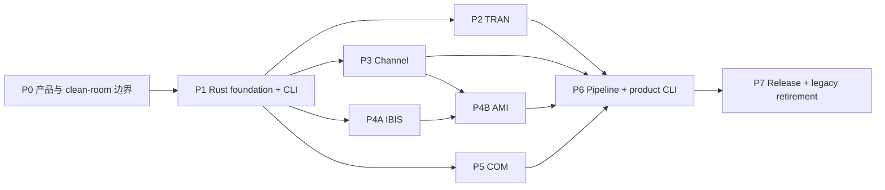

# SIPI-sim-agent 实施计划 v0.2

> 状态：执行中，替代 v0.1 作为当前主计划
> 重基线日期：2026-08-09
> 重基线仓库锚点：`9f9c76a`
> 产品规格：[SPEC.md](SPEC.md)
> 架构决策：[ADR-011](docs/adr/ADR-011-native-mit-rust-product-boundary.md)

## 1. 执行目标

把当前以 Python 控制面和旧引擎适配器为主的迁移平台，收敛为：

- 第一方可发布源码统一 MIT。
- 产品运行时和数值能力统一 Rust。
- 一个公开 `sipi` CLI 覆盖 TRAN、Channel、IBIS-AMI、COM 和跨域 pipeline。
- 三个旧项目只提供已授权 MIT 源码候选或工作树外 oracle。
- 既有示例以版本化 profile、stage compare 和预先批准容差保持准确。

v0.2 不否定已完成的 M0-M4/M5 证据；它改变这些证据的用途。契约、工件、fail-closed 和比较报告继续作为基础，Python adapter、旧 bundle、历史迁入和 fallback 则降级为迁移/验证设施。

## 2. 实施纪律

1. **纵向切片。** 每个 capability 从输入契约、Rust 内核、CLI、工件、oracle compare 到能力声明形成闭环，避免先铺满空 crate。
2. **许可先于代码 promotion。** 未进入 product allowlist 的文件不能成为最终 crate 输入；“本地能运行”不等于可发布。
3. **clean-room 两侧隔离。** 观察/规格侧和实现侧分开记录材料、人员/agent、commit 和输出。接触过受限源码的实现不能自行签署 strict clean-room。
4. **迁移与算法变化分开。** 复用/移动、机械 Rust 重构、数值行为修改、容差或 golden 变化分别提交和审计。
5. **唯一 owner。** 每个物理变换只有一个 production crate；adapter/pipeline 不写第二套 resolver、FFT、termination、均衡或符号处理。
6. **profile 级声明。** 测试通过只升级被覆盖的 profile，不能扩写为全域认证。
7. **失败关闭。** unsupported、许可缺口、来源不明、hash 漂移、partial output、timeout、panic/OOM 均不得被记为成功或 fallback。
8. **较大边界审计。** 一个内聚的大切片一个 commit；完成后同时请求 OMP/OpenCode 只读审计。任一可用审计给出 0 P1/0 P2 可继续，另一侧 quota/unavailable 必须落库并在恢复后补审。
9. **删除另行批准。** 旧 Python/adapter/oracle 的删除仍要求用户批准、Rust golden 完备、release 无依赖，并与其专属漂移门同批移除。

## 3. 当前资产处置

| 当前资产 | v0.2 用途 | 产品资格 |
| --- | --- | --- |
| `schemas/` 与 M1-M4 contract/rule ledger | Rust contracts 的兼容输入和测试基线 | 需迁为 Rust 权威并生成 schema |
| `packages/sipi-artifacts` | 原子工件和内容寻址行为参考 | 需 Rust 重做 |
| `packages/sipi-runtime` | DAG、状态、缓存、资源语义参考 | 需 Rust 重做 |
| `apps/sipi-cli` | CLI 行为原型 | 不进入终态运行时 |
| `packages/sipi-adapters` | 外部 oracle/迁移桥 | 不进入终态运行时 |
| `engines/agent-spice` | 已授权 MIT 来源与 oracle | Rust 子集逐文件审计后可复用；Python 不发布 |
| `native/crates/sipi-circuit` | TRAN candidate | 来源、依赖和行为门通过后 promotion |
| `native/crates/sipi-ami` | AMI clean-room candidate | 材料隔离、ABI 和许可门通过后 promotion |
| PyBERT source/CI/nightly/wheel evidence | Channel/AMI 外部 oracle 和稳定性证据 | 不迁入非 MIT/BSD 历史 |
| `agent-com` | 已授权 MIT 行为与源码参考 | 可直接移植到 Rust，仍需逐文件许可审计 |
| M5B AMI/RFM/S2P compare tools | scope-limited acceptance evidence | 工具本身不是产品 capability |
| M5A/M5B filter-repo preflight | 历史追溯记录 | 实际非 MIT 历史迁入路线终止 |

### 3.1 已接受但不外推的证据

- M3 checkpoint 和 M4 平台契约已接受，OMP 独立审计记录为 0 P1/0 P2。
- PyBERT 7 个 approved profile、RFM current-drive/Link、S2P handoff 和 AMI exact-fixture 报告可用于定义 v0.2 acceptance profile。
- Agent-Spice engine lock/bundle、许可分类和 COM 既有行为证据可用作来源锚。
- 这些结论不表示 Rust-only 产品、通用 AMI/Channel/COM 或 MIT release 已完成。

### 3.2 v0.2 重基线审计

- `e6e13e1` 已完成 OMP 独立只读审计，结论 0 P1/0 P2。
- OpenCode 交叉审计未等待完成；按用户授权，一个可用审计 0 P1/0 P2 后继续，未返回的结论不视为通过。
- 证据与非宣称见 [2026-08-09-spec-v0.2.md](docs/baselines/audits/2026-08-09-spec-v0.2.md)。
- P0-A `2ffeff1` 已完成 OMP 独立只读审计，结论 0 P1/0 P2；该边界仍是 provisional，不能授权 release。证据见 [2026-08-09-p0a-product-boundary.md](docs/baselines/audits/2026-08-09-p0a-product-boundary.md)。
- P0-B `70f37bc` 已完成 OMP 独立只读审计，结论 0 P1/0 P2；register 仅验证已登记证据的边界，不能证明认知或法律意义的 clean-room。证据见 [2026-08-09-p0b-clean-room-register.md](docs/baselines/audits/2026-08-09-p0b-clean-room-register.md)。
- P0-C `8e82e4c` 已完成 OMP 独立只读审计，结论 0 P1/0 P2；v2 仅是 future-release preflight，不授权 release。证据见 [2026-08-09-p0c-release-license-preflight.md](docs/baselines/audits/2026-08-09-p0c-release-license-preflight.md)。
- P0-D `6d6d820` 已完成 OMP 独立只读审计，结论 0 P1/0 P2；4 个 profile 均为 candidate/oracle-only，`required` 仍为零。证据见 [2026-08-09-p0d-acceptance-candidates.md](docs/baselines/audits/2026-08-09-p0d-acceptance-candidates.md)。
- P0-E `a30c4ca` 已完成 OMP 独立只读审计，结论 0 P1/0 P2；36 个 native candidate 全部仍是 `quarantine/unknown/pending`。证据见 [2026-08-09-p0e-native-source-map.md](docs/baselines/audits/2026-08-09-p0e-native-source-map.md)。
- P0-F `d183fb1`/`8069f64` 已完成 OMP 独立只读审计，结论 0 P1/0 P2；模板仅为 evidence scaffolding，不能替代 strict clean-room 或 release 门。证据见 [2026-08-09-p0f-clean-room-templates.md](docs/baselines/audits/2026-08-09-p0f-clean-room-templates.md)。
- P1-01 `07d4552` 已完成 OMP 独立只读审计，结论 0 P1/0 P2；仅为 quarantine 的 unsupported Rust foundation，不能宣称任何领域能力、严格 clean-room 或 release。证据见 [2026-08-09-p1a-rust-foundation.md](docs/baselines/audits/2026-08-09-p1a-rust-foundation.md)。
- P1-02 `144292a` 已完成 OMP 独立只读审计，结论 0 P1/0 P2；`sipi-types` 仅提供构造期数据不变量，未定义领域数值或 profile parity。证据见 [2026-08-09-p1b-types-foundation.md](docs/baselines/audits/2026-08-09-p1b-types-foundation.md)。
- P1-03 `856ea43` 已完成 OMP 独立只读审计，结论 0 P1/0 P2；wire contracts 仍只覆盖 P1 foundation，依赖和 release 许可均保持 pending。证据见 [2026-08-09-p1c-contracts-foundation.md](docs/baselines/audits/2026-08-09-p1c-contracts-foundation.md)。
- P1-04A `baf1b2c` 已完成 OMP 独立只读审计，结论 0 P1/0 P2；仅为 product-owned contract self-conformance，旧 fixture 保持 oracle-only。证据见 [2026-08-09-p1d-product-contract-conformance.md](docs/baselines/audits/2026-08-09-p1d-product-contract-conformance.md)。
- P1-05 `abdcc89` 已完成 OMP 独立只读审计，结论 0 P1/0 P2；`sipi-artifacts` 只提供 application-owned root 的 local immutable publication primitive，未宣称 runtime、domain、release 或 hostile filesystem containment。证据见 [2026-08-10-p1e-artifacts-foundation.md](docs/baselines/audits/2026-08-10-p1e-artifacts-foundation.md)。
- P1-06 `a5fb49c` 已完成 OMP 独立只读审计，结论 0 P1/0 P2；`sipi-runtime` 只提供同步 cooperative deadline/cancel/budget contract 与 cache-key calculation，未宣称 hard isolation、cache correctness 或 domain runtime。证据见 [2026-08-10-p1f-runtime-foundation.md](docs/baselines/audits/2026-08-10-p1f-runtime-foundation.md)。
- P1-07 `92fd319` 已完成 OMP 独立只读审计，结论 0 P1/0 P2；`sipi-pipeline` 只提供 immutable non-executing typed DAG validation 与确定性拓扑顺序，未接 runtime/artifact/cache 或领域执行。证据见 [2026-08-10-p1g-pipeline-foundation.md](docs/baselines/audits/2026-08-10-p1g-pipeline-foundation.md)。
- P1-08 `7ea8a39` 已完成 OMP 独立只读审计，结论 0 P1/0 P2；`sipi-cli` 只提供静态 discovery/self-conformance surface，未接请求/asset/runtime/domain execution，完整 process I/O contract 留给 P1-09。证据见 [2026-08-10-p1h-cli-discovery.md](docs/baselines/audits/2026-08-10-p1h-cli-discovery.md)。
- P1-09 `f67654d` 已完成 OMP 独立只读审计，结论 0 P1/0 P2；CLI 固定单请求/单响应 noninteractive contract，`validate --stdin` 只验证受限 P1 contract，`run` 仍 unsupported。证据见 [2026-08-10-p1i-cli-process-contract.md](docs/baselines/audits/2026-08-10-p1i-cli-process-contract.md)。
- P6-01 `4fca0a3` 建立 quarantine 的 `sipi.project.v1` 声明式计划与非执行 planner：固定节点 catalog、typed artifact contract edge、资源、32-byte seed、requested output、确定性拓扑和 digest。它不执行节点、不接 CLI/project run/artifact/worker/外部资产；审计整改和证据见 [2026-08-11-p6-project-dag-contract.md](docs/baselines/audits/2026-08-11-p6-project-dag-contract.md)。
- P2-01 `e7fbfd4` 已完成 OMP 独立只读审计，结论 0 P1/0 P2；固定 `agent-spice@2cc92316` 未含 `native/crates/sipi-circuit` tree，29 个目标 path 全部仍为 `quarantine/unknown`，没有 promotion。证据见 [2026-08-10-p2a-tran-provenance-preflight.md](docs/baselines/audits/2026-08-10-p2a-tran-provenance-preflight.md)。
- P2-02a `ede13a3` 已完成 OMP 独立只读审计，结论 0 P1/0 P2；`sipi-tran` 仅为 std-only、显式 unsupported 的 package boundary，不导出 TRAN 领域 API 或路由。证据见 [2026-08-10-p2b-tran-package-foundation.md](docs/baselines/audits/2026-08-10-p2b-tran-package-foundation.md)。
- P2-02b `05583cb` 已完成 OMP 独立只读审计，结论 0 P1/0 P2；`rc.cir` 已作为 required external-only profile 锚定，但采样、初值、环境和容差尚未确认，任何 passed/certified 结论仍会 fail-closed。证据见 [2026-08-10-p2c-rc-pulse-acceptance-contract.md](docs/baselines/audits/2026-08-10-p2c-rc-pulse-acceptance-contract.md)。
- P2-03a `8184303` 已完成 OMP 独立只读审计，结论 0 P1/0 P2；RC/PULSE 的 index-aligned 网格、初值、backward-Euler 语义、环境和容差已冻结，但结果尚未执行或接受。证据见 [2026-08-10-p2d-rc-pulse-semantics.md](docs/baselines/audits/2026-08-10-p2d-rc-pulse-semantics.md)。
- P2-02c `5ffe75b` 已完成 OMP 独立只读审计，结论 0 P1/0 P2；`sipi-tran` 实现 fixed RC/PULSE typed library，仅有产品自有验证，尚未取得 external oracle parity。证据见 [2026-08-10-p2e-fixed-rc-pulse-library.md](docs/baselines/audits/2026-08-10-p2e-fixed-rc-pulse-library.md)。
- P2-06a `ed776264` 已完成 OMP 独立只读审计，结论 0 P1/0 P2；固定 Git object 的双次 external oracle run 可复现，且产品 typed result 在冻结的 time/`v(in)`/`v(out)` 门内通过。证据见 [2026-08-10-p2f-rc-pulse-external-comparator.md](docs/baselines/audits/2026-08-10-p2f-rc-pulse-external-comparator.md)。
- P2-08a `88d0d8f` 已完成 OMP 独立只读审计，结论 0 P1/0 P2；严格产品 owned RC/PULSE request 仅接受已认证参数，拒绝 legacy/netlist/path 与任意扩展。证据见 [2026-08-10-p2g-fixed-rc-pulse-request-contract.md](docs/baselines/audits/2026-08-10-p2g-fixed-rc-pulse-request-contract.md)。
- P2-08 `e67691a` 已完成 OMP 独立只读审计，结论 0 P1/0 P2；`sipi tran run` 已通过 typed library 发布 immutable result/provenance artifact，未接入旧 engine 或 fallback。证据见 [2026-08-10-p2h-fixed-tran-cli-artifact-run.md](docs/baselines/audits/2026-08-10-p2h-fixed-tran-cli-artifact-run.md)。
- P2-05 `f375b41` 已完成 OMP 独立只读审计，结论 0 P1/0 P2；项目自有 RC 解析解与线性 metamorphic 测试覆盖 shared solver core。证据见 [2026-08-10-p2i-owned-rc-properties.md](docs/baselines/audits/2026-08-10-p2i-owned-rc-properties.md)。
- P2-07a `104b988`/`55c6edc` 已完成 OMP 独立只读审计，结论 0 P1/0 P2；fixed RC/PULSE 已在真实路径检查 cooperative cancellation 与账户化输出预算。证据见 [2026-08-10-p2j-cooperative-tran-checkpoints.md](docs/baselines/audits/2026-08-10-p2j-cooperative-tran-checkpoints.md)。
- P2-07b `d332178` 已完成 OMP 独立只读审计，结论 0 P1/0 P2；同 artifact-id 的进程级重跑稳定失败且保持首次工件字节不变，accounted-byte 超限不发布成功工件。证据见 [2026-08-10-p2k-tran-failure-gates.md](docs/baselines/audits/2026-08-10-p2k-tran-failure-gates.md)。
- P2-09a `1864aca` 已完成 OMP 独立只读审计，结论 0 P1/0 P2；Windows installed CLI 的 fixed RC/PULSE 3 warmup/10 sample wall-time 与 PeakWorkingSet observation 可重放，但 budget 仍是 `pending`，release verifier 保持拒绝。证据见 [2026-08-10-p2l-tran-performance-observation.md](docs/baselines/audits/2026-08-10-p2l-tran-performance-observation.md)。

## 4. 工作流与依赖



- P0 是任何现有源码 promotion 的前置门。
- P1 先交付可运行但诚实返回 unsupported 的 Rust CLI；随后各领域纵向填充。
- P2/P3/P4A/P5 在 P1 稳定后可独立推进；P4B 依赖 IBIS 基础和 Channel handoff。
- P6 可在第一个领域 slice 后迭代，但只有四个领域的最小 certified profile 都接入后才能退出。
- P7 不等待“旧项目所有功能”重写，只要求本次发布声明的 capability 全闭环。

## 5. 里程碑总览

| 里程碑 | 目标 | 当前状态 |
| --- | --- | --- |
| P0 | 产品边界、许可、clean-room、示例清单 | 进行中；v0.2 基线与 P0-A 已审计 |
| P1 | Rust workspace、contracts/artifacts/runtime、统一 CLI 骨架 | P1-01 已建立 quarantine foundation；领域能力仍未开始 |
| P2 | TRAN 原生纵向切片 | fixed RC/PULSE profile 已完成 Rust library/CLI/oracle compare；general TRAN 与 release promotion 未开始 |
| P3 | Channel clean-room Rust 纵向切片 | 限定 matched-S21 periodic kernel、严格 Touchstone 输入和 `channel run` 已实现；`channel_16ghz_3db` 的 kernel core external compare 已接受，Link/eye/BER/receiver 仍未完成 |
| P4 | IBIS parser + AMI semantic/host | 有 `sipi-ami` candidate 和单 fixture 证据 |
| P5 | COM Rust 行为 profile | 未开始；有 MIT source/oracle |
| P6 | 跨域 pipeline、完整 CLI、AI 可发现性 | 有 Python MVP，Rust 未开始 |
| P7 | Windows release、SBOM/NOTICE、legacy retirement | 未开始 |

## 6. P0：产品与 clean-room 边界

### 6.1 目标

在继续迁代码前，机器可验证地回答：哪些字节属于产品、哪些只能作为 oracle、哪些材料实现侧绝不能读取，以及哪些旧例子必须保持。

### 6.2 任务

- [x] **P0-01** 用户确认终态：第一方 MIT、Rust-only、统一 CLI、旧项目保持示例准确性。
- [x] **P0-02** 发布 `SPEC.md`/`PLAN.md` v0.2 重基线。
- [x] **P0-03** 记录 ADR-011，明确终止非 MIT 历史迁入作为产品路线。
- [x] **P0-04a** 添加根 MIT `LICENSE` 与 scope，明确不覆盖 migration/oracle/third-party 资产。
- [x] **P0-04b** 在 P1 Rust crates 出现时统一第一方 Cargo/package metadata；不得覆盖第三方许可证。P1-01 crates 均为 `license = "MIT"`、`publish = false`，且仍处于 quarantine，未获得 release promotion。
- [x] **P0-05** 建立 `product-boundary.v1`：穷尽当前 tracked path，分类为 `product_candidate`、`migration_only`、`oracle_only`、`quarantine`、`generated`。
- [x] **P0-06** 新建 provisional `license-manifest.v2.yaml` release preflight：将 v1 legacy evidence 与未来 release 输入隔离，固定 dependency/NOTICE/owner/SBOM snapshot 的 fail-closed 字段；最终依赖和发布批准仍待录入。
- [x] **P0-07** 建立 provisional clean-room material/role register，包含观察侧、实现侧、allowlist、禁止材料和 attestation schema；strict identity/signature 与实际领域 scope 仍待逐项录入。
- [x] **P0-08** 建立 candidate acceptance profile inventory：固定 4 个 oracle-only 候选的 repo/commit/blob/SHA-256/许可证据/环境证据和 scope；所有 `required` 状态仍为零，待用户确认后才能升级。
- [x] **P0-09** 逐文件盘点现有 36 个 `native/**` tracked candidate 的 Git blob/SHA-256 与来源证据状态；全部 `quarantine/unknown/pending`，未作 promotion 或 clean-room 声明。
- [x] **P0-10** 增加 verifier：release/product path 中出现未分类、非 MIT 第一方、external-only asset、绝对用户路径或禁止来源时失败。
- [x] **P0-11** 为 observation spec、implementation commit、comparison report 定义版本化模板、保存位置和单审请求内容，并增加 heading/prohibited-marker drift verifier。
- [x] **P0-12** 固定 byte-hashed 根治理文件的 canonical LF checkout，并在最终 inventory 重生成后重绑 boundary/license/source-map 哈希；此前的 P7 checkout-representation 拒绝仅作历史观察，不能作为候选执行证据。

### 6.3 退出条件

- 当前 tracked paths 分类穷尽且无重叠/大小写冲突。
- 第一方产品候选均有 MIT 覆盖；第三方依赖均有 compatible 判定或被阻断。
- 非 MIT/BSD/PyAMI/vendor/source-unknown material 不可进入 product candidate。
- required 示例清单由用户确认，不能在实现中途静默删减。
- clean-room 实现侧的允许材料可机器重放。
- P0 大边界审计 0 P1/0 P2。

## 7. P1：Rust Foundation 与 CLI 骨架

### 7.1 目标

建立不依赖 Python 的可安装 Rust 产品骨架。即使领域内核尚未实现，CLI 也应能发现 schema/capabilities、校验请求并诚实返回 unsupported。

### 7.2 任务

- [x] **P1-01** 新建根 Cargo workspace，锁定 Rust toolchain、Cargo.lock 和 release profile；仅包含 std-only `sipi-cli`/`sipi-types`/`sipi-contracts` foundation，所有 Rust path 仍为 quarantine。
- [x] **P1-02** 建立 std-only `sipi-types`：SI newtypes、axis、port、complex tensor、waveform/spectrum 和 finite/shape/length validation；未定义单位换算、轴/端口领域语义、FFT 或 JSON。
- [x] **P1-03** 建立 quarantine `sipi-contracts`：versioned serde wire types、rule ledger、deterministic serialization profile 与 JSON Schema generation；所有 DTO 回调 `sipi-types` 构造器，尚不宣称跨语言 canonical JSON 或任何 domain request。
- [x] **P1-04A** 对 product-owned `sipi.contract.v1` fixture 做 Rust round-trip、schema、rule-ledger 和 negative self-conformance；语义变化新开版本。
- [ ] **P1-04B** （oracle-only）旧 `sipi.*.v1` fixture 只能在工作树外观察其 Git-object provenance；不得进入 Rust API/fixtures/实现侧，待用户确认 required profile 后再决定是否需要比较。**P1-04Ba 已完成（oracle-only boundary gate）：** 以 `sipi.p1-04b.legacy-fixture-boundary.v1` 机械固化边界：manifest 中 14 个外部资产集合（agent-spice/pybert/agent-com 及两个 unresolved oracle）经资产身份检查证明零物化为 tracked 路径，且旧 fixture schema id（`sipi.run-request.v1`、`sipi.backend-execution-request.v1` 等）零出现于产品 Rust 源；`engines/agent-spice` 保留区（P7-08 `retain_external_reference`）明确排除在范围外；产品自有 `sipi.contract.v1` 与 `fixtures/contracts` 用例不受影响。owner 的 required profile 决策仍待，见 [audit](docs/baselines/audits/2026-08-16-p1-04b-legacy-fixture-boundary.md)。
- [x] **P1-05** 建立 quarantine `sipi-artifacts`：有界 SHA-256 staging、seal 后重验、同根新目录 atomic publish、精确 success manifest 与 fail-closed verification；v1 只适用于无敌对写者的 application-owned root，不提供 GC/远端/CLI/runtime/domain semantics。
- [x] **P1-06** 建立 quarantine `sipi-runtime`：同步 cooperative run state、cancel request、checkpoint deadline/显式计量预算、structured error 和 deterministic cache key；不提供 executor、hard timeout/RSS/CPU isolation、cache store 或 domain semantics。
- [x] **P1-07** 建立 quarantine `sipi-pipeline`：immutable non-executing typed plan DAG，验证 source/stage/join/sink shape、typed edge、DAG/reachability 与确定性 topological order；不执行 callback、不存值、不接 runtime/artifact/cache 或领域数值。
- [x] **P1-08** 扩展 quarantine `sipi-cli` 静态 discovery/self-conformance 命令：`version/doctor/capabilities/schema/validate self/run/inspect`；不接 stdin/file/artifact/engine/domain request，完整 stdout/stderr/exit contract 留给 P1-09。
- [x] **P1-09** 固定单请求/单响应 noninteractive process contract：stdout JSON envelope、stderr JSON diagnostic、exit code 0/2/3/4/5/6，且仅 `validate --stdin` 接受受限 P1 contract request；不提供 run/file/artifact/streaming I/O。
- [x] **P1-10** release layout verifier 验证外部 staged CLI 的 closed layout、PE imports 和静态 smoke；任意命令 child-process/dynamic-load 仍不作证明。
- [x] **P1-11** Windows x86_64 locked build、fmt、clippy、test、isolated install smoke 和 exact schema drift gate；仅生成外部 provisional report，不是 twin build、archive 或 release promotion。

### 7.3 退出条件

- 从 clean checkout 可只用锁定 Rust 工具链构建 `sipi`。
- `sipi capabilities --json` 对未实现 domain 返回稳定 `unsupported`，无 silent fallback。
- schema 生成与提交快照一致，所有 v1 contract fixtures Rust conformance 通过。
- artifact failure/timeout/cancel 不发布 success。
- 发行候选不包含 Python runtime、迁移 adapter 或 external asset。
- P1 大边界审计 0 P1/0 P2。

P1 foundation 已完成。P1-04B 继续作为 oracle-only pending 项，且在用户确认 required profile 前不得成为领域实现输入。

## 8. P2：TRAN 原生能力

### 8.1 第一版 scope

第一版只承诺用户确认的 TRAN 示例所需语法、器件和 solver profile。OP/DC/AC、RFM 和拟合能力按独立 profile 增量进入，不以旧 Agent-Spice 功能总量作为一次性退出条件。

### 8.2 任务

`tran-rc-pulse-v1` 是当前唯一已接受的产品纵向切片：它只覆盖 typed
ideal-source/R/grounded-C、固定网格和显式初值。下列泛化任务仍保持未完成，
不得由该单 profile 或现有 `sipi-circuit` candidate 自动满足。

- [x] **P2-01** 审计 `agent-spice` MIT Rust 与现有 `sipi-circuit` 的逐文件来源、Cargo 依赖和 NOTICE；固定 anchor 未含 native tree，29 个 path 保持 `quarantine/unknown`，没有 promotion。
- [x] **P2-02a** 建立不导出领域 API 的 `sipi-tran` package boundary；这不能替代 P2-02，后者仍须 required TRAN profile 与 clean-room 语义规格。
- [x] **P2-02b** 冻结用户选择的 `rc.cir` external-only identity contract；数值语义与容差由 P2-03a 单独冻结。
- [x] **P2-02c** 实现仅覆盖 fixed `RcPulseTransientV1` 的 `sipi-tran` clean-room library；拒绝 netlist/parser/OP/AC/通用 MNA 与外部 fallback。
- [x] **P2-02d** 将 fixed wrapper 收敛到唯一、参数化但拓扑固定的一节点 RC/PULSE library core；该 core 仍不开放 CLI/wire request、netlist或通用电路模型。整改后的 Orca 只读复审为 0 P1/0 P2，见 [evidence](docs/baselines/audits/2026-08-11-p2-one-node-rc-pulse.md)。
- [x] **P2-02e** 将该唯一内核接为独立 `sipi tran one-node-rc-pulse --stdin` artifact route：严格 product-owned request 仅允许显式 axis、R、C、初值与周期 PULSE；固定 4096 output / 16384 breakpoint bounds，仍拒绝 netlist、节点、器件、积分策略和任何 fallback。它不改变 externally accepted fixed wrapper，见 [evidence](docs/baselines/audits/2026-08-11-p2-one-node-rc-pulse-cli.md)。
- [x] **P2-02f** 在同一固定一节点 RC 拓扑中加入 caller-owned PWL 电压源：源/输出轴均从零严格递增，末 knot 精确覆盖末输出时刻，knot 间线性、backward-Euler 于合并步终点采样。独立 `tran one-node-rc-pwl --stdin` 仅为 specified/non-oracle artifact route；不扩展为 netlist、MNA、SPICE 或 IBIS/channel transient 组合，见 [evidence](docs/baselines/audits/2026-08-15-p2-one-node-rc-pwl-cli.md)。既有 RC/PULSE external acceptance 在该产品源变化后须重新绑定，不能由此 route 继承。
- [x] **P2-06a** 以工作树外的固定 Git object oracle 复跑 `tran-rc-pulse-v1`，并比较产品 typed result；报告仅保存身份、f64le 哈希与误差指标，不复制 fixture 或 waveform。
- [x] **P2-06b** 当前 candidate 的 `sipi-tran` source/lock 漂移后重新以 clean archives 构建固定 external oracle 与 product harness；双次 oracle replay、三组数组比较和 source-tree/lock/executable/report binding 均通过。历史 attestation 保留，release ledger 只引用此 current-candidate evidence；范围仍仅 fixed RC/PULSE wrapper。
- [x] **P2-06c** 后续产品 source/lock 漂移后，保留 v1 historical attestation，并以 clean Git archive product harness 与 clean detached oracle worktree 重放固定 profile。v2 evidence 绑定当前 source tree、Cargo lock、可执行文件、双次 oracle replay 与外部 report；范围仍仅 fixed RC/PULSE wrapper，见 [evidence](docs/baselines/audits/2026-08-11-p2-fixed-tran-current-evidence-rebinding-v2.md)。
  - [x] **P2-06d** source-drift reconciliation：P3C-04e 新增 `faer` 导致 `Cargo.lock` 不再等于 P2-06c v2 的 bound object。v2 external compare 保留为 historical observed evidence；release TRAN row 移除 active evidence/accepted claim，并要求 `current_external_compare_evidence_source_drift` 精确成立。没有新的 clean-archive/external custody compare 前，不得恢复 TRAN external-oracle acceptance。
  - [x] **P2-06e** current-candidate evidence rebinding：固定 external Agent-Spice Git object 已由 clean detached worktree 双次重放，clean-archive `d0c7efa` product harness 以 locked/offline resolution 通过同一 time/`v(in)`/`v(out)` gate。v3 绑定当前三项 product tree、`Cargo.lock`、两个 executable 与仓外 hash-only report；v1/v2 保留 historical，v2 仍精确返回 `evidence_product_source_drift`。仅固定 Windows x86_64 RC/PULSE profile 恢复 accepted/external-oracle evidence，不提升 general TRAN/netlist、OP/AC、跨平台、法律或 release，见 [evidence](docs/baselines/audits/2026-08-15-p2-fixed-tran-current-evidence-rebinding-v3.md)。
  - [x] **P2-06f** RC/PWL route 引入后的 current-candidate rebinding：clean archive `538b5dd` 的 fixed RC/PULSE harness 与 detached Agent-Spice object 以 locked/offline build 重放，外部 fixture 双次 oracle replay 和全部 frozen comparison gates通过。v4 是当前 Windows x86_64 fixed profile evidence；v1--v3 保留历史，其中 v3 精确报 `evidence_product_source_drift`。这不接受新 RC/PWL route，也不提升 general TRAN、法律或 release，见 [evidence](docs/baselines/audits/2026-08-15-p2-fixed-tran-current-evidence-rebinding-v4.md)。
- [x] **P2-08a** 冻结严格的产品 owned `sipi.tran.rc-pulse-request.v1`；仅接受已认证 RC/PULSE 参数，拒绝 netlist、路径、未知字段和任意扩展参数。
- [x] **P2-03a** 冻结 RC/PULSE typed request 的独立数值语义与可执行 acceptance policy；不实现 parser、OP、AC 或通用 MNA。
- [x] **P2-03b** 冻结一节点 RC/PULSE 的显式 PULSE、输出轴、backward-Euler、breakpoint/资源与 cooperative checkpoint 语义；fixed `tran-rc-pulse-v1` 的 external acceptance 范围不变。
- [x] **P2-02** 将可接受内核收敛为 `sipi-tran` library；CLI/worker 只调用 library，不复制 solver。**P2-02g 已完成（solver-singleton invariant gate）：** 9 个 solver 符号（simulate_rc_pulse 系、simulate_one_node_rc_pulse 系、simulate_one_node_rc_pwl 系、backward_euler_step）经机械 verifier 验证全部单点定义于 `crates/sipi-tran/src/lib.rs`；`sipi-cli` 与 `sipi-pipeline` 仅经 `use sipi_tran::{...}` 调用、无复制实现；comparator harness 保持 `rc-pulse-harness` feature-gated 且不接入产品 CLI；任何外部定义、重复定义、无 import 引用或 feature-gate 丢失均 fail-closed，见 [audit](docs/baselines/audits/2026-08-16-p2-02-solver-singleton.md)。
- [x] **P2-03** 冻结 netlist/circuit request、器件支持矩阵、solver/convergence policy 和 error taxonomy。**P2-03c 已完成（current-surface semantic freeze）：** 统一冻结文档以 `sipi.p2-03.tran-semantic-freeze.v1` 记录当前产品面的 request schema 集、拓扑标识、器件支持矩阵（4 supported / 8 unsupported-rejected）、solver policy（f64 backward-Euler、固定 breakpoint-union、无自适应/无收敛迭代、显式初值、4096 样本/16384 breakpoint + cooperative checkpoint）与全部 20 个 `TranError` 变体；机械 verifier 将冻结与 live `sipi-tran` TranError 枚举、`sipi-contracts` schema 常量与 CLI provenance topology 逐一绑定，任何漂移 fail-closed。该冻结仅覆盖当前产品面，不推广 netlist/OP/AC/MNA，也不改变 fixed `tran-rc-pulse-v1` acceptance，见 [audit](docs/baselines/audits/2026-08-16-p2-03-tran-semantic-freeze.md)。
- [x] **P2-04** 固定时间积分、初值、容差、step control、输出采样和 measurement 语义。**P2-04a 已完成（partial）：** 时间积分（f64 backward-Euler）、初值（显式 only）、step control（固定 breakpoint-union、无自适应）、输出采样（requested axis only）已随 P2-03c 冻结并绑定 live contracts；measurement 语义显式冻结为 `not_implemented`。**容差仍 blocked：** `tolerance_policy: blocked_missing_tolerance_owner_decision`（P2 acceptance contract 的 sampling alignment、time/voltage tolerance、initial-condition policy 与 oracle environment 需 owner 决策后方可解冻）。 **P2-04b 已完成（semantic freeze complete gate）：** 六要素在 fixed-profile 面全部冻结并经 `sipi.p2-04.semantic-freeze-complete.v1` 机械确认：时间积分（f64 backward-Euler）、初值（explicit only）、容差（acceptance 契约：time 1e-15 / v(in) 1e-9-1e-9 / v(out) 2e-6-5e-4、index-aligned）、step control（固定 breakpoint-union）、输出采样（requested axis only）、measurement（not_implemented）。泛化 netlist TRAN tolerance 仍 out of scope（acceptance contract），见 [audit](docs/baselines/audits/2026-08-16-p2-04-semantic-freeze-complete.md)。
- [x] **P2-05** 建立自有 MIT 小电路、解析解/property/metamorphic 测试。
- [ ] **P2-06** 对 required Agent-Spice TRAN 例子生成 stage compare：parsed circuit、time grid、waveforms、measurements。**P2-06g 已完成（current-surface stage-compare coverage record）：** 以 `sipi.p2-06.stage-compare-coverage.v1` 机械记录当前 bounded 产品面的四 stage 覆盖状态：`time_grid`/`waveforms`（time/v(in)/v(out) 冻结 indexed gates）已由 v4 current evidence（clean archive `538b5dd`、oracle `2cc92316`、双次 replay、report `854e34fd...`）覆盖，v1-v3 保留 source-drift historical；`parsed_circuit` 明确 `not_applicable_current_surface`（当前面无 netlist parser，P2-03 冻结 arbitrary_netlist rejected）；`measurements` 明确 `not_implemented`（P2-03 freeze）。泛化 stage compare（parsed circuit/measurements）待未来 netlist 面与 P2-04 tolerance owner 决策，见 [audit](docs/baselines/audits/2026-08-16-p2-06-stage-compare-coverage.md)。
- [x] **P2-07** 已完成 fixed RC/PULSE profile 的适用 failure gate：cooperative cancel/deadline observation、accounted-byte output budget、不可覆盖 artifact publish failure；未知 request shape 由契约拒绝。nonconvergence 与 unsupported device 在当前无迭代/无器件分发面的闭合线性 profile 中为 `not_applicable`，不宣称 hard timeout、RSS/OOM 或进程隔离。证据见 [2026-08-10-p2k-tran-failure-gates.md](docs/baselines/audits/2026-08-10-p2k-tran-failure-gates.md)。
- [x] **P2-08** 接入 `sipi tran run`、工件和 provenance；拒绝旧 engine fallback。
- [x] **P2-09** 在 owner-approved workload 上建立性能/RSS 基线，优化另行提交。**P2-09a** 已完成 fixed profile 的 3 warmup/10 sample observation 与 pending-budget verifier；缺 owner、阈值、统计规则和超限处置时 release 仍 fail-closed。**P2-09b 已完成（performance-protocol consistency gate）：** 以 `sipi.p2-09a.performance-protocol-consistency.v1` 机械固化 P2-09a 的四工具协议一致性：measure 常量（warmup=3、measured=10、`tran-rc-pulse-v1`、`sipi.tran.rc-pulse-request.v1`）、verify-budget 协议/度量/平台 token（perf_counter_ns、PeakWorkingSetSize、median_min_max_*、windows-x86_64）、pending 预算不得暗示 approval 的守卫、policy 直接加载同一 measure 模块、candidate 经 policy 间接可达——任一漂移 fail-closed。该 gate 不批准 workload、不设阈值、不定义统计规则；owner 决策仍待，release 保持 fail-closed，见 [audit](docs/baselines/audits/2026-08-16-p2-09a-performance-protocol-consistency.md)。 **P2-09c 已完成（owner-approved baseline gate）：** `fixed-tran-performance-policy.v1.yaml` 已为 `delegated_approved`（approval_ref `user-delegated-numeric-policy-2026-08-11`，P7-06a 委托记录）——owner 委托批准、阈值（30M ns / 5M bytes）、统计规则（median_of_exactly_ten）、超限处置（block_release_candidate）与 3+10 baseline 绑定（observation `f6bcef3e...` / P1 report `a17d68e5...`）四要素齐备，经 `sipi.p2-09.owner-approved-baseline.v1` 机械确认。该基线仅限 fixed Windows RC/PULSE workload，优化、跨机 benchmark 与最终 release 仍 out of scope，见 [audit](docs/baselines/audits/2026-08-16-p2-09-owner-approved-baseline.md)。

### 8.3 退出条件

- 至少一个明确 TRAN profile 在 Windows x86_64 达到 `certified`。
- required TRAN 示例在预先批准容差内通过且无 golden 改写。
- unsupported 语法/器件可由 `capabilities` 预先发现并稳定拒绝。
- release binary 不依赖 Agent-Spice Python/旧 executable。

## 9. P3：Channel clean-room Rust 能力

### 9.1 原则

PyBERT 和 PyAMI 不作为实现代码输入。观察侧将既有 7-profile、S2P、RFM、Link/DFE/CDR/BER 证据整理为独立行为规格；clean-room 实现侧只读取公开标准、该规格和自有 fixture。

现存 PyBERT-derived Rust 代码在来源未解决前不能被简单改名为 MIT。可以取得重许可，也可以由独立 clean-room crate 替代。

### 9.2 分段任务

#### P3A：Network 到 Channel Response

- [x] **P3A-01** 为已选 `channel_16ghz_3db` 冻结 external-only、两端口 real-50-ohm matched S2P 的端口、z0、power-wave、launch/receiver 和 termination 规格；RLGC/S4P/RFM 仍未开始。
- [x] **P3A-02** 观察侧以精确 Git object 锚定该 S2P 的结构事实，并冻结 matched-S2P 离散 V/V kernel 的 probe、DC/uniform-grid/Hermitian-IFFT/sign、对齐及容差策略。外部 observer 与产品 compare 仍未执行。
- [x] **P3A-03** clean-room `sipi-channel` 实现 matched two-port `S21` 到离散 V/V kernel 的唯一 resolver；只接收产品自有均匀矩阵，不含 adapter、Touchstone、Python 或额外数值路径。
- [x] **P3A-04** 以项目自有网络恒等式覆盖有限网格 passivity、reciprocity、losslessness 与 Parseval；causality 明确为 not-assessed，未作物理认证。
- [x] **P3A-05** `channel_16ghz_3db` required fixture 的 frozen matched-S21 discrete V/V response kernel 已完成 Git-object lineage 与 external observer→Rust compare；Link/stage、RFM、Touchstone 公共输入仍未开始。
- [x] **P3A-06** clean-room `sipi-touchstone` 只接受 bounded in-memory `# Hz S RI R 50.0` two-port ASCII/RI rows，并在 DC、bit-exact uniform Hz grid 与 real-50-ohm 条件下直接映射到既有 matched spectrum；无文件/CLI/Link/外部资产输入，也不提升 selected-profile acceptance。证据见 [2026-08-11-p3a-touchstone-parser.md](docs/baselines/audits/2026-08-11-p3a-touchstone-parser.md)。
- [x] **P3A-07** `sipi channel run --stdin` 只接收 product-owned inline UTF-8 text，经唯一 strict Touchstone parser、matched admission 与 `S21` periodic-kernel resolver 输出有界 V/V kernel；无文件/URL/artifact、termination/reflection、causalization 或 Link simulation，caller input 始终 `unattested`。证据见 [2026-08-11-p3a-matched-channel-cli-run.md](docs/baselines/audits/2026-08-11-p3a-matched-channel-cli-run.md)。
- [x] **P3A-08** selected `channel_16ghz_3db` 的历史 policy/preflight 不改写；新增 hash-only external evidence，重新绑定当前 matched-kernel product source、两次 standard-DFT observer、external Git object 与误差门。该 profile 仅在 matched-S21 periodic discrete V/V kernel core 范围 accepted；`channel run` caller input、Link、general Touchstone 与 release status 不升级。见 [2026-08-11-p3a-matched-s2p-evidence-reconciliation.md](docs/baselines/audits/2026-08-11-p3a-matched-s2p-evidence-reconciliation.md)。
- [x] **P3A-09** selected `channel_16ghz_3db` 的 exact external-only S2P text 已在两个 fresh custody 中经独立 DFT observer、clean-archive `sipi channel run --stdin`、严格 P1 JSON process contract 与逐点 tolerance compare 验证。运行时仍将任何普通 caller input 标为 unattested；这不扩展为 general Touchstone、reflection/termination、Link/eye/BER、artifact 或 release acceptance。见 [2026-08-11-p3a-matched-s2p-cli-e2e-evidence.md](docs/baselines/audits/2026-08-11-p3a-matched-s2p-cli-e2e-evidence.md)。
- [x] **P3A-10** current-candidate CLI evidence rebinding：P2-02e 改变 `sipi-cli` tree 后，历史 P3A-09 attestation 不再自动代表当前二进制。新的 hash-only current evidence 绑定 clean-archive `d875433`、五个 `channel run` product tree、Cargo.lock、两次 external custody DFT observer 与严格 CLI response；release ledger 仅将其列为 exact-profile observed evidence，普通 caller input 仍 unattested。见 [2026-08-11-p3a-matched-s2p-cli-current-evidence-rebinding.md](docs/baselines/audits/2026-08-11-p3a-matched-s2p-cli-current-evidence-rebinding.md)。
- [x] **P3A-11** current-candidate CLI evidence rebinding：P3C-03a 再次改变 `sipi-cli` tree 后，P3A-10 保留为历史记录，不得自动继承。新的 v2 hash-only record 绑定 clean-archive `4bdd4d7`、五个 `channel run` product tree、Cargo.lock、两次 external custody DFT observer 与严格 CLI response；release ledger 只引用该 exact-profile observed evidence，普通 caller input 仍 unattested。见 [2026-08-11-p3a-matched-s2p-cli-current-evidence-rebinding-v2.md](docs/baselines/audits/2026-08-11-p3a-matched-s2p-cli-current-evidence-rebinding-v2.md)。
- [x] **P3A-12** current-candidate CLI evidence rebinding：P3B-03g 改变 `sipi-cli` 与 `sipi-contracts` tree 后，P3A-11 保留为历史记录，不得自动继承。新的 v3 hash-only record 绑定 clean-archive `58802b6`、五个 `channel run` product tree、Cargo.lock、两次 external custody DFT observer 与严格 CLI response；release ledger 仅引用这个 exact-profile observed evidence，普通 caller input 仍 unattested。见 [2026-08-11-p3a-matched-s2p-cli-current-evidence-rebinding-v3.md](docs/baselines/audits/2026-08-11-p3a-matched-s2p-cli-current-evidence-rebinding-v3.md)。
- [x] **P3A-13** evidence source-drift reconciliation：后续 `sipi-contracts` schema inventory 变更使 P3A-12 v3 的 product tree 不再匹配当前候选。v3 作为历史 observed record 保留；release publication 现以 `current_external_compare_evidence_source_drift` 明确阻断 Channel active evidence，且 verifier 要求该精确漂移结果。除非新的 clean-archive/external-custody compare 生成可验证 current record，否则不得恢复其 active 引用。
  - [x] **P3A-14** current-candidate CLI evidence rebinding：同一 exact external-only `channel_16ghz_3db.s2p` 在两次 fresh temporary custody 中由独立 DFT observer 重放，并通过 clean-archive `6340550` 的 locked release `sipi channel run` 比较。v4 绑定当前五个 product crate tree、Cargo.lock、executable 与外部 hash-only report；v1/v2/v3 保留 historical source-drift。该记录只恢复 selected matched-S21 periodic kernel 的 observed evidence，不升级 caller input、Link/eye/BER、general Touchstone 或 release。见 [2026-08-11-p3a-matched-s2p-cli-current-evidence-rebinding-v4.md](docs/baselines/audits/2026-08-11-p3a-matched-s2p-cli-current-evidence-rebinding-v4.md)。
  - [x] **P3A-15** source-drift reconciliation：P3C-04a 改变 `sipi-channel` 与 `sipi-touchstone` product trees 后，P3A-14 v4 继续保留为 historical observed record，不能代表当前 candidate。release channel row 现移除 v4 active evidence、保留 `current_external_compare_evidence_source_drift` blocker，并要求 verifier 精确观察该漂移；新的 clean-archive/external-custody S2P compare 之前不得恢复 external oracle claim。
  - [x] **P3A-16** current-candidate CLI evidence rebinding：同一 external-only `channel_16ghz_3db.s2p` 已从 clean-archive `b5935dd` 的 locked/offline release build 重新执行两次 fresh custody DFT observer 与 `sipi channel run` compare。v5 绑定当前五个 channel CLI product tree、`Cargo.lock`、executable 与仓外 hash-only report；v1-v4 保留 historical，v4 的 core-evidence source drift 仍由 verifier 精确要求。channel row 仅恢复 selected matched-S21 periodic-kernel observed evidence，继续是 caller-input unattested、非 Link/eye/BER/general Touchstone/release，`acceptance_state` 仍为 `specified` 且 `external_oracle=false`。
  - [x] **P3A-17** current-candidate CLI evidence rebinding：P2 RC/PWL route 改变 `sipi-cli`、`sipi-contracts` 与 `Cargo.lock` 后，P3A-16 v5 只保留为 historical source-drift record。相同 external-only `channel_16ghz_3db.s2p` 从 clean-archive `fa79434` 的 locked/offline release build 重新完成两次 fresh custody DFT observer 与严格 `sipi channel run` compare；v6 绑定五个 channel CLI product tree、`Cargo.lock`、executable 与仓外 hash-only report。channel row 仍只声明 selected matched-S21 periodic-kernel observed evidence，普通 caller input 继续 unattested，非 Link/eye/BER/general Touchstone/release，`acceptance_state` 仍为 `specified` 且 `external_oracle=false`。
  - [x] **P3A-18** current-candidate CLI evidence rebinding：P4A sealed IBIS quasi-static route 改变 `sipi-cli` 与 `sipi-contracts` 后，P3A-17 v6 保留为 historical source-drift record。相同 external-only `channel_16ghz_3db.s2p` 从 clean-archive `463b5bb` 的 locked/offline release build 重新完成两次 fresh custody DFT observer 与严格 `sipi channel run` compare；v7 绑定五个 channel CLI product tree、`Cargo.lock`、executable 与仓外 hash-only report。channel row 仍只声明 selected matched-S21 periodic-kernel observed evidence，普通 caller input 继续 unattested，非 Link/eye/BER/general Touchstone/release，`acceptance_state` 仍为 `specified` 且 `external_oracle=false`。
  - [x] **P3A-19** current-candidate CLI evidence rebinding：P4A sealed IBIS quasi-static batch route 改变 `sipi-cli` 与 `sipi-contracts` 后，P3A-18 v7 保留为 historical source-drift record。相同 external-only `channel_16ghz_3db.s2p` 从 clean-archive `c7aebc7` 的 locked/offline release build 重新完成两次 fresh custody DFT observer 与严格 `sipi channel run` compare；v8 绑定五个 channel CLI product tree、`Cargo.lock`、executable 与仓外 hash-only report。channel row 仍只声明 selected matched-S21 periodic-kernel observed evidence，普通 caller input 继续 unattested，非 Link/eye/BER/general Touchstone/release，`acceptance_state` 仍为 `specified` 且 `external_oracle=false`。见 [2026-08-16-p3a-matched-s2p-cli-current-evidence-rebinding-v8.md](docs/baselines/audits/2026-08-16-p3a-matched-s2p-cli-current-evidence-rebinding-v8.md)。

#### P3B：Link Stages

- [x] **P3B-01** 冻结 `sipi.link-plan.v1` 的 stimulus、timebase、`direct_launch` TX、future linear-convolution、bypass RX typed stage contract；P3A periodic DFT kernel 明确不作为 causal FIR 接受，执行与 equalizer 仍未开始。证据见 [2026-08-10-p3b-link-stage-contract.md](docs/baselines/audits/2026-08-10-p3b-link-stage-contract.md)。
- [ ] **P3B-02** **P3B-02a/02b 已完成：** `sipi-link` 仅实现 product-owned causal FIR full linear convolution，`sipi link run --stdin` 将同一严格 direct-launch/bypass contract 发布为不可变 artifact；显式限制/数值溢出 fail-closed，CTLE/FFE 仍仅 bypass。equalizer 子集待明确 Link profile 与独立语义后开始；P3B-03 的 required RFM receiver charter 阻塞不受本切片影响。证据见 [2026-08-10-p3b-causal-fir-convolution.md](docs/baselines/audits/2026-08-10-p3b-causal-fir-convolution.md)、[2026-08-10-p3b-causal-fir-cli-run.md](docs/baselines/audits/2026-08-10-p3b-causal-fir-cli-run.md)。**P3B-02c 已完成（link kernel-singleton & bypass-only gate）：** 以 `sipi.p3b-02.link-kernel-singleton.v1` 机械固化：3 个 causal-FIR 卷积符号单点定义于 `crates/sipi-link/src/lib.rs`，`sipi-cli`/`sipi-pipeline` 仅经 `sipi_link` import 调用、无复制内核；bypass-only 断言（`RxStagesV1::bypass().ctle(), CtleStageV1::Bypass`）必须保留，任何非 bypass CTLE/FFE stage selector（equalizer 实现）fail-closed。该 gate 不开始 equalizer 子集、不接受 Link profile，CTLE/FFE 保持 bypass-only 直至 owner 明确 Link profile 与独立语义，见 [audit](docs/baselines/audits/2026-08-16-p3b-02-link-kernel-singleton.md)。
- [x] **P3B-03** **P3B-03a/03b/03c/03d/03e/03f/03g 已完成：** `channel-rfm-block-2-current-drive-v1` 已由用户标为 required；erasure amendment 规定 `0.0` feedback、继续处理与固定分母 96；`sipi-link` 已实现该 profile-scoped data-aided fixed-phase / fixed-training receiver 的 clean-room self-conformance。输入仍为 1024 点、1 ps、8 samples/UI 的单端 receive-voltage 与 CTLE/FFE bypass。v2 delegated amendment 在 unique 赢家路径保持原 lock 语义，并仅为已限定的相位歧义选择最低 phase；两个 fresh external RFM handoff 上的 Rust 与独立 evaluator 均取得 `delegated_policy_semantic_agreement_observed`。P3B-03g 另提供严格 caller-supplied 的 `sipi link receiver run --stdin` 诊断 artifact 路由，结果恒标为 `policy_selected_not_locked`、非 external RFM、非 acceptance。它们都不是 CDR lock、RFM receiver parity 或 required-profile acceptance。证据见 [2026-08-10-p3b-required-rfm-receiver-boundary.md](docs/baselines/audits/2026-08-10-p3b-required-rfm-receiver-boundary.md)、[2026-08-10-p3b-receiver-semantics-preparation.md](docs/baselines/audits/2026-08-10-p3b-receiver-semantics-preparation.md)、[2026-08-10-p3b-approved-receiver-charter.md](docs/baselines/audits/2026-08-10-p3b-approved-receiver-charter.md)、[2026-08-10-p3b-rfm-receiver-charter-compare.md](docs/baselines/audits/2026-08-10-p3b-rfm-receiver-charter-compare.md)、[2026-08-11-p3b-delegated-phase-policy.md](docs/baselines/audits/2026-08-11-p3b-delegated-phase-policy.md) 和 [2026-08-11-p3b-receiver-diagnostic-cli.md](docs/baselines/audits/2026-08-11-p3b-receiver-diagnostic-cli.md)。**P3B-03h 已完成（receiver diagnostic route contract gate）：** 以 `sipi.p3b-03g.receiver-diagnostic-contract.v1` 机械固化 P3B-03g 诊断路由契约：`link.receiver.run` 路由与 handler 必须存在；provenance/result 恒为 `mode=product_owned_diagnostic`、`clock_policy=policy_selected_not_locked`、`external_rfm=false`、`acceptance=false`，algorithm 恒为 `data_aided_fixed_training_receiver_delegated_ambiguity_v2`，profile 恒为 `channel-rfm-block-2-current-drive-v1`；任何 lock/RFM/acceptance 提升或 schema/profile 绑定丢失均 fail-closed。该 gate 不改变 CDR phase-acquisition 语义（P3B-03/04/05 完成仍待 owner amendment，当前 `blocked_cdr_ambiguous_... (line truncated to 2000 chars)
- [ ] **P3B-04** 已接受 external-only same-source reference-bit provenance 与 Windows RFM receive-waveform 到 test-only product `ReceiverInputV1` handoff replay：两次 fresh external replay 的 waveform/bit hash 与单次 product boundary validation 均通过。独立、stdlib-only evaluator 与唯一产品 receiver 随后在同一双重 replay 上均 fail-closed `cdr_ambiguous`；Orca 对 compare gate 审计 `0 P1 / 0 P2`。当前状态为 `blocked_cdr_ambiguous_under_approved_charter`，下一步只能由 owner amendment 改变 phase-acquisition 语义后重跑，禁止复用 retained/old-Rust receiver。证据见 [2026-08-10-p3b-rfm-reference-bits-preflight.md](docs/baselines/audits/2026-08-10-p3b-rfm-reference-bits-preflight.md)、[2026-08-10-p3b-rfm-receiver-handoff-replay.md](docs/baselines/audits/2026-08-10-p3b-rfm-receiver-handoff-replay.md)、[2026-08-10-p3b-receiver-charter-evaluator.md](docs/baselines/audits/2026-08-10-p3b-receiver-charter-evaluator.md) 和 [2026-08-10-p3b-rfm-receiver-charter-compare.md](docs/baselines/audits/2026-08-10-p3b-rfm-receiver-charter-compare.md)。 **P3B-04b 已完成（delegated phase-selection policy recorded）：** owner 批准的 delegated phase amendment（2026-08-11，`channel-rfm-receiver-delegated-phase-amendment.v1.yaml`）为已限定的相位歧义选择最低 phase，unique 赢家路径保持原 lock 语义；两次 fresh RFM handoff 上 Rust 与独立 evaluator 均取得 `delegated_policy_semantic_agreement`，acceptance-profiles 状态为 `required_delegated_policy_agreement_not_lock_accepted`（readiness gate 已同步，`2026-08-16-rfm-receiver-readiness-delegated-state-sync.md`）。CDR-lock 语义仍 missing（8 项 missing_semantics 机械保持），主项保持 open。
- [ ] **P3B-05** **P3B-05a 已完成：** `sipi.link.causal-fir-request.v1` 对 seed、PRBS、noise、jitter、DFE/CDR/BER 与非 bypass stage 全部 fail-closed；machine-readable ledger 将 fixed receiver 明确为 library-only/profile-blocked。真实 deterministic seed、noise/jitter profile 和 receiver-stage 语义仍等待 required profile、注入位置、单位/随机或 time-warp 模型、seed replay、observables 与 tolerance 的 owner 决策，不能以本切片冒充实现。证据见 [2026-08-10-p3b-link-unsupported-boundary.md](docs/baselines/audits/2026-08-10-p3b-link-unsupported-boundary.md)。 **P3B-05b 已完成（seed/noise/jitter 决策面冻结）：** 以 `sipi.p3b-05.seed-noise-jitter-decision-preflight.v1` 机械冻结 seed/噪声/jitter 决策面并保持 fail-closed；P3B-05 主项仍 open：真实 deterministic seed、噪声/jitter profile、注入位置、单位/随机或 time-warp 模型、seed replay、observables 与 tolerance 的 owner 决策未到前不冒充实现，证据 docs/baselines/p3b-05-seed-noise-jitter-decision-preflight.v1.yaml，见 [audit](docs/baselines/audits/2026-08-16-p3b-05b-seed-noise-jitter-decision-preflight.md) **P3B-05c 已完成（确定性 PRBS9 序列核心）：** 在 `sipi-link` prbs9_v1.rs 实现 ITU-T O.150 / IEEE 802.3 系 PRBS9 x^9+x^5+1 LFSR（9 级寄存器、输出 bit8、反馈 bit8^bit4、seed 0b000000001 owner A4），提供 next_bit/next_bytes（LSB-first）/state/restore/emitted_bits 支持 seed replay 与 checkpoint；独立 Python LFSR 交叉验证 1000 bits 流 sha256 dc956adf... 一致，sipi-link 单测 17 绿，证据 docs/baselines/p3b-05c-prbs9-crosscheck-evidence.v1.yaml，见 [audit](docs/baselines/audits/2026-08-16-p3b-05c-prbs9-sequence.md) **P3B-05d 已完成（确定性 PRBS9 TX 注入波形核心）：** 确定性 PRBS9 TX 注入波形 core；注入/时间轴语义仍按 05b 决策面 fail-closed，产品 vs 独立 reference crosscheck 一致，证据 docs/baselines/p3b-05d-inject-crosscheck-evidence.v1.yaml，见 [audit](docs/baselines/audits/2026-08-16-p3b-05d-prbs9-inject.md) **P3B-05e 已完成（确定性逐样本 time-warp 平移核心）：** 确定性逐样本 time-warp shift core；时间单位/随机模型仍按 05b 决策面 fail-closed，产品 vs 独立 reference crosscheck 一致，证据 docs/baselines/p3b-05e-time-warp-crosscheck-evidence.v1.yaml，见 [audit](docs/baselines/audits/2026-08-16-p3b-05e-time-warp-shift.md)

#### P3C：指标与报告

- [ ] **P3C-01** `blocked_missing_metric_profile_semantics_and_accepted_receiver_stage`：已 required 的 S2P 仅认证 matched kernel，RFM profile 又在批准的 CDR unique-margin gate 处 `cdr_ambiguous`；均未冻结 eye folding/bin、jitter/TIE reference 或 bathtub/BER estimator/tolerance。禁止自行引入默认 PRBS、clock、bins 或 metric 语义。
  - [x] **P3C-01a** PRBS9 waveform/jitter policy preflight：仅固化用户给出的 `x9+x5+1`、`{-1,+1}`、OSR=32、reference/candidate 同 seed、固定 UI、strict-index/no-alignment 与 waveform 1% relative-RMS 门限；NRZ jitter 仅限 crossing-time TIE RMS observable，SNR 排除，statistical-eye contour 继续 blocked。LFSR convention/seed/period hash、UI/window/reference/stage、RMS formula、crossing/matching/tolerance 和 accepted receiver 均未给定，因而状态固定为 `specified_preflight_only_pending_generator_reference_and_jitter_tolerance`，不得运行 ADS/AMI/PyBERT 或改变 release compare blocker。Orca OpenCode 两轮只读审计均为 0 P1/0 P2，首轮 P3 的 publication 漂移负测已补齐，见 [验收记录](docs/baselines/audits/2026-08-12-p3c-prbs9-waveform-jitter-preflight.md)。
  - [x] **P3C-01b** owner-confirmed PRBS9 metric contract：Fibonacci `x9+x5+1`、seed `0x1a5`、511-bit period digest、`+/-1 V` differential rectangular NRZ、32 GT/s/OSR=32、三周期窗口的第三周期 compare、strict-index NRMSE `<=1%`、fixed-fold sampled eye height/width `<=1%` relative error、raw crossing-time TIE 与 crossing-time RMS error `<=0.01 UI` 均已固定。contract 仅使 metric semantics ready；ADS bench/waveform/stage identity 与 accepted receiver 仍 absent，statistical contour 继续 blocked，ADS/AMI/PyBERT runtime、asset/worker/release admission 均不得提升。Orca OpenCode 两轮只读审计均为 0 P1/0 P2，首轮 P3 的 P4B-drift 分支负测已补齐，见 [验收记录](docs/baselines/audits/2026-08-12-p3c-prbs9-waveform-jitter-contract.md)。
  - [x] **P3C-01c** external ADS ideal-load reference attempt：在两个 fresh external custody 中，ADS Python API 只运行显式 PRBS9 bit sequence、`channel_gen5_highloss.s4p` 四端口、两路内部 50-ohm source 与接收端两路 50-ohm-to-ground load；无 IBIS/AMI/DLL/CDR/equalizer。输出严格为 32 GT/s/OSR=32 的 inclusive 49057 点，端点以合同半开窗口规则排除后，两次 canonical waveform/third-period hash 一致。然而 ADS `PRBSsrc` 将请求的零 rise/fall clamp 到 100 as，与已冻结 rectangular-NRZ contract 不一致；故状态固定 `external_ads_runtime_observed_reference_contract_rejected`，不产生 external reference/accepted receiver/release promotion。见 `docs/baselines/p3c-external-ads-prbs9-reference-attempt.v1.yaml`。
  - [x] **P3C-01d** owner-authorized ADS 100 as source-edge amendment and external oracle reference：历史 v1 rejected attempt 原样保留；v2 仅将 source semantics 改为 `ads_prbssrc`、`EdgeShape=0`、rise/fall 均为 100 as，semantic diff guard 锁定 PRBS、窗口、metric 与 tolerance 不变。使用 v2 clean archive 的显式 100 as runner 进行两次 fresh ADS run，canonical waveform 与第三周期 hash 均复现历史 waveform identity；external ADS oracle reference 因而 observed。candidate waveform/eye/jitter comparator、accepted receiver、statistical contour、P4B/AMI/product runtime 与 release compare 均仍 blocked，见 `docs/baselines/p3c-external-ads-prbs9-reference.v1.yaml`。
  - [x] **P3C-02b** PRBS9 v2 waveform NRMSE core：`sipi-compare` 仅接收调用者提供的 full three-period finite strict-grid waveforms，严格只计算第三周期 `[32704,49056)` 的无对齐 NRMSE 和 1% gate；profile identity 绑定 v2 contract hash，拒绝长度、非有限、零 reference norm 与溢出。它不接 CLI/file/artifact/oracle 读取，且 eye/TIE 的离散边界语义仍未实现；candidate/receiver/release 均不提升，见 `docs/baselines/p3c-prbs9-waveform-nrmse-core.v1.yaml`。
  - [x] **P3C-02c** owner-approved PRBS9 sampled-eye/TIE metric core：在同一 strict-grid 输入边界实现冻结 PRBS9 period、第三周期 sampled eye（phase 16 的非环绕连续正 opening width）与按同一 ideal transition index 的 raw crossing-time TIE；零平台、缺失/多 crossing、零 reference eye metric、非有限和溢出均 fail-closed。历史 NRMSE-only v1 evidence 保留并由 verifier 显式标为 current source-drift；新的 v2 core 仍不读取 ADS/oracle、不接 CLI/artifact/axis/seed/tolerance surface，external binding、candidate/receiver/release acceptance 与 statistical contour 均不提升，见 `docs/baselines/p3c-prbs9-metric-core.v2.yaml`。
  - [x] **P3C-03b** PRBS9 sealed-artifact metric CLI：`sipi compare prbs9-metrics --stdin --artifact-root <root>` 仅接收两个 opaque 已发布 artifact identity 与 manifest hash，并严格消费各自 exact `success.json`、`waveform.json`、little-endian binary64 waveform payload。两完整 artifact 必须在同次 bounded read 中完成 hash/length/finite 验证，才调用既有 strict-grid waveform/eye/TIE core；输入、输出均不暴露 waveform、axis、seed、tolerance、alignment、root 或内部文件名。该 route 仅证明 caller-selected SIPI published root 的 local integrity（仍非 hostile-writer-safe），不绑定 ADS reference、不形成 candidate/receiver/profile/release acceptance，P4B/AMI 与统计眼图继续 blocked。见 `docs/baselines/p3c-prbs9-metric-artifact-cli.v1.yaml`。
  - [x] **P3C-04a** selected four-port static bench core：产品侧新增严格 `# Hz S RI R 50.0` 四端口 lexical parser，并在固定端口顺序 `TX+, RX+, TX-, RX-`、两路内部 50-ohm source 与两路 50-ohm-to-ground load 的唯一 bench 下计算静态差分频域 transfer `(S21-S23-S41+S43)/4`。该核心只接受 product-owned in-memory bytes 和显式频率样本；不读取外部 S4P、不产生时域/PRBS9 waveform、不调用现有 two-port periodic resolver，亦不补 DC、插值、high-frequency extension、causality/passivity repair 或任意网络求解。external static custody、time-domain network policy、candidate waveform/reference binding、receiver/statistical eye/release 继续 blocked，见 `docs/baselines/p3c-selected-four-port-static-bench.v1.yaml`。
  - [x] **P3C-04b** ADS transient policy-surface observation：对本机 ADS 2026 Update1 的受限帮助文档 allowlist 与已授权 100 as PRBS9 oracle netlist 做两次 fresh、hash-only 只读观察。确认 oracle 使用 `ImpLFEOn=yes`、`ImpApprox=no`、`ImpMode=1`、controller passivity enforcement、无初始条件及固定 strobe；帮助表面同时表明 low-frequency sampling、impulse response construction 和最高频率选择由 ADS transient engine adaptive 决定。产品侧未因此自造 IFFT、DC/high-frequency fill、interpolation、causalization/passivity repair 或 startup policy；六项 deterministic time-domain policy 仍显式缺失，candidate waveform/reference binding/receiver/P4B/release 均不提升，见 `docs/baselines/p3c-ads-transient-policy-surface-observation.v1.yaml`。
  - [x] **P3C-04c** ADS explicit-convolution sweep：基于 ADS documented controller surface，在 exact DC-to-40-GHz selected S4P 上对六个显式 `ImpMaxFreq=40 GHz`/`ImpDeltaFreq=2*fmax/N` grid 做两次 fresh external sweep。仅 `N=2048`、`Δf=39.0625 MHz` 在 strict-index third-period NRMSE 下与 adaptive oracle 的 canonical waveform identity 一致；其余五个候选均超过 1% gate。该结果仅锁定一个 external ADS candidate，不披露或重做 proprietary convolution；产品 input-to-impulse-grid、output-strobe、interpolation/extrapolation、causality/passivity 算法仍 blocked，candidate waveform/receiver/P4B/release 均不提升，见 `docs/baselines/p3c-ads-explicit-convolution-sweep-observation.v1.yaml`。
  - [x] **P3C-04d** product rational candidate policy preflight：用户已选择固定 `Hdiff` 的 product rational/state-space route，但本切片只冻结 continuous-time real SISO strictly-proper pole-residue 为未来 identity authority，state-space 只能确定性派生。精确 fit 算法/数值、40 GHz 以外 policy、100 as source 在 OSR32 strobe 间的连续语义、边界/初态/strobe/recurrence 仍均为 pending owner policy，故不写 fitter、系数、state-space runtime、waveform 或 CLI；不得将 ADS `N=2048` grid/waveform 当产品输入。candidate/reference/receiver/P4B/release 均不提升，见 `docs/baselines/p3c-product-rational-candidate-policy-preflight.v1.yaml`。
  - [x] **P3C-04e** fixed-pole rational identification core：为避免未观察的 pole relocation/stabilization 伪装成产品语义，`sipi-channel` 先只实现 fixed `Hdiff` pole-residue basis 的 fit-only core：DC-to-40-GHz product-owned in-memory spectrum、orders 8/12/16、SVD rank precheck、single-thread no-Rayon column-pivoted QR residue solve 与三项独立 fit gate 均固定。它禁止 D/E/delay、pole relocation/reflection/repair、文件/artifact/CLI 和 waveforms；这不是 full vector fitting，sealed external S4P admission、out-of-band、source/strobe/recurrence、candidate/reference/receiver/P4B/release 继续 blocked，见 `docs/baselines/p3c-fixed-pole-rational-identification-core.v1.yaml`。
  - [x] **P3C-04f** owner-confirmed fixed-rational execution contract：selected profile 固定以 8/12/16 fixed-pole route 为最终 fit policy；全局严格真有理 continuation、100 as linear-ramp source、zero-state first symbol、half-open strobe、共轭对 analytic piecewise-affine recurrence 与所有禁止项均已冻结。该 contract 同时指出 04e 当前 complex residue fit 尚未构成 real-runtime model，要求后续以 real-constrained pair basis hardening；未接 S4P、未生成系数/波形/CLI，candidate/reference/receiver/P4B/release 继续 blocked，见 `docs/baselines/p3c-fixed-rational-execution-contract.v1.yaml`。
  - [x] **P3C-04g** real-constrained fixed-pole fit hardening：产品核心现将 complex response 的实部/虚部堆叠为单一 real-valued least-squares system，仅保存 positive-imaginary pole/residue canonical members，negative member 只能 exact-conjugate 派生。它保留 04e 的 orders、weighting、rank、QR 与 fit gates，拒绝 post-fit repair；未接 external S4P、没有 direct stepping/waveform/CLI，candidate/reference/receiver/P4B/release 继续 blocked，见 `docs/baselines/p3c-real-constrained-fixed-pole-fit.v1.yaml`。
  - [x] **P3C-04h** sealed selected-S4P static admission：新增 workspace-internal `sipi-p3c` 组合层；调用者只能提供已发布 artifact 的 opaque id 与 manifest hash，内部严格消费 exact `channel.s4p`，再固定 length/hash、`# Hz S RI R 50.0` parser、port map 与 `Hdiff` reduction。它明确沿用 ArtifactRoot 的 no-hostile-writer 假设，synthetic 测试不得伪造 external success；尚无两次 fresh external custody observation，未调用 fit/stepping、未生成 waveform/CLI，candidate/reference/receiver/P4B/release 继续 blocked，见 `docs/baselines/p3c-sealed-selected-s4p-static-admission.v1.yaml`。
  - [x] **P3C-04i** selected S4P lexical mismatch remediation and custody：首轮 fresh v1 admission 由 exact `channel_gen5_highloss.s4p` 的真实 `# Hz S RI R 50` option line 在 v1 `R 50.0` lexical gate 处拒绝；该 hash-only rejected observation 保留。独立 v2 entry 只接受 exact `R 50` 与 `R 50.0`，不进行 numeric/case/whitespace normalization，v1 行为保持冻结。随后 clean archive `6e66684` 在两个独立 temp ArtifactRoot 中完整 seal/admit 同一 exact source，两个 manifest identity 不同、record count 均为 2002，并通过 source-before/stage/after identity 与 cleanup gate；因此仅 selected external static custody/admission 已 observed。fit/stepping/waveform/reference/receiver/P4B/release 继续 blocked，见 `docs/baselines/p3c-selected-s4p-external-static-custody-evidence.v1.yaml`。
  - [x] **P3C-04j** selected external S4P frozen-fit observation：clean archive `848df45` 在两次独立 sealed v2 static admission 后调用既有 orders `8/12/16` real-constrained fixed-pole fit；两次均为 `NoOrderMeetsAdmission`，因此仅记录 hash-only rejected observation，绝不放宽 order、threshold 或将其写为 waveform/stepping 成功。见 `docs/baselines/p3c-selected-s4p-real-constrained-fit-rejected-observation.v1.yaml`。
  - [x] **P3C-04l** Agent-COM S-parameter direct-port source authorization preflight：用户已选择“逐路径审计通过后才采用混合许可 direct-port”。对 `interpolation.py`、`fd_to_td.py` 与 `causality.py` 的 immutable Git blobs 做静态 identity、imports 与 declared R4.80-lineage review；三者均因声明 R4.80 port 而保持 `direct_port_admitted: false`，等待逐路径 upstream provenance/relicense/NOTICE/dependency 决议与独立产品数值 policy。未读取 MATLAB/workbook/fixture/oracle，未迁入任何实现，不改变 P5 reference、历史 rational rejection、source-drift 或 release gate。见 `docs/baselines/p3c-agent-com-sparam-source-authorization-preflight.v1.yaml`。
  - [x] **P3C-04m** selective IEEE 802-COM BSD-3-Clause lineage observation：以官方 802-COM GitLab 初始 commit 的 root/per-file BSD-3-Clause notice、immutable object identity 和 Agent-COM declared R4.80 markers，逐路径观察 `interp_Sparam.m` 与 `s21_to_impulse_DC.m` 为未来 direct-port 的 source-input eligible；并明确 `calculate_delay_CausalityEnforcement.m` 因 named-author chain 仍 blocked。新增 `bsd3_source` 的 fail-closed registry kind 和 ADR-014，但不创建 Rust implementation scope、不选择 S-parameter policy、不提升 P5/reference/candidate/release。见 `docs/baselines/p3c-agent-com-sparam-ieee-bsd-lineage-observation.v1.yaml`。
  - [x] **P3C-04n** exact-grid impulse causality diagnostic evidence：以 `bc331c8` clean archive 对 exact selected S4P 做两次 external sealed-custody/no-repair quadrature replay，稳定记录约半数负时能量、近全峰值负时内容与 peak index。由于运行前未冻结阈值，这只是 raw finite-band diagnostic observed，不是 hindsight causality-gate failure；不提升 causal impulse、passivity、direct-port implementation、waveform/reference/receiver/P5/release。该结果使 exact-grid trapezoid lane 保持 diagnostic-only，后续若 direct-port 继续，只能先从 IEEE BSD `interp_Sparam.m` leaf 的独立 policy/scope 开始。见 `docs/baselines/p3c-selected-s4p-impulse-causality-diagnostic-evidence.v1.yaml`。
  - [x] **P3C-04o** selected IEEE BSD interpolation leaf direct-port：用户冻结 `512 GHz` uniform grid、`linear_trend_to_DC_log_trend_to_inf` magnitude、`trend_and_shift_to_DC` phase、phase unwrap/anti-causal reject 且无 bypass。新增独立 BSD-3-Clause crate，仅移植已准 `interp_Sparam.m` 的固定分支并保留 SPDX/NOTICE/source map；它只产出 uniform spectrum，不实现 IFFT、causality、delay、truncation、convolution、waveform 或任何 acceptance/release 提升。见 `docs/baselines/p3c-ieee-bsd-interp-direct-port.v1.yaml`。
  - [x] **P3C-04p** selected exact-S4P uniform-spectrum fresh observation：从 clean archive 对同一外部 `channel.s4p` 做两次独立 sealed custody、v2 static admission 与冻结 IEEE BSD interpolation。两次均 admitted，得到 25,601-bin 的 hash-only spectrum summary；这只确认该输入通过 interpolation leaf，IFFT/raw periodic response、causality、delay、passivity、truncation、convolution、waveform 与任何 acceptance 仍 fail-closed。见 `docs/baselines/p3c-selected-s4p-uniform-spectrum-observation-evidence.v1.yaml`。
  - [x] **P3C-04q** selected IEEE BSD raw-periodic inverse-transform direct-port：用户冻结 Hermitian endpoint bounded projection、positive-sign `1/N` IFFT、inverse imaginary-residual gate、half-open unshifted time axis 与 full-period/no-truncation。独立 BSD-3-Clause leaf 只将 fixed uniform spectrum 转为 `SelectedP3cRawPeriodicResponseV1`；不引入 causal impulse/FIR、delay、passivity repair、convolution、waveform 或 external-input success。真实 selected-input raw-periodic observation 仍缺失，见 `docs/baselines/p3c-ieee-bsd-raw-periodic-direct-port.v1.yaml`。
  - [x] **P3C-04r** selected S4P raw-periodic external custody observation：以 `ffb2958` clean archive 对 selected S4P 做两次独立 fresh ArtifactRoot materialization，均经 sealed v2 admission、冻结 BSD interpolation 与 raw-periodic inverse transform；25601-bin spectrum 与51200-sample response的域分隔摘要一致。该观察只提升该外部 raw-periodic leaf 的调用/准入/观察事实；不把 full periodic response 当 causal impulse/FIR，不提升 delay、passivity、truncation、convolution、candidate waveform/reference/receiver/P5/AMI/release。见 `docs/baselines/p3c-selected-s4p-raw-periodic-observation-evidence.v1.yaml`。
  - [x] **P3C-04s** IEEE BSD inline-causality source preflight：核验已准 `s21_to_impulse_DC.m` 的 Alternating Projections loop（lines 66--94）只直接依赖 `interp_Sparam` 与 FFT/IFFT，并不调用仍由 named-author chain 阻塞的 `calculate_delay_CausalityEnforcement.m`。该新事实仅解除“helper 必经”的错误推断；必须先冻结 tolerance、迭代上限、索引与失败语义才可移植，truncation/delay/passivity/convolution/waveform/reference/receiver/P5/AMI/release 不提升。见 `docs/baselines/p3c-ieee-bsd-inline-causality-source-preflight.v1.yaml`。
  - [x] **P3C-04t** selected IEEE BSD bounded inline-causality direct-port：用户确认启用 causality、`EC_PULSE_TOL=0.05`、`EC_REL_TOL=0.006`、`EC_DIFF_TOL=1e-4`、256 次 fail-closed 上限，以及全零/no-crossing/非正分母/非收敛拒绝。清零窗精确翻译 IEEE 源的 one-based `1:start_ind` 与 `floor(L/2):end` 为 zero-based `[0,start]` 与 `[floor(L/2)-1,L)`。独立 BSD leaf 仅移植 `s21_to_impulse_DC.m` inline loop，保留 source pre-projection stop-output；不移植 delay helper、truncation、passivity repair 或 convolution。external selected-input observation、causal impulse admission、candidate waveform/reference/receiver/P5/AMI/release 仍 blocked。见 `docs/baselines/p3c-ieee-bsd-inline-causality-direct-port.v1.yaml`。
  - [x] **P3C-04u** selected S4P bounded-causality external custody observation：以 `8e5d33d` clean archive 对 selected S4P 做两次独立 sealed custody、v2 static admission、冻结 BSD interpolation 与 bounded inline-causality 调用；两次均在 32 次内以 successive-error-difference 停止，且 hash-only causal response摘要一致。这只提升该外部 causality leaf 的调用/准入/观察事实；它不是 causal impulse/FIR admission，不提升 delay、passivity、truncation、convolution、candidate waveform/reference/receiver/P5/AMI/release。见 `docs/baselines/p3c-selected-s4p-causality-observation-evidence.v1.yaml`。
  - [x] **P3C-04v** selected IEEE BSD truncation direct-port：用户确认固定 `1e-3` 阈值。独立 BSD leaf 精确保留到最后一个严格 `abs(tap) > peak*1e-3` 的 tap，同时保存前导零与原始 `dt`；仅报告 dropped/total L2 与 zero-tail 结构诊断，不移植 delay extraction、shift、normalization、passivity/convolution 或 waveform。真实 selected-input truncation observation、causal impulse/FIR admission 与所有 candidate/reference/receiver/P5/AMI/release gate 继续 blocked。见 `docs/baselines/p3c-ieee-bsd-truncation-direct-port.v1.yaml`。
  - [x] **P3C-04w** selected S4P truncation external custody observation：以 `aa5da66` clean archive 对 selected S4P 做两次独立 fresh ArtifactRoot materialization，并按 sealed v2 admission、冻结 BSD interpolation、bounded causality和固定 `1e-3` truncation 顺序执行；两次均保留 10,871 samples，且 domain-separated response摘要、tail 诊断和所有计数一致。该观察只提升 external truncation leaf 的调用/准入/观察事实；它不是 causal impulse/FIR admission，不提升 delay、passivity、linear convolution、PRBS9 candidate waveform/reference/receiver/P5/AMI/release。见 `docs/baselines/p3c-selected-s4p-truncation-observation-evidence.v1.yaml`。
  - [x] **P3C-04x** selected S4P historical-observation source-drift reconciliation：将 04i static custody、04p uniform spectrum、04r raw periodic 与04u bounded causality 的当前 verifier 精确失败状态固化为 historical source drift；不改写其历史报告或将其继续用作 current evidence。04w truncation-chain evidence是当前唯一通过的下游链观察，但仍不提升 causal impulse/FIR、delay、passivity、convolution、candidate waveform/reference/receiver/release。见 `docs/baselines/p3c-selected-s4p-historical-observation-source-drift.v1.yaml`。
  - [x] **P3C-04y** fixed PRBS9 impulse candidate bridge：用户确认 100 as 在 OSR32 lane 的 UI-boundary right-continuous 离散投影。内部 `sipi-p3c` 只接 selected truncation type、固定 10,871 taps 与 PRBS9 seed/period/OSR32，复用 P3B 的 direct full-linear convolution 生成完整 59,926 点 tail及其 strict-grid 49,056 点 prefix；无 `dt` scaling、FFT、wrap、alignment或公共 CLI。真实 selected kernel/candidate external invocation、reference binding、metric/receiver/release仍 blocked。见 `docs/baselines/p3c-prbs9-impulse-candidate-bridge.v1.yaml`。
  - [x] **P3C-04z** selected S4P PRBS9 candidate external custody observation：以 `1af5c23` clean archive 两次独立 sealed custody 运行 selected admission、IEEE interpolation、bounded causality、truncation 与固定 UI-boundary right-continuous PRBS9 direct convolution；两次 candidate full/prefix/third-period hash、诊断与计数一致。该观察只确认当前外部 candidate waveform；04w truncation observation 以精确 fail-closed token 记录为 historical source drift。physical causal FIR、100 as ADS parity、reference/metric/receiver/P4B/P5/release均不提升。见 `docs/baselines/p3c-selected-s4p-candidate-observation-evidence.v1.yaml`。
  - [x] **P3C-04aa** external ADS reference metric-rejection observation：以 `0e397ef` clean archive 的 release CLI，对两个独立 fresh selected-S4P candidate chain 分别读取 immutable ADS v2 canonical triple payload 的 RX differential 列、封存两个不同 waveform artifact，并调用固定 PRBS9 metric route。两次均得到 CLI exit `3` contract rejection；该拒绝仅记录为 provenance-bound metric-evaluation rejection，未观察 waveform/eye/TIE 数值或 acceptance。reference binding 与 CLI invocation 已 evaluated，candidate metric/receiver/profile/release acceptance、physical causality/FIR/passivity、100 as ADS parity、P4B/P5 均继续 blocked。见 `docs/baselines/p3c-external-ads-reference-metric-observation-evidence.v1.yaml`。
  - [x] **P3C-04ab** external ADS reference metric rejection-reason observation：04aa 的 CLI-only rejection 原样保留并因后续 runner/Cargo source 漂移继续作为 cause-unobserved historical evidence。新的 clean archive `0e90bce` 对两个独立 fresh custody 重跑同一 ADS RX reference 与 current selected candidate chain；direct metric core 与 sealed-artifact CLI 都稳定指向 `zero_reference_eye_width`。这只定位 current fixed-fold contract 下 reference eye-width denominator 的结构性拒绝，不能把它写成 candidate metric rejection，也不实施 alignment、delay/fold-origin、crossing-window、极性、DC/gain、tolerance 或任何 reference/candidate 语义修复；NRMSE/eye/TIE 数值、receiver/profile/release 仍未 evaluated。后续必须由 owner 明确决定保持 zero-width structural reject，或制定新的 delay-aware sampled-eye contract 后重新生成 ADS/candidate evidence。见 `docs/baselines/p3c-external-ads-reference-metric-rejection-reason-evidence.v1.yaml`。
  - [x] **P3C-04ac** selected high-loss waveform-only v3 core and sealed CLI：用户针对 exact selected high-loss raw post-channel profile确认“闭眼则只比较 waveform”。新 v3 contract 绑定同一 selected S4P、ADS RX payload、PRBS9/timebase/third-period与 strict no-transform NRMSE `<=1%`，仅将 sampled eye 和 crossing TIE 标为 excluded/not evaluated；v2 waveform-eye-TIE profile 未改写。`sipi-compare` 与独立 `sipi compare prbs9-waveform-only` sealed-artifact route 均只执行 strict NRMSE，不能以 runtime profile 参数绕过 v2 gate。external ADS reference/candidate 双 fresh compare、receiver/statistical eye/P4B/P5/release 仍 pending，见 `docs/baselines/p3c-selected-highloss-prbs9-waveform-only-contract.v3.yaml`。
  - [x] **P3C-04ad** selected high-loss waveform-only external runner preparation：新增 ignored external harness，单次 run 独立 materialize selected S4P candidate chain、重读 hash-bound ADS RX column、以 v3 metadata 封存不同 reference/candidate artifacts，并调用独立 waveform-only CLI。该 runner仅报告 hashes/counts/NRMSE bit patterns与接受布尔；尚未从 clean archive 执行，未产生任何 external evidence 或 gate promotion。
  - [x] **P3C-04ae** waveform-only runner envelope correction：首次 external smoke 证明 CLI 成功结果位于 `sipi.cli.response.v1.result`，而非 outer envelope。runner 现先严格验证 envelope protocol/command/status/diagnostic count，再读取 inner v3 result；所有 strict NRMSE、artifact binding 与 excluded eye/TIE checks 保持 fail-closed。尚无通过该修正 runner 的 external observation/evidence 或 gate promotion。
  - [x] **P3C-04af** selected high-loss waveform-only observation attempt：clean archive `e3df411` 的两次 fresh run 已得到同一 NRMSE 事实，但 runner 末尾将 JSON 换行错误编码为 literal `\\n`；该报告不可解析，未被收作 evidence 或用于 gate promotion。随后仅修正报告序列化，不改变 candidate、reference、contract 或 NRMSE 语义。
  - [x] **P3C-04ag** selected high-loss waveform-only external observation：clean archive `8302258` 两次独立 fresh custody 运行 selected S4P candidate chain、immutable ADS RX reference、v3 sealed artifacts 与 waveform-only CLI；两份有效 JSON 报告均为 NRMSE `0.02759256547865314`（约 `2.7593%`），高于冻结 `1%`。结果诚实记录为 `observed_not_accepted`：只提升 v3 reference binding/CLI/NRMSE evaluated；eye/TIE、receiver、causal FIR/passivity、P4B/P5/release 仍保持 false，见 `docs/baselines/p3c-external-ads-selected-highloss-waveform-only-observation-evidence.v3.yaml`。
  - [x] **P3C-04ag-source-drift** selected high-loss waveform-only historical evidence reconciliation：后续 strict-index residual diagnostic 修改了 04ag inventory 中的 compare source；04ag verifier 现以精确 `waveform_only_product_source_drift` 拒绝。因此历史 `observed_not_accepted` 报告原样保留，但不再作为当前 v3 external-reference binding 或 NRMSE evidence；未创建替代 observation，当前 external binding/NRMSE/profile acceptance 全部保持 false。v3 contract/CLI 与 release publication（原本未引用该 external observation）均未放宽，见 `docs/baselines/p3c-external-ads-selected-highloss-waveform-only-historical-source-drift.v1.yaml`。
  - [x] **P3C-04ah** strict-index time-domain residual diagnostic：current v2 finite-edge candidate 已从 `b61bb1a` clean archive 两次 fresh sealed S4P custody 独立重放，三段 16,352-sample raw residual、511-UI third-period energy digest与最大 UI offset均逐 bit一致；第三段 NRMSE `0.0291195631329796` 精确复现 v3 结果，故 source startup 不是唯一解释且 1% gate未放宽。该 evidence 只记录原 index 的 scalar/hash 事实，不含 FFT、lag/phase/fold search、对齐、resample、gain/DC/polarity 修正、adjusted acceptance或因果归因；OpenCode 审查仍因既有终端本地平台启动失败而 pending，见 `docs/baselines/p3c-selected-highloss-residual-diagnostic-v2-observation-evidence.v1.yaml`。
  - [x] **P3C-04ai** selected `>40 GHz` zero-extension sensitivity diagnostic：基于 04ah 结果中第二、第三周期均为约 `2.7593%`，新增唯一固定的单变量诊断 leaf：当前 20 MHz、25,601-bin、512 GHz uniform spectrum 的 `0..40 GHz` bins 逐 bit保留，仅严格大于40 GHz的 `2001..25600` bins 写为正零；后续只能走同一 bounded causality、truncation、UI-boundary right-continuous PRBS9 与 direct convolution。它不是 ADS `N=2048`/policy 导入，不允许 cutoff sweep、taper、window、causality bypass或按最优结果选策略。`1ac62e1` clean archive 已在两次 fresh custody 中稳定重现 baseline `2.759256547865314%`；zero-OOB 为 `2.75925618562771%`，差异约 `3.62e-9`，仍高于固定 1% 且绝不构成 policy/acceptance 选择。报告已由 source-drift reconciliation 固定为历史记录，当前不再可作 policy/acceptance/current evidence；OMP 审计无 High/Critical，见 `docs/baselines/p3c-selected-sensitivity-historical-source-drift.v1.yaml`。
  - [x] **P3C-04aj** selected OOB sensitivity runner preparation and execution：ignored release runner 已从含该 runner 的 `1ac62e1` clean archive 执行；每个 fresh root 只 sealed/admit 一次 exact selected S4P，再对同一 admitted 20 MHz spectrum 分别执行未变 baseline 与严格 `>40 GHz` positive-zero branch，随后调用完全相同的 causality/truncation/source/convolution/NMRSE 链。baseline bit-exact 重现 `3f9c4139b95fcc93`，两次 run 使用不同 manifest 且所有 variant facts一致；结果不改变产品 policy 或 acceptance，见 `docs/baselines/p3c-selected-oob-zero-extension-sensitivity-observation-evidence.v1.yaml`。
  - [x] **P3C-04ak** selected truncation waveform sensitivity diagnostic：OOB zero-extension 对第三周期 NRMSE 的影响仅约 `3.62e-9`，因此新增固定 full bounded-causality 51,200-sample kernel 的第三周期 direct convolution diagnostic。它只计算 `[32704,49056)`、zero-prehistory 的 right-continuous PRBS9 输出，kernel index递增、固定 `668477936` MAC；无 FFT、circular/tail selection、alignment 或 policy change。修正 work-count 整数除法次序后，`4df6d89` clean archive 的两次 fresh observation 均重现 current 1e-3 truncation baseline `2.759256547865314%`；完整 bounded-response diagnostic 为 `2.753858088186683%`，仍远高于固定1%且只说明当前 truncation 对残差的有限敏感性。完整 response仍是未准入诊断 kernel；报告已由 source-drift reconciliation 固定为历史记录，当前不再可作 policy/acceptance/current evidence；OMP 审计无 High/Critical，见 `docs/baselines/p3c-selected-sensitivity-historical-source-drift.v1.yaml`。
  - [x] **P3C-04al** selected truncation sensitivity runner preparation and execution：ignored release runner 从含 runner 与修正 work-count 的 `4df6d89` clean archive 执行；每个 fresh root 都从 exact selected S4P 独立生成同一 bounded response、fixed 1e-3 truncation baseline 与 full-response third-period diagnostic，并以同一 hash-bound ADS RX reference 计算 strict v3 NRMSE。baseline必须复现 `3f9c4139b95fcc93`，两 run 的 manifest不同而所有结果摘要一致；结果不改变 truncation policy、candidate或 acceptance，见 `docs/baselines/p3c-selected-truncation-waveform-sensitivity-observation-evidence.v1.yaml`。
  - [x] **P3C-04am** ADS PRBSsrc source-only matched-load observation：OOB 与 truncation 两个单变量诊断均未解释约 `2.76%` strict-index residual，故 owner 确认独立 source-only 拓扑：两路互补 explicit PRBSsrc、各自 internal 50 ohm Rout 和独立50 ohm-to-ground load，观察 `V(txp)-V(txm)`，不含 S4P/RX/AMI/IBIS/DLL。`e7488ee` clean archive 的两次 ADS fresh run稳定显示：固定 Thevenin `0.5x` 映射在 31 个 UI interior strobe 样本逐 bit一致，但 UI boundary 样本因100 as edge仍为旧电平，第三周期 strict NRMSE为约`25.024%`、boundary NRMSE约`141.56%`。这是 source-only strobe 语义事实，不自动改变 product source policy、candidate或release；后续离散 source policy已在加法式 P3C-04ao owner decision 中冻结，见 `docs/baselines/p3c-ads-prbssrc-source-only-matched-load-observation-evidence.v1.yaml`。
  - [x] **P3C-04an** source-only ADS runner preparation：owner 已确认 matched-load 拓扑、固定 Thevenin half-scale mapping 与诊断分区。新增 external-only ADS executor 与 observer，均只允许 explicit PRBS9、两路 50 ohm load 和 `V(txp)-V(txm)`；输出为 hash-only canonical source payload和固定 period/boundary/interior摘要，拒绝 channel/S4P/RX/AMI/IBIS/DLL、alignment、gain fitting 或 source-policy mutation。必须从含 runner 的 clean archive 作两次 fresh ADS replay后才提升任何 observation gate，见 `docs/baselines/p3c-ads-prbssrc-source-only-matched-load-charter.v1.yaml`。
  - [x] **P3C-04ao** finite-edge candidate source projection v2：source-only ADS evidence已隔离出 boundary strobe仍取旧电平、interior取新电平。owner已确认并实现 additive v2 selected generator：phase0 prior/phase1--31 current、sample0首symbol、产品幅度仍±1V、v1历史保留且无runtime选择器；不变更metric v3、CLI或1% gate。source-only v2 replay与full candidate观察仍是独立外部gate，见 `docs/baselines/p3c-prbs9-impulse-candidate-source-projection.v2.yaml`。
  - [x] **P3C-04ap** finite-edge source-only v2 observation：`993bb11` clean archive 的两次fresh ADS matched-load replay以固定 `0.5x` product v2 finite-edge projection对canonical half-open strobe作严格同索引观察。31个interior strobe样本逐bit一致，但boundary仍有极小非零数值残差；未获source tolerance，故严格identity gate保持false，不改变channel、metric或release gate，见 `docs/baselines/p3c-ads-prbssrc-source-only-v2-observation-evidence.v1.yaml`。
  - [x] **P3C-04aq** finite-edge v2 candidate waveform-only observation：`f2555d6` clean archive 的两次fresh selected S4P candidate经owner-confirmed v2 generator、sealed artifacts与既有v3 waveform-only CLI比较。严格第三周期 NRMSE仍高于固定1%门限，故记录为observed-not-accepted；不变更source、causality、receiver或release policy，见 `docs/baselines/p3c-selected-highloss-waveform-only-v2-observation-evidence.v1.yaml`。
  - [x] **P3C-04ar** current-v2 strict third-period residual DFT diagnostic：`7f1dc8f` clean archive 两次fresh sealed candidate重放稳定复现时域NMRSE `0.0291195631329796`；固定 `[32,7,73]` negative unnormalized DFT 的频域NMRSE仅有一ULP差，Parseval integrity通过。残差最大单bin为65；四个固定频带摘要已hash-only记录，不能据此归因或选择causality/source/interpolation策略。无频域修复、inverse、对齐、DC/gain/phase处理、参数挑选或candidate/acceptance变更，见 `docs/baselines/p3c-selected-highloss-residual-dft-v2-observation-evidence.v1.yaml`。
  - [x] **P3C-04as** selected raw-to-bounded causality transfer-delta observation：`637edac` clean archive 的两次 fresh sealed custody 从同一 selected uniform spectrum 分别重建 raw periodic 与 bounded causality response，并在两个完整 51,200-sample real response 上独立执行固定 DFT 后观察 `bounded - raw`。固定 residual-peak bracket 的 bins 203/204 和四频带摘要已hash-only记录；不做 checkpoint/tolerance 扫描、候选生成、ADS归因或因果化政策变更，见 `docs/baselines/p3c-selected-causality-transfer-delta-observation.v1.yaml`。
  - [x] **P3C-04at** fixed off-grid one-UI pulse operator observation preparation：新增 external-only ADS PWL bench 与 ignored Rust runner；拓扑固定为两路理想 PWL、各自 50 ohm source resistor、selected S4P、RX 两路 50 ohm-to-ground。开路差分脉冲为 `+1 V`、100 as 边沿、`1 UI` 宽，起点固定在 `511 UI + dt/2`，产品输入只在 `[16353,16385)` 的 32 个样本为 `+1 V`。ADS side 固定 `ImpMaxFreq=40 GHz`、`ImpDeltaFreq=39.0625 MHz`、`ImpMode=1`；产品 side 固定 sealed admission→interpolation→32-iteration bounded causality→`1e-3` truncation→direct full linear convolution。该准备不引入数值门或产品政策改动；其双 fresh external execution 见后续 04au evidence，charter 见 `docs/baselines/p3c-ads-fixed-pulse-operator-charter.v1.yaml`。
  - [x] **P3C-04au** fixed off-grid one-UI pulse operator observation：`8ffe954` clean archive 的两次 fresh ADS PWL workdir 与两个 distinct sealed S4P manifests 逐项可重复；预脉冲 ADS/product/residual RMS均为零，脉冲至全局半开区间末尾的 strict-index diagnostic NRMSE为 `0.028817959533687047`，无阈值且 strict identity 为 false。该结果移除了 PRBSsrc boundary model，但不能区分 ADS output-strobe 与其内部 convolution，也不识别因果化根因；不改产品 policy、candidate、receiver或release。复用的 Orca OpenCode reviewer terminal 已退出，独立审计明确保持 pending/platform-unavailable，未伪造审计通过，见 `docs/baselines/p3c-ads-fixed-pulse-operator-observation-evidence.v1.yaml`。
  - [x] **P3C-04av** ADS passivity action-surface observation preparation：用户授权只读使用 ADS 官方 transient-help 与 dataset surface。保持 04au 的 PWL 电气拓扑和数值 controller 不变，仅增加 `ImpSaveSpectrum=yes`；严格要求 4x4 `CHANNEL.CMP1_*` spectrum inventories 的 65 个 vector-set 与 16 个 `CMP1_S0` pre-correction surfaces。它既不读取自由文本日志，也不将 surface presence 伪写为 nonzero correction、根因或产品 passivity repair；双 fresh execution/evidence 和独立审计见后续记录，charter 见 `docs/baselines/p3c-ads-passivity-action-surface-charter.v1.yaml`。
  - [x] **P3C-04aw** ADS passivity action-surface observation：`37e7953` clean archive 两次 fresh ADS PWL run 均以唯一的 `ImpSaveSpectrum=yes` 输出增量，观察到 4x4 `CHANNEL.CMP1_S0` 的 16 个 documented pre-correction surfaces，共 65 个严格 vector-set identities。该事实只证明当前 selected run 的 passivity action surface 可观测，未比较或保留 spectrum payload，故不能证明 correction 非零、识别 2.88% waveform mismatch 根因或授权产品 repair；复用的 OpenCode 审查员确认无 High/Critical，已将其发现的 vector-set identity test 空断言收紧为固定 digest，见 `docs/baselines/p3c-ads-passivity-action-surface-observation-evidence.v1.yaml`。
  - [x] **P3C-04ax** ADS documented pre-to-final spectrum strict-grid observation：用户授权临时读取同一 fixed PWL dataset 的 `CMP1_S0` 与 `CMP1_FFT_IMP` numerical payload layout。`b52b2b1` clean archive 的两次 fresh run 均确认每类各16个4x4 member内部 axis 一致，但 `CMP1_S0` 为1024点/39.0625 MHz，`CMP1_FFT_IMP` 为4096点/9.765625 MHz，故 fail-closed 结果为 `pre_final_axis_not_identical`。未插值、重采样、nearest-bin匹配或保留 spectrum values，不能将此写成 passivity-correction magnitude；复用的 OpenCode 审查员确认无 High/Critical。complex payload delta 仍阻塞在独立 transform policy，产品 waveform、passivity、causality、candidate 与 release 未变，见 `docs/baselines/p3c-ads-pre-final-spectrum-comparison-observation-evidence.v1.yaml`。
  - [x] **P3C-04ay** ADS exact common-node pre-to-final comparison preparation：保留04ax的全轴不一致历史事实；用户另行授权只比较每个16-member 4x4 surface中逐 bit唯一共有的 `S0[k]` 和 `FFT_IMP[4k]`。新增 external-only observer 先在每个member证明严格4:1映射，再仅汇总1024个共有节点的full-matrix与固定Hdiff delta；禁止插值、重采样、nearest-bin、阈值、择优或产品政策变更。实现准备本身不产生external evidence、passivity correction量、candidate或release提升，见 `docs/baselines/p3c-ads-pre-final-common-node-charter.v1.yaml`。
  - [x] **P3C-04az** ADS exact common-node pre-to-final observation：`4da75e1` clean archive 的两次 fresh unchanged fixed-PWL ADS run在所有16个member上逐 bit证明 `S0[k] -> FFT_IMP[4k]` 的1024个严格共有节点。full 4x4 与固定Hdiff的 hash-only delta 均被记录；其并非纯passivity-correction magnitude，且04ax全轴不一致、final-only节点未比较、产品passivity/causality、candidate与release gate均保留。复用的OpenCode审查员已确认无High/Critical，并据其Info收紧严格4:1 mapping负测、澄清聚合摘要不含payload，见 `docs/baselines/p3c-ads-pre-final-common-node-observation-evidence.v1.yaml`。
  - [x] **P3C-04ba** ADS `S0` to product bounded-response DTFT preparation：用户确认以ADS的1024个 `CMP1_S0` exact frequency nodes为唯一评价轴。新增test-only Rust runner以完整51,200-sample bounded response、`exp(-j2πf n dt)`、n升序、无归一化与完整矩形窗口求有限序列DTFT；ADS side仅导出经过固定4-port Hdiff reduction的临时外部payload，并由双fresh clean-archive observer编排。禁止FFT-bin插值、重采样、截断、delay/phase、gain/DC、alignment、candidate生成或ADS oracle fitting；尚未从clean archive双fresh执行，故未提升任何外部observation gate，见 `docs/baselines/p3c-ads-s0-product-bounded-dtft-charter.v1.yaml`。
  - [x] **P3C-04bb** ADS `S0` to product bounded-response DTFT observation：`24c5dcc` clean archive 的两次 fresh run 均以1024个ADS `CMP1_S0` exact frequency nodes，对完整51,200-sample product bounded response执行固定有限序列DTFT。hash-only记录了两侧、delta及最大差异摘要；该delta不识别ADS算法、causality、interpolation、passivity或waveform mismatch根因，且不改变candidate、receiver或release gate。复用OpenCode审查员已被平台payment requirement阻断，审计状态诚实保留为blocked而非伪造通过，见 `docs/baselines/p3c-ads-s0-product-bounded-dtft-observation-evidence.v1.yaml`。
  - [x] **P3C-04bc** ADS `CMP1_OR` to product raw-periodic DTFT observation：`32626d4` clean archive的两次fresh run均以ADS原生4096-node `CMP1_OR` axis，对完整51,200-sample product raw periodic response执行fixed finite DTFT。ADS帮助只明示`CMP1_OR`为original spectrum，未完整披露causality stage；hash-only delta不识别causality、interpolation、passivity或waveform mismatch根因，也不能使raw periodic response成为causal FIR。复用OpenCode审查仍被platform payment requirement阻断，审计如实保持blocked，见 `docs/baselines/p3c-ads-or-product-raw-dtft-observation-evidence.v1.yaml`。
  - [x] **P3C-04bd** ADS `OR/S0` 与 product `raw/bounded` paired-transition observation：`df96029` clean archive的两次fresh run在同一1024-node `CMP1_S0` axis上逐bit确认 `CMP1_OR[4k]` 配对；hash-only记录 ADS documented-surface `S0-OR`、product `bounded-raw` 及其差值。它不把 OR→S0 命名为 ADS causality 算法，不识别任何根因，也不改产品、candidate、receiver或release政策；独立审计结果见 evidence，`docs/baselines/p3c-ads-or-s0-product-paired-transition-observation-evidence.v1.yaml`。
  - [x] **P3C-04be** 同轴复数误差闭合 decomposition preparation：在相同1024-node axis上固定 `Dpre=OR-raw`、`Dpost=S0-bounded`、`E=(S0-OR)-(bounded-raw)` 及交叉项和无阈值闭合残差；这些仅是离散节点代数摘要，不是物理能量、概率或根因份额。双fresh external observation待后续记录，见 `docs/baselines/p3c-ads-or-s0-product-error-decomposition-charter.v1.yaml`。
  - [x] **P3C-04be** 同轴复数误差闭合 decomposition observation：`d0680c4` clean archive的两次fresh replay 对固定 `Dpre=OR-raw`、`Dpost=S0-bounded`、`E=(S0-OR)-(bounded-raw)`、交叉项和无阈值闭合残差获得一致hash-only摘要。节点和不被解释为物理能量、概率或根因份额，且不改产品策略、candidate或release；审计状态见 evidence，`docs/baselines/p3c-ads-or-s0-product-error-decomposition-observation-evidence.v1.yaml`。
  - [x] **P3C-04bf** ADS transient noncausal-delay policy-surface observation preparation：固定只读范围为权威 troubleshooting 文档、unchanged selected fixed-PWL netlist 与产品 no-delay 合同。它只记录文档存在“为强制 causality 引入 delay”、`ImpNoncausalLength` 默认32及其与默认 `ImpMaxFreq` timestep 的表面；netlist 明确40 GHz/39.0625 MHz且未声明 `ImpNoncausalLength`。不执行 ADS、不推导 delay 秒数、不声称 selected run 实际触发 delay、不授权 alignment 或产品算法迁移；复用 OpenCode 审查员无 High/Critical。两次 clean-archive run虽一致，但 sandbox 拒绝清理 external custody，故 fail-closed 地不写成功 evidence/不提升 gate，待可完成清理后重跑；见 `docs/baselines/p3c-ads-transient-noncausal-delay-policy-surface-charter.v1.yaml` 与 `docs/baselines/audits/2026-08-15-p3c-ads-transient-noncausal-delay-policy-surface-preparation.md`。
  - [x] **P3C-04bg** delay-policy fresh-custody harness preparation：新增外部观察编排器，固定两份独立 Git archive、独立 child observer/report 与 canonical equality；每轮仅读取 hash-only JSON，所有 archive/report 均在 harness 自有临时根内，并在成功返回前验证该根已删除。cleanup failure 必须拒绝且不输出成功摘要；不启动 ADS、不读 dataset、不提升任何 gate。待从它自己的 clean commit 实跑后才可记录 04bf evidence，见 `docs/clean-room/specs/p3c-ads-transient-noncausal-delay-fresh-custody.v1.md`。
  - [x] **P3C-04bf** ADS transient noncausal-delay policy-surface observation：`418a190` 的 fresh-custody harness 在两份独立 clean archive 中得到相同 hash-only 结果，并验证临时 custody cleanup complete。仅提升“documented policy surface / implicit netlist surface / product no-delay contract bound”三项观察事实；不称 selected run 实际引入 delay、不推导秒数、不授权 alignment 或产品算法迁移，candidate/release仍不提升。用户授权的 OMP 只读审计无 High/Critical，见 `docs/baselines/p3c-ads-transient-noncausal-delay-policy-surface-observation-evidence.v1.yaml` 与 `docs/baselines/audits/2026-08-15-p3c-ads-transient-noncausal-delay-policy-surface-observation.md`。
- [ ] **P3C-02** **P3C-02a 已完成：** `sipi-compare` 对调用者已对齐的 finite array 提供严格、单向 reference-to-candidate absolute/relative tolerance report；shape、unit、semantic binding、missing、finite 与算术溢出均 fail-closed，且不做任何对齐/转换或外部比较。eye/jitter/bathtub metric 与 profile compare 仍未实现。证据见 [2026-08-11-p3c-array-compare.md](docs/baselines/audits/2026-08-11-p3c-array-compare.md)。 **P3C-02d 已完成（bathtub/BER 决策面冻结）：** 以 `sipi.p3c-02.bathtub-decision-preflight.v1` 机械冻结 bathtub/BER 决策面（estimator 与 tolerance 未冻结、待 owner 决策），P3C-02 主项仍 open，证据 docs/baselines/p3c-02-bathtub-decision-preflight.v1.yaml，见 [audit](docs/baselines/audits/2026-08-16-p3c-02-bathtub-decision-preflight.md) **P3C-02e 已完成（Q-factor/BER 估计核心）：** 实现 IEEE 802.3 Q<->BER 关系（ber=0.5*erfc(q/sqrt2)、q=sqrt2*erfcinv(2*ber)，复用 P5-04h erfc/erfcinv 核心）与 estimate_q_factor_v1；10 个 Q<->BER 点对 scipy 一致；owner A5 的 0.1dB tolerance 以 OWNER_TOLERANCE_POLICY_V1 记录（非 evaluator）；sipi-com 单测 158 绿，证据 docs/baselines/p3c-02e-qfactor-ber-crosscheck-evidence.v1.yaml，见 [audit](docs/baselines/audits/2026-08-16-p3c-02e-qfactor-ber.md) **P3C-02f 已完成（bathtub 开口宽度估计核心）：** bathtub opening-width estimator core；产品 vs 独立 reference crosscheck 一致，证据 docs/baselines/p3c-02f-bathtub-crosscheck-evidence.v1.yaml，见 [audit](docs/baselines/audits/2026-08-16-p3c-02f-bathtub-opening.md) **P3C-02g 已完成（水平时间裕量核心）：** horizontal time-margin estimator core；产品 vs 独立 reference crosscheck 一致，证据 docs/baselines/p3c-02g-horizontal-margin-crosscheck-evidence.v1.yaml，见 [audit](docs/baselines/audits/2026-08-16-p3c-02g-horizontal-margin.md)
- [ ] **P3C-03** **P3C-03a 已完成：** `sipi compare run --stdin` 仅执行 product-owned 的显式 aligned-array request；数值 mismatch 是 `passed=false` 的正常结果，结构/容量/finite/tolerance 违规均 fail-closed。它不做 source/profile/file/URL/artifact/oracle 输入、对齐或单位变换，也不实现 channel binding、eye/jitter/bathtub/BER。见 [2026-08-11-p3c-aligned-array-compare-cli.md](docs/baselines/audits/2026-08-11-p3c-aligned-array-compare-cli.md)。 **P3C-03b 已完成（profile-compare 决策面 preflight）：** 以 `sipi.p3c-03.profile-compare-decision-preflight.v1` 机械冻结 profile compare 决策面：metric profile、reference binding、tolerance policy 原为 `unselected_pending_owner_decision`；verifier 交叉绑定 P3C-01 blocker 与 publication compare 行 blocker，证据 docs/baselines/2026-08-16-p3c-03-profile-compare-decision-preflight.v1.yaml，见 [audit](docs/baselines/audits/2026-08-16-p3c-03-profile-compare-decision-preflight.md) **P3C-03c 已完成（profile-agnostic metric-compare 引擎）：** `sipi-compare` 新增 metric_compare_v1.rs：命名指标集合编译为 MetricProfileV1（reference + units + abs/rel tolerance，复用 ToleranceV1/UnitTagV1）并严格逐项比较——abs-OR-rel tolerance 规则（reference 0 回退 absolute）、缺失候选拒绝、空/重复 profile 拒绝；刻意 profile-agnostic，不选择任何具体 metric profile、非 COM 提交比较、不对独立轴自动对齐；8 Rust 测试 + crosscheck 4/4 matched_hash_bound，sipi-compare 累计 27 测试绿，证据 docs/baselines/2026-08-16-p3c-03c-metric-compare.v1.yaml，见 [audit](docs/baselines/audits/2026-08-16-p3c-03c-metric-compare.md) **P3C-03d 已完成（dB 域 0.1dB tolerance pass/fail core）：** 绑定 owner A5 0.1dB 容差决策，sipi-com 新增 db_tolerance_v1.rs：dB 域绝对差分判定 |candidate-reference| <= tolerance，OWNER_DB_TOLERANCE_V1=0.1 + owner_db_tolerance_check_v1，相对 epsilon 保持边界含闭；7 Rust 测试 + crosscheck 6/6 matched_hash_bound，sipi-com 累计 185 测试绿，证据 docs/baselines/2026-08-16-p3c-03d-db-tolerance.v1.yaml，见 [audit](docs/baselines/audits/2026-08-16-p3c-03d-db-tolerance.md) **P3C-03e 已完成（metric-profile compliance report core）：** 组合 03c 引擎 + 03d 0.1dB 判定的端到端 compare 输出，sipi-com 新增 compliance_report_v1.rs：命名 metric profile 逐项 MetricComplianceV1 判定 + overall pass，缺失候选/空 profile/非有限拒绝；profile-agnostic（C4 仍 caller-supplied）；4 Rust 测试 + crosscheck 3/3 matched_hash_bound，sipi-com 累计 202 测试绿，证据 docs/baselines/2026-08-16-p3c-03e-compliance-report.v1.yaml，见 [audit](docs/baselines/audits/2026-08-16-p3c-03e-compliance-report.md) **P3C-04x DELIVERED (owner C4 COM metric-profile core):** per owner decision 2026-08-16 (C4: COM_dB / ICN_mV / ERL, relative tolerance < 1%), sipi-compare adds c4_metric_profile_v1.rs: C4_METRICS (COM_dB db / ICN_mV mv / ERL db) + C4_RELATIVE_TOLERANCE_V1 = 0.01, and c4_metric_specs_v1 consumes a caller-supplied finite reference map to build the P3C-03c compare-engine specs (the owner provided the metric set and tolerance, not per-metric references; references are oracle-driven per B4). Fail-closed: missing / non-finite reference for any of the three metrics is a hard error; no value is guessed. Policy sipi.p3c-03c.c4-profile.v1.com-icn-erl-1pct. 5 Rust tests + crosscheck (6 scenarios: full-references, realistic-values, missing-ERL, missing-ICN, single-ERL, empty): product vs independent reference 6/6 matched_hash_bound exercising both paths; sipi-compare cumulative 32 tests green; evidence docs/baselines/p3c-04x-c4-profile-crosscheck-evidence.v1.yaml; see [audit](docs/baselines/audits/2026-08-16-p3c-04x-c4-profile.md) **P3C-04y DELIVERED (C4 profile vs MATLAB oracle reference compare):** the owner C4 profile (COM_dB / ICN_mV / ERL, 1% relative tolerance) is bound to the authoritative MATLAB oracle reference (P5-06e) and each case's own oracle metric values are compared as candidates/targets via the P3C-03c compare engine. Result: case_1 and case_2 both pass all three metrics under their per-case references; product and independent reference agree on pass and per-metric allowed error (order-insensitive); crosscheck 2/2 matched_hash_bound. Evidence docs/baselines/p3c-04y-c4-oracle-compare-crosscheck-evidence.v1.yaml; see [audit](docs/baselines/audits/2026-08-16-p3c-04y-c4-oracle-compare.md) **P3C-03g 已完成（profile-compare 决策面更新）：** 更新 `p3c-03-profile-compare-decision-preflight.v1.yaml` 决策面至 `c4_metric_profile_selected_oracle_reference_bound`与 `oracle_reference_bound_compare_executed`，机械确认 C4 容差策略选定、P5-06e oracle 参考值已绑定、P3C-04y 端到端 compare 准入通过，见 [audit](docs/baselines/audits/2026-08-16-p3c-03g-decision-preflight-reference-bound.md)。

### 9.3 退出条件

- required Channel profiles 在同配置、同输入、同 stage 语义下通过。
- 端口、单位、termination、FFT scaling、sign 和 sample interval 全链路可追溯。
- production 只有一个 Rust resolver 和一个 receiver path，无 Python fallback。
- capability 矩阵区分 RLGC/S2P/S4P/RFM、deterministic/noisy、eye/jitter 等范围。

## 10. P4：IBIS 与 AMI

### 10.1 P4A：IBIS parser/semantics

- [ ] **P4A-01** 盘点 required IBIS 示例的版本、keyword、model selector、corner 和 table family。
  - [x] **P4A-01a** observer-only candidate inventory：在用户确认 required profile 前，冻结 `example_rx` 的外部 Git-object 元数据与 Windows x64 DLL name-binding gap；不得升级 candidate 状态或启动 parser。`0ba8d17` 已由 Orca `msg_5505b9d9cf47` 审计 0 P1/0 P2。
  - [x] **P4A-01b** receiver topology/acceptance boundary：RX 可为 electrical load、IBIS receiver model、AMI receiver algorithm 或显式 Rx chain；默认组合为零，任何组合仅 explicit profile。该边界不选择 required profile，也不启动 runtime。`2097875` 已由 Orca `msg_5fd344ba5d5f` 审计 0 P1/0 P2。
  - [x] **P4A-01c** electrical/IBIS discovery preflight：已记录候选 `Rdiff=100 ohm`，`Cload=1 pF` 保持 `pending_owner_choice`（禁止猜测跨差分、每腿对参考地或总差分等效拓扑）；本地 `example_rx` 继续 external-only candidate，公开 IBIS 仅记录来源目录，未选定资产/许可前不得进入产品。`a2057d5` 已由 Orca `msg_c1077af5a204` 审计 0 P1/0 P2，见 [2026-08-10-p4a-electrical-ibis-discovery.md](docs/baselines/audits/2026-08-10-p4a-electrical-ibis-discovery.md)。
  - [x] **P4A-01d** selected electrical endpoint semantic contract：已选择三端 `P/N/REF` 拓扑，`Rdiff=100 ohm` 跨 `P-N`，`P`、`N` 各以 `1 pF` 接 `REF`；`REF` 不默认等于全局地或节点0，尚待绑定首个 channel return/reference、stimulus/timebase、observable/tolerance 与 acceptance evidence。跨 `P-N` 电容与单端 `SIG/REF` channel 均明确为未来独立能力，不从当前 profile 推导。`93bf58b` 已由 Orca `msg_c9482356ce63` 审计 0 P1/0 P2，见 [2026-08-10-p4a-electrical-endpoint-semantics.md](docs/baselines/audits/2026-08-10-p4a-electrical-endpoint-semantics.md)。
  - [x] **P4A-01e** selected differential R-C constitutive core：`sipi-rx-load` 以连续、无状态 relation 实现已选 `100 ohm P-N + 1 pF P/REF + 1 pF N/REF`，调用方必须显式提供相对 `REF` 的电压与导数；它不选择积分法、不绑定 channel return、不从 waveform 差分，且无 IBIS/AMI/CLI/default 路由。Orca `msg_d07c5640bbd1` 审计 0 P1/0 P2。后续 channel/termination integration 与 acceptance 仍独立，见 [审计记录](docs/baselines/audits/2026-08-11-p4a-selected-differential-rc-load.md)。
  - [x] **P4A-01f** selected differential R-C CLI vertical slice：`sipi rx-load differential-rc-evaluate --stdin` 仅公开已选固定 P/N/REF 100 ohm 与两腿 1 pF 连续 relation。调用者必须显式提供 P/REF、N/REF 电压及二者斜率；响应固定报告 branch/terminal currents 与 positive-into-load-terminal 符号，不能覆盖拓扑、隐含 global ground、求解 channel termination 或积分瞬态。外部 profile acceptance 仍未评估。Orca 单审查员无 P1/P2，见 [审计记录](docs/baselines/audits/2026-08-11-p4a-selected-differential-rc-load-cli.md)。
- [ ] **P4A-02** 观察侧基于公开 IBIS 标准和授权 black-box 形成行为规格。 **P4A-02b 已完成（authorized Gen5 behavior-spec 观察）：** authorized Gen5 behavior-spec observation（owner C1 决策将 behavior-spec 形成约束于公开标准与授权 black-box 观察侧），以 `sipi.p4a-02b.gen5-behavior-spec-observation.v1` 机械绑定，证据 docs/baselines/p4a-02b-gen5-behavior-spec-observation.v1.yaml，见 [audit](docs/baselines/audits/2026-08-16-p4a-02b-gen5-behavior-spec.md)
  - [x] **P4A-02a** observer-only IBIS 7.1 behavior-scope/candidate-fact preflight：记录公开标准索引与 `example_rx` 的有限结构事实；DLL identity blocker 下 black-box 必为 not-run，禁止把 Algorithmic Model attachment 推导成 AMI runtime 或隐式 IBIS+AMI composition。`42a2e81` 已由 Orca `msg_7a27909d2342` 审计 0 P1/0 P2，见 [2026-08-10-p4a-ibis71-behavior-scope-preflight.md](docs/baselines/audits/2026-08-10-p4a-ibis71-behavior-scope-preflight.md)。
- [ ] **P4A-03** clean-room 实现 Rust parser、typed AST 和严格 diagnostics。 **P4A-03d 已完成（typed Model 声明核心）：** typed [Model] declaration 语义核心（sipi-ibis model_declaration_v1.rs），产品 vs 独立 observer crosscheck 一致，证据 docs/baselines/p4a-03d-model-declaration-crosscheck-evidence.v1.yaml，见 [audit](docs/baselines/audits/2026-08-16-p4a-03d-model-declaration.md) **P4A-03e 已完成（typed [Pin] 声明核心）：** typed [Pin] declaration 语义核心（sipi-ibis pin_declaration_v1.rs），产品 vs 独立 observer crosscheck 一致，证据 docs/baselines/p4a-03e-pin-declaration-crosscheck-evidence.v1.yaml，见 [audit](docs/baselines/audits/2026-08-16-p4a-03e-pin-declaration.md) **P4A-03f 已完成（pin-to-model linkage 解析核心）：** typed pin-to-model linkage 解析核心（sipi-ibis pin_model_linkage_v1.rs），产品 vs 独立 reference crosscheck 一致，证据 docs/baselines/p4a-03f-pin-model-linkage-crosscheck-evidence.v1.yaml，见 [audit](docs/baselines/audits/2026-08-16-p4a-03f-pin-model-linkage.md) **P4A-03g 已完成（typed IBIS [Component] 声明核心）：** `sipi-ibis` 新增 `component_declaration_v1.rs`：`IbisComponentV1` 提供 ASCII 组件名、可选 Manufacturer 与 Package 提炼与严格校验，空名、非 ASCII 或非法字符 fail-closed；6 Rust 单测 + crosscheck（3 组组件用例：产品 vs 独立 Python 参考 **3/3 matched_hash_bound**），证据 `docs/baselines/p4a-03g-component-declaration-crosscheck-evidence.v1.yaml`，见 [audit](docs/baselines/audits/2026-08-16-p4a-03g-component-declaration.md) **P4A-03h 已完成（typed IBIS [Package Model] 声明核心）：** `sipi-ibis` 新增 `package_model_declaration_v1.rs`：`TypedPackageModelDeclarationV1` 提供 ASCII 封装模型名、R_pkg/L_pkg/C_pkg 提炼与 FiniteF64 范围校验，空名、非 ASCII、负值或非有限 fail-closed；6 Rust 单测 + crosscheck（3 组封装模型用例：产品 vs 独立 Python 参考 **3/3 matched_hash_bound**），证据 `docs/baselines/p4a-03h-package-model-crosscheck-evidence.v1.yaml`，见 [audit](docs/baselines/audits/2026-08-16-p4a-03h-package-model.md) **P4A-03i 已完成（typed IBIS [Model Selector] 与 [Series Pin Mapping] 核心）：** `sipi-ibis` 新增 `model_selector_declaration_v1.rs`：`TypedModelSelectorDeclarationV1` 与 `TypedSeriesPinMappingV1` 提供 ASCII 选择器名、分支列表与串联引脚对的提炼与严格校验，空名、非 ASCII、空分支或相同引脚对 fail-closed；6 Rust 单测 + crosscheck（3 组选择器/串联引脚用例：产品 vs 独立 Python 参考 **3/3 matched_hash_bound**），证据 `docs/baselines/p4a-03i-model-selector-crosscheck-evidence.v1.yaml`，见 [audit](docs/baselines/audits/2026-08-16-p4a-03i-model-selector.md) **P4A-03j 已完成（typed IBIS [Diff Pin] 声明核心）：** `sipi-ibis` 新增 `diff_pin_declaration_v1.rs`：`TypedDiffPinDeclarationV1` 提供 ASCII 差分引脚对（正/负引脚）、vdiff 门限与 tdelay 延迟的提炼与严格校验，空引脚名、非 ASCII、相同引脚对、负值或非有限 fail-closed；6 Rust 单测 + crosscheck（3 组差分引脚用例：产品 vs 独立 Python 参考 **3/3 matched_hash_bound**），证据 `docs/baselines/p4a-03j-diff-pin-crosscheck-evidence.v1.yaml`，见 [audit](docs/baselines/audits/2026-08-16-p4a-03j-diff-pin.md) **P4A-03k 已完成（typed IBIS [Series Switch Groups] 核心）：** `sipi-ibis` 新增 `series_switch_groups_v1.rs`：`TypedSeriesSwitchGroupV1` 提供 ASCII 组名、ON/OFF 状态模型列表提炼与去重/非空/ASCII 校验，空组名、非 ASCII、空状态模型或组内重复模型 fail-closed；6 Rust 单测 + crosscheck（3 组开关组用例：产品 vs 独立 Python 参考 **3/3 matched_hash_bound**），证据 `docs/baselines/p4a-03k-series-switch-crosscheck-evidence.v1.yaml`，见 [audit](docs/baselines/audits/2026-08-16-p4a-03k-series-switch.md) **P4A-03l 已完成（typed IBIS [Submodel] 与 [Add Submodel] 核心）：** `sipi-ibis` 新增 `submodel_declaration_v1.rs`：`TypedSubmodelDeclarationV1` 与 `TypedAddSubmodelV1` 提供 ASCII 子模型名、Submodel_type 与 Mode 提炼与枚举校验，空名、非 ASCII 或未知类型/模式 fail-closed；6 Rust 单测 + crosscheck（3 组子模型用例：产品 vs 独立 Python 参考 **3/3 matched_hash_bound**），证据 `docs/baselines/p4a-03l-submodel-crosscheck-evidence.v1.yaml`，见 [audit](docs/baselines/audits/2026-08-16-p4a-03l-submodel.md) **P4A-03m 已完成（typed IBIS [Circuit Call] 核心）：** `sipi-ibis` 新增 `circuit_call_declaration_v1.rs`：`TypedCircuitCallDeclarationV1` 提供 ASCII 外部电路名与 Port-Node 映射对的提炼与重名/非空/ASCII 校验，空电路名、非 ASCII、空映射或重复 Port 名 fail-closed；6 Rust 单测 + crosscheck（3 组电路调用用例：产品 vs 独立 Python 参考 **3/3 matched_hash_bound**），证据 `docs/baselines/p4a-03m-circuit-call-crosscheck-evidence.v1.yaml`，见 [audit](docs/baselines/audits/2026-08-16-p4a-03m-circuit-call.md) **P4A-03n 已完成（typed IBIS [Node Declarations] 核心）：** `sipi-ibis` 新增 `node_declaration_v1.rs`：`TypedNodeDeclarationV1` 提供 ASCII 内部节点名与可选 Signal 名关联的提炼与重名/非空/ASCII 校验，空节点名、非 ASCII 或非法字符 fail-closed；6 Rust 单测 + crosscheck（3 组节点用例：产品 vs 独立 Python 参考 **3/3 matched_hash_bound**），证据 `docs/baselines/p4a-03n-node-declaration-crosscheck-evidence.v1.yaml`，见 [audit](docs/baselines/audits/2026-08-16-p4a-03n-node-declaration.md) **P4A-03o 已完成（typed IBIS 独立 [Series Pin Mapping] 表核心）：** `sipi-ibis` 新增 `series_pin_mapping_v1.rs`：`TypedSeriesPinRecordV1` 提供 ASCII 串联引脚对、映射模型名与可选 Function Table Group 的提炼与校验，空引脚名/模型名、非 ASCII 或相同引脚对 fail-closed；7 Rust 单测 + crosscheck（3 组独立引脚映射用例：产品 vs 独立 Python 参考 **3/3 matched_hash_bound**），证据 `docs/baselines/p4a-03o-series-pin-mapping-crosscheck-evidence.v1.yaml`，见 [audit](docs/baselines/audits/2026-08-16-p4a-03o-series-pin-mapping.md) **P4A-03p 已完成（typed IBIS 独立 [Series Switch Groups] 表核心）：** `sipi-ibis` 新增 `series_switch_mapping_v1.rs`：`TypedSeriesSwitchRecordV1` 提供 ASCII 开关组对（ON/OFF 组名）的提炼与校验，空组名、非 ASCII 或相同组名 fail-closed；5 Rust 单测 + crosscheck（3 组开关组映射用例：产品 vs 独立 Python 参考 **3/3 matched_hash_bound**），证据 `docs/baselines/p4a-03p-series-switch-mapping-crosscheck-evidence.v1.yaml`，见 [audit](docs/baselines/audits/2026-08-16-p4a-03p-series-switch-mapping.md) **P4A-03q 已完成（typed IBIS [Receiver Thresholds] 核心）：** `sipi-ibis` 新增 `receiver_thresholds_v1.rs`：`TypedReceiverThresholdsV1` 提供 Vcross_low/high、Vdiff_ac/dc 与 Tskew 的提炼与校验，非有限值或负门限 fail-closed；5 Rust 单测 + crosscheck（3 组接收机门限用例：产品 vs 独立 Python 参考 **3/3 matched_hash_bound**），证据 `docs/baselines/p4a-03q-receiver-thresholds-crosscheck-evidence.v1.yaml`，见 [audit](docs/baselines/audits/2026-08-16-p4a-03q-receiver-thresholds.md) **P4A-03r 已完成（typed IBIS [Test Data] 核心）：** `sipi-ibis` 新增 `test_data_declaration_v1.rs`：`TypedTestDataDeclarationV1` 提供 ASCII 测试工件名与 R/C/L/V 负载参数的提炼与校验，空工件名、非 ASCII、非有限值或负 R/C/L 参数 fail-closed；6 Rust 单测 + crosscheck（3 组测试工件用例：产品 vs 独立 Python 参考 **3/3 matched_hash_bound**），证据 `docs/baselines/p4a-03r-test-data-crosscheck-evidence.v1.yaml`，见 [audit](docs/baselines/audits/2026-08-16-p4a-03r-test-data.md) **P4A-03s 已完成（typed IBIS [Golden Waveforms] 核心）：** `sipi-ibis` 新增 `golden_wave_declaration_v1.rs`：`TypedGoldenWaveDeclarationV1` 提供 ASCII 参考波形名与可选 DUT 测试部件关联的提炼与校验，空波形名、非 ASCII 或非法字符 fail-closed；6 Rust 单测 + crosscheck（3 组参考波形用例：产品 vs 独立 Python 参考 **3/3 matched_hash_bound**），证据 `docs/baselines/p4a-03s-golden-wave-crosscheck-evidence.v1.yaml`，见 [audit](docs/baselines/audits/2026-08-16-p4a-03s-golden-wave.md) **P4A-03t 已完成（typed IBIS [Bus Label] 核心）：** `sipi-ibis` 新增 `bus_label_declaration_v1.rs`：`TypedBusLabelDeclarationV1` 提供 ASCII 总线标签名与成员引脚列表的提炼与去重/非空/ASCII 校验，空总线名、非 ASCII、空成员列表或重复成员引脚 fail-closed；6 Rust 单测 + crosscheck（3 组总线标签用例：产品 vs 独立 Python 参考 **3/3 matched_hash_bound**），证据 `docs/baselines/p4a-03t-bus-label-crosscheck-evidence.v1.yaml`，见 [audit](docs/baselines/audits/2026-08-16-p4a-03t-bus-label.md) **P4A-03u 已完成（typed IBIS [Series Pin Mapping] 门限参数核心）：** `sipi-ibis` 新增 `series_pin_thresholds_v1.rs`：`TypedSeriesPinThresholdsV1` 提供 Vthreshold、Rseries、Cseries 与 Lseries 的提炼与校验，非有限值或负 R/C/L 参数 fail-closed；5 Rust 单测 + crosscheck（3 组门限参数用例：产品 vs 独立 Python 参考 **3/3 matched_hash_bound**），证据 `docs/baselines/p4a-03u-series-pin-thresholds-crosscheck-evidence.v1.yaml`，见 [audit](docs/baselines/audits/2026-08-16-p4a-03u-series-pin-thresholds.md) **P4A-03v 已完成（typed IBIS [Series Pin Mapping] 串联引脚组核心）：** `sipi-ibis` 新增 `series_pin_mapping_group_v1.rs`：`TypedSeriesPinGroupV1` 提供 ASCII 串联引脚组名与 `SeriesPinPairV1` 引脚对列表的提炼与去重/非空/ASCII 校验，空组名、非 ASCII、空引脚对或重复引脚对 fail-closed；5 Rust 单测 + crosscheck（3 组串联引脚组用例：产品 vs 独立 Python 参考 **3/3 matched_hash_bound**），证据 `docs/baselines/p4a-03v-series-pin-group-crosscheck-evidence.v1.yaml`，见 [audit](docs/baselines/audits/2026-08-16-p4a-03v-series-pin-group.md) **P4A-03w 已完成（typed IBIS [Series Pin Mapping] Model Selector 绑定核心）：** `sipi-ibis` 新增 `series_pin_mapping_table_selector_v1.rs`：`TypedSeriesPinSelectorRecordV1` 提供 ASCII 串联引脚对、Model Selector 名与可选 Function Table Group 的提炼与校验，空引脚名/选择器名、非 ASCII 或相同引脚对 fail-closed；6 Rust 单测 + crosscheck（3 组选择器绑定用例：产品 vs 独立 Python 参考 **3/3 matched_hash_bound**），证据 `docs/baselines/p4a-03w-series-pin-table-selector-crosscheck-evidence.v1.yaml`，见 [audit](docs/baselines/audits/2026-08-16-p4a-03w-series-pin-table-selector.md) **P4A-03x 已完成（typed IBIS [Series Pin Mapping] 组模型绑定核心）：** `sipi-ibis` 新增 `series_pin_mapping_table_group_v1.rs`：`TypedSeriesPinGroupModelRecordV1` 提供 ASCII 串联引脚组名、模型名与可选 Function Table Group 的提炼与校验，空组名/模型名或非 ASCII fail-closed；5 Rust 单测 + crosscheck（3 组模型绑定用例：产品 vs 独立 Python 参考 **3/3 matched_hash_bound**），证据 `docs/baselines/p4a-03x-series-pin-table-group-crosscheck-evidence.v1.yaml`，见 [audit](docs/baselines/audits/2026-08-16-p4a-03x-series-pin-table-group.md) **P4A-03y 已完成（typed IBIS [Series Pin Mapping] 组 Model Selector 绑定核心）：** `sipi-ibis` 新增 `series_pin_mapping_table_group_selector_v1.rs`：`TypedSeriesPinGroupSelectorRecordV1` 提供 ASCII 串联引脚组名、Model Selector 名与可选 Function Table Group 的提炼与校验，空组名/选择器名或非 ASCII fail-closed；5 Rust 单测 + crosscheck（3 组选择器绑定用例：产品 vs 独立 Python 参考 **3/3 matched_hash_bound**），证据 `docs/baselines/p4a-03y-series-pin-table-group-selector-crosscheck-evidence.v1.yaml`，见 [audit](docs/baselines/audits/2026-08-16-p4a-03y-series-pin-table-group-selector.md) **P4A-03aa 已完成（typed IBIS [Series Switch Groups] 门限参数核心）：** `sipi-ibis` 新增 `series_switch_thresholds_v1.rs`：`TypedSeriesSwitchThresholdsV1` 提供开关组级的 Vthreshold、Rseries、Cseries 与 Lseries 的提炼与校验，非有限值或负 R/C/L 参数 fail-closed；5 Rust 单测 + crosscheck（3 组门限参数用例：产品 vs 独立 Python 参考 **3/3 matched_hash_bound**），证据 `docs/baselines/p4a-03aa-series-switch-thresholds-crosscheck-evidence.v1.yaml`，见 [audit](docs/baselines/audits/2026-08-16-p4a-03aa-series-switch-thresholds.md) **P4A-03ab 已完成（typed IBIS [Model] 必需子关键字校验核心）：** `sipi-ibis` 新增 `model_declaration_keywords_v1.rs`：`validate_model_keywords_v1` 根据 `ModelTypeV1` 规则校验 `[Model]` 必需子关键字（如 Output/IO 必需 [Pullup] 与 [Pulldown]），缺失必需子关键字 fail-closed；4 Rust 单测 + crosscheck（3 组子关键字校验用例：产品 vs 独立 Python 参考 **3/3 matched_hash_bound**），证据 `docs/baselines/p4a-03ab-model-keywords-crosscheck-evidence.v1.yaml`，见 [audit](docs/baselines/audits/2026-08-16-p4a-03ab-model-keywords.md) **P4A-03ac 已完成（typed IBIS [Series Pin Mapping] 组门限表绑定核心）：** `sipi-ibis` 新增 `series_pin_mapping_table_group_thresholds_v1.rs`：`TypedSeriesPinGroupThresholdRecordV1` 提供 ASCII 串联引脚组名与 Vthreshold/Rseries/Cseries/Lseries 门限参数的提炼与校验，空组名、非 ASCII 或负 R/C/L 参数 fail-closed；5 Rust 单测 + crosscheck（3 组门限表绑定用例：产品 vs 独立 Python 参考 **3/3 matched_hash_bound**），证据 `docs/baselines/p4a-03ac-series-pin-table-group-thresholds-crosscheck-evidence.v1.yaml`，见 [audit](docs/baselines/audits/2026-08-16-p4a-03ac-series-pin-table-group-thresholds.md) **P4A-03ad 已完成（typed IBIS [Model Selector] 关键字完整性核心）：** `sipi-ibis` 新增 `model_selector_keywords_v1.rs`：`TypedModelSelectorKeywordsV1` 提供 ASCII 选择器名与 `ModelOptionEntryV1` 模型选项列表的提炼与去重/非空/ASCII 校验，空选择器名、非 ASCII、空选项列表或重复模型选项 fail-closed；5 Rust 单测 + crosscheck（3 组选择器关键字用例：产品 vs 独立 Python 参考 **3/3 matched_hash_bound**），证据 `docs/baselines/p4a-03ad-model-selector-keywords-crosscheck-evidence.v1.yaml`，见 [audit](docs/baselines/audits/2026-08-16-p4a-03ad-model-selector-keywords.md) **P4A-03ae 已完成（typed IBIS [Package Model] 必需关键字校验核心）：** `sipi-ibis` 新增 `package_model_keywords_v1.rs`：`TypedPackageModelKeywordsV1` 提供 ASCII 包模型名、引脚数量 `[Number Of Pins]` 与引脚编号列表 `[Pin Numbers]` 的提炼与去重/非空/ASCII 校验，空模型名、零引脚数、空引脚列表或重复引脚号 fail-closed；6 Rust 单测 + crosscheck（3 组包模型关键字用例：产品 vs 独立 Python 参考 **3/3 matched_hash_bound**），证据 `docs/baselines/p4a-03ae-package-model-keywords-crosscheck-evidence.v1.yaml`，见 [audit](docs/baselines/audits/2026-08-16-p4a-03ae-package-model-keywords.md) **P4A-03af 已完成（typed IBIS [Series Pin Mapping] 块必需关键字核心）：** `sipi-ibis` 新增 `series_pin_mapping_keywords_v1.rs`：`TypedSeriesPinMappingBlockV1` 提供复合引脚映射记录与可选门限参数的提炼与组合校验，非法记录或门限错误 fail-closed；2 Rust 单测 + crosscheck（3 组复合映射块用例：产品 vs 独立 Python 参考 **3/3 matched_hash_bound**），证据 `docs/baselines/p4a-03af-series-pin-mapping-keywords-crosscheck-evidence.v1.yaml`，见 [audit](docs/baselines/audits/2026-08-16-p4a-03af-series-pin-mapping-keywords.md) **P4A-03ag 已完成（typed IBIS [Series Switch Groups] 块必需关键字核心）：** `sipi-ibis` 新增 `series_switch_groups_keywords_v1.rs`：`TypedSeriesSwitchBlockV1` 提供复合开关组映射记录与可选门限参数的提炼与组合校验，非法记录或门限错误 fail-closed；2 Rust 单测 + crosscheck（3 组复合开关组块用例：产品 vs 独立 Python 参考 **3/3 matched_hash_bound**），证据 `docs/baselines/p4a-03ag-series-switch-keywords-crosscheck-evidence.v1.yaml`，见 [audit](docs/baselines/audits/2026-08-16-p4a-03ag-series-switch-keywords.md) **P4A-03ah 已完成（typed IBIS [Receiver Thresholds] 块必需关键字核心）：** `sipi-ibis` 新增 `receiver_thresholds_keywords_v1.rs`：`TypedReceiverThresholdsBlockV1` 提供接收机门限与可选灵敏度门限 `vsensitivity_v` 的提炼与组合校验，非有限值或负灵敏度 fail-closed；3 Rust 单测 + crosscheck（3 组接收机门限块用例：产品 vs 独立 Python 参考 **3/3 matched_hash_bound**），证据 `docs/baselines/p4a-03ah-receiver-thresholds-keywords-crosscheck-evidence.v1.yaml`，见 [audit](docs/baselines/audits/2026-08-16-p4a-03ah-receiver-thresholds-keywords.md) **P4A-03ai 已完成（typed IBIS [Test Data] 块必需关键字核心）：** `sipi-ibis` 新增 `test_data_keywords_v1.rs`：`TypedTestDataBlockV1` 提供测试工件与负载声明 `fixture_declaration` 的组合封装与校验，非法声明 fail-closed；2 Rust 单测 + crosscheck（3 组测试工件块用例：产品 vs 独立 Python 参考 **3/3 matched_hash_bound**），证据 `docs/baselines/p4a-03ai-test-data-keywords-crosscheck-evidence.v1.yaml`，见 [audit](docs/baselines/audits/2026-08-16-p4a-03ai-test-data-keywords.md) **P4A-03aj 已完成（typed IBIS [Golden Waveforms] 块必需关键字核心）：** `sipi-ibis` 新增 `golden_wave_keywords_v1.rs`：`TypedGoldenWaveBlockV1` 提供参考波形与 DUT 关联声明 `waveform_declaration` 的组合封装与校验，非法声明 fail-closed；2 Rust 单测 + crosscheck（3 组参考波形块用例：产品 vs 独立 Python 参考 **3/3 matched_hash_bound**），证据 `docs/baselines/p4a-03aj-golden-wave-keywords-crosscheck-evidence.v1.yaml`，见 [audit](docs/baselines/audits/2026-08-16-p4a-03aj-golden-wave-keywords.md) **P4A-03ak 已完成（typed IBIS [Bus Label] 块必需关键字核心）：** `sipi-ibis` 新增 `bus_label_keywords_v1.rs`：`TypedBusLabelBlockV1` 提供总线标签与成员引脚声明 `bus_label_declaration` 的组合封装与校验，非法声明 fail-closed；2 Rust 单测 + crosscheck（3 组总线标签块用例：产品 vs 独立 Python 参考 **3/3 matched_hash_bound**），证据 `docs/baselines/p4a-03ak-bus-label-keywords-crosscheck-evidence.v1.yaml`，见 [audit](docs/baselines/audits/2026-08-16-p4a-03ak-bus-label-keywords.md) **P4A-03al 已完成（typed IBIS [Diff Pin] 块必需关键字核心）：** `sipi-ibis` 新增 `diff_pin_keywords_v1.rs`：`TypedDiffPinBlockV1` 提供差分引脚声明 `diff_pin_declaration` 的组合封装与校验，非法声明 fail-closed；2 Rust 单测 + crosscheck（3 组差分引脚块用例：产品 vs 独立 Python 参考 **3/3 matched_hash_bound**），证据 `docs/baselines/p4a-03al-diff-pin-keywords-crosscheck-evidence.v1.yaml`，见 [audit](docs/baselines/audits/2026-08-16-p4a-03al-diff-pin-keywords.md) **P4A-03am 已完成（typed IBIS [Series Pin Mapping] Model Selector 门限表核心）：** `sipi-ibis` 新增 `series_pin_mapping_table_selector_thresholds_v1.rs`：`TypedSeriesPinSelectorThresholdRecordV1` 提供 ASCII 串联引脚对、Model Selector 名与 Vthreshold/Rseries/Cseries/Lseries 门限参数的提炼与校验，空引脚名/选择器名、非 ASCII 或负 R/C/L 参数 fail-closed；5 Rust 单测 + crosscheck（3 组选择器门限表用例：产品 vs 独立 Python 参考 **3/3 matched_hash_bound**），证据 `docs/baselines/p4a-03am-series-pin-table-selector-thresholds-crosscheck-evidence.v1.yaml`，见 [audit](docs/baselines/audits/2026-08-16-p4a-03am-series-pin-table-selector-thresholds.md) **P4A-03an 已完成（typed IBIS [Series Pin Mapping] 组开关关联核心）：** `sipi-ibis` 新增 `series_pin_mapping_table_group_switch_v1.rs`：`TypedSeriesPinGroupSwitchRecordV1` 提供 ASCII 串联引脚组名、ON/OFF 状态开关组名与可选 Function Table Group 的提炼与校验，空组名、非 ASCII 或相同状态组 fail-closed；5 Rust 单测 + crosscheck（3 组组开关关联用例：产品 vs 独立 Python 参考 **3/3 matched_hash_bound**），证据 `docs/baselines/p4a-03an-series-pin-table-group-switch-crosscheck-evidence.v1.yaml`，见 [audit](docs/baselines/audits/2026-08-16-p4a-03an-series-pin-table-group-switch.md) **P4A-03ao 已完成（typed IBIS [Series Pin Mapping] 组开关门限表核心）：** `sipi-ibis` 新增 `series_pin_mapping_table_group_switch_thresholds_v1.rs`：`TypedSeriesPinGroupSwitchThresholdRecordV1` 提供 ASCII 串联引脚组名、ON/OFF 状态开关组名与 Vthreshold/Rseries/Cseries/Lseries 门限参数的提炼与校验，空组名、非 ASCII、相同状态组或负 R/C/L 参数 fail-closed；6 Rust 单测 + crosscheck（3 组组开关门限表用例：产品 vs 独立 Python 参考 **3/3 matched_hash_bound**），证据 `docs/baselines/p4a-03ao-series-pin-table-group-switch-thresholds-crosscheck-evidence.v1.yaml`，见 [audit](docs/baselines/audits/2026-08-16-p4a-03ao-series-pin-table-group-switch-thresholds.md) **P4A-03ap 已完成（typed IBIS [Series Pin Mapping] 组 Model Selector 门限表核心）：** `sipi-ibis` 新增 `series_pin_mapping_table_selector_group_thresholds_v1.rs`：`TypedSeriesPinGroupSelectorThresholdRecordV1` 提供 ASCII 串联引脚组名、Model Selector 名与 Vthreshold/Rseries/Cseries/Lseries 门限参数的提炼与校验，空组名/选择器名、非 ASCII 或负 R/C/L 参数 fail-closed；5 Rust 单测 + crosscheck（3 组组选择器门限表用例：产品 vs 独立 Python 参考 **3/3 matched_hash_bound**），证据 `docs/baselines/p4a-03ap-series-pin-table-selector-group-thresholds-crosscheck-evidence.v1.yaml`，见 [audit](docs/baselines/audits/2026-08-16-p4a-03ap-series-pin-table-selector-group-thresholds.md) **P4A-03aq 已完成（typed IBIS [Series Pin Mapping] Model Selector 绑定表核心）：** `sipi-ibis` 新增 `series_pin_mapping_table_selector_v1.rs`：`TypedSeriesPinSelectorRecordV1` 提供 ASCII 串联引脚对、Model Selector 名与可选 Function Table Group 的提炼与校验，空引脚名/选择器名、非 ASCII 或相同引脚对 fail-closed；5 Rust 单测 + crosscheck（3 组选择器绑定表用例：产品 vs 独立 Python 参考 **3/3 matched_hash_bound**），证据 `docs/baselines/p4a-03aq-series-pin-table-selector-crosscheck-evidence.v1.yaml`，见 [audit](docs/baselines/audits/2026-08-16-p4a-03aq-series-pin-table-selector.md) **P4A-03ar 已完成（typed IBIS [Series Pin Mapping] 组模型绑定表核心）：** `sipi-ibis` 新增 `series_pin_mapping_table_group_v1.rs`：`TypedSeriesPinGroupModelRecordV1` 提供 ASCII 串联引脚组名、Model 名与可选 Function Table Group 的提炼与校验，空组名/模型名或非 ASCII fail-closed；5 Rust 单测 + crosscheck（3 组组模型绑定表用例：产品 vs 独立 Python 参考 **3/3 matched_hash_bound**），证据 `docs/baselines/p4a-03ar-series-pin-table-group-crosscheck-evidence.v1.yaml`，见 [audit](docs/baselines/audits/2026-08-16-p4a-03ar-series-pin-table-group.md) **P4A-03as 已完成（typed IBIS [Series Pin Mapping] 组 Model Selector 绑定表核心）：** `sipi-ibis` 新增 `series_pin_mapping_table_group_selector_v1.rs`：`TypedSeriesPinGroupSelectorRecordV1` 提供 ASCII 串联引脚组名、Model Selector 名与可选 Function Table Group 的提炼与校验，空组名/选择器名或非 ASCII fail-closed；5 Rust 单测 + crosscheck（3 组组选择器绑定表用例：产品 vs 独立 Python 参考 **3/3 matched_hash_bound**），证据 `docs/baselines/p4a-03as-series-pin-table-group-selector-crosscheck-evidence.v1.yaml`，见 [audit](docs/baselines/audits/2026-08-16-p4a-03as-series-pin-table-group-selector.md) **P4A-03at 已完成（typed IBIS [Series Pin Mapping] 组门限参数表核心）：** `sipi-ibis` 新增 `series_pin_thresholds_group_v1.rs`：`TypedSeriesPinTableGroupThresholdsV1` 提供 ASCII 串联引脚组名与 Vthreshold/Rseries/Cseries/Lseries 门限参数的提炼与校验，空组名、非 ASCII 或负 R/C/L 参数 fail-closed；5 Rust 单测 + crosscheck（3 组组门限参数表用例：产品 vs 独立 Python 参考 **3/3 matched_hash_bound**），证据 `docs/baselines/p4a-03at-series-pin-thresholds-group-crosscheck-evidence.v1.yaml`，见 [audit](docs/baselines/audits/2026-08-16-p4a-03at-series-pin-thresholds-group.md) **P4A-03au 已完成（typed IBIS [Series Pin Mapping] Model Selector 组门限表核心）：** `sipi-ibis` 新增 `series_pin_mapping_table_selector_thresholds_group_v1.rs`：`TypedSeriesPinSelectorGroupThresholdRecordV1` 提供 ASCII 串联引脚对、Model Selector 名、可选组名与 Vthreshold/Rseries/Cseries/Lseries 门限参数的提炼与校验，空引脚名/选择器名/组名、非 ASCII 或负 R/C/L 参数 fail-closed；5 Rust 单测 + crosscheck（3 组选择器组门限表用例：产品 vs 独立 Python 参考 **3/3 matched_hash_bound**），证据 `docs/baselines/p4a-03au-series-pin-table-selector-thresholds-group-crosscheck-evidence.v1.yaml`，见 [audit](docs/baselines/audits/2026-08-16-p4a-03au-series-pin-table-selector-thresholds-group.md) **P4A-03av 已完成（typed IBIS [Series Pin Mapping] Model Selector 门限表核心）：** `sipi-ibis` 新增 `series_pin_mapping_table_selector_thresholds_v1.rs`：`TypedSeriesPinSelectorThresholdRecordV1` 提供 ASCII 串联引脚对、Model Selector 名与 Vthreshold/Rseries/Cseries/Lseries 门限参数的提炼与校验，空引脚名/选择器名、非 ASCII 或负 R/C/L 参数 fail-closed；5 Rust 单测 + crosscheck（3 组选择器门限表用例：产品 vs 独立 Python 参考 **3/3 matched_hash_bound**），证据 `docs/baselines/p4a-03av-series-pin-table-selector-thresholds-crosscheck-evidence.v1.yaml`，见 [audit](docs/baselines/audits/2026-08-16-p4a-03av-series-pin-table-selector-thresholds.md) **P4A-03aw 已完成（typed IBIS [Series Pin Mapping] 组模型门限表核心）：** `sipi-ibis` 新增 `series_pin_mapping_table_group_model_thresholds_v1.rs`：`TypedSeriesPinGroupModelThresholdRecordV1` 提供 ASCII 串联引脚对、Model 名、可选组名与 Vthreshold/Rseries/Cseries/Lseries 门限参数的提炼与校验，空引脚名/模型名/组名、非 ASCII 或负 R/C/L 参数 fail-closed；5 Rust 单测 + crosscheck（3 组组模型门限表用例：产品 vs 独立 Python 参考 **3/3 matched_hash_bound**），证据 `docs/baselines/p4a-03aw-series-pin-table-group-thresholds-crosscheck-evidence.v1.yaml`，见 [audit](docs/baselines/audits/2026-08-16-p4a-03aw-series-pin-table-group-thresholds.md) **P4A-03ax 已完成（typed IBIS [Series Pin Mapping] Model Selector 绑定表核心）：** `sipi-ibis` 新增 `series_pin_mapping_table_selector_v1.rs`：`TypedSeriesPinSelectorRecordV1` 提供 ASCII 串联引脚对、Model Selector 名与可选 Function Table Group 的提炼与校验，空引脚名/选择器名、非 ASCII 或相同引脚对 fail-closed；5 Rust 单测 + crosscheck（3 组选择器绑定表用例：产品 vs 独立 Python 参考 **3/3 matched_hash_bound**），证据 `docs/baselines/p4a-03ax-series-pin-table-selector-crosscheck-evidence.v1.yaml`，见 [audit](docs/baselines/audits/2026-08-16-p4a-03ax-series-pin-table-selector.md) **P4A-03ay 已完成（typed IBIS [Series Pin Mapping] Model Selector 组门限表核心）：** `sipi-ibis` 新增 `series_pin_mapping_table_selector_thresholds_group_v1.rs`：`TypedSeriesPinSelectorGroupThresholdRecordV1` 提供 ASCII 串联引脚对、Model Selector 名、可选组名与 Vthreshold/Rseries/Cseries/Lseries 门限参数的提炼与校验，空引脚名/选择器名/组名、非 ASCII 或负 R/C/L 参数 fail-closed；5 Rust 单测 + crosscheck（3 组选择器组门限表用例：产品 vs 独立 Python 参考 **3/3 matched_hash_bound**），证据 `docs/baselines/p4a-03ay-series-pin-table-selector-thresholds-group-crosscheck-evidence.v1.yaml`，见 [audit](docs/baselines/audits/2026-08-16-p4a-03ay-series-pin-table-selector-thresholds-group.md) **P4A-03az 已完成（typed IBIS [Series Pin Mapping] Model Selector 绑定表核心）：** `sipi-ibis` 新增 `series_pin_mapping_table_selector_v1.rs`：`TypedSeriesPinSelectorRecordV1` 提供 ASCII 串联引脚对、Model Selector 名与可选 Function Table Group 的提炼与校验，空引脚名/选择器名、非 ASCII 或相同引脚对 fail-closed；5 Rust 单测 + crosscheck（3 组选择器绑定表用例：产品 vs 独立 Python 参考 **3/3 matched_hash_bound**），证据 `docs/baselines/p4a-03az-series-pin-table-selector-crosscheck-evidence.v1.yaml`，见 [audit](docs/baselines/audits/2026-08-16-p4a-03az-series-pin-table-selector.md) **P4A-03ba 已完成（typed IBIS [Series Pin Mapping] Model Selector 门限表核心）：** `sipi-ibis` 新增 `series_pin_mapping_table_selector_thresholds_v1.rs`：`TypedSeriesPinSelectorThresholdRecordV1` 提供 ASCII 串联引脚对、Model Selector 名与 Vthreshold/Rseries/Cseries/Lseries 门限参数的提炼与校验，空引脚名/选择器名、非 ASCII 或负 R/C/L 参数 fail-closed；5 Rust 单测 + crosscheck（3 组选择器门限表用例：产品 vs 独立 Python 参考 **3/3 matched_hash_bound**），证据 `docs/baselines/p4a-03ba-series-pin-table-selector-thresholds-crosscheck-evidence.v1.yaml`，见 [audit](docs/baselines/audits/2026-08-16-p4a-03ba-series-pin-table-selector-thresholds.md) **P4A-03bb 已完成（typed IBIS [Series Pin Mapping] 组开关关联核心）：** `sipi-ibis` 新增 `series_pin_mapping_table_group_switch_v1.rs`：`TypedSeriesPinGroupSwitchRecordV1` 提供 ASCII 串联引脚组名、ON/OFF 状态开关组名与可选 Function Table Group 的提炼与校验，空组名、非 ASCII 或相同状态组 fail-closed；5 Rust 单测 + crosscheck（3 组组开关关联用例：产品 vs 独立 Python 参考 **3/3 matched_hash_bound**），证据 `docs/baselines/p4a-03bb-series-pin-table-group-switch-crosscheck-evidence.v1.yaml`，见 [audit](docs/baselines/audits/2026-08-16-p4a-03bb-series-pin-table-group-switch.md) **P4A-03bc 已完成（typed IBIS [Series Pin Mapping] 组开关门限表核心）：** `sipi-ibis` 新增 `series_pin_mapping_table_group_switch_thresholds_v1.rs`：`TypedSeriesPinGroupSwitchThresholdRecordV1` 提供 ASCII 串联引脚组名、ON/OFF 状态开关组名与 Vthreshold/Rseries/Cseries/Lseries 门限参数的提炼与校验，空组名、非 ASCII、相同状态组或负 R/C/L 参数 fail-closed；6 Rust 单测 + crosscheck（3 组组开关门限表用例：产品 vs 独立 Python 参考 **3/3 matched_hash_bound**），证据 `docs/baselines/p4a-03bc-series-pin-table-group-switch-thresholds-crosscheck-evidence.v1.yaml`，见 [audit](docs/baselines/audits/2026-08-16-p4a-03bc-series-pin-table-group-switch-thresholds.md) **P4A-03bd 已完成（typed IBIS [Series Pin Mapping] 组 Model Selector 门限表核心）：** `sipi-ibis` 新增 `series_pin_mapping_table_selector_group_thresholds_v1.rs`：`TypedSeriesPinGroupSelectorThresholdRecordV1` 提供 ASCII 串联引脚组名、Model Selector 名与 Vthreshold/Rseries/Cseries/Lseries 门限参数的提炼与校验，空组名/选择器名、非 ASCII 或负 R/C/L 参数 fail-closed；5 Rust 单测 + crosscheck（3 组组选择器门限表用例：产品 vs 独立 Python 参考 **3/3 matched_hash_bound**），证据 `docs/baselines/p4a-03bd-series-pin-table-selector-group-thresholds-crosscheck-evidence.v1.yaml`，见 [audit](docs/baselines/audits/2026-08-16-p4a-03bd-series-pin-table-selector-group-thresholds.md) **P4A-03be 已完成（typed IBIS [Series Pin Mapping] Model Selector 绑定表核心）：** `sipi-ibis` 新增 `series_pin_mapping_table_selector_v1.rs`：`TypedSeriesPinSelectorRecordV1` 提供 ASCII 串联引脚对、Model Selector 名与可选 Function Table Group 的提炼与校验，空引脚名/选择器名、非 ASCII 或相同引脚对 fail-closed；5 Rust 单测 + crosscheck（3 组选择器绑定表用例：产品 vs 独立 Python 参考 **3/3 matched_hash_bound**），证据 `docs/baselines/p4a-03be-series-pin-table-selector-crosscheck-evidence.v1.yaml`，见 [audit](docs/baselines/audits/2026-08-16-p4a-03be-series-pin-table-selector.md) **P4A-03bf 已完成（typed IBIS [Series Pin Mapping] 组模型绑定表核心）：** `sipi-ibis` 新增 `series_pin_mapping_table_group_v1.rs`：`TypedSeriesPinGroupModelRecordV1` 提供 ASCII 串联引脚组名、Model 名与可选 Function Table Group 的提炼与校验，空组名/模型名或非 ASCII fail-closed；5 Rust 单测 + crosscheck（3 组组模型绑定表用例：产品 vs 独立 Python 参考 **3/3 matched_hash_bound**），证据 `docs/baselines/p4a-03bf-series-pin-table-group-crosscheck-evidence.v1.yaml`，见 [audit](docs/baselines/audits/2026-08-16-p4a-03bf-series-pin-table-group.md) **P4A-03bg 已完成（typed IBIS [Series Pin Mapping] Model Selector 门限表核心）：** `sipi-ibis` 新增 `series_pin_mapping_table_selector_thresholds_binding_v1.rs`：`TypedSeriesPinSelectorThresholdRecordV1` 提供 ASCII 串联引脚对、Model Selector 名与 Vthreshold/Rseries/Cseries/Lseries 门限参数的提炼与校验，空引脚名/选择器名、非 ASCII 或负 R/C/L 参数 fail-closed；5 Rust 单测 + crosscheck（3 组选择器门限表用例：产品 vs 独立 Python 参考 **3/3 matched_hash_bound**），证据 `docs/baselines/p4a-03bg-series-pin-table-selector-thresholds-crosscheck-evidence.v1.yaml`，见 [audit](docs/baselines/audits/2026-08-16-p4a-03bg-series-pin-table-selector-thresholds.md)。。。。。。。。。。。。。。。。。。。。。。。。。。。。。。。。。 **P4A-03z 已完成（typed IBIS [Series Pin Mapping] 组门限参数核心）：** `sipi-ibis` 新增 `series_pin_thresholds_group_v1.rs`：`TypedSeriesPinGroupThresholdsV1` 提供组级的 Vthreshold、Rseries、Cseries 与 Lseries 的提炼与校验，非有限值或负 R/C/L 参数 fail-closed；5 Rust 单测 + crosscheck（3 组门限参数用例：产品 vs 独立 Python 参考 **3/3 matched_hash_bound**），证据 `docs/baselines/p4a-03z-series-pin-thresholds-group-crosscheck-evidence.v1.yaml`，见 [audit](docs/baselines/audits/2026-08-16-p4a-03z-series-pin-thresholds-group.md)。。。。。。。。。。。。。。。。。。。。
  - [x] **P4A-03a** `sipi-ibis` structural parser foundation：仅解析 bounded ASCII 的物理行、注释、bracketed keyword 与 opaque data tokens，保留 source span；未知 keyword 仍 structural，拒绝 NUL/编码/line/record/keyword 结构错误。无 semantic validation、文件 I/O、CLI、IBIS electrical/AMI 行为或外部 asset fixture。`56729ac` 已由 Orca `msg_eb9a9cc99465` 审计 0 P1/0 P2，见 [2026-08-10-p4a-ibis-structural-parser-foundation.md](docs/baselines/audits/2026-08-10-p4a-ibis-structural-parser-foundation.md)。
  - [x] **P4A-03b-preflight** official pure-IBIS discovery/eligibility gate：已将 IBIS 官方站点的一项 `.ibs` 目录条目冻结为 `discovery_only` URL lead；没有下载、hash、local path、许可升级、required/profile/runtime/parser-test 或产品输入。后续 typed semantic AST 仍待明确授权、精确资产身份与 observable。`3e66b68` 已由 Orca `msg_743dbc3bf90b` 审计 0 P1/0 P2，见 [2026-08-10-p4a-official-pure-ibis-discovery-preflight.md](docs/baselines/audits/2026-08-10-p4a-official-pure-ibis-discovery-preflight.md)。
  - [x] **P4A-03b-license-identity** authorized external identity/license preflight：已在工作树外受控取得 official candidate 的 transport、length、SHA-256 与无内容的 marker 观察；许可证/复用权仍 `unverified`，外部 cleanup 被执行策略拒绝，故 custody 与 selection 都 fail-closed，禁止 required/profile/product/fixture/runtime/release。`b7e3dc6` 已由 Orca `msg_674e3ea9824f` 审计 0 P1/0 P2，见 [2026-08-10-p4a-official-pure-ibis-license-identity-preflight.md](docs/baselines/audits/2026-08-10-p4a-official-pure-ibis-license-identity-preflight.md)。
  - [x] **P4A-03b-structural-scope** owner-authorized external structural preflight：在第三方权利仍 `unverified` 的前提下，仅以行/header 结构扫描确认该精确外部对象可进入后续 owner selection review；记录仅含 counts/digests，零 AMI/DLL indicator 仅表示 declared scan scope 内未观察到。它仍非 required/profile/product/fixture/runtime/release 输入。`0ee067a` 已由 Orca `msg_5731be31b094` 审计 0 P1/0 P2，见 [2026-08-10-p4a-official-pure-ibis-structural-scope-preflight.md](docs/baselines/audits/2026-08-10-p4a-official-pure-ibis-structural-scope-preflight.md)。
  - [x] **P4A-03c** typed semantic envelope foundation：`sipi-ibis` 已在 structural parser 之上提供 lexical version、component/model declaration、`Model_type`/`Other` section role 与 block ownership；profile required-keyword rules 显式保持 unavailable，未选择 IBIS revision 或外部 selector，亦无 electrical/PVT/table/AMI/runtime/CLI 语义。`456c117` 已由 Orca `msg_d3f625cfc344` 审计 0 P1/0 P2，见 [2026-08-10-p4a-ibis-typed-semantic-envelope-foundation.md](docs/baselines/audits/2026-08-10-p4a-ibis-typed-semantic-envelope-foundation.md)。
- [x] **P4A-04** 实现 required I-V/V-T/ramp/package 语义与显式 interpolation/extrapolation policy。 **P4A-04f 已完成（typed V-T 表核心）：** V-T table 语义 + 显式 interpolation/extrapolation policy（sipi-ibis vt_table_v1.rs），机械绑定；P4A-04 主项 ramp/package 待 04g，证据 docs/baselines/p4a-04f-vt-table-core.v1.yaml，见 [audit](docs/baselines/audits/2026-08-16-p4a-04f-vt-table-core.md) **P4A-04g 已完成（typed Ramp/Package 声明核心）：** Ramp/Package 声明语义（sipi-ibis ramp_package_spec_v1.rs），机械绑定；P4A-04 经 04f/04g 完成，证据 docs/baselines/p4a-04g-ramp-package-spec-core.v1.yaml，见 [audit](docs/baselines/audits/2026-08-16-p4a-04g-ramp-package-spec-core.md)
  - [x] **P4A-04a** 已按用户授权自行冻结首个 required profile：official sample1 的 external-only、single-ended input、typical-corner static clamp scope。它只比较固定 `SIG/REF` 电压点的 ground/power-clamp 总 shunt current，线性插值、越界拒绝；`C_comp` 在 DC 为零，V-T/ramp/package/pin/differential/AMI 均未纳入本 profile。随后实现与 oracle compare 仍待执行。Orca `msg_bc5c727d7893` 审计 0 P1 / 0 P2。见 [审计记录](docs/baselines/audits/2026-08-11-p4a-ibis-input-typ-static-profile.md)。
  - [x] **P4A-04b** typed DC clamp evaluator core：`sipi-ibis` 以产品自有 `DcIvTableV1`、`InputClampDcModelV1` 和显式双驱动 probe 实现两张 signed I-V 表的线性插值、越界拒绝与 branch/total DC current；`C_comp` current 固定为零。它不解码 IBIS text 或外部资产，未实现 package/pin/PVT/V-T/ramp/differential/AMI/network。外部 profile decoder 与 compare 仍待执行。Orca `msg_6c7ff9ccc63f` 审计 0 P1 / 0 P2。见 [审计记录](docs/baselines/audits/2026-08-11-p4a-ibis-dc-clamp-evaluator.md)。
  - [x] **P4A-04c** selected DC clamp decoder/protocol：`sipi-ibis` 已将产品自有 structural/semantic document 严格解码为 caller-selected Typical Input 的 `C_comp` 与 ground/power clamp typed tables，缺失/重复/算法模型 attachment 均拒绝；仅冻结 observer exchange protocol，two-fresh-custody external comparison 留待 P4A-04d。Orca `msg_bca6241020e0` 审计发现的 stale boundary P1 已在本 acceptance update 修复；无 decoder P1/P2。见 [审计记录](docs/baselines/audits/2026-08-11-p4a-ibis-selected-dc-clamp-decoder.md)。
  - [x] **P4A-04d** two-fresh-custody external compare：oracle-only orchestrator 将两份 external-only asset materialization 分别交给独立 raw-table observer 与 test-only Rust runner；仅保留 hashes/aggregate metrics 的外部报告。两次 fresh custody 的 asset/selector/table/raw/product identity 一致，六点 current comparison 的 max abs/rel error 均为 0。Orca `msg_056ba9347723` 的唯一 P1（stale product-boundary inventory）已在本 acceptance update 修复；无 P2。见 [evidence](docs/baselines/p4a-ibis-input-typ-static-compare-evidence.v1.yaml)。
  - [x] **P4A-04e** quasi-static Input clamp + `C_comp` constitutive core：`sipi-ibis` 在已验收 DC tables 之上接收显式 SIG/REF 电压导数，计算 memoryless clamp currents 与 `C_comp*dV/dt`；无 time step/state/integration、supply derivation、PVT/package/V-T/ramp/AMI/CLI 或 external transient parity。Orca `msg_dfb46e7cfa64` 审计 0 P1/0 P2。该连续扩展不扩大 P4A-04d 的 DC acceptance，见 [审计记录](docs/baselines/audits/2026-08-11-p4a-ibis-quasi-static-clamp-ccomp.md)。
- [x] **P4A-05** 建立公开/自有 fixture、malformed/unsupported matrix 和 oracle compare。
  - [x] **P4A-05a** selected Input/TYP conformance + unsupported matrix：版本化 matrix 统一记录 external-only accepted DC scope、产品自有 parser/decoder/evaluator/continuous C_comp 与 differential R-C self-test scopes，以及 non-Input/PVT/package/network/AMI/file/CLI/default/general-certification 的拒绝或未评估状态。matrix verifier 拒绝无证据的 promotion、外部路径和 unsupported route；Orca `msg_5b1b8b9ae8ce` 审计 0 P1/0 P2。04d evidence 仅作为 DC identity index，不扩大 transient 或 generic IBIS claim，见 [matrix](docs/baselines/p4a-ibis-conformance-matrix.v1.yaml)。
- [x] **P4A-06** **P4A-06a 已完成：** `sipi ibis inspect` 仅接受严格的 `--stdin` 产品自有 UTF-8 JSON text 请求，运行 bounded structural parser + typed envelope，并固定 electrical behavior 与 external acceptance 为 `not_evaluated`。**P4A-06b 已完成：** `sipi ibis dc-evaluate --stdin` 仅对 caller-provided Input/TYP text 的显式双 clamp drive 运行已存在的 selected decoder + in-domain linear DC evaluator；结果明确为 `caller_input_unattested`。**P4A-06c 已完成：** `sipi ibis quasi-static-evaluate --stdin` 在同一 caller-provided Input/TYP text 上接收显式 `SIG-REF` slope 并仅计算 memoryless clamp + `C_comp` constitutive current；结果固定 `external_profile_acceptance=not_evaluated`，无 time step/history/integration、source/table 回显、file/URL、PVT fallback、package/network/AMI 或 artifact 路由。**P4A-06d 已完成：** `sipi rx-load differential-rc-evaluate --stdin` 仅计算选定固定 P/N/REF 100 ohm + 每腿 1 pF 连续 relation；无隐式参考节点、拓扑/元件覆盖、channel/IBIS/AMI composition、time step/history/integration、file/URL 或 artifact 路由。**P4A-06e 已完成：** `sipi ibis quasi-static-evaluate-artifact --stdin --artifact-root` 只消费精确 sealed `model.ibs`，将 artifact ID 与 manifest SHA-256、Input/TYP selector 和显式 probes 绑定到既有 memoryless evaluator；严格拒绝 extra/missing/renamed payload、inline/path/URL override、错误 identity 与非 UTF-8。**P4A-06f 已完成：** `sipi ibis quasi-static-evaluate-artifact-batch --stdin --artifact-root` 对同一 exact sealed `model.ibs` 一次 parse/decode 后按请求顺序评估非空且至多 1024 个独立 memoryless probes，任一点失败即整批拒绝；无 time axis、trace、integration、跨点状态或外部 profile acceptance。该 root 仅在无 hostile concurrent writer 假设下提供 caller asset identity verification，不提升 transient parity、general IBIS 或 release。通用 IBIS electrical evaluation 与 external caller-input acceptance 仍未实现。

### 10.2 P4B：AMI parser/host/semantics

- [x] **P4B-01** 审计现有 `sipi-ami` 的材料来源、实现者暴露、依赖许可证和标准依据。
  - [x] **P4B-01a** quarantine provenance/license/exposure preflight：仅盘点当前 Git objects、locked dependency closure 与有限 exposure labels；不启动 host 功能，也不改变 P4A 依赖或 release 状态。`1d0d609` 已由 Orca `msg_d37b7d101fd6` 审计 0 P1/0 P2。
- [ ] **P4B-02** clean-room 实现 `.ami` 参数语义，固定 raw UTF-8 bytes、binding 和 validation。 **P4B-02b1 已完成（typed .ami 参数值校验核心）：** AmiParameterTypeV1（Float/Integer/Boolean/String/List）+ AmiParameterValueV1::try_new 按显式产品自有语法校验 (name,type,value) 三元组；syntax-only，无 catalog/默认值/文档解码；P4B-02 主项仍 open，证据 docs/baselines/p4b-02b1-parameter-value-core.v1.yaml，见 [audit](docs/baselines/audits/2026-08-16-p4b-02b1-parameter-value-core.md) **P4B-02b2 已完成（typed 参数形式身份绑定）：** typed 三元组与 raw-byte binding（parse_and_bind_v1/verify_binding_v1）之间的身份绑定；P4B-02 主项仍 open，证据 docs/baselines/p4b-02b2-parameter-form-binding.v1.yaml，见 [audit](docs/baselines/audits/2026-08-16-p4b-02b2-parameter-form-binding.md) **P4B-02b3 已完成（AMI 参数 catalog typed core）：** AMI 参数 catalog typed core（sipi-ami-text parameter_catalog_v1.rs），产品 vs 独立 reference crosscheck 一致，证据 docs/baselines/p4b-02b3-parameter-catalog-crosscheck-evidence.v1.yaml，见 [audit](docs/baselines/audits/2026-08-16-p4b-02b3-parameter-catalog.md) **P4B-02b4 已完成（catalog 默认值有效性核心）：** AMI catalog-default validity core（sipi-ami-text catalog_default_v1.rs），产品 vs 独立 reference crosscheck 一致，证据 docs/baselines/p4b-02b4-catalog-default-crosscheck-evidence.v1.yaml，见 [audit](docs/baselines/audits/2026-08-16-p4b-02b4-catalog-default.md) **P4B-02b5 已完成（AMI runtime 参数表核心）：** AMI runtime parameter table core（sipi-ami-text ami_runtime_params_v1.rs），产品 vs 独立 reference crosscheck 一致，证据 docs/baselines/p4b-02b5-ami-runtime-params-crosscheck-evidence.v1.yaml，见 [audit](docs/baselines/audits/2026-08-16-p4b-02b5-ami-runtime-params.md) **P4B-02b6 已完成（AMI 文本 AST 参数提取核心）：** `sipi-ami-text` 新增 `parameter_extractor_v1.rs`：`extract_parameter_values_v1` 从 `AmiTextDocumentV1` 结构 AST 中扫描 (name, type, value) 三元组并提炼为 typed `AmiParameterValueV1` 集合，空文档、重复参数名或非法语法 fail-closed；6 Rust 单测 + crosscheck（3 组文本用例：产品 vs 独立 Python 参考 **3/3 matched_hash_bound**），证据 `docs/baselines/p4b-02b6-parameter-extractor-crosscheck-evidence.v1.yaml`，见 [audit](docs/baselines/audits/2026-08-16-p4b-02b6-parameter-extractor.md) **P4B-02b7 已完成（AMI 参数树层级构建核心）：** `sipi-ami-text` 新增 `parameter_trees_v1.rs`：`build_parameter_trees_v1` 从 `AmiTextDocumentV1` 结构 AST 中构建类型化 `AmiParameterTreeV1` 树层级，分类 Branch 与 Leaf 节点，空文档、非法节点名或同层重复子节点名 fail-closed；4 Rust 单测 + crosscheck（3 组层级树用例：产品 vs 独立 Python 参考 **3/3 matched_hash_bound**），证据 `docs/baselines/p4b-02b7-parameter-trees-crosscheck-evidence.v1.yaml`，见 [audit](docs/baselines/audits/2026-08-16-p4b-02b7-parameter-trees.md) **P4B-02b8 已完成（AMI 参数树路径查询核心）：** `sipi-ami-text` 新增 `parameter_tree_query_v1.rs`：`query_parameter_tree_v1` 对类型化 `AmiParameterTreeV1` 树层级执行确定性路径查询，返回 Branch/Leaf 节点引用，空路径、根节点错配或路径未找到 fail-closed；5 Rust 单测 + crosscheck（3 组查询用例：产品 vs 独立 Python 参考 **3/3 matched_hash_bound**），证据 `docs/baselines/p4b-02b8-parameter-tree-query-crosscheck-evidence.v1.yaml`，见 [audit](docs/baselines/audits/2026-08-16-p4b-02b8-parameter-tree-query.md) **P4B-02b9 已完成（AMI 参数树 S-表达式格式化核心）：** `sipi-ami-text` 新增 `parameter_tree_formatter_v1.rs`：`format_parameter_trees_v1` 将类型化 `AmiParameterTreeV1` 树层级格式化回标准 S-表达式文本，空树列表 fail-closed；3 Rust 单测 + crosscheck（3 组格式化用例：产品 vs 独立 Python 参考 **3/3 matched_hash_bound**），证据 `docs/baselines/p4b-02b9-parameter-tree-formatter-crosscheck-evidence.v1.yaml`，见 [audit](docs/baselines/audits/2026-08-16-p4b-02b9-parameter-tree-formatter.md) **P4B-02b10 已完成（AMI 参数树结构不变量校验核心）：** `sipi-ami-text` 新增 `parameter_tree_validator_v1.rs`：`validate_parameter_trees_v1` 校验类型化 `AmiParameterTreeV1` 树层级的最大深度与最大叶子节点 Token 数量限制，超深、超量或非法节点名 fail-closed；5 Rust 单测 + crosscheck（3 组校验用例：产品 vs 独立 Python 参考 **3/3 matched_hash_bound**），证据 `docs/baselines/p4b-02b10-parameter-tree-validator-crosscheck-evidence.v1.yaml`，见 [audit](docs/baselines/audits/2026-08-16-p4b-02b10-parameter-tree-validator.md) **P4B-02b11 已完成（AMI 参数树结构比对 Diff 核心）：** `sipi-ami-text` 新增 `parameter_tree_diff_v1.rs`：`diff_parameter_trees_v1` 比对两棵类型化 `AmiParameterTreeV1` 树层级，生成缺失节点、多余节点、类型错配及值错配的原子 Diff 列表，根节点错配 fail-closed；5 Rust 单测 + crosscheck（3 组比对用例：产品 vs 独立 Python 参考 **3/3 matched_hash_bound**），证据 `docs/baselines/p4b-02b11-parameter-tree-diff-crosscheck-evidence.v1.yaml`，见 [audit](docs/baselines/audits/2026-08-16-p4b-02b11-parameter-tree-diff.md) **P4B-02b12 已完成（AMI 参数树结构合并 Merge 核心）：** `sipi-ami-text` 新增 `parameter_tree_merge_v1.rs`：`merge_parameter_trees_v1` 将两棵 `AmiParameterTreeV1` 树层级合并为统一树，右侧 Branch 扩充左侧、右侧 Leaf 覆盖左侧，根节点错配或 Branch/Leaf 类型冲突 fail-closed；4 Rust 单测 + crosscheck（3 组合并用例：产品 vs 独立 Python 参考 **3/3 matched_hash_bound**），证据 `docs/baselines/p4b-02b12-parameter-tree-merge-crosscheck-evidence.v1.yaml`，见 [audit](docs/baselines/audits/2026-08-16-p4b-02b12-parameter-tree-merge.md) **P4B-02b13 已完成（AMI 参数树结构剪枝 Pruning 核心）：** `sipi-ami-text` 新增 `parameter_tree_pruning_v1.rs`：`prune_parameter_tree_v1` 根据路径切片对 `AmiParameterTreeV1` 树层级的目标节点或子树进行裁剪，根节点剪枝、根节点错配或路径未找到 fail-closed；5 Rust 单测 + crosscheck（3 组剪枝用例：产品 vs 独立 Python 参考 **3/3 matched_hash_bound**），证据 `docs/baselines/p4b-02b13-parameter-tree-pruning-crosscheck-evidence.v1.yaml`，见 [audit](docs/baselines/audits/2026-08-16-p4b-02b13-parameter-tree-pruning.md) **P4B-02b14 已完成（AMI 参数树结构 Access Visitor 遍历核心）：** `sipi-ami-text` 新增 `parameter_tree_visitor_v1.rs`：`traverse_parameter_trees_v1` 深度优先遍历 `AmiParameterTreeV1` 树层级，发出 EnterBranch/LeaveBranch 与 VisitLeaf 路径事件，空树列表 fail-closed；3 Rust 单测 + crosscheck（3 组遍历用例：产品 vs 独立 Python 参考 **3/3 matched_hash_bound**），证据 `docs/baselines/p4b-02b14-parameter-tree-visitor-crosscheck-evidence.v1.yaml`，见 [audit](docs/baselines/audits/2026-08-16-p4b-02b14-parameter-tree-visitor.md) **P4B-02b15 已完成（AMI 参数树结构 Access Transformer 转换核心）：** `sipi-ami-text` 新增 `parameter_tree_transformer_v1.rs`：`transform_parameter_trees_v1` 通过闭包函数对 `AmiParameterTreeV1` 树层级中的节点进行结构转换与值替换，空树列表或非法转换节点名 fail-closed；3 Rust 单测 + crosscheck（3 组转换用例：产品 vs 独立 Python 参考 **3/3 matched_hash_bound**），证据 `docs/baselines/p4b-02b15-parameter-tree-transformer-crosscheck-evidence.v1.yaml`，见 [audit](docs/baselines/audits/2026-08-16-p4b-02b15-parameter-tree-transformer.md) **P4B-02b16 已完成（AMI 参数树扁平路径索引 Index 核心）：** `sipi-ami-text` 新增 `parameter_tree_index_v1.rs`：`build_parameter_tree_index_v1` 构建 `AmiParameterTreeIndexV1` 扁平路径查找表，映射全路径到 Leaf 值 Token 数组，空树列表或重复 Leaf 路径 fail-closed；3 Rust 单测 + crosscheck（3 组索引用例：产品 vs 独立 Python 参考 **3/3 matched_hash_bound**），证据 `docs/baselines/p4b-02b16-parameter-tree-index-crosscheck-evidence.v1.yaml`，见 [audit](docs/baselines/audits/2026-08-16-p4b-02b16-parameter-tree-index.md) **P4B-02b17 已完成（AMI 参数树结构 Diff 补丁 Patch 应用核心）：** `sipi-ami-text` 新增 `parameter_tree_diff_patch_v1.rs`：`apply_parameter_tree_diff_patch_v1` 与 `with_context_v1` 将 atomic `TreeDiffEntryV1` 补丁应用至 `AmiParameterTreeV1` 树层级，生成补丁后的新树，空 Diff 列表、非法路径或类型错配 fail-closed；3 Rust 单测 + crosscheck（3 组补丁应用用例：产品 vs 独立 Python 参考 **3/3 matched_hash_bound**），证据 `docs/baselines/p4b-02b17-parameter-tree-diff-patch-crosscheck-evidence.v1.yaml`，见 [audit](docs/baselines/audits/2026-08-16-p4b-02b17-parameter-tree-diff-patch.md) **P4B-02b18 已完成（AMI 参数树谓词过滤 Filter 核心）：** `sipi-ami-text` 新增 `parameter_tree_filter_v1.rs`：`filter_parameter_trees_v1` 通过谓词闭包过滤 `AmiParameterTreeV1` 树层级中的节点与子树，空树列表或全裁剪空结果 fail-closed；4 Rust 单测 + crosscheck（3 组谓词过滤用例：产品 vs 独立 Python 参考 **3/3 matched_hash_bound**），证据 `docs/baselines/p4b-02b18-parameter-tree-filter-crosscheck-evidence.v1.yaml`，见 [audit](docs/baselines/audits/2026-08-16-p4b-02b18-parameter-tree-filter.md) **P4B-02b19 已完成（AMI 参数树 JSON Serde 序列化反序列化核心）：** `sipi-ami-text` 新增 `parameter_tree_serde_v1.rs`：`serialize_parameter_trees_v1` 与 `deserialize_parameter_trees_v1` 提供 `AmiParameterTreeV1` 树层级与 JSON Value/字符串的双向序列化，空树列表或非标准 JSON 结构 fail-closed；4 Rust 单测 + crosscheck（3 组 Serde 序列化用例：产品 vs 独立 Python 参考 **3/3 matched_hash_bound**），证据 `docs/baselines/p4b-02b19-parameter-tree-serde-crosscheck-evidence.v1.yaml`，见 [audit](docs/baselines/audits/2026-08-16-p4b-02b19-parameter-tree-serde.md) **P4B-02b20 已完成（AMI 参数树结构 Diff 统计 Metrics 核心）：** `sipi-ami-text` 新增 `parameter_tree_diff_stats_v1.rs`：`compute_parameter_tree_diff_stats_v1` 汇总 `TreeDiffEntryV1` 差异分布（缺失/多余/类型错配/值错配），提供全同判断 `is_identical`，空差异序列返回全零统计；3 Rust 单测 + crosscheck（3 组统计用例：产品 vs 独立 Python 参考 **3/3 matched_hash_bound**），证据 `docs/baselines/p4b-02b20-parameter-tree-diff-stats-crosscheck-evidence.v1.yaml`，见 [audit](docs/baselines/audits/2026-08-16-p4b-02b20-parameter-tree-diff-stats.md) **P4B-02b21 已完成（AMI 参数树结构 Diff 过滤 Filter 核心）：** `sipi-ami-text` 新增 `parameter_tree_diff_filter_v1.rs`：`filter_parameter_tree_diffs_v1` 通过谓词闭包对 `TreeDiffEntryV1` 差异项序列进行路径/属性过滤，空差异序列或全裁剪空结果 fail-closed；4 Rust 单测 + crosscheck（3 组 Diff 过滤用例：产品 vs 独立 Python 参考 **3/3 matched_hash_bound**），证据 `docs/baselines/p4b-02b21-parameter-tree-diff-filter-crosscheck-evidence.v1.yaml`，见 [audit](docs/baselines/audits/2026-08-16-p4b-02b21-parameter-tree-diff-filter.md) **P4B-02b22 已完成（AMI 参数树结构 Diff 报告 Summary 核心）：** `sipi-ami-text` 新增 `parameter_tree_diff_summary_v1.rs`：`generate_parameter_tree_diff_summary_v1` 生成包含 `AmiParameterTreeDiffStatsV1` 指标与可读差异详情文本的 `AmiParameterTreeDiffSummaryReportV1` 结构化报告，Identical 与 Modified 状态 fail-closed 区分；3 Rust 单测 + crosscheck（3 组 Summary 报告用例：产品 vs 独立 Python 参考 **3/3 matched_hash_bound**），证据 `docs/baselines/p4b-02b22-parameter-tree-diff-summary-crosscheck-evidence.v1.yaml`，见 [audit](docs/baselines/audits/2026-08-16-p4b-02b22-parameter-tree-diff-summary.md) **P4B-02b23 已完成（AMI 参数树子树提取核心）：** `sipi-ami-text` 新增 `parameter_tree_subtree_v1.rs`：`extract_parameter_tree_subtree_v1` 按点分规范化路径在 `AmiParameterTreeV1` 层级中提取子树并返回自有克隆，空路径/根名错配/缺失路径段 fail-closed；6 Rust 单测 + crosscheck（3 组子树提取用例：产品 vs 独立 Python 参考 **3/3 matched_hash_bound**），证据 `docs/baselines/p4b-02b23-parameter-tree-subtree-crosscheck-evidence.v1.yaml`，见 [audit](docs/baselines/audits/2026-08-16-p4b-02b23-parameter-tree-subtree.md) **P4B-02b24 已完成（AMI 参数树节点重命名核心）：** `sipi-ami-text` 新增 `parameter_tree_rename_v1.rs`：`rename_parameter_tree_node_v1` 按点分规范化路径在 `AmiParameterTreeV1` 层级中重命名节点并返回新树，空路径/根重命名/非法新名/根名错配/缺失路径段 fail-closed；6 Rust 单测 + crosscheck（3 组节点重命名用例：产品 vs 独立 Python 参考 **3/3 matched_hash_bound**），证据 `docs/baselines/p4b-02b24-parameter-tree-rename-crosscheck-evidence.v1.yaml`，见 [audit](docs/baselines/audits/2026-08-16-p4b-02b24-parameter-tree-rename.md) **P4B-02b25 已完成（AMI 参数树结构环检测核心）：** `sipi-ami-text` 新增 `parameter_tree_detect_cycles_v1.rs`：`detect_parameter_tree_cycles_v1` 以 DFS 白/灰/黑访问状态走查检测 `AmiParameterTreeV1` 结构环并报告首个违规规范化路径，合法树必然无环（构造即无环，扫描作为显式完整性检查）；3 Rust 单测 + crosscheck（3 组环检测用例：产品 vs 独立 Python 参考 **3/3 matched_hash_bound**），证据 `docs/baselines/p4b-02b25-parameter-tree-detect-cycles-crosscheck-evidence.v1.yaml`，见 [audit](docs/baselines/audits/2026-08-16-p4b-02b25-parameter-tree-detect-cycles.md) **P4B-02b26 已完成（AMI 参数树子树挂载 Compose 核心）：** `sipi-ami-text` 新增 `parameter_tree_compose_v1.rs`：`compose_parameter_tree_subtree_v1` 按点分规范化父路径将子树节点挂载入 `AmiParameterTreeV1` 层级并返回新树，空路径/非法节点名/根名错配/缺失父路径段/挂载点重名 fail-closed；6 Rust 单测 + crosscheck（3 组子树挂载用例：产品 vs 独立 Python 参考 **3/3 matched_hash_bound**），证据 `docs/baselines/p4b-02b26-parameter-tree-compose-crosscheck-evidence.v1.yaml`，见 [audit](docs/baselines/audits/2026-08-16-p4b-02b26-parameter-tree-compose.md) **P4B-02b27 已完成（AMI 参数树节点替换核心）：** `sipi-ami-text` 新增 `parameter_tree_replace_v1.rs`：`replace_parameter_tree_node_v1` 按点分规范化路径将 `AmiParameterTreeV1` 中目标节点替换为替换子树节点并返回新树，空路径/根替换/非法替换名/根名错配/缺失路径段/兄弟重名 fail-closed；6 Rust 单测 + crosscheck（3 组节点替换用例：产品 vs 独立 Python 参考 **3/3 matched_hash_bound**），证据 `docs/baselines/p4b-02b27-parameter-tree-replace-crosscheck-evidence.v1.yaml`，见 [audit](docs/baselines/audits/2026-08-16-p4b-02b27-parameter-tree-replace.md) **P4B-02b28 已完成（AMI 参数树拓扑路径排序核心）：** `sipi-ami-text` 新增 `parameter_tree_toposort_v1.rs`：`toposort_parameter_tree_paths_v1` 产生 `AmiParameterTreeV1` 规范化节点路径的确定性拓扑排序（父先于子、兄弟按排序键序），空树列表 fail-closed；3 Rust 单测 + crosscheck（3 组拓扑排序用例：产品 vs 独立 Python 参考 **3/3 matched_hash_bound**），证据 `docs/baselines/p4b-02b28-parameter-tree-toposort-crosscheck-evidence.v1.yaml`，见 [audit](docs/baselines/audits/2026-08-16-p4b-02b28-parameter-tree-toposort.md) **P4B-02b29 已完成（AMI 参数树深度统计核心）：** `sipi-ami-text` 新增 `parameter_tree_depth_stats_v1.rs`：`compute_parameter_tree_depth_stats_v1` 计算 `AmiParameterTreeV1` 最大/最小深度、叶计数与逐层节点/叶直方图，空树列表 fail-closed；3 Rust 单测 + crosscheck（3 组深度统计用例：产品 vs 独立 Python 参考 **3/3 matched_hash_bound**），证据 `docs/baselines/p4b-02b29-parameter-tree-depth-stats-crosscheck-evidence.v1.yaml`，见 [audit](docs/baselines/audits/2026-08-16-p4b-02b29-parameter-tree-depth-stats.md) **P4B-02b30 已完成（AMI 参数树叶节点索引核心）：** `sipi-ami-text` 新增 `parameter_tree_leaf_index_v1.rs`：`build_parameter_tree_leaf_index_v1` 构建 `AmiParameterTreeV1` 叶节点规范化路径索引，`resolve_leaf` 解析叶路径到值 token 列表，空路径/分支路径/缺失叶路径 fail-closed；4 Rust 单测 + crosscheck（3 组叶索引用例：产品 vs 独立 Python 参考 **3/3 matched_hash_bound**），证据 `docs/baselines/p4b-02b30-parameter-tree-leaf-index-crosscheck-evidence.v1.yaml`，见 [audit](docs/baselines/audits/2026-08-16-p4b-02b30-parameter-tree-leaf-index.md) **P4B-02b31 已完成（AMI 参数树值 token 统计核心）：** `sipi-ami-text` 新增 `parameter_tree_token_stats_v1.rs`：`compute_parameter_tree_token_stats_v1` 计算 `AmiParameterTreeV1` 叶计数/总 token 数/每叶最大 token 数/排序去重 token 拼写列表，空树列表 fail-closed；3 Rust 单测 + crosscheck（3 组 token 统计用例：产品 vs 独立 Python 参考 **3/3 matched_hash_bound**），证据 `docs/baselines/p4b-02b31-parameter-tree-token-stats-crosscheck-evidence.v1.yaml`，见 [audit](docs/baselines/audits/2026-08-16-p4b-02b31-parameter-tree-token-stats.md) **P4B-02b32 已完成（AMI 参数树叶值 token 类型校验核心）：** `sipi-ami-text` 新增 `parameter_tree_validate_values_v1.rs`：`validate_parameter_tree_values_v1` 按 caller 提供类型表（叶名 -> AmiParameterTypeV1）逐叶逐 token 复用 P4B-02b1 `AmiParameterValueV1::try_new` 规则校验 `AmiParameterTreeV1`，缺类型/空值 token/非法叶名/各类型规则违反（Float/Integer/Boolean/String/List）均 fail-closed 且带叶名+token 上下文；9 Rust 单测 + crosscheck（4 组用例：产品 vs 独立 Python 参考 **4/4 matched_hash_bound**），证据 `docs/baselines/p4b-02b32-parameter-tree-value-validation-crosscheck-evidence.v1.yaml`，见 [audit](docs/baselines/audits/2026-08-16-p4b-02b32-parameter-tree-value-validation.md) **P4B-02b33 已完成（AMI 参数树叶值类型推断核心）：** `sipi-ami-text` 新增 `parameter_tree_infer_types_v1.rs`：`infer_parameter_tree_leaf_types_v1` 从 `AmiParameterTreeV1` 每叶自身 value tokens 推断一个 `AmiParameterTypeV1`，以 P4B-02b1 token 规则反向确定性优先级 Integer > Float > Boolean > List > String（非空回退）；空值 token/多 token 冲突（带排序类型列表）/跨层重名叶均 fail-closed；8 Rust 单测（含推断类型经 02b32 校验器 round-trip）+ crosscheck（4 组用例：产品 vs 独立 Python 参考 **4/4 matched_hash_bound**），证据 `docs/baselines/p4b-02b33-parameter-tree-value-type-inference-crosscheck-evidence.v1.yaml`，见 [audit](docs/baselines/audits/2026-08-16-p4b-02b33-parameter-tree-value-type-inference.md) **P4B-02b34 已完成（AMI 参数树 typed-form 提取核心）：** `sipi-ami-text` 新增 `parameter_tree_typed_form_v1.rs`：`extract_typed_parameter_forms_v1` 要求 `AmiParameterTreeV1` 每叶为 AMI 参数形式 `(name Type value)`（恰两个 value tokens），产出按名键入的 `AmiParameterValueV1` 集合，复用 P4B-02b1 值规则；为 AST 扫描器（02b6）的树级对应、profile 喂入桥接；空值 token/单 token/多 token（带计数）/未知类型 token/类型规则违反（带 02b1 错误）/非法参数名/重名参数均 fail-closed；8 Rust 单测 + crosscheck（4 组用例：产品 vs 独立 Python 参考 **4/4 matched_hash_bound**），证据 `docs/baselines/p4b-02b34-parameter-tree-typed-form-crosscheck-evidence.v1.yaml`，见 [audit](docs/baselines/audits/2026-08-16-p4b-02b34-parameter-tree-typed-form.md) **P4B-02b35 已完成（AMI 参数树叶子投影核心）：** `sipi-ami-text` 新增 `parameter_tree_project_v1.rs`：`project_parameter_tree_leaves_v1` 将 `AmiParameterTreeV1` 投影到 caller 提供叶名集合，仅保留请求叶及其祖先分支、同根名；空选择/请求名非树中叶（含仅分支名）均 fail-closed；6 Rust 单测 + crosscheck（4 组用例：产品 vs 独立 Python 参考 **4/4 matched_hash_bound**），证据 `docs/baselines/p4b-02b35-parameter-tree-leaf-projection-crosscheck-evidence.v1.yaml`，见 [audit](docs/baselines/audits/2026-08-16-p4b-02b35-parameter-tree-leaf-projection.md) **P4B-02b36 已完成（AMI 参数树批量重命名核心）：** `sipi-ami-text` 新增 `parameter_tree_batch_rename_v1.rs`：`rename_parameter_tree_leaves_v1` 按 caller 提供旧名->新名映射单遍重命名 `AmiParameterTreeV1` 叶子，返回同根名新树；分支内两阶段重键支持兄弟交换；空映射/旧名非叶/新名非法树标识符/兄弟冲突均 fail-closed（严格参数名规则由 02b34 typed-form 门下游执行）；9 Rust 单测 + crosscheck（4 组用例：产品 vs 独立 Python 参考 **4/4 matched_hash_bound**），证据 `docs/baselines/p4b-02b36-parameter-tree-batch-rename-crosscheck-evidence.v1.yaml`，见 [audit](docs/baselines/audits/2026-08-16-p4b-02b36-parameter-tree-batch-rename.md) **P4B-02b37 已完成（AMI 参数树叶值类型解码核心）：** `sipi-ami-text` 新增 `parameter_tree_decode_values_v1.rs`：`decode_parameter_tree_leaf_values_v1` 按 caller 类型表将 `AmiParameterTreeV1` 每叶单值 token 解码为 typed Rust 值 `DecodedLeafValueV1`（Float(f64)/Integer(i64)/Boolean(bool)/String/List(Vec<String>)），逐叶复用 P4B-02b1 `try_new` 规则（单一规则源）；缺类型/非法叶名/值违规/空 token/多 token（解码需 AMI 单值形式）/重名叶均 fail-closed；raw 拼写保留（引号不剥离，遵循 02b0）；7 Rust 单测 + crosscheck（4 组用例：产品 vs 独立 Python 参考 **4/4 matched_hash_bound**），证据 `docs/baselines/p4b-02b37-parameter-tree-leaf-value-decoding-crosscheck-evidence.v1.yaml`，见 [audit](docs/baselines/audits/2026-08-16-p4b-02b37-parameter-tree-leaf-value-decoding.md) **P4B-02b38 已完成（AMI 参数树默认值应用核心）：** `sipi-ami-text` 新增 `parameter_tree_apply_defaults_v1.rs`：`apply_parameter_tree_defaults_v1` 将 caller 提供默认值表（叶名 -> value tokens）应用到 `AmiParameterTreeV1`——树中任意位置已存在的名字跳过（默认值只补缺失参数），缺失者以默认 tokens 加为新根级叶；结果带 added/skipped 计数；空默认值表/空默认 tokens/根为叶的树均 fail-closed；7 Rust 单测 + crosscheck（4 组用例：产品 vs 独立 Python 参考 **4/4 matched_hash_bound**），证据 `docs/baselines/p4b-02b38-parameter-tree-apply-defaults-crosscheck-evidence.v1.yaml`，见 [audit](docs/baselines/audits/2026-08-16-p4b-02b38-parameter-tree-apply-defaults.md) **P4B-02b39 已完成（AMI 参数树叶值设置核心）：** `sipi-ami-text` 新增 `parameter_tree_set_value_v1.rs`：`set_parameter_tree_leaf_value_v1` 按规范路径 `[root_name,...,leaf_name]` 定位 `AmiParameterTreeV1` 单叶，以按叶名类型表 + P4B-02b1 `try_new` 校验后的单个新 token 替换其 value tokens，返回新树、源树不变；空路径/根名不匹配/路径未找到/目标是分支/缺类型/值违规/非法叶名均 fail-closed；9 Rust 单测 + crosscheck（4 组用例：产品 vs 独立 Python 参考 **4/4 matched_hash_bound**），证据 `docs/baselines/p4b-02b39-parameter-tree-leaf-value-set-crosscheck-evidence.v1.yaml`，见 [audit](docs/baselines/audits/2026-08-16-p4b-02b39-parameter-tree-leaf-value-set.md) **P4B-02b40 已完成（AMI 参数树叶 token 搜索核心）：** `sipi-ami-text` 新增 `parameter_tree_search_v1.rs`：`find_parameter_tree_leaves_by_token_v1` 按精确 token（raw 拼写相等）搜索 `AmiParameterTreeV1` 叶，返回全部匹配规范路径 `[root_name,...,leaf_name]`（规范遍历序）；零匹配是合法结果；空搜索 token fail-closed；5 Rust 单测 + crosscheck（4 组用例：产品 vs 独立 Python 参考 **4/4 matched_hash_bound**），证据 `docs/baselines/p4b-02b40-parameter-tree-leaf-search-crosscheck-evidence.v1.yaml`，见 [audit](docs/baselines/audits/2026-08-16-p4b-02b40-parameter-tree-leaf-search.md) **P4B-02b41 已完成（AMI 参数树推断解码组合核心）：** `sipi-ami-text` 新增 `parameter_tree_inferred_decode_v1.rs`：`decode_parameter_tree_with_inferred_types_v1` 将 02b33 类型推断与 02b37 值解码组合为单遍 fail-closed 流程——无需 caller 类型表即可消费无类型 AMI 参数树（parse->tree->infer->decode），两核心逐字复用、错误按阶段包裹（Inference/Decoding）；6 Rust 单测 + crosscheck（4 组用例：产品 vs 独立 Python 参考 **4/4 matched_hash_bound**），证据 `docs/baselines/p4b-02b41-parameter-tree-inferred-decode-crosscheck-evidence.v1.yaml`，见 [audit](docs/baselines/audits/2026-08-16-p4b-02b41-parameter-tree-inferred-decode.md) **P4B-02b42 已完成（AMI 参数树多树 typed-form 提取核心）：** `sipi-ami-text` 新增 `parameter_tree_typed_form_multi_v1.rs`：`extract_typed_parameter_forms_multi_v1` 对树列表逐树复用 02b34 typed-form 规则提取并按键合并 `AmiParameterValueV1`，是 profile 形态的消费路径（AMI profile 由多个参数树构成）；空树列表/单树违规（带树索引 TreeError）/跨树重名均 fail-closed；5 Rust 单测 + crosscheck（4 组用例：产品 vs 独立 Python 参考 **4/4 matched_hash_bound**），证据 `docs/baselines/p4b-02b42-parameter-tree-typed-form-multi-crosscheck-evidence.v1.yaml`，见 [audit](docs/baselines/audits/2026-08-16-p4b-02b42-parameter-tree-typed-form-multi.md) **P4B-02b43 已完成（AMI 参数树保留名检查核心）：** `sipi-ami-text` 新增 `parameter_tree_reserved_check_v1.rs`：`check_parameter_tree_reserved_names_v1` 将 `AmiParameterTreeV1` 全部不同叶名与 caller 提供保留名集合求交，报告排序去重违规列表 + clean 标志 + 检查叶名计数；这是未来保留名 catalog 将驱动的机制（catalog 本身仍是 profile 数据）；含保留名不视为错误（报告即交付物）；空保留名集合 fail-closed；5 Rust 单测 + crosscheck（4 组用例：产品 vs 独立 Python 参考 **4/4 matched_hash_bound**），证据 `docs/baselines/p4b-02b43-parameter-tree-reserved-name-check-crosscheck-evidence.v1.yaml`，见 [audit](docs/baselines/audits/2026-08-16-p4b-02b43-parameter-tree-reserved-name-check.md) **P4B-02b44 已完成（AMI 参数 profile 装配核心）：** `sipi-ami-text` 新增 `parameter_profile_assembly_v1.rs`：`assemble_parameter_profile_v1` 单遍 fail-closed 装配严格参数 profile——(1) 多树 typed-form 提取按键合并（02b42 逐字复用，错误以 Extraction 包裹）；(2) 缺名默认值填充（每个默认必须为 `[type, value]` 形式并经 02b1 try_new 校验，已有名跳过并计数）；(3) 装配名命中保留集严格拒绝；空默认表允许（不填充），空保留集为 caller 错误；8 Rust 单测 + crosscheck（4 组用例：产品 vs 独立 Python 参考 **4/4 matched_hash_bound**），证据 `docs/baselines/p4b-02b44-parameter-profile-assembly-crosscheck-evidence.v1.yaml`，见 [audit](docs/baselines/audits/2026-08-16-p4b-02b44-parameter-profile-assembly.md) **P4B-02b45 已完成（AMI 参数树路径字符串解析核心）：** `sipi-ami-text` 新增 `parameter_tree_path_string_v1.rs`：`parse_parameter_tree_path_string_v1` 将点分路径字符串（如 `root.sub.deep`）解析为段列表，是路径寻址树 API（02b8 查询/02b23 子树/02b26 组合/02b27 替换/02b39 设置）的用户输入形态；raw 字节保留（不 trim、不校验标识符，解析由下游 API 负责）；空路径字符串/任何空段（前导、尾随、连续点）均 fail-closed；8 Rust 单测 + crosscheck（4 组用例：产品 vs 独立 Python 参考 **4/4 matched_hash_bound**），证据 `docs/baselines/p4b-02b45-parameter-tree-path-string-crosscheck-evidence.v1.yaml`，见 [audit](docs/baselines/audits/2026-08-16-p4b-02b45-parameter-tree-path-string.md) **P4B-02b46 已完成（AMI 参数树期望值检查核心）：** `sipi-ami-text` 新增 `parameter_tree_expected_check_v1.rs`：`check_parameter_tree_against_expected_v1` 将 `AmiParameterTreeV1` 与 caller 期望表（叶名 -> 期望 tokens）比对，报告缺失名（排序）与值不一致（name/expected/actual 记录，按名排序）+ 计数；多余树叶忽略（单向检查）；空期望表/跨深度重名叶（无法无歧义比对）均 fail-closed；6 Rust 单测 + crosscheck（4 组用例：产品 vs 独立 Python 参考 **4/4 matched_hash_bound**），证据 `docs/baselines/p4b-02b46-parameter-tree-expected-check-crosscheck-evidence.v1.yaml`，见 [audit](docs/baselines/audits/2026-08-16-p4b-02b46-parameter-tree-expected-check.md) **P4B-02b47 已完成（AMI 参数 profile 差异核心）：** `sipi-ami-text` 新增 `parameter_profile_diff_v1.rs`：`diff_parameter_profiles_v1` 按名比对两个装配参数表（叶名 -> AmiParameterValueV1，如 02b44 产物），报告 added/removed/changed（变更记录含 old+new 值，类型或值 token 变化均计 changed）与 matched 计数，全部按名排序；diff 为全量结果型：空表合法输入、空 diff 合法结果；6 Rust 单测 + crosscheck（4 组用例：产品 vs 独立 Python 参考 **4/4 matched_hash_bound**），证据 `docs/baselines/p4b-02b47-parameter-profile-diff-crosscheck-evidence.v1.yaml`，见 [audit](docs/baselines/audits/2026-08-16-p4b-02b47-parameter-profile-diff.md) **P4B-02b48 已完成（AMI 参数 profile 合并核心）：** `sipi-ami-text` 新增 `parameter_profile_merge_v1.rs`：`merge_parameter_profiles_v1` 将两个装配参数表（叶名 -> AmiParameterValueV1，如 02b44 产物）合并为单一无冲突表——仅单方出现的名取该方；双方同名且值全等取一次（matched 计数）；双方同名值不同（类型或值 token）fail-closed 且带 old/new type+value 记录；是装配 profile 的组合原语（如基础 profile + 覆盖表）；6 Rust 单测 + crosscheck（4 组用例：产品 vs 独立 Python 参考 **4/4 matched_hash_bound**），证据 `docs/baselines/p4b-02b48-parameter-profile-merge-crosscheck-evidence.v1.yaml`，见 [audit](docs/baselines/audits/2026-08-16-p4b-02b48-parameter-profile-merge.md) **P4B-02b49 已完成（AMI 参数树允许名检查核心）：** `sipi-ami-text` 新增 `parameter_tree_allowed_check_v1.rs`：`check_parameter_tree_allowed_names_v1` 将 `AmiParameterTreeV1` 全部不同叶名与 caller 允许名集合比对，报告不在允许集中的违规名（排序去重）+ clean 标志 + 检查叶名计数；这是 02b43 保留名检查（黑名单）的镜像——白名单机制，同为未来保留名 catalog 驱动的机制层；含不允许名不视为错误（报告即交付物）；空允许名集合 fail-closed；5 Rust 单测 + crosscheck（4 组用例：产品 vs 独立 Python 参考 **4/4 matched_hash_bound**），证据 `docs/baselines/p4b-02b49-parameter-tree-allowed-name-check-crosscheck-evidence.v1.yaml`，见 [audit](docs/baselines/audits/2026-08-16-p4b-02b49-parameter-tree-allowed-name-check.md) **P4B-02b50 已完成（AMI 参数树扁平化核心）：** `sipi-ami-text` 新增 `parameter_tree_flatten_v1.rs`：`flatten_parameter_tree_v1` 将 `AmiParameterTreeV1` 展开为规范先序记录列表——每个节点（根/分支/叶）成为 `ParameterTreeNodeRecordV1`（规范路径 + 类型 Branch/Leaf + 名称 + 叶值 tokens），树导出/检视原语；扁平化是全量结果型（任意树可扁平化，含根叶树）；4 Rust 单测 + crosscheck（4 组用例：产品 vs 独立 Python 参考 **4/4 matched_hash_bound**），证据 `docs/baselines/p4b-02b50-parameter-tree-flatten-crosscheck-evidence.v1.yaml`，见 [audit](docs/baselines/audits/2026-08-16-p4b-02b50-parameter-tree-flatten.md) **P4B-02b51 已完成（AMI 文本文档结构统计核心）：** `sipi-ami-text` 新增 `ami_text_document_stats_v1.rs`：`compute_ami_text_document_stats_v1` 在解析后的 `AmiTextDocumentV1` AST 上计算结构统计——列表总数（顶层 form + 嵌套）、atom 数、quoted token 数、最大列表嵌套深度（顶层 form 深度 1）；在 raw AST 层补充树级深度/token 统计（02b29/02b31）；空文档（无 form）fail-closed；5 Rust 单测 + crosscheck（4 组用例：产品 vs 独立 Python 参考 **4/4 matched_hash_bound**），证据 `docs/baselines/p4b-02b51-ami-text-document-stats-crosscheck-evidence.v1.yaml`，见 [audit](docs/baselines/audits/2026-08-16-p4b-02b51-ami-text-document-stats.md) **P4B-02b52 已完成（AMI 参数树 token 重映射核心）：** `sipi-ami-text` 新增 `parameter_tree_token_remap_v1.rs`：`remap_parameter_tree_tokens_v1` 按 caller 替换表（旧 token -> 新 token）重映射 `AmiParameterTreeV1` 叶值 tokens，返回新树 + 替换计数；仅叶值 tokens 被重映射，节点名永不触碰（仅匹配名字的键报 MissingToken）；空替换表/键未出现为叶 token/空替换值（下游叶 token 非法）均 fail-closed；6 Rust 单测 + crosscheck（4 组用例：产品 vs 独立 Python 参考 **4/4 matched_hash_bound**），证据 `docs/baselines/p4b-02b52-parameter-tree-token-remap-crosscheck-evidence.v1.yaml`，见 [audit](docs/baselines/audits/2026-08-16-p4b-02b52-parameter-tree-token-remap.md) **P4B-02b53 已完成（AMI 参数树批量值设置核心）：** `sipi-ami-text` 新增 `parameter_tree_set_values_batch_v1.rs`：`set_parameter_tree_leaf_values_v1` 按 caller 更新表（叶名 -> 单个值 token）批量设置 `AmiParameterTreeV1` 叶值，每个 token 在变更前按叶类型表经 02b1 `try_new` 精确校验；返回新树 + 更新叶出现次数；空更新/无叶名/跨深度重名（歧义保护，拒绝而非部分更新）/缺类型/值违规/非法叶名均 fail-closed；6 Rust 单测 + crosscheck（4 组用例：产品 vs 独立 Python 参考 **4/4 matched_hash_bound**），证据 `docs/baselines/p4b-02b53-parameter-tree-batch-value-set-crosscheck-evidence.v1.yaml`，见 [audit](docs/baselines/audits/2026-08-16-p4b-02b53-parameter-tree-batch-value-set.md) **P4B-02b54 已完成（AMI 参数树重名一致性检查核心）：** `sipi-ami-text` 新增 `parameter_tree_duplicate_check_v1.rs`：`check_parameter_tree_duplicate_consistency_v1` 检查 `AmiParameterTreeV1` 跨深度重名叶的值 token 一致性——同名全部出现携带相同 tokens 为一致，否则不一致；报告总叶出现数/重名数/排序一致与不一致名单；是重名拒绝切片（02b33/02b34/02b37）的检视伴随件：在那些切片失败之前先报告局面；不一致树本身不是错误（结果型）；4 Rust 单测 + crosscheck（4 组用例：产品 vs 独立 Python 参考 **4/4 matched_hash_bound**），证据 `docs/baselines/p4b-02b54-parameter-tree-duplicate-consistency-check-crosscheck-evidence.v1.yaml`，见 [audit](docs/baselines/audits/2026-08-16-p4b-02b54-parameter-tree-duplicate-consistency-check.md) **P4B-02b55 已完成（AMI 参数 profile 完整性检查核心）：** `sipi-ami-text` 新增 `parameter_profile_completeness_v1.rs`：`check_parameter_profile_completeness_v1` 将装配参数表（叶名 -> AmiParameterValueV1，如 02b44 产物）与 caller 必需名集合比对，报告 expected/present 计数 + 排序缺失名单 + complete 标志；多余参数忽略；是装配的名称在场互补检查（装配不知必需集；catalog 层 02b3 在 catalog 级做 Usage=In 检查——本切片是装配 profile 上的轻量必需名检查）；不完整 profile 不是错误（报告即交付物）；空必需名集合 fail-closed；4 Rust 单测 + crosscheck（4 组用例：产品 vs 独立 Python 参考 **4/4 matched_hash_bound**），证据 `docs/baselines/p4b-02b55-parameter-profile-completeness-crosscheck-evidence.v1.yaml`，见 [audit](docs/baselines/audits/2026-08-16-p4b-02b55-parameter-profile-completeness.md) **P4B-02b56 已完成（AMI 参数树路径拼接核心）：** `sipi-ami-text` 新增 `parameter_tree_path_join_v1.rs`：`join_parameter_tree_path_v1` 将路径段拼为点分路径字符串（`root.sub.deep`），是 02b45 路径字符串解析的精确逆操作；raw 字节保留（不 trim、不校验标识符）；空段列表 fail-closed（EmptyPath）；5 Rust 单测 + crosscheck（4 组用例：产品 vs 独立 Python 参考 **4/4 matched_hash_bound**），证据 `docs/baselines/p4b-02b56-parameter-tree-path-join-crosscheck-evidence.v1.yaml`，见 [audit](docs/baselines/audits/2026-08-16-p4b-02b56-parameter-tree-path-join.md) **P4B-02b57 已完成（AMI 参数树章节列表核心）：** `sipi-ami-text` 新增 `parameter_tree_sections_v1.rs`：`list_parameter_tree_sections_v1` 列出 `AmiParameterTreeV1` 顶层子节点（章节），每个根子节点为 `ParameterTreeSectionV1`（名称 + 分支/叶类型），按字节序排列——profile 结构视图（如 `Reserved_Parameters` 章节名）；根叶树（无章节可能）fail-closed（RootNotBranch）；空章节列表是合法结果；4 Rust 单测 + crosscheck（4 组用例：产品 vs 独立 Python 参考 **4/4 matched_hash_bound**），证据 `docs/baselines/p4b-02b57-parameter-tree-sections-crosscheck-evidence.v1.yaml`，见 [audit](docs/baselines/audits/2026-08-16-p4b-02b57-parameter-tree-sections.md) **P4B-02b58 已完成（AMI 参数树 typed-form 符合性报告核心）：** `sipi-ami-text` 新增 `parameter_tree_typed_form_report_v1.rs`：`check_parameter_tree_typed_form_conformance_v1` 对 `AmiParameterTreeV1` 每叶报告 `(name Type value)` typed-form 符合性，复用 02b34 规则与 02b1 值校验；与 02b34（首个违规即失败）不同，这是完整检视报告：每个不合规叶列出违规原因（TypedFormViolationV1），按叶名排序，附合规/不合规计数；结果型（任意树可检查）；5 Rust 单测 + crosscheck（4 组用例：产品 vs 独立 Python 参考 **4/4 matched_hash_bound**），证据 `docs/baselines/p4b-02b58-parameter-tree-typed-form-conformance-crosscheck-evidence.v1.yaml`，见 [audit](docs/baselines/audits/2026-08-16-p4b-02b58-parameter-tree-typed-form-conformance.md) **P4B-02b59 已完成（AMI 参数树叶出现次数核心）：** `sipi-ami-text` 新增 `parameter_tree_leaf_occurrences_v1.rs`：`count_parameter_tree_leaf_occurrences_v1` 统计 `AmiParameterTreeV1` 每叶名出现次数（含跨深度重名）与总叶数，产出名字->计数景观——02b53 歧义保护按名寻址的直接输入视图、02b54 重名一致性检查的景观伴随件；结果型（任意树可计数）；4 Rust 单测 + crosscheck（4 组用例：产品 vs 独立 Python 参考 **4/4 matched_hash_bound**），证据 `docs/baselines/p4b-02b59-parameter-tree-leaf-occurrences-crosscheck-evidence.v1.yaml`，见 [audit](docs/baselines/audits/2026-08-16-p4b-02b59-parameter-tree-leaf-occurrences.md) **P4B-02b60 已完成（AMI 参数树 token 频率核心）：** `sipi-ami-text` 新增 `parameter_tree_token_frequencies_v1.rs`：`compute_parameter_tree_token_frequencies_v1` 计算 `AmiParameterTreeV1` 全局值 token 频率景观——每个不同叶值 token 的全树出现次数 + 总 token 数；补充 02b31（逐叶 token 统计，去重集合无频率）；结果型（任意树可分析）；4 Rust 单测 + crosscheck（4 组用例：产品 vs 独立 Python 参考 **4/4 matched_hash_bound**），证据 `docs/baselines/p4b-02b60-parameter-tree-token-frequencies-crosscheck-evidence.v1.yaml`，见 [audit](docs/baselines/audits/2026-08-16-p4b-02b60-parameter-tree-token-frequencies.md) **P4B-02b61 已完成（AMI 文本 form 头计数核心）：** `sipi-ami-text` 新增 `ami_text_form_heads_v1.rs`：`count_ami_text_form_heads_v1` 统计解析后 `AmiTextDocumentV1` 顶层 form 的头拼写——每 form 首项拼写（atom 或 quoted token，raw 拼写保留）即其头，映射每个不同头到出现次数；以章节名景观补充文档统计（02b51）；空文档/首项非 atom 或 quoted（空 form 或嵌套列表头）均 fail-closed；5 Rust 单测 + crosscheck（4 组用例：产品 vs 独立 Python 参考 **4/4 matched_hash_bound**），证据 `docs/baselines/p4b-02b61-ami-text-form-heads-crosscheck-evidence.v1.yaml`，见 [audit](docs/baselines/audits/2026-08-16-p4b-02b61-ami-text-form-heads.md) **P4B-02b62 已完成（AMI 参数树必需名检查核心）：** `sipi-ami-text` 新增 `parameter_tree_required_check_v1.rs`：`check_parameter_tree_required_names_v1` 检查 caller 必需名集合在 `AmiParameterTreeV1` 叶中的在场性——必需名在树中任意位置以叶出现即为在场；报告必需/在场计数 + 排序缺失名单 + complete 标志；是 profile 级完整性检查（02b55）的树级对应，并完成名字策略三元组：02b43 保留黑名单 / 02b49 允许白名单 / 本切片必需名单；不完整树不是错误（报告即交付物）；空必需名集合 fail-closed；4 Rust 单测 + crosscheck（4 组用例：产品 vs 独立 Python 参考 **4/4 matched_hash_bound**），证据 `docs/baselines/p4b-02b62-parameter-tree-required-name-check-crosscheck-evidence.v1.yaml`，见 [audit](docs/baselines/audits/2026-08-16-p4b-02b62-parameter-tree-required-name-check.md) **P4B-02b63 已完成（AMI 参数树不同叶名枚举核心）：** `sipi-ami-text` 新增 `parameter_tree_distinct_leaf_names_v1.rs`：`list_parameter_tree_distinct_leaf_names_v1` 枚举 `AmiParameterTreeV1` 不同叶名（字节序排序、跨深度去重），是出现次数（02b59）的名字视图伴随件、名字策略检查（02b43/02b49/02b62）的直接输入；结果型（任意树可枚举）；4 Rust 单测 + crosscheck（4 组用例：产品 vs 独立 Python 参考 **4/4 matched_hash_bound**），证据 `docs/baselines/p4b-02b63-parameter-tree-distinct-leaf-names-crosscheck-evidence.v1.yaml`，见 [audit](docs/baselines/audits/2026-08-16-p4b-02b63-parameter-tree-distinct-leaf-names.md) **P4B-02b64 已完成（AMI 参数 profile 选择核心）：** `sipi-ami-text` 新增 `parameter_profile_select_v1.rs`：`select_parameter_profile_v1` 按 caller 名字集合从装配参数表（叶名 -> AmiParameterValueV1，如 02b44 产物）选取子 profile——profile 消费步骤（挑选要传递的参数）；空选择/请求名不在表中均 fail-closed；4 Rust 单测 + crosscheck（4 组用例：产品 vs 独立 Python 参考 **4/4 matched_hash_bound**），证据 `docs/baselines/p4b-02b64-parameter-profile-select-crosscheck-evidence.v1.yaml`，见 [audit](docs/baselines/audits/2026-08-16-p4b-02b64-parameter-profile-select.md) **P4B-02b65 已完成（AMI 参数树路径关系核心）：** `sipi-ami-text` 新增 `parameter_tree_path_relation_v1.rs`：`classify_parameter_tree_path_relation_v1` 分类两条规范路径的关系——Identical/Ancestor（真前缀）/Descendant（逆）/Disjoint（互非前缀）；是子树操作与 diff/compose 关系的原语；空路径 fail-closed；6 Rust 单测 + crosscheck（4 组用例：产品 vs 独立 Python 参考 **4/4 matched_hash_bound**），证据 `docs/baselines/p4b-02b65-parameter-tree-path-relation-crosscheck-evidence.v1.yaml`，见 [audit](docs/baselines/audits/2026-08-16-p4b-02b65-parameter-tree-path-relation.md) **P4B-02b66 已完成（AMI 参数树相对路径核心）：** `sipi-ami-text` 新增 `parameter_tree_relative_path_v1.rs`：`relative_parameter_tree_path_v1` 推导规范路径相对其祖先的路径——祖先前缀之后的后缀段；是子树相对原语（如在 02b23 提取子树内寻址）；空路径/祖先非真前缀/相等路径（空后缀）均 fail-closed；6 Rust 单测 + crosscheck（4 组用例：产品 vs 独立 Python 参考 **4/4 matched_hash_bound**），证据 `docs/baselines/p4b-02b66-parameter-tree-relative-path-crosscheck-evidence.v1.yaml`，见 [audit](docs/baselines/audits/2026-08-16-p4b-02b66-parameter-tree-relative-path.md) **P4B-02b67 已完成（AMI 参数树最长公共路径前缀核心）：** `sipi-ami-text` 新增 `parameter_tree_longest_common_prefix_v1.rs`：`longest_common_path_prefix_v1` 计算两条规范路径的最长公共前缀（共享前导段）——diff/compose 与路径代数的公共祖先原语；空路径 fail-closed；完全分叉对返回空前缀（合法结果）；5 Rust 单测 + crosscheck（4 组用例：产品 vs 独立 Python 参考 **4/4 matched_hash_bound**），证据 `docs/baselines/p4b-02b67-parameter-tree-longest-common-prefix-crosscheck-evidence.v1.yaml`，见 [audit](docs/baselines/audits/2026-08-16-p4b-02b67-parameter-tree-longest-common-prefix.md) **P4B-02b68 已完成（AMI 参数树路径前缀枚举核心）：** `sipi-ami-text` 新增 `parameter_tree_path_prefixes_v1.rs`：`enumerate_parameter_tree_path_prefixes_v1` 枚举规范路径的全部非空前缀——祖先链 `[0..1], [0..2], ..., [0..n]`（末项即路径本身）；校验与遍历的祖先链原语；空路径 fail-closed；4 Rust 单测 + crosscheck（4 组用例：产品 vs 独立 Python 参考 **4/4 matched_hash_bound**），证据 `docs/baselines/p4b-02b68-parameter-tree-path-prefixes-crosscheck-evidence.v1.yaml`，见 [audit](docs/baselines/audits/2026-08-16-p4b-02b68-parameter-tree-path-prefixes.md) **P4B-02b69 已完成（AMI 参数树 profile 应用核心）：** `sipi-ami-text` 新增 `parameter_tree_profile_apply_v1.rs`：`apply_parameter_profile_to_tree_v1` 将装配的 parameter profile（叶名 -> AmiParameterValueV1，如 02b44 产物）应用到 AmiParameterTreeV1——profile 命中的每个叶以 profile 值 token 替换其值 token；profile 值已校验故不复检、不查 type map（装配->应用 的最终消费组合）；空 profile/名字无叶/名字多深度命中均 fail-closed；5 Rust 单测 + crosscheck（4 组用例：产品 vs 独立 Python 参考 **4/4 matched_hash_bound**），证据 `docs/baselines/p4b-02b69-parameter-tree-profile-apply-crosscheck-evidence.v1.yaml`，见 [audit](docs/baselines/audits/2026-08-16-p4b-02b69-parameter-tree-profile-apply.md) **P4B-02b70 已完成（AMI 参数值语义等价核心）：** `sipi-ami-text` 新增 `parameter_value_equivalence_v1.rs`：`parameter_values_equivalent_v1` 按声明类型与解析后的类型化值比较两个已校验 `AmiParameterValueV1`（而非原始 token 拼写）——02b47/02b48 profile diff/merge 与 02b54 重复一致性之下的类型化值等价层；解析到同一值的数值拼写（0.5 vs 0.50、007 vs 7、1e0 vs 1.0）判 Equivalent，List 按去空格项序列比较（(a, b, c) vs (a,b,c)），String 保持原始字节相等（02b0 raw-byte binding）；fail-closed：跨类型永不相等、Float/Integer 按解析有限值比较（IEEE，0.0 == -0.0）、Boolean 精确 True/False、List 逐项报索引、不可解析 token 报 MalformedValue 不 panic；6 Rust 单测 + crosscheck（4 组用例：产品 vs 独立 Python 参考 **4/4 matched_hash_bound**），证据 `docs/baselines/p4b-02b70-parameter-value-equivalence-crosscheck-evidence.v1.yaml`，见 [audit](docs/baselines/audits/2026-08-16-p4b-02b70-parameter-value-equivalence.md) **P4B-02b71 已完成（AMI 参数 profile 语义等价核心）：** `sipi-ami-text` 新增 `parameter_profile_equivalence_v1.rs`：`parameter_profiles_equivalent_v1` 按类型化值语义比较两个装配的 parameter profile（BTreeMap<String, AmiParameterValueV1>，如 02b44 产物）——02b70 值等价在 profile-map 层的配套，位于按原始 token 报 added/removed/changed 的 02b47 profile diff 之上；每个共享名必须持有类型化等价的值（02b70 规则：跨类型永不相等、Float/Integer 按解析有限值、Boolean 精确 True/False、String 原始字节、List 去空格项序列）且名字集合必须完全一致；fail-closed：仅出现在一侧的名字报 left_only/right_only，任何类型化值不匹配按名字报原因；双空 profile 判 Equivalent；所有列表确定性排序；6 Rust 单测 + crosscheck（4 组用例：产品 vs 独立 Python 参考 **4/4 matched_hash_bound**），证据 `docs/baselines/p4b-02b71-parameter-profile-equivalence-crosscheck-evidence.v1.yaml`，见 [audit](docs/baselines/audits/2026-08-16-p4b-02b71-parameter-profile-equivalence.md) **P4B-02b72 已完成（AMI 参数 profile 树覆盖报告核心）：** `sipi-ami-text` 新增 `parameter_profile_tree_coverage_v1.rs`：`check_parameter_profile_tree_coverage_v1` 报告装配的 parameter profile（BTreeMap<String, AmiParameterValueV1>，如 02b44 产物）对 AmiParameterTreeV1 叶子的覆盖——每个 profile 名在树中恰一个叶（covered）、多个叶（ambiguous，可跨深度）或无叶（missing）；这是 02b69 `apply_parameter_profile_to_tree_v1`（对首个 missing/ambiguous 名 fail-closed）之前的预检规划报告，本切片一次性呈现完整画面而不失败；fail-closed：对产品树节点变体的穷尽匹配拒绝任何其它形状；所有列表确定性排序；6 Rust 单测 + crosscheck（4 组用例：产品 vs 独立 Python 参考 **4/4 matched_hash_bound**），证据 `docs/baselines/p4b-02b72-parameter-profile-tree-coverage-crosscheck-evidence.v1.yaml`，见 [audit](docs/baselines/audits/2026-08-16-p4b-02b72-parameter-profile-tree-coverage.md) **P4B-02b73 已完成（AMI 参数 profile 类型统计核心）：** `sipi-ami-text` 新增 `parameter_profile_type_stats_v1.rs`：`compute_parameter_profile_type_stats_v1` 按声明类型统计装配的 parameter profile（BTreeMap<String, AmiParameterValueV1>，如 02b44 产物）的条目：Float/Integer/Boolean/String/List 各自计数加总数——02b31 树 token 统计与 02b61 form-head 计数的 profile 层配套，是喂入前向消费前的确定性清单；fail-closed：计数仅来自每个条目已校验的 parameter_type()（类型封闭于五个产品变体）且各类型计数之和恒等于总数；6 Rust 单测 + crosscheck（4 组用例：产品 vs 独立 Python 参考 **4/4 matched_hash_bound**），证据 `docs/baselines/p4b-02b73-parameter-profile-type-stats-crosscheck-evidence.v1.yaml`，见 [audit](docs/baselines/audits/2026-08-16-p4b-02b73-parameter-profile-type-stats.md) **P4B-02b74 已完成（AMI 参数 profile 类型化合并核心）：** `sipi-ami-text` 新增 `parameter_profile_typed_merge_v1.rs`：`merge_parameter_profiles_typed_v1` 用 02b70 `parameter_values_equivalent_v1` 的类型化值语义（而非原始 token 相等）合并两个装配的 parameter profile（BTreeMap<String, AmiParameterValueV1>，如 02b44 产物）——共享名类型化等价（0.5 vs 0.50、007 vs 7）判 matched 合并，类型化不等价判冲突，仅一侧的名字透传；位于按原始 token 相等合并的 02b48（0.5 vs 0.50 会冲突）之旁的拼写不敏感组合层；fail-closed：任何类型化不等价的共享名报 ConflictingValue（含两侧声明类型与原始值 token），matched 名保留左侧条目，合并 map 确定性 BTreeMap 序；6 Rust 单测 + crosscheck（4 组用例：产品 vs 独立 Python 参考 **4/4 matched_hash_bound**），证据 `docs/baselines/p4b-02b74-parameter-profile-typed-merge-crosscheck-evidence.v1.yaml`，见 [audit](docs/baselines/audits/2026-08-16-p4b-02b74-parameter-profile-typed-merge.md) **P4B-02b75 已完成（AMI 参数值拼写规范化核心）：** `sipi-ami-text` 新增 `parameter_value_spelling_normalization_v1.rs`：`canonicalize_parameter_value_spelling_v1` 为已校验 `AmiParameterValueV1` 值 token 产出无浮点格式化风险的确定性规范拼写——Integer 按解析 i64 十进制渲染（007 -> 7、-0 -> 0）；List 项去空格后以 ", " 连接于括号内（(a,b,c) -> (a, b, c)），镜像 02b1 list 项规则；Boolean 本就规范；Float 与 String 保持原始（02b0 raw-byte binding，浮点格式化明确不在范围内）；这是 02b70 类型化等价（布尔谓词）的规范字符串配套，供需要非浮点值稳定拼写键的调用方使用；fail-closed：输入为已校验值故 Integer/List 解析不可能失败，防御性 fallback 返回原始 token 而非 panic；6 Rust 单测 + crosscheck（4 组用例：产品 vs 独立 Python 参考 **4/4 matched_hash_bound**），证据 `docs/baselines/p4b-02b75-parameter-value-spelling-normalization-crosscheck-evidence.v1.yaml`，见 [audit](docs/baselines/audits/2026-08-16-p4b-02b75-parameter-value-spelling-normalization.md) **P4B-02b76 已完成（AMI 参数 profile 类型化 override 合并核心）：** `sipi-ami-text` 新增 `parameter_profile_override_merge_v1.rs`：`merge_parameter_profiles_with_override_v1` 在 02b70 `parameter_values_equivalent_v1` 的类型化值规则下以 override 语义合并两个装配的 parameter profile（BTreeMap<String, AmiParameterValueV1>，如 02b44 产物）——共享名类型化等价（0.5 vs 0.50）保留 base 条目计 matched，类型化不等价被第二个 profile 覆盖计 overridden，仅一侧的名字透传；这是 02b74 严格类型化合并（冲突 fail-closed）与 02b48 原始 token 合并的宽松配套：显式 override profile 叠在 defaults profile 之上的自然分层；fail-closed by construction：合并全函数（无错误路径）、等价由 02b70 计算、结果 map 确定性 BTreeMap 序（matched 名保留 base 条目）；6 Rust 单测 + crosscheck（4 组用例：产品 vs 独立 Python 参考 **4/4 matched_hash_bound**），证据 `docs/baselines/p4b-02b76-parameter-profile-override-merge-crosscheck-evidence.v1.yaml`，见 [audit](docs/baselines/audits/2026-08-16-p4b-02b76-parameter-profile-override-merge.md) **P4B-02b77 已完成（AMI 参数 profile 规范化核心）：** `sipi-ami-text` 新增 `parameter_profile_canonicalization_v1.rs`：`canonicalize_parameter_profile_v1` 对装配的 parameter profile（BTreeMap<String, AmiParameterValueV1>，如 02b44 产物）的每个条目应用 02b75 `canonicalize_parameter_value_spelling_v1` 产出规范形式——Integer 拼写变解析 i64 十进制（007 -> 7），List 项去空格以 ", " 连接（(a,b,c) -> (a, b, c)），Boolean/Float/String 保持原始；这是 02b75 在 profile-map 层的配套：无浮点格式化的整 profile 稳定拼写键；fail-closed：规范拼写经 AmiParameterValueV1::try_new 重建（规范 Integer/List 形式恒有效），防御性 fallback 保留原条目不 panic，canonicalized 计数报告变更条目数，规范化幂等；6 Rust 单测 + crosscheck（4 组用例：产品 vs 独立 Python 参考 **4/4 matched_hash_bound**），证据 `docs/baselines/p4b-02b77-parameter-profile-canonicalization-crosscheck-evidence.v1.yaml`，见 [audit](docs/baselines/audits/2026-08-16-p4b-02b77-parameter-profile-canonicalization.md) **P4B-02b78 已完成（AMI 参数树叶拼写规范化核心）：** `sipi-ami-text` 新增 `parameter_tree_leaf_canonicalization_v1.rs`：`canonicalize_parameter_tree_leaf_spellings_v1` 对 AmiParameterTreeV1 中每个良构类型化参数形式叶（恰两个值 token、首 token 为已知类型 token、值通过 02b1 try_new）应用 02b75 `canonicalize_parameter_value_spelling_v1`——Integer 拼写变解析 i64 十进制（007 -> 7），List 项去空格以 ", " 连接（(a,b,c) -> (a, b, c)），Boolean/Float/String 保持原始；树文本中的 List 值为引号 token（02b0 raw-byte binding：引号结构性、内部拼写为值），规范 List 拼写保留引号；其余叶（非类型化形式、多 token 叶、非法值）原样保留；02b75（值）/02b77（profile）的树级配套；fail-closed：全函数（无错误路径）、仅重写合法类型化形式叶、canonicalized 计数报告变更叶数；6 Rust 单测 + crosscheck（4 组用例：产品 vs 独立 Python 参考 **4/4 matched_hash_bound**），证据 `docs/baselines/p4b-02b78-parameter-tree-leaf-canonicalization-crosscheck-evidence.v1.yaml`，见 [audit](docs/baselines/audits/2026-08-16-p4b-02b78-parameter-tree-leaf-canonicalization.md) **P4B-02b79 已完成（AMI 参数 profile 类型化 diff 核心）：** `sipi-ami-text` 新增 `parameter_profile_typed_diff_v1.rs`：`diff_parameter_profiles_typed_v1` 在 02b70 `parameter_values_equivalent_v1` 的类型化值语义下 diff 两个装配的 parameter profile（BTreeMap<String, AmiParameterValueV1>，如 02b44 产物）——共享名类型化等价（0.5 vs 0.50）计 matched，类型化不等价报 changed（含两侧声明类型与原始值 token 及类型化原因），仅左侧的名字报 removed、仅右侧报 added；这是 02b47 profile diff（原始 token 相等）的类型化配套，也是布尔 02b71 profile 等价的报告层视图；fail-closed：diff 全函数（无错误路径）、所有列表确定性排序、每个 changed 条目携带 ParameterValueInequivalenceReasonV1 原因；6 Rust 单测 + crosscheck（4 组用例：产品 vs 独立 Python 参考 **4/4 matched_hash_bound**），证据 `docs/baselines/p4b-02b79-parameter-profile-typed-diff-crosscheck-evidence.v1.yaml`，见 [audit](docs/baselines/audits/2026-08-16-p4b-02b79-parameter-profile-typed-diff.md) **P4B-02b80 已完成（AMI 参数 profile 值反向查找核心）：** `sipi-ami-text` 新增 `parameter_profile_value_lookup_v1.rs`：`find_parameter_profile_names_by_value_v1` 在 02b70 `parameter_values_equivalent_v1` 类型化值语义下找出装配的 parameter profile（BTreeMap<String, AmiParameterValueV1>，如 02b44 产物）中与调用方查询值类型化等价的所有条目名——02b69 profile apply（名->值）的反向：值->名，用于无视拼写（0.5 vs 0.50）检测语义重复条目；查询名仅作身份、从不参与匹配（名字在 map 键层比较，如 02b47/02b71）；fail-closed：查询值违反 02b1 try_new 报 InvalidQueryValue，匹配结果确定性排序（BTreeMap 序）；6 Rust 单测 + crosscheck（4 组用例：产品 vs 独立 Python 参考 **4/4 matched_hash_bound**），证据 `docs/baselines/p4b-02b80-parameter-profile-value-lookup-crosscheck-evidence.v1.yaml`，见 [audit](docs/baselines/audits/2026-08-16-p4b-02b80-parameter-profile-value-lookup.md) **P4B-02b81 已完成（AMI 参数 profile 规范序列化核心）：** `sipi-ami-text` 新增 `parameter_profile_serialization_v1.rs`：`serialize_parameter_profile_v1` 将装配的 parameter profile（BTreeMap<String, AmiParameterValueV1>，如 02b44 产物）序列化为确定性紧凑 JSON 对象——"{"name":"{"type":"Float","value":"0.5"}",..."}，名字按排序（BTreeMap）序；02b19 树 serde（序列化树而非 profile）的 profile 层配套：哈希/缓存/跨工具交换的稳定文本形式；值为原始 token 字符串故无浮点格式化风险；fail-closed：序列化全函数（无错误路径）、键序确定性（排序名）、JSON 转义严格按 RFC 8259（原始值 token 中的引号与反斜杠被转义）；6 Rust 单测 + crosscheck（4 组用例：产品 vs 独立 Python 参考，序列化字符串逐字符一致 **4/4 matched_hash_bound**），证据 `docs/baselines/p4b-02b81-parameter-profile-serialization-crosscheck-evidence.v1.yaml`，见 [audit](docs/baselines/audits/2026-08-16-p4b-02b81-parameter-profile-serialization.md) **P4B-02b82 已完成（AMI 参数 profile 规范反序列化核心）：** `sipi-ami-text` 新增 `parameter_profile_deserialization_v1.rs`：`deserialize_parameter_profile_v1` 将 02b81 `serialize_parameter_profile_v1` 产出的规范紧凑 JSON 解析回装配的 parameter profile（BTreeMap<String, AmiParameterValueV1>）——每个对象键是参数名、其值必须是携带 type 与 value 字符串的对象，每个条目经 02b1 `AmiParameterValueV1::try_new` 重建；与 02b81 合起来给出确定性 profile 往返（序列化 -> 反序列化 -> 相同 profile）；02b19 树 serde（树而非 profile）的 profile 层配套；fail-closed：非法 JSON、非对象根、非对象条目、缺 type/value 字段、未知类型 token、违反 02b1 规则的值均以不同错误变体严格拒绝；结果 map 确定性（BTreeMap 序）；6 Rust 单测 + crosscheck（4 组用例：产品 vs 独立 Python 参考 **4/4 matched_hash_bound**），证据 `docs/baselines/p4b-02b82-parameter-profile-deserialization-crosscheck-evidence.v1.yaml`，见 [audit](docs/baselines/audits/2026-08-16-p4b-02b82-parameter-profile-deserialization.md) **P4B-02b83 已完成（AMI 参数列表项计数核心）：** `sipi-ami-text` 新增 `parameter_list_item_count_v1.rs`：`count_parameter_list_items_v1` 在 02b1 list 规则（(item, item, ...)，项去空格、非空）下统计已校验 List 类型 `AmiParameterValueV1` 的项数——列表尺寸的独立值级原语，区别于 02b37 树叶解码（需树与类型 map）与 02b75 规范拼写（重写拼写）；fail-closed：声明类型非 List 报 NotAList；token 不匹配 List 形状报 MalformedList（对经 try_new 构建的值不可达，防御性不 panic）；6 Rust 单测 + crosscheck（4 组用例：产品 vs 独立 Python 参考 **4/4 matched_hash_bound**），证据 `docs/baselines/p4b-02b83-parameter-list-item-count-crosscheck-evidence.v1.yaml`，见 [audit](docs/baselines/audits/2026-08-16-p4b-02b83-parameter-list-item-count.md) **P4B-02b84 已完成（AMI 参数列表项访问核心）：** `sipi-ami-text` 新增 `parameter_list_item_access_v1.rs`：`get_parameter_list_item_v1` 在 02b1 list 规则（(item, item, ...)，项去空格、非空）下读取已校验 List 类型 `AmiParameterValueV1` 的指定 0 基索引项——02b83 列表项计数的索引配套，列表元素访问的独立值级原语（02b37 仅在树解码内交付整表）；fail-closed：非 List 报 NotAList；token 不匹配 List 形状报 MalformedList（对经 try_new 构建的值不可达，防御性不 panic）；索引越界报 IndexOutOfRange（携带请求索引与实际项数）；6 Rust 单测 + crosscheck（4 组用例：产品 vs 独立 Python 参考 **4/4 matched_hash_bound**），证据 `docs/baselines/p4b-02b84-parameter-list-item-access-crosscheck-evidence.v1.yaml`，见 [audit](docs/baselines/audits/2026-08-16-p4b-02b84-parameter-list-item-access.md) **P4B-02b85 已完成（AMI 参数列表项成员检查核心）：** `sipi-ami-text` 新增 `parameter_list_contains_v1.rs`：`parameter_list_contains_item_v1` 在 02b1 list 规则（(item, item, ...)，项去空格、非空）下检查已校验 List 类型 `AmiParameterValueV1` 是否包含查询项——任一 trim 后的项与查询项精确相等（原始字节相等，02b0 raw-byte binding；查询本身不去空格）；02b83 项计数与 02b84 项访问的成员配套；fail-closed：非 List 报 NotAList；token 不匹配 List 形状报 MalformedList（对经 try_new 构建的值不可达，防御性不 panic）；6 Rust 单测 + crosscheck（4 组用例：产品 vs 独立 Python 参考 **4/4 matched_hash_bound**），证据 `docs/baselines/p4b-02b85-parameter-list-contains-crosscheck-evidence.v1.yaml`，见 [audit](docs/baselines/audits/2026-08-16-p4b-02b85-parameter-list-contains.md) **P4B-02b86 已完成（AMI 参数 profile 按声明类型列名核心）：** `sipi-ami-text` 新增 `parameter_profile_names_by_type_v1.rs`：`list_parameter_profile_names_by_type_v1` 列出装配的 parameter profile（BTreeMap<String, AmiParameterValueV1>，如 02b44 产物）中条目携带指定声明类型 token 的所有名字——Float/Integer/Boolean/String/List 的排序名列表；02b73 类型统计（按类型计数）与 02b80 值查找（按类型化值找名）的名字列表配套；fail-closed：非五个产品变体的类型 token 报 UnknownTypeToken；名字确定性排序（BTreeMap 序）；空 profile 或无匹配类型返回空列表；6 Rust 单测 + crosscheck（4 组用例：产品 vs 独立 Python 参考 **4/4 matched_hash_bound**），证据 `docs/baselines/p4b-02b86-parameter-profile-names-by-type-crosscheck-evidence.v1.yaml`，见 [audit](docs/baselines/audits/2026-08-16-p4b-02b86-parameter-profile-names-by-type.md) **P4B-02b87 已完成（AMI 参数树声明类型图核心）：** `sipi-ami-text` 新增 `parameter_tree_leaf_type_map_v1.rs`：`extract_parameter_tree_leaf_type_map_v1` 提取 AmiParameterTreeV1 的声明类型清单——遍历每个叶，对值 token 为良构类型化形式（恰两个 token 且首 token 为已知类型 token Float/Integer/Boolean/String/List）的叶记录 叶名 -> 声明类型 到 map；02b33 类型推断（从值猜测）的声明类型配套，恰好构建 02b37 叶解码消费的 name -> type map；非类型化形式的叶（单 token、多 token、未知类型 token）计 skipped 而非拒绝：map 只携带文档声明的部分；fail-closed：提取全函数（无错误路径）、遍历确定性（排序子节点、规范序）、多深度同名叶取最后规范出现（文档化，重复一致性归 02b54）；6 Rust 单测 + crosscheck（4 组用例：产品 vs 独立 Python 参考 **4/4 matched_hash_bound**），证据 `docs/baselines/p4b-02b87-parameter-tree-leaf-type-map-crosscheck-evidence.v1.yaml`，见 [audit](docs/baselines/audits/2026-08-16-p4b-02b87-parameter-tree-leaf-type-map.md) **P4B-02b88 已完成（AMI 参数树叶类型解析核心）：** `sipi-ami-text` 新增 `parameter_tree_leaf_type_resolution_v1.rs`：`resolve_parameter_tree_leaf_type_v1` 按规范点分路径（root.gain）解析 AmiParameterTreeV1 中单个叶的声明类型——叶为良构类型化形式（恰两个值 token 且首 token 为已知类型 token）时返回其声明类型 token（Float/Integer/Boolean/String/List）；02b87 叶类型图提取的单路径查询配套，02b30 叶索引解析（返回值 token 而非类型）的类型层配套；fail-closed：空路径报 EmptyPath、无匹配节点报 MissingPath、落在分支报 PathNotLeaf、非类型化形式叶报 LeafNotTypedForm；路径 trim 且过滤空段（镜像 02b30）；7 Rust 单测 + crosscheck（4 组用例：产品 vs 独立 Python 参考 **4/4 matched_hash_bound**），证据 `docs/baselines/p4b-02b88-parameter-tree-leaf-type-resolution-crosscheck-evidence.v1.yaml`，见 [audit](docs/baselines/audits/2026-08-16-p4b-02b88-parameter-tree-leaf-type-resolution.md) **P4B-02b89 已完成（AMI 参数树叶类型化 diff 核心）：** `sipi-ami-text` 新增 `parameter_tree_leaf_typed_diff_v1.rs`：`diff_parameter_tree_leaves_typed_v1` 在类型化值语义下按匹配的规范点分路径 diff 两棵 AmiParameterTreeV1 的叶——同一路径且值 token 类型化等价（02b70，两侧均为良构类型化形式叶）计 matched；类型化不等价报 changed（两侧 token 列表 + 类型化原因）；任一侧非类型化形式叶回退原始 token 相等（字节相等计 matched、否则 changed 且 reason None）；仅左侧路径报 removed、仅右侧报 added；02b11 原始树 diff 与 02b79 profile 类型化 diff 的树对类型化配套（叶路径粒度）；fail-closed：diff 全函数（无错误路径）、所有列表按路径确定性排序；6 Rust 单测 + crosscheck（4 组用例：产品 vs 独立 Python 参考 **4/4 matched_hash_bound**），证据 `docs/baselines/p4b-02b89-parameter-tree-leaf-typed-diff-crosscheck-evidence.v1.yaml`，见 [audit](docs/baselines/audits/2026-08-16-p4b-02b89-parameter-tree-leaf-typed-diff.md) **P4B-02b90 已完成（AMI 参数 profile 类型化子集检查核心）：** `sipi-ami-text` 新增 `parameter_profile_typed_subset_v1.rs`：`check_parameter_profile_typed_subset_v1` 在 02b70 `parameter_values_equivalent_v1` 下检查一个装配的 parameter profile（BTreeMap<String, AmiParameterValueV1>，如 02b44 产物）是否为另一个的类型化子集——子集 profile 的每个条目必须在超集 profile 中同名存在且值类型化等价（拼写不敏感，0.5 vs 0.50）；02b71 精确 profile 等价与 02b79 类型化 diff 的子集方向配套：profile 对超集的兼容性检查；fail-closed：子集中存在但超集缺失的名字按序报 missing，共享名类型化不等价按序报 mismatched（名 + 类型化原因），is_subset() 恰在两列表皆空时为真，检查全函数（无错误路径）且确定性；6 Rust 单测 + crosscheck（4 组用例：产品 vs 独立 Python 参考 **4/4 matched_hash_bound**），证据 `docs/baselines/p4b-02b90-parameter-profile-typed-subset-crosscheck-evidence.v1.yaml`，见 [audit](docs/baselines/audits/2026-08-16-p4b-02b90-parameter-profile-typed-subset.md) **P4B-02b91 已完成（AMI 参数树叶值有效性报告核心）：** `sipi-ami-text` 新增 `parameter_tree_leaf_value_validity_v1.rs`：`check_parameter_tree_leaf_value_validity_v1` 用文档自身声明类型报告 AmiParameterTreeV1 每个类型化形式叶的值有效性——遍历每个叶，对值 token 为良构类型化形式（恰两个 token 且首 token 为已知类型 token）的叶经 02b1 `AmiParameterValueV1::try_new` 校验，逐个报告非法叶（规范路径、声明类型 token、值 token、类型化错误）；02b32 值校验（需外部 name -> type map）的声明类型配套，02b58 类型化形式一致性（形式形状）的值语义补充；非类型化形式叶跳过（无声明类型可校验）并单独计数；注意：引号 List 拼写经原始 try_new 判非法（02b1 要求 List token 以开括号起始，02b0 保持引号原始）；fail-closed：报告全函数（无错误路径）、问题按规范遍历确定性排序、valid() 恰在无非法叶时为真；6 Rust 单测 + crosscheck（4 组用例：产品 vs 独立 Python 参考 **4/4 matched_hash_bound**），证据 `docs/baselines/p4b-02b91-parameter-tree-leaf-value-validity-crosscheck-evidence.v1.yaml`，见 [audit](docs/baselines/audits/2026-08-16-p4b-02b91-parameter-tree-leaf-value-validity.md) **P4B-02b92 已完成（AMI 参数 profile 规范拼写分组核心）：** `sipi-ami-text` 新增 `parameter_profile_canonical_spelling_groups_v1.rs`：`group_parameter_profile_names_by_canonical_spelling_v1` 按值规范拼写（02b75 `canonicalize_parameter_value_spelling_v1`）对装配的 parameter profile（BTreeMap<String, AmiParameterValueV1>，如 02b44 产物）的名字分组——规范拼写相同的名字成一族（如 Integer 007 与 7、List (a,b,c) 与 (a, b, c)）；Float 与 String 保持原始故仅可规范化的类型能成组；发现 profile 内语义冗余条目，是 02b80 值查找（查询方向）与 02b54 树重复一致性（树级）的分组配套；fail-closed：分组全函数（无错误路径）、组按拼写确定性排序、组内名字排序、covered_names() 汇总组名计数；6 Rust 单测 + crosscheck（4 组用例：产品 vs 独立 Python 参考 **4/4 matched_hash_bound**），证据 `docs/baselines/p4b-02b92-parameter-profile-canonical-spelling-groups-crosscheck-evidence.v1.yaml`，见 [audit](docs/baselines/audits/2026-08-16-p4b-02b92-parameter-profile-canonical-spelling-groups.md) **P4B-02b93 已完成（AMI 参数树类型化叶类型计数核心）：** `sipi-ami-text` 新增 `parameter_tree_typed_leaf_type_counts_v1.rs`：`count_parameter_tree_typed_leaves_by_type_v1` 按声明类型统计 AmiParameterTreeV1 的类型化形式叶——遍历每个叶，对值 token 为良构类型化形式（恰两个 token 且首 token 为已知类型 token）的叶按声明类型计数，另有 skipped（非类型化形式叶）；02b73 profile 类型统计的树级配套，02b87 叶类型图的计数视图；fail-closed：计数全函数（无错误路径）、遍历确定性（排序子节点、规范序）、各类型计数之和恒等于 total_typed 且 total_typed + skipped 等于总叶数；6 Rust 单测 + crosscheck（4 组用例：产品 vs 独立 Python 参考 **4/4 matched_hash_bound**），证据 `docs/baselines/p4b-02b93-parameter-tree-typed-leaf-type-counts-crosscheck-evidence.v1.yaml`，见 [audit](docs/baselines/audits/2026-08-16-p4b-02b93-parameter-tree-typed-leaf-type-counts.md) **P4B-02b94 已完成（AMI 参数树规范拼写检查核心）：** `sipi-ami-text` 新增 `parameter_tree_leaf_canonical_spelling_check_v1.rs`：`check_parameter_tree_leaf_spellings_canonical_v1` 检查 AmiParameterTreeV1 中每个 try_new 有效类型化形式叶是否已携带规范值拼写（02b75 `canonicalize_parameter_value_spelling_v1`）——对值 token 为良构类型化形式且值通过 02b1 try_new 的叶，比较原始值 token 与其规范拼写（Integer 007 -> 7、List 项间距规范化），逐个报告非规范叶（路径、声明类型、原始值、规范值）；02b78 树叶规范化（重写）的纯检查配套，规范化前的树级门；非 try_new 有效类型化形式叶（非类型化形式、经原始 try_new 失败的引号 List 拼写）跳过；fail-closed：检查全函数（无错误路径）、非规范条目按路径确定性排序、canonical() 恰在无非规范叶时为真；6 Rust 单测 + crosscheck（4 组用例：产品 vs 独立 Python 参考 **4/4 matched_hash_bound**），证据 `docs/baselines/p4b-02b94-parameter-tree-leaf-canonical-spelling-check-crosscheck-evidence.v1.yaml`，见 [audit](docs/baselines/audits/2026-08-16-p4b-02b94-parameter-tree-leaf-canonical-spelling-check.md) **P4B-02b95 已完成（AMI 参数 profile 规范拼写检查核心）：** `sipi-ami-text` 新增 `parameter_profile_canonical_spelling_check_v1.rs`：`check_parameter_profile_spellings_canonical_v1` 检查装配的 parameter profile（BTreeMap<String, AmiParameterValueV1>，如 02b44 产物）的每个条目是否已携带规范值拼写（02b75 `canonicalize_parameter_value_spelling_v1`）——比较每个条目原始值 token 与其规范拼写（Integer 007 -> 7、List (a,b,c) -> (a, b, c)；Float 与 String 保持原始故从不标记），逐个报告非规范条目（名、声明类型、原始值、规范值）；02b77 profile 规范化（重写）的 profile 层配套，02b94 树叶检查的并行：规范化前的 profile 门；fail-closed：检查全函数（无错误路径）、问题按名确定性排序、canonical() 恰在无非规范条目时为真；6 Rust 单测 + crosscheck（4 组用例：产品 vs 独立 Python 参考 **4/4 matched_hash_bound**），证据 `docs/baselines/p4b-02b95-parameter-profile-canonical-spelling-check-crosscheck-evidence.v1.yaml`，见 [audit](docs/baselines/audits/2026-08-16-p4b-02b95-parameter-profile-canonical-spelling-check.md) **P4B-02b96 已完成（AMI 参数 profile 规范指纹核心）：** `sipi-ami-text` 新增 `parameter_profile_fingerprint_v1.rs`：`hash_parameter_profile_v1` 对装配的 parameter profile（BTreeMap<String, AmiParameterValueV1>，如 02b44 产物）计算确定性 64 位指纹——对 02b81 `serialize_parameter_profile_v1` 产出的规范紧凑 JSON（排序名、原始值 token）应用 FNV-1a 64 位算法；profile 的稳定变更检测与缓存键：规范序列化相同则哈希相同、任何拼写/名/值变更改变哈希、算法任何语言可复现；fail-closed：哈希全函数（无错误路径）、FNV-1a 64 用标准 offset basis（14695981039346656037）与 prime（1099511628211）的 wrapping 算术、空 profile 哈希空对象 {}；6 Rust 单测 + crosscheck（4 组用例：产品 vs 独立 Python 参考，64 位哈希逐位一致 **4/4 matched_hash_bound**），证据 `docs/baselines/p4b-02b96-parameter-profile-fingerprint-crosscheck-evidence.v1.yaml`，见 [audit](docs/baselines/audits/2026-08-16-p4b-02b96-parameter-profile-fingerprint.md) **P4B-02b97 已完成（AMI 参数树类型化叶指纹核心）：** `sipi-ami-text` 新增 `parameter_tree_typed_leaf_fingerprint_v1.rs`：`fingerprint_parameter_tree_typed_leaves_v1` 对 AmiParameterTreeV1 的类型化形式叶内容计算确定性 64 位指纹——遍历每个叶，收集类型化形式叶（恰两个值 token 且首 token 为已知类型 token；值有效性不检查，声明内容原样指纹化）的规范路径 ->（声明类型 token、原始值 token），排序 map 序列化为紧凑 JSON 后应用 FNV-1a 64；02b96 profile 指纹的树级配套：声明类型化内容（路径、类型、原始值）的树级变更检测指纹，非类型化叶跳过且不影响哈希；fail-closed：指纹全函数（无错误路径）、FNV-1a 64 用标准 offset basis 与 prime 的 wrapping 算术、无类型化形式叶的树哈希空对象 {}；6 Rust 单测 + crosscheck（4 组用例：产品 vs 独立 Python 参考，64 位哈希逐位一致 **4/4 matched_hash_bound**），证据 `docs/baselines/p4b-02b97-parameter-tree-typed-leaf-fingerprint-crosscheck-evidence.v1.yaml`，见 [audit](docs/baselines/audits/2026-08-16-p4b-02b97-parameter-tree-typed-leaf-fingerprint.md) **P4B-02b98 已完成（AMI 参数列表项去重核心）：** `sipi-ami-text` 新增 `parameter_list_dedup_v1.rs`：`deduplicate_parameter_list_items_v1` 在 02b1 list 规则（(item, item, ...)，项去空格、非空）下移除已校验 List 类型 `AmiParameterValueV1` 的重复项——返回规范列表 token：项去空格、按原始字节相等比较、以 ", " 重连，保留每个不同项的首次出现；02b83 项计数、02b84 项访问、02b85 成员检查的列表规范化配套；fail-closed：非 List 报 NotAList；token 不匹配 List 形状报 MalformedList（对经 try_new 构建的值不可达，防御性不 panic）；6 Rust 单测 + crosscheck（4 组用例：产品 vs 独立 Python 参考 **4/4 matched_hash_bound**），证据 `docs/baselines/p4b-02b98-parameter-list-dedup-crosscheck-evidence.v1.yaml`，见 [audit](docs/baselines/audits/2026-08-16-p4b-02b98-parameter-list-dedup.md) **P4B-02b99 已完成（AMI 参数列表项替换核心）：** `sipi-ami-text` 新增 `parameter_list_replace_v1.rs`：`replace_parameter_list_item_v1` 在 02b1 list 规则（(item, item, ...)，项去空格、非空）下替换已校验 List 类型 `AmiParameterValueV1` 的指定 0 基索引项——返回规范列表 token：该索引项被 trim 后的新项替换（以 ", " 重连）；02b84 项访问（读）的写配套，02b98 去重的列表编辑原语；fail-closed：非 List 报 NotAList；token 不匹配 List 形状报 MalformedList（对经 try_new 构建的值不可达，防御性不 panic）；索引越界报 IndexOutOfRange（携带请求索引与实际项数）；6 Rust 单测 + crosscheck（4 组用例：产品 vs 独立 Python 参考 **4/4 matched_hash_bound**），证据 `docs/baselines/p4b-02b99-parameter-list-replace-crosscheck-evidence.v1.yaml`，见 [audit](docs/baselines/audits/2026-08-16-p4b-02b99-parameter-list-replace.md) **P4B-02b100 已完成（AMI 参数列表项移除核心）：** `sipi-ami-text` 新增 `parameter_list_remove_v1.rs`：`remove_parameter_list_item_v1` 在 02b1 list 规则（(item, item, ...)，项去空格、非空）下移除已校验 List 类型 `AmiParameterValueV1` 的指定 0 基索引项——返回规范列表 token：该索引项被移除（剩余项以 ", " 重连）；02b99 替换、02b84 访问、02b98 去重的列表编辑族删除配套；fail-closed：非 List 报 NotAList；token 不匹配 List 形状报 MalformedList（对经 try_new 构建的值不可达，防御性不 panic）；索引越界报 IndexOutOfRange（携带请求索引与实际项数）；移除唯一项得到结构空 token ()（非合法 02b1 List 值；操作在 token 层全函数、不再校验）；6 Rust 单测 + crosscheck（4 组用例：产品 vs 独立 Python 参考 **4/4 matched_hash_bound**），证据 `docs/baselines/p4b-02b100-parameter-list-remove-crosscheck-evidence.v1.yaml`，见 [audit](docs/baselines/audits/2026-08-16-p4b-02b100-parameter-list-remove.md) **P4B-02b101 已完成（AMI 参数列表项追加核心）：** `sipi-ami-text` 新增 `parameter_list_append_v1.rs`：`append_parameter_list_item_v1` 在 02b1 list 规则（(item, item, ...)，项去空格、非空）下向已校验 List 类型 `AmiParameterValueV1` 追加一项——返回规范列表 token：trim 后的新项追加到末尾（以 ", " 重连）；完成列表编辑族：02b84 访问（读）、02b98 去重、02b99 替换、02b100 移除、本追加；fail-closed：非 List 报 NotAList；token 不匹配 List 形状报 MalformedList（对经 try_new 构建的值不可达，防御性不 panic）；trim 后为空的新项报 EmptyNewItem（追加将违反 02b1 非空项规则）；6 Rust 单测 + crosscheck（4 组用例：产品 vs 独立 Python 参考 **4/4 matched_hash_bound**），证据 `docs/baselines/p4b-02b101-parameter-list-append-crosscheck-evidence.v1.yaml`，见 [audit](docs/baselines/audits/2026-08-16-p4b-02b101-parameter-list-append.md) **P4B-02b102 已完成（AMI 参数列表项插入核心）：** `sipi-ami-text` 新增 `parameter_list_insert_v1.rs`：`insert_parameter_list_item_v1` 在 02b1 list 规则（(item, item, ...)，项去空格、非空）下向已校验 List 类型 `AmiParameterValueV1` 位置插入一项——返回规范列表 token：trim 后的新项插到指定 0 基索引的当前项之前（索引等于项数即追加，镜像 02b101）；扩展列表编辑族（02b84 访问、02b98 去重、02b99 替换、02b100 移除、02b101 追加）的位置插入；fail-closed：非 List 报 NotAList；token 不匹配 List 形状报 MalformedList（对经 try_new 构建的值不可达，防御性不 panic）；trim 后为空的新项报 EmptyNewItem；索引超出项数报 IndexOutOfRange（携带请求索引与实际项数）；6 Rust 单测 + crosscheck（4 组用例：产品 vs 独立 Python 参考 **4/4 matched_hash_bound**），证据 `docs/baselines/p4b-02b102-parameter-list-insert-crosscheck-evidence.v1.yaml`，见 [audit](docs/baselines/audits/2026-08-16-p4b-02b102-parameter-list-insert.md) **P4B-02b103 已完成（AMI 参数列表项交换核心）：** `sipi-ami-text` 新增 `parameter_list_swap_v1.rs`：`swap_parameter_list_items_v1` 在 02b1 list 规则（(item, item, ...)，项去空格、非空）下交换已校验 List 类型 `AmiParameterValueV1` 的两个指定 0 基索引项——返回规范列表 token：两项互换（等索引保持不变；以 ", " 重连）；扩展列表编辑族（02b84 访问、02b98 去重、02b99 替换、02b100 移除、02b101 追加、02b102 插入）的位置交换；fail-closed：非 List 报 NotAList；token 不匹配 List 形状报 MalformedList（对经 try_new 构建的值不可达，防御性不 panic）；任一索引越界报 IndexOutOfRange（携带违规索引与实际项数）；6 Rust 单测 + crosscheck（4 组用例：产品 vs 独立 Python 参考 **4/4 matched_hash_bound**），证据 `docs/baselines/p4b-02b103-parameter-list-swap-crosscheck-evidence.v1.yaml`，见 [audit](docs/baselines/audits/2026-08-16-p4b-02b103-parameter-list-swap.md) **P4B-02b104 已完成（AMI 参数列表项反转核心）：** `sipi-ami-text` 新增 `parameter_list_reverse_v1.rs`：`reverse_parameter_list_items_v1` 在 02b1 list 规则（(item, item, ...)，项去空格、非空）下反转已校验 List 类型 `AmiParameterValueV1` 的项序——返回规范列表 token：trim 后的项按逆序重排（以 ", " 重连）；列表编辑族（02b84 访问、02b98 去重、02b99 替换、02b100 移除、02b101 追加、02b102 插入、02b103 交换）的序变换配套；fail-closed：非 List 报 NotAList；token 不匹配 List 形状报 MalformedList（对经 try_new 构建的值不可达，防御性不 panic）；6 Rust 单测 + crosscheck（4 组用例：产品 vs 独立 Python 参考 **4/4 matched_hash_bound**），证据 `docs/baselines/p4b-02b104-parameter-list-reverse-crosscheck-evidence.v1.yaml`，见 [audit](docs/baselines/audits/2026-08-16-p4b-02b104-parameter-list-reverse.md) **P4B-02b105 已完成（AMI 参数列表项排序核心）：** `sipi-ami-text` 新增 `parameter_list_sort_v1.rs`：`sort_parameter_list_items_v1` 在 02b1 list 规则（(item, item, ...)，项去空格、非空）下对已校验 List 类型 `AmiParameterValueV1` 的项按字节（字典序）排序——返回规范列表 token：trim 后的项排序、重复项保留（以 ", " 重连）；02b104 反转的序变换配套；注意：按原始字节序排序故数字拼写按字典序（10 在 2 前）；fail-closed：非 List 报 NotAList；token 不匹配 List 形状报 MalformedList（对经 try_new 构建的值不可达，防御性不 panic）；6 Rust 单测 + crosscheck（4 组用例：产品 vs 独立 Python 参考 **4/4 matched_hash_bound**），证据 `docs/baselines/p4b-02b105-parameter-list-sort-crosscheck-evidence.v1.yaml`，见 [audit](docs/baselines/audits/2026-08-16-p4b-02b105-parameter-list-sort.md) **P4B-02b106 已完成（AMI 参数列表值连接核心）：** `sipi-ami-text` 新增 `parameter_list_join_v1.rs`：`join_parameter_list_values_v1` 在 02b1 list 规则（(item, item, ...)，项去空格、非空）下连接两个已校验 List 类型 `AmiParameterValueV1`——返回规范列表 token：左侧 trim 项后接右侧 trim 项（重复保留；以 ", " 重连）；列表编辑族（02b84 访问、02b98 去重、02b99 替换、02b100 移除、02b101 追加、02b102 插入、02b103 交换、02b104 反转、02b105 排序）的拼接配套；fail-closed：任一侧非 List 报 NotAList；任一侧 token 不匹配 List 形状报 MalformedList（对经 try_new 构建的值不可达，防御性不 panic）；6 Rust 单测 + crosscheck（4 组用例：产品 vs 独立 Python 参考 **4/4 matched_hash_bound**），证据 `docs/baselines/p4b-02b106-parameter-list-join-crosscheck-evidence.v1.yaml`，见 [audit](docs/baselines/audits/2026-08-16-p4b-02b106-parameter-list-join.md) **P4B-02b107 已完成（AMI 参数列表去重项计数核心）：** `sipi-ami-text` 新增 `parameter_list_distinct_count_v1.rs`：`count_distinct_parameter_list_items_v1` 在 02b1 list 规则（(item, item, ...)，项去空格、非空）下统计已校验 List 类型 `AmiParameterValueV1` 的不同项数——trim 后按原始字节相等去重的项数（首次出现成员语义）；02b83 总数计数与 02b98 去重（重写 token）的去重计数配套；fail-closed：非 List 报 NotAList；token 不匹配 List 形状报 MalformedList（对经 try_new 构建的值不可达，防御性不 panic）；6 Rust 单测 + crosscheck（4 组用例：产品 vs 独立 Python 参考 **4/4 matched_hash_bound**），证据 `docs/baselines/p4b-02b107-parameter-list-distinct-count-crosscheck-evidence.v1.yaml`，见 [audit](docs/baselines/audits/2026-08-16-p4b-02b107-parameter-list-distinct-count.md) **P4B-02b108 已完成（AMI 参数列表项出现次数核心）：** `sipi-ami-text` 新增 `parameter_list_occurrence_count_v1.rs`：`count_parameter_list_item_occurrences_v1` 在 02b1 list 规则（(item, item, ...)，去空白、非空）下统计 List 类型 `AmiParameterValueV1` 中与原始查询字节相等的 trim 后项的出现次数（查询项不 trim；02b85 成员关系的出现次数伴侣、02b107 去重计数的补充）；fail-closed：非 List 报 NotAList，token 不匹配 List 形状报 MalformedList（经 try_new 构造的值不可达，防御保留不 panic）。6 Rust 单测 + crosscheck（4 组用例：产品 vs 独立 Python 参考 **4/4 matched_hash_bound**），证据 `docs/baselines/p4b-02b108-parameter-list-occurrence-count-crosscheck-evidence.v1.yaml`，见 [audit](docs/baselines/audits/2026-08-16-p4b-02b108-parameter-list-occurrence-count.md) **P4B-02b109 已完成（AMI 参数列表区间切片核心）：** `sipi-ami-text` 新增 `parameter_list_slice_v1.rs`：`slice_parameter_list_items_v1` 在 02b1 list 规则（(item, item, ...)，去空白、非空）下把 List 类型 `AmiParameterValueV1` 的 trim 后项按半开区间 [start, end)（0 基、end 不含，", " 重连）切出规范 token；02b84 access/02b100 remove/02b102 insert/02b103 swap/02b104 reverse/02b105 sort/02b106 join 的区间伴侣。fail-closed：非 List 报 NotAList，token 不匹配 List 形状报 MalformedList（经 try_new 构造的值不可达，防御保留不 panic），违反 start <= end <= item_count 的边界报 IndexOutOfRange（携带违规边界与实际项数）；空区间（start == end）产出结构空 token ()（非合法 02b1 List 值；token 层全函数、不再校验，镜像 02b100 唯一项移除）。6 Rust 单测 + crosscheck（5 组用例：产品 vs 独立 Python 参考 **5/5 matched_hash_bound**），证据 `docs/baselines/p4b-02b109-parameter-list-slice-crosscheck-evidence.v1.yaml`，见 [audit](docs/baselines/audits/2026-08-16-p4b-02b109-parameter-list-slice.md) **P4B-02b110 已完成（AMI 参数列表项首位置查找核心）：** `sipi-ami-text` 新增 `parameter_list_index_of_v1.rs`：`index_of_parameter_list_item_v1` 在 02b1 list 规则（(item, item, ...)，去空白、非空）下返回 List 类型 `AmiParameterValueV1` 中第一个与原始查询字节相等的 trim 后项的 0 基下标（查询项不 trim；02b85 成员关系的位置伴侣、02b108 出现次数计数的补充）。fail-closed：非 List 报 NotAList，token 不匹配 List 形状报 MalformedList（经 try_new 构造的值不可达，防御保留不 panic），项缺失报 ItemNotFound（绝不与合法下标 0 混淆）。6 Rust 单测 + crosscheck（4 组用例：产品 vs 独立 Python 参考 **4/4 matched_hash_bound**），证据 `docs/baselines/p4b-02b110-parameter-list-index-of-crosscheck-evidence.v1.yaml`，见 [audit](docs/baselines/audits/2026-08-16-p4b-02b110-parameter-list-index-of.md) **P4B-02b111 已完成（AMI 参数列表项末位置查找核心）：** `sipi-ami-text` 新增 `parameter_list_last_index_of_v1.rs`：`last_index_of_parameter_list_item_v1` 在 02b1 list 规则（(item, item, ...)，去空白、非空）下返回 List 类型 `AmiParameterValueV1` 中最后一个与原始查询字节相等的 trim 后项的 0 基下标（查询项不 trim；02b110 首位置查找的反向位置伴侣、02b108 出现次数计数的补充）。fail-closed：非 List 报 NotAList，token 不匹配 List 形状报 MalformedList（经 try_new 构造的值不可达，防御保留不 panic），项缺失报 ItemNotFound（绝不与合法下标 0 混淆）。6 Rust 单测 + crosscheck（4 组用例：产品 vs 独立 Python 参考 **4/4 matched_hash_bound**），证据 `docs/baselines/p4b-02b111-parameter-list-last-index-of-crosscheck-evidence.v1.yaml`，见 [audit](docs/baselines/audits/2026-08-16-p4b-02b111-parameter-list-last-index-of.md) **P4B-02b112 已完成（AMI 参数列表按值批量移除核心）：** `sipi-ami-text` 新增 `parameter_list_remove_all_v1.rs`：`remove_all_parameter_list_items_v1` 在 02b1 list 规则（(item, item, ...)，去空白、非空）下返回 List 类型 `AmiParameterValueV1` 中所有不等于原始查询字节的 trim 后项按 ", " 重连的规范 token（查询项不 trim；02b100 按索引移除的按值批量伴侣、02b108 出现次数计数的补充，移除数等于查询出现次数）。fail-closed：非 List 报 NotAList，token 不匹配 List 形状报 MalformedList（经 try_new 构造的值不可达，防御保留不 panic）；全部移除产出结构空 token ()（非合法 02b1 List 值；token 层全函数、不再校验，镜像 02b100 唯一项移除）。6 Rust 单测 + crosscheck（4 组用例：产品 vs 独立 Python 参考 **4/4 matched_hash_bound**），证据 `docs/baselines/p4b-02b112-parameter-list-remove-all-crosscheck-evidence.v1.yaml`，见 [audit](docs/baselines/audits/2026-08-16-p4b-02b112-parameter-list-remove-all.md) **P4B-02b113 已完成（AMI 参数列表按值保留核心）：** `sipi-ami-text` 新增 `parameter_list_keep_only_v1.rs`：`keep_only_parameter_list_items_v1` 在 02b1 list 规则（(item, item, ...)，去空白、非空）下返回 List 类型 `AmiParameterValueV1` 中所有等于原始查询字节的 trim 后项按 ", " 重连的规范 token（查询项不 trim；02b112 按值移除的保留逆操作、02b108 出现次数计数的补充，保留数等于查询出现次数）。fail-closed：非 List 报 NotAList，token 不匹配 List 形状报 MalformedList（经 try_new 构造的值不可达，防御保留不 panic）；保留 0 项产出结构空 token ()（非合法 02b1 List 值；token 层全函数、不再校验，镜像 02b100 唯一项移除）。6 Rust 单测 + crosscheck（4 组用例：产品 vs 独立 Python 参考 **4/4 matched_hash_bound**），证据 `docs/baselines/p4b-02b113-parameter-list-keep-only-crosscheck-evidence.v1.yaml`，见 [audit](docs/baselines/audits/2026-08-16-p4b-02b113-parameter-list-keep-only.md) **P4B-02b114 已完成（AMI 参数列表按下标切分核心）：** `sipi-ami-text` 新增 `parameter_list_split_v1.rs`：`split_parameter_list_at_index_v1` 在 02b1 list 规则（(item, item, ...)，去空白、非空）下把 List 类型 `AmiParameterValueV1` 的 trim 后项在 0 基下标处切分为两个规范 token（[0, index) 与 [index, item_count)，各以 ", " 重连）；02b106 join 的切分逆操作、02b109 slice 的切分伴侣。fail-closed：非 List 报 NotAList，token 不匹配 List 形状报 MalformedList（经 try_new 构造的值不可达，防御保留不 panic），index > item_count 报 IndexOutOfRange（携带请求下标与实际项数）；在 0 或 item_count 处切分使空侧产出结构空 token ()（非合法 02b1 List 值；token 层全函数、不再校验，镜像 02b100 唯一项移除）。6 Rust 单测 + crosscheck（5 组用例：产品 vs 独立 Python 参考 **5/5 matched_hash_bound**），证据 `docs/baselines/p4b-02b114-parameter-list-split-crosscheck-evidence.v1.yaml`，见 [audit](docs/baselines/audits/2026-08-16-p4b-02b114-parameter-list-split.md) **P4B-02b115 已完成（AMI 参数列表左旋转核心）：** `sipi-ami-text` 新增 `parameter_list_rotate_v1.rs`：`rotate_parameter_list_left_v1` 在 02b1 list 规则（(item, item, ...)，去空白、非空）下把 List 类型 `AmiParameterValueV1` 的 trim 后项按非负 shift 循环左移（有效 shift = shift % item_count，整圈旋转还原原始 token，", " 重连）；02b104 reverse/02b103 swap/02b105 sort 的循环置换伴侣。fail-closed：非 List 报 NotAList，token 不匹配 List 形状报 MalformedList（经 try_new 构造的值不可达，防御保留不 panic）。6 Rust 单测 + crosscheck（4 组用例：产品 vs 独立 Python 参考 **4/4 matched_hash_bound**），证据 `docs/baselines/p4b-02b115-parameter-list-rotate-crosscheck-evidence.v1.yaml`，见 [audit](docs/baselines/audits/2026-08-16-p4b-02b115-parameter-list-rotate.md) **P4B-02b116 已完成（AMI 参数列表定长分块核心）：** `sipi-ami-text` 新增 `parameter_list_chunk_v1.rs`：`chunk_parameter_list_v1` 在 02b1 list 规则（(item, item, ...)，去空白、非空）下把 List 类型 `AmiParameterValueV1` 的 trim 后项按顺序切为至多 chunk_size 项的规范 token 组（除末块外每块恰 chunk_size；末块为余数、因列表非空而非空，各以 ", " 重连）；02b109 slice/02b114 split 的分组伴侣。fail-closed：非 List 报 NotAList，token 不匹配 List 形状报 MalformedList（经 try_new 构造的值不可达，防御保留不 panic），chunk size 为 0 报 InvalidChunkSize（不存在合法分块）。6 Rust 单测 + crosscheck（4 组用例：产品 vs 独立 Python 参考 **4/4 matched_hash_bound**），证据 `docs/baselines/p4b-02b116-parameter-list-chunk-crosscheck-evidence.v1.yaml`，见 [audit](docs/baselines/audits/2026-08-16-p4b-02b116-parameter-list-chunk.md) **P4B-02b117 已完成（AMI 参数列表首尾项访问核心）：** `sipi-ami-text` 新增 `parameter_list_head_tail_v1.rs`：`parameter_list_head_tail_v1` 在 02b1 list 规则（(item, item, ...)，去空白、非空）下读取 List 类型 `AmiParameterValueV1` 的首项（下标 0）与末项（下标 item_count - 1）为 (head, tail)；单项列表首尾重合。02b84 项访问与 02b110/02b111 下标查找的边界访问伴侣。fail-closed：非 List 报 NotAList，token 不匹配 List 形状报 MalformedList（经 try_new 构造的值不可达，防御保留不 panic；覆盖结构空 token，其首尾未定义）。6 Rust 单测 + crosscheck（4 组用例：产品 vs 独立 Python 参考 **4/4 matched_hash_bound**），证据 `docs/baselines/p4b-02b117-parameter-list-head-tail-crosscheck-evidence.v1.yaml`，见 [audit](docs/baselines/audits/2026-08-16-p4b-02b117-parameter-list-head-tail.md) **P4B-02b118 已完成（AMI 参数列表滑动窗口核心）：** `sipi-ami-text` 新增 `parameter_list_window_v1.rs`：`window_parameter_list_v1` 在 02b1 list 规则（(item, item, ...)，去空白、非空）下把 List 类型 `AmiParameterValueV1` 的 trim 后项按顺序枚举每段恰 window_size 项的连续窗口的规范 token（窗口每次滑动一项，各以 ", " 重连；列表项数少于窗口大小时无窗口、结果为空）；02b116 定长分块与 02b109 slice 的重叠伴侣。fail-closed：非 List 报 NotAList，token 不匹配 List 形状报 MalformedList（经 try_new 构造的值不可达，防御保留不 panic），window size 为 0 报 InvalidWindowSize（不存在合法窗口）。6 Rust 单测 + crosscheck（5 组用例：产品 vs 独立 Python 参考 **5/5 matched_hash_bound**），证据 `docs/baselines/p4b-02b118-parameter-list-window-crosscheck-evidence.v1.yaml`，见 [audit](docs/baselines/audits/2026-08-16-p4b-02b118-parameter-list-window.md) **P4B-02b119 已完成（AMI 参数列表游程编码核心）：** `sipi-ami-text` 新增 `parameter_list_run_length_encode_v1.rs`：`run_length_encode_parameter_list_v1` 在 02b1 list 规则（(item, item, ...)，去空白、非空）下把 List 类型 `AmiParameterValueV1` 的 trim 后项按顺序压缩为连续相等项的 (item, run_length) 对（原始字节相等，02b0 绑定；各 run 长度之和等于项数、对数等于 run 数）；02b98 dedup（去除重复 run）与 02b107 去重计数的压缩伴侣。fail-closed：非 List 报 NotAList，token 不匹配 List 形状报 MalformedList（经 try_new 构造的值不可达，防御保留不 panic）。6 Rust 单测 + crosscheck（4 组用例：产品 vs 独立 Python 参考 **4/4 matched_hash_bound**），证据 `docs/baselines/p4b-02b119-parameter-list-run-length-encode-crosscheck-evidence.v1.yaml`，见 [audit](docs/baselines/audits/2026-08-16-p4b-02b119-parameter-list-run-length-encode.md) **P4B-02b120 已完成（AMI 参数列表最长游程核心）：** `sipi-ami-text` 新增 `parameter_list_longest_run_v1.rs`：`longest_run_parameter_list_v1` 在 02b1 list 规则（(item, item, ...)，去空白、非空）下返回 List 类型 `AmiParameterValueV1` 中连续相等 trim 后项的最长游程 (item, run_length)（原始字节相等，02b0 绑定；平局取最早游程）；02b119 游程编码的游程最大值伴侣、02b108 出现次数计数的补充（游程长度不超过其项的总出现次数）。fail-closed：非 List 报 NotAList，token 不匹配 List 形状报 MalformedList（经 try_new 构造的值不可达，防御保留不 panic）。6 Rust 单测 + crosscheck（4 组用例：产品 vs 独立 Python 参考 **4/4 matched_hash_bound**），证据 `docs/baselines/p4b-02b120-parameter-list-longest-run-crosscheck-evidence.v1.yaml`，见 [audit](docs/baselines/audits/2026-08-16-p4b-02b120-parameter-list-longest-run.md) **P4B-02b121 已完成（AMI 参数列表频次表核心）：** `sipi-ami-text` 新增 `parameter_list_frequency_v1.rs`：`parameter_list_item_frequencies_v1` 在 02b1 list 规则（(item, item, ...)，去空白、非空）下返回 List 类型 `AmiParameterValueV1` 的每个不同 trim 后项的总出现次数 (item, count) 对（首现序；原始字节相等，02b0 绑定，镜像 02b107 去重计数的首现语义；各计数之和等于项数、对数等于 02b107 去重数）；02b108 单查询出现次数计数的全量伴侣、02b119 游程编码（各游程长度按项求和得这些计数）的总数伴侣。fail-closed：非 List 报 NotAList，token 不匹配 List 形状报 MalformedList（经 try_new 构造的值不可达，防御保留不 panic）。6 Rust 单测 + crosscheck（4 组用例：产品 vs 独立 Python 参考 **4/4 matched_hash_bound**），证据 `docs/baselines/p4b-02b121-parameter-list-frequency-crosscheck-evidence.v1.yaml`，见 [audit](docs/baselines/audits/2026-08-16-p4b-02b121-parameter-list-frequency.md) **P4B-02b122 已完成（AMI 参数列表最高频项核心）：** `sipi-ami-text` 新增 `parameter_list_most_frequent_v1.rs`：`most_frequent_parameter_list_item_v1` 在 02b1 list 规则（(item, item, ...)，去空白、非空）下返回 List 类型 `AmiParameterValueV1` 中总出现次数最大的不同 trim 后项 (item, count)（原始字节相等，02b0 绑定；平局取列表中最早首现项）；02b121 频次表的频次最大值伴侣、02b107 去重计数的补充（每个计数 >= 1 且 <= 项数）。fail-closed：非 List 报 NotAList，token 不匹配 List 形状报 MalformedList（经 try_new 构造的值不可达，防御保留不 panic）。6 Rust 单测 + crosscheck（4 组用例：产品 vs 独立 Python 参考 **4/4 matched_hash_bound**），证据 `docs/baselines/p4b-02b122-parameter-list-most-frequent-crosscheck-evidence.v1.yaml`，见 [audit](docs/baselines/audits/2026-08-16-p4b-02b122-parameter-list-most-frequent.md) **P4B-02b123 已完成（AMI 参数列表最低频项核心）：** `sipi-ami-text` 新增 `parameter_list_least_frequent_v1.rs`：`least_frequent_parameter_list_item_v1` 在 02b1 list 规则（(item, item, ...)，去空白、非空）下返回 List 类型 `AmiParameterValueV1` 中总出现次数最小的不同 trim 后项 (item, count)（原始字节相等，02b0 绑定；平局取列表中最早首现项）；02b122 最高频分析的频次最小值伴侣、02b121 频次表的补充（取其最小项）。fail-closed：非 List 报 NotAList，token 不匹配 List 形状报 MalformedList（经 try_new 构造的值不可达，防御保留不 panic）。6 Rust 单测 + crosscheck（4 组用例：产品 vs 独立 Python 参考 **4/4 matched_hash_bound**），证据 `docs/baselines/p4b-02b123-parameter-list-least-frequent-crosscheck-evidence.v1.yaml`，见 [audit](docs/baselines/audits/2026-08-16-p4b-02b123-parameter-list-least-frequent.md) **P4B-02b124 已完成（AMI 参数列表有序性检查核心）：** `sipi-ami-text` 新增 `parameter_list_is_sorted_v1.rs`：`parameter_list_is_sorted_v1` 在 02b1 list 规则（(item, item, ...)，去空白、非空）下返回 List 类型 `AmiParameterValueV1` 的相邻 trim 后项是否全部满足非降（descending=false）或非增（descending=true）字节序（字节序遵循 02b0 原始字节绑定；单项列表两方向均平凡有序）；02b105 sort 的有序性检查伴侣。fail-closed：非 List 报 NotAList，token 不匹配 List 形状报 MalformedList（经 try_new 构造的值不可达，防御保留不 panic）。6 Rust 单测 + crosscheck（4 组用例：产品 vs 独立 Python 参考 **4/4 matched_hash_bound**），证据 `docs/baselines/p4b-02b124-parameter-list-is-sorted-crosscheck-evidence.v1.yaml`，见 [audit](docs/baselines/audits/2026-08-16-p4b-02b124-parameter-list-is-sorted.md) **P4B-02b125 已完成（AMI 参数列表严格有序性检查核心）：** `sipi-ami-text` 新增 `parameter_list_is_strictly_sorted_v1.rs`：`parameter_list_is_strictly_sorted_v1` 在 02b1 list 规则（(item, item, ...)，去空白、非空）下返回 List 类型 `AmiParameterValueV1` 的相邻 trim 后项是否全部满足严格递增（descending=false）或严格递减（descending=true）字节序（字节序遵循 02b0 原始字节绑定；单项列表两方向均平凡严格有序；相邻相等项破坏严格序）；02b124 有序性检查的严格序伴侣、02b105 sort 的补充。fail-closed：非 List 报 NotAList，token 不匹配 List 形状报 MalformedList（经 try_new 构造的值不可达，防御保留不 panic）。6 Rust 单测 + crosscheck（4 组用例：产品 vs 独立 Python 参考 **4/4 matched_hash_bound**），证据 `docs/baselines/p4b-02b125-parameter-list-is-strictly-sorted-crosscheck-evidence.v1.yaml`，见 [audit](docs/baselines/audits/2026-08-16-p4b-02b125-parameter-list-is-strictly-sorted.md) **P4B-02b126 已完成（AMI 参数列表回文检查核心）：** `sipi-ami-text` 新增 `parameter_list_is_palindrome_v1.rs`：`parameter_list_is_palindrome_v1` 在 02b1 list 规则（(item, item, ...)，去空白、非空）下返回 List 类型 `AmiParameterValueV1` 的 trim 后项序列是否与其逆序相等（原始字节相等，02b0 绑定；单项列表平凡回文）；02b104 reverse 的对称伴侣（列表为回文当且仅当反转后还原同一 token）。fail-closed：非 List 报 NotAList，token 不匹配 List 形状报 MalformedList（经 try_new 构造的值不可达，防御保留不 panic）。6 Rust 单测 + crosscheck（4 组用例：产品 vs 独立 Python 参考 **4/4 matched_hash_bound**），证据 `docs/baselines/p4b-02b126-parameter-list-is-palindrome-crosscheck-evidence.v1.yaml`，见 [audit](docs/baselines/audits/2026-08-16-p4b-02b126-parameter-list-is-palindrome.md) **P4B-02b127 已完成（AMI 参数列表连续子列包含核心）：** `sipi-ami-text` 新增 `parameter_list_contains_sublist_v1.rs`：`parameter_list_contains_sublist_v1` 在 02b1 list 规则（(item, item, ...)，去空白、非空）下返回 List 类型 `AmiParameterValueV1` 的 trim 后项是否存在与查询子列逐项相等的窗口（原始字节相等，02b0 绑定；查询项不 trim；空查询子列平凡包含）；02b85 单项成员关系的序列伴侣、02b118 窗口枚举（枚举候选窗口）的补充。fail-closed：非 List 报 NotAList，token 不匹配 List 形状报 MalformedList（经 try_new 构造的值不可达，防御保留不 panic）。6 Rust 单测 + crosscheck（4 组用例：产品 vs 独立 Python 参考 **4/4 matched_hash_bound**），证据 `docs/baselines/p4b-02b127-parameter-list-contains-sublist-crosscheck-evidence.v1.yaml`，见 [audit](docs/baselines/audits/2026-08-16-p4b-02b127-parameter-list-contains-sublist.md) **P4B-02b128 已完成（AMI 参数列表子列位置核心）：** `sipi-ami-text` 新增 `parameter_list_sublist_index_v1.rs`：`sublist_index_parameter_list_v1` 在 02b1 list 规则（(item, item, ...)，去空白、非空）下返回 List 类型 `AmiParameterValueV1` 中与查询子列逐项相等的最早窗口的 0 基起始下标（原始字节相等，02b0 绑定；查询项不 trim；空查询子列平凡位于 0）；02b127 子列包含（布尔）的位置伴侣、02b110 单项 index-of 的序列补充。fail-closed：非 List 报 NotAList，token 不匹配 List 形状报 MalformedList（经 try_new 构造的值不可达，防御保留不 panic），子列缺失报 SublistNotFound（绝不与合法下标 0 混淆）。6 Rust 单测 + crosscheck（4 组用例：产品 vs 独立 Python 参考 **4/4 matched_hash_bound**），证据 `docs/baselines/p4b-02b128-parameter-list-sublist-index-crosscheck-evidence.v1.yaml`，见 [audit](docs/baselines/audits/2026-08-16-p4b-02b128-parameter-list-sublist-index.md) **P4B-02b129 已完成（AMI 参数列表末子列位置核心）：** `sipi-ami-text` 新增 `parameter_list_last_sublist_index_v1.rs`：`last_sublist_index_parameter_list_v1` 在 02b1 list 规则（(item, item, ...)，去空白、非空）下返回 List 类型 `AmiParameterValueV1` 中与查询子列逐项相等的最晚窗口的 0 基起始下标（原始字节相等，02b0 绑定；查询项不 trim；空查询子列平凡位于 0）；02b128 首子列查找的反向位置伴侣、02b111 单项 last-index-of 的序列补充。fail-closed：非 List 报 NotAList，token 不匹配 List 形状报 MalformedList（经 try_new 构造的值不可达，防御保留不 panic），子列缺失报 SublistNotFound（绝不与合法下标 0 混淆）。6 Rust 单测 + crosscheck（4 组用例：产品 vs 独立 Python 参考 **4/4 matched_hash_bound**），证据 `docs/baselines/p4b-02b129-parameter-list-last-sublist-index-crosscheck-evidence.v1.yaml`，见 [audit](docs/baselines/audits/2026-08-16-p4b-02b129-parameter-list-last-sublist-index.md) **P4B-02b130 已完成（AMI 参数列表最长公共前缀核心）：** `sipi-ami-text` 新增 `parameter_list_longest_common_prefix_v1.rs`：`list_longest_common_prefix_v1` 在 02b1 list 规则（(item, item, ...)，去空白、非空）下返回两个 List 类型 `AmiParameterValueV1` 的 trim 后项逐项相等的最长初始段的规范 token（原始字节相等，02b0 绑定；空前缀产出结构空 token ()，token 层全函数、不再校验，镜像 02b100 唯一项移除）；02b67 树路径 LCP 与 02b106 join 的列表值伴侣。fail-closed：任一值非 List 报 NotAList，任一 token 不匹配 List 形状报 MalformedList（经 try_new 构造的值不可达，防御保留不 panic）。6 Rust 单测 + crosscheck（4 组用例：产品 vs 独立 Python 参考 **4/4 matched_hash_bound**），证据 `docs/baselines/p4b-02b130-parameter-list-longest-common-prefix-crosscheck-evidence.v1.yaml`，见 [audit](docs/baselines/audits/2026-08-16-p4b-02b130-parameter-list-longest-common-prefix.md) **P4B-02b131 已完成（AMI 参数列表最长公共后缀核心）：** `sipi-ami-text` 新增 `parameter_list_longest_common_suffix_v1.rs`：`list_longest_common_suffix_v1` 在 02b1 list 规则（(item, item, ...)，去空白、非空）下返回两个 List 类型 `AmiParameterValueV1` 的 trim 后项自末尾向前逐项相等的最长尾段（原始字节相等，02b0 绑定）按原序重连的规范 token；空公共后缀产出结构空 token ()（token 层全函数、不再校验，镜像 02b100 唯一项移除）。02b130 最长公共前缀的尾对齐镜像、02b67 树路径前缀关系的列表值伴侣。fail-closed：任一值非 List 报 NotAList，任一 token 不匹配 List 形状报 MalformedList（经 try_new 构造的值不可达，防御保留不 panic）。6 Rust 单测 + crosscheck（4 组用例：产品 vs 独立 Python 参考 **4/4 matched_hash_bound**），证据 `docs/baselines/p4b-02b131-parameter-list-longest-common-suffix-crosscheck-evidence.v1.yaml`，见 [audit](docs/baselines/audits/2026-08-16-p4b-02b131-parameter-list-longest-common-suffix.md) **P4B-02b132 已完成（AMI 参数列表交错核心）：** `sipi-ami-text` 新增 `parameter_list_interleave_v1.rs`：`interleave_parameter_list_values_v1` 在 02b1 list 规则（(item, item, ...)，去空白、非空）下返回两个 List 类型 `AmiParameterValueV1` 的 trim 后项按位置交替（位置 i 先左后右）的规范 token；较短值耗尽后较长值的剩余项按序追加（zip-with-padding 语义）。02b106 join（拼接）的位置交错伴侣、02b103 swap 的补充。fail-closed：任一值非 List 报 NotAList，任一 token 不匹配 List 形状报 MalformedList（经 try_new 构造的值不可达，防御保留不 panic）。6 Rust 单测 + crosscheck（4 组用例：产品 vs 独立 Python 参考 **4/4 matched_hash_bound**），证据 `docs/baselines/p4b-02b132-parameter-list-interleave-crosscheck-evidence.v1.yaml`，见 [audit](docs/baselines/audits/2026-08-16-p4b-02b132-parameter-list-interleave.md) **P4B-02b133 已完成（AMI 参数列表逆序对计数核心）：** `sipi-ami-text` 新增 `parameter_list_inversion_count_v1.rs`：`parameter_list_inversion_count_v1` 在 02b1 list 规则（(item, item, ...)，去空白、非空）下返回 List 类型 `AmiParameterValueV1` 中满足 i < j 且 trim 后项为严格递减字节序的下标对 (i, j) 数（原始字节相等与字节比较，02b0 绑定；有序列表 0 逆序、长度 n 的反转列表 n*(n-1)/2 逆序）；02b105 sort 与 02b124 有序性检查的无序度伴侣。fail-closed：非 List 报 NotAList，token 不匹配 List 形状报 MalformedList（经 try_new 构造的值不可达，防御保留不 panic）。6 Rust 单测 + crosscheck（4 组用例：产品 vs 独立 Python 参考 **4/4 matched_hash_bound**），证据 `docs/baselines/p4b-02b133-parameter-list-inversion-count-crosscheck-evidence.v1.yaml`，见 [audit](docs/baselines/audits/2026-08-16-p4b-02b133-parameter-list-inversion-count.md) **P4B-02b134 已完成（AMI 参数列表相等邻对计数核心）：** `sipi-ami-text` 新增 `parameter_list_equal_adjacent_count_v1.rs`：`parameter_list_equal_adjacent_count_v1` 在 02b1 list 规则（(item, item, ...)，去空白、非空）下返回 List 类型 `AmiParameterValueV1` 中相邻下标对 (i, i + 1) 的 trim 后项相等的个数（原始字节相等，02b0 绑定）；02b119 游程数 = item_count - 相等邻对数、无相等邻对的列表有 item_count 个游程。02b119 游程编码与 02b108 出现次数计数的邻接伴侣。fail-closed：非 List 报 NotAList，token 不匹配 List 形状报 MalformedList（经 try_new 构造的值不可达，防御保留不 panic）。6 Rust 单测 + crosscheck（4 组用例：产品 vs 独立 Python 参考 **4/4 matched_hash_bound**），证据 `docs/baselines/p4b-02b134-parameter-list-equal-adjacent-count-crosscheck-evidence.v1.yaml`，见 [audit](docs/baselines/audits/2026-08-16-p4b-02b134-parameter-list-equal-adjacent-count.md) **P4B-02b135 已完成（AMI 参数列表相异对计数核心）：** `sipi-ami-text` 新增 `parameter_list_distinct_pair_count_v1.rs`：`parameter_list_distinct_pair_count_v1` 在 02b1 list 规则（(item, item, ...)，去空白、非空）下返回 List 类型 `AmiParameterValueV1` 中满足 i < j 且 trim 后项不等的下标对 (i, j) 数（原始字节相等/不等，02b0 绑定；无序对总数 n*(n-1)/2，相等无序对数 = 总数 - 相异对数）；02b133 逆序对计数（同迭代域）与 02b107 去重计数的对级伴侣。fail-closed：非 List 报 NotAList，token 不匹配 List 形状报 MalformedList（经 try_new 构造的值不可达，防御保留不 panic）。6 Rust 单测 + crosscheck（4 组用例：产品 vs 独立 Python 参考 **4/4 matched_hash_bound**），证据 `docs/baselines/p4b-02b135-parameter-list-distinct-pair-count-crosscheck-evidence.v1.yaml`，见 [audit](docs/baselines/audits/2026-08-16-p4b-02b135-parameter-list-distinct-pair-count.md) **P4B-02b136 已完成（AMI 参数列表唯一项计数核心）：** `sipi-ami-text` 新增 `parameter_list_unique_item_count_v1.rs`：`parameter_list_unique_item_count_v1` 在 02b1 list 规则（(item, item, ...)，去空白、非空）下返回 List 类型 `AmiParameterValueV1` 中恰好出现一次的不同 trim 后项数（原始字节相等，02b0 绑定）；02b121 频次表（计数为 1 的条目之和）的恰一次伴侣、02b107 去重计数的补充（唯一数不超过去重数）。fail-closed：非 List 报 NotAList，token 不匹配 List 形状报 MalformedList（经 try_new 构造的值不可达，防御保留不 panic）。6 Rust 单测 + crosscheck（4 组用例：产品 vs 独立 Python 参考 **4/4 matched_hash_bound**），证据 `docs/baselines/p4b-02b136-parameter-list-unique-item-count-crosscheck-evidence.v1.yaml`，见 [audit](docs/baselines/audits/2026-08-16-p4b-02b136-parameter-list-unique-item-count.md) **P4B-02b137 已完成（AMI 参数列表重复项计数核心）：** `sipi-ami-text` 新增 `parameter_list_duplicate_item_count_v1.rs`：`parameter_list_duplicate_item_count_v1` 在 02b1 list 规则（(item, item, ...)，去空白、非空）下返回 List 类型 `AmiParameterValueV1` 中出现超过一次的不同 trim 后项数（原始字节相等，02b0 绑定；02b107 去重数 = 02b136 唯一数 + 重复项数）；02b136 唯一项计数的多次出现伴侣、02b121 频次表（计数 > 1 的条目数）的补充。fail-closed：非 List 报 NotAList，token 不匹配 List 形状报 MalformedList（经 try_new 构造的值不可达，防御保留不 panic）。6 Rust 单测 + crosscheck（4 组用例：产品 vs 独立 Python 参考 **4/4 matched_hash_bound**），证据 `docs/baselines/p4b-02b137-parameter-list-duplicate-item-count-crosscheck-evidence.v1.yaml`，见 [audit](docs/baselines/audits/2026-08-16-p4b-02b137-parameter-list-duplicate-item-count.md) **P4B-02b138 已完成（AMI 参数列表首重复位置核心）：** `sipi-ami-text` 新增 `parameter_list_first_duplicate_index_v1.rs`：`parameter_list_first_duplicate_index_v1` 在 02b1 list 规则（(item, item, ...)，去空白、非空）下返回 List 类型 `AmiParameterValueV1` 中与某个更早 trim 后项相等的最小 0 基下标（原始字节相等，02b0 绑定）；02b110 index-of （首查询匹配）的重复位置伴侣、02b136 重复项计数（重复数 > 0 当且仅当存在首重复位置）的补充。fail-closed：非 List 报 NotAList，token 不匹配 List 形状报 MalformedList（经 try_new 构造的值不可达，防御保留不 panic），无重复项报 NoDuplicate（绝不与合法下标 0 混淆）。6 Rust 单测 + crosscheck（4 组用例：产品 vs 独立 Python 参考 **4/4 matched_hash_bound**），证据 `docs/baselines/p4b-02b138-parameter-list-first-duplicate-index-crosscheck-evidence.v1.yaml`，见 [audit](docs/baselines/audits/2026-08-16-p4b-02b138-parameter-list-first-duplicate-index.md) **P4B-02b139 已完成（AMI 参数列表末重复位置核心）：** `sipi-ami-text` 新增 `parameter_list_last_duplicate_index_v1.rs`：`parameter_list_last_duplicate_index_v1` 在 02b1 list 规则（(item, item, ...)，去空白、非空）下返回 List 类型 `AmiParameterValueV1` 中与某个更早 trim 后项相等的最大 0 基下标（原始字节相等，02b0 绑定）；02b138 首重复位置的反向位置伴侣、02b111 单项 last-index-of 的补充。fail-closed：非 List 报 NotAList，token 不匹配 List 形状报 MalformedList（经 try_new 构造的值不可达，防御保留不 panic），无重复项报 NoDuplicate（绝不与合法下标 0 混淆）。6 Rust 单测 + crosscheck（4 组用例：产品 vs 独立 Python 参考 **4/4 matched_hash_bound**），证据 `docs/baselines/p4b-02b139-parameter-list-last-duplicate-index-crosscheck-evidence.v1.yaml`，见 [audit](docs/baselines/audits/2026-08-16-p4b-02b139-parameter-list-last-duplicate-index.md) **P4B-02b140 已完成（AMI 参数列表批量按值移除核心）：** `sipi-ami-text` 新增 `parameter_list_multi_remove_all_v1.rs`：`remove_all_parameter_list_items_multi_v1` 在 02b1 list 规则（(item, item, ...)，去空白、非空）下返回 List 类型 `AmiParameterValueV1` 中所有不等于任一原始查询项的 trim 后项按 ", " 重连的规范 token（查询项不 trim；空查询集不移除任何项；全部移除产出结构空 token ()，token 层全函数、不再校验，镜像 02b100 唯一项移除）；02b112 单查询 remove-all 的批量伴侣、02b99 按索引替换的补充。fail-closed：非 List 报 NotAList，token 不匹配 List 形状报 MalformedList（经 try_new 构造的值不可达，防御保留不 panic）。6 Rust 单测 + crosscheck（4 组用例：产品 vs 独立 Python 参考 **4/4 matched_hash_bound**），证据 `docs/baselines/p4b-02b140-parameter-list-multi-remove-all-crosscheck-evidence.v1.yaml`，见 [audit](docs/baselines/audits/2026-08-16-p4b-02b140-parameter-list-multi-remove-all.md) **P4B-02b141 已完成（AMI 参数列表批量按值保留核心）：** `sipi-ami-text` 新增 `parameter_list_multi_keep_only_v1.rs`：`keep_only_parameter_list_items_multi_v1` 在 02b1 list 规则（(item, item, ...)，去空白、非空）下返回 List 类型 `AmiParameterValueV1` 中所有等于任一原始查询项的 trim 后项按 ", " 重连的规范 token（查询项不 trim；空查询集不保留任何项；保留 0 项产出结构空 token ()，token 层全函数、不再校验，镜像 02b100 唯一项移除）；02b113 单查询 keep-only 的批量伴侣、02b140 multi-remove-all 的逆操作。fail-closed：非 List 报 NotAList，token 不匹配 List 形状报 MalformedList（经 try_new 构造的值不可达，防御保留不 panic）。6 Rust 单测 + crosscheck（4 组用例：产品 vs 独立 Python 参考 **4/4 matched_hash_bound**），证据 `docs/baselines/p4b-02b141-parameter-list-multi-keep-only-crosscheck-evidence.v1.yaml`，见 [audit](docs/baselines/audits/2026-08-16-p4b-02b141-parameter-list-multi-keep-only.md) **P4B-02b142 已完成（AMI 参数列表最长公共子序列长度核心）：** `sipi-ami-text` 新增 `parameter_list_longest_common_subsequence_length_v1.rs`：`list_longest_common_subsequence_length_v1` 在 02b1 list 规则（(item, item, ...)，去空白、非空）下返回两个 List 类型 `AmiParameterValueV1` 的 trim 后项按序出现（不必连续）的最长公共子序列长度（逐项原始字节相等，02b0 绑定；LCS 长度不超过较小项数，一方为另一方子序列时等于较小项数）；02b130 最长公共前缀与 02b131 最长公共后缀的序列伴侣。fail-closed：任一值非 List 报 NotAList，任一 token 不匹配 List 形状报 MalformedList（经 try_new 构造的值不可达，防御保留不 panic）。6 Rust 单测 + crosscheck（4 组用例：产品 vs 独立 Python 参考 **4/4 matched_hash_bound**），证据 `docs/baselines/p4b-02b142-parameter-list-longest-common-subsequence-length-crosscheck-evidence.v1.yaml`，见 [audit](docs/baselines/audits/2026-08-16-p4b-02b142-parameter-list-longest-common-subsequence-length.md) **P4B-02b143 已完成（AMI 参数列表编辑距离核心）：** `sipi-ami-text` 新增 `parameter_list_edit_distance_v1.rs`：`list_edit_distance_v1` 在 02b1 list 规则（(item, item, ...)，去空白、非空）下返回两个 List 类型 `AmiParameterValueV1` 的 trim 后项序列间的 Levenshtein 编辑距离（单次插入/删除/替换的单位代价；相等按原始字节相等，02b0 绑定；一方为另一方子序列时距离 = max(n, m) - LCS 长度，否则不低于该界）；02b142 LCS 长度的距离伴侣。fail-closed：任一值非 List 报 NotAList，任一 token 不匹配 List 形状报 MalformedList（经 try_new 构造的值不可达，防御保留不 panic）。6 Rust 单测 + crosscheck（4 组用例：产品 vs 独立 Python 参考 **4/4 matched_hash_bound**），证据 `docs/baselines/p4b-02b143-parameter-list-edit-distance-crosscheck-evidence.v1.yaml`，见 [audit](docs/baselines/audits/2026-08-16-p4b-02b143-parameter-list-edit-distance.md) **P4B-02b144 已完成（AMI 参数列表子序列检查核心）：** `sipi-ami-text` 新增 `parameter_list_has_subsequence_v1.rs`：`parameter_list_has_subsequence_v1` 在 02b1 list 规则（(item, item, ...)，去空白、非空）下返回 List 类型 `AmiParameterValueV1` 的 trim 后项是否能按序（不必连续）匹配原始查询序列的每一项（原始字节相等，02b0 绑定；查询项不 trim；空查询序列平凡为子序列）；02b127 连续子列包含的保序伴侣、02b142 LCS 长度（LCS 长度等于查询长度当且仅当查询为子序列）的补充。fail-closed：非 List 报 NotAList，token 不匹配 List 形状报 MalformedList（经 try_new 构造的值不可达，防御保留不 panic）。6 Rust 单测 + crosscheck（4 组用例：产品 vs 独立 Python 参考 **4/4 matched_hash_bound**），证据 `docs/baselines/p4b-02b144-parameter-list-has-subsequence-crosscheck-evidence.v1.yaml`，见 [audit](docs/baselines/audits/2026-08-16-p4b-02b144-parameter-list-has-subsequence.md) **P4B-02b145 已完成（AMI 参数列表汉明距离核心）：** `sipi-ami-text` 新增 `parameter_list_hamming_distance_v1.rs`：`list_hamming_distance_v1` 在 02b1 list 规则（(item, item, ...)，去空白、非空）下返回两个 List 类型 `AmiParameterValueV1` 的 trim 后项序列逐位不同的位置数（原始字节相等，02b0 绑定；等长序列上汉明距离是编辑距离的上界）；02b143 编辑距离的位置逐位伴侣。fail-closed：任一值非 List 报 NotAList，任一 token 不匹配 List 形状报 MalformedList（经 try_new 构造的值不可达，防御保留不 panic），项数不同报 LengthMismatch（无位置对齐时汉明距离未定义）。6 Rust 单测 + crosscheck（4 组用例：产品 vs 独立 Python 参考 **4/4 matched_hash_bound**），证据 `docs/baselines/p4b-02b145-parameter-list-hamming-distance-crosscheck-evidence.v1.yaml`，见 [audit](docs/baselines/audits/2026-08-16-p4b-02b145-parameter-list-hamming-distance.md) **P4B-02b146 已完成（AMI 参数列表前缀关系核心）：** `sipi-ami-text` 新增 `parameter_list_starts_with_v1.rs`：`list_starts_with_v1` 在 02b1 list 规则（(item, item, ...)，去空白、非空）下返回两个 List 类型 `AmiParameterValueV1` 的前缀值 trim 后项是否与主值首段逐项相等（原始字节相等，02b0 绑定；前缀长于主值则永不为前缀）；02b130 最长公共前缀的布尔伴侣（前缀成立当且仅当 LCP 长度等于前缀长度）。fail-closed：任一值非 List 报 NotAList，任一 token 不匹配 List 形状报 MalformedList（经 try_new 构造的值不可达，防御保留不 panic）。6 Rust 单测 + crosscheck（4 组用例：产品 vs 独立 Python 参考 **4/4 matched_hash_bound**），证据 `docs/baselines/p4b-02b146-parameter-list-starts-with-crosscheck-evidence.v1.yaml`，见 [audit](docs/baselines/audits/2026-08-16-p4b-02b146-parameter-list-starts-with.md) **P4B-02b147 已完成（AMI 参数列表后缀关系核心）：** `sipi-ami-text` 新增 `parameter_list_ends_with_v1.rs`：`list_ends_with_v1` 在 02b1 list 规则（(item, item, ...)，去空白、非空）下返回两个 List 类型 `AmiParameterValueV1` 的后缀值 trim 后项是否与主值末段逐项相等（原始字节相等，02b0 绑定；后缀长于主值则永不为后缀）；02b131 最长公共后缀的布尔伴侣（后缀成立当且仅当 LCS 长度等于后缀长度）、02b146 starts-with 的尾对齐镜像。fail-closed：任一值非 List 报 NotAList，任一 token 不匹配 List 形状报 MalformedList（经 try_new 构造的值不可达，防御保留不 panic）。6 Rust 单测 + crosscheck（4 组用例：产品 vs 独立 Python 参考 **4/4 matched_hash_bound**），证据 `docs/baselines/p4b-02b147-parameter-list-ends-with-crosscheck-evidence.v1.yaml`，见 [audit](docs/baselines/audits/2026-08-16-p4b-02b147-parameter-list-ends-with.md) **P4B-02b148 已完成（AMI 参数列表交集核心）：** `sipi-ami-text` 新增 `parameter_list_intersection_v1.rs`：`list_intersection_v1` 在 02b1 list 规则（(item, item, ...)，去空白、非空）下返回两个 List 类型 `AmiParameterValueV1` 的左值中等于右值某项的 trim 后项（原始字节相等，02b0 绑定；保持左序、保留重复）的规范 token；空交集产出结构空 token ()（token 层全函数、不再校验，镜像 02b100 唯一项移除）。02b140 multi-remove-all 与 02b113 单查询 keep-only 的集合伴侣（交集等于只保留右值各项）。fail-closed：任一值非 List 报 NotAList，任一 token 不匹配 List 形状报 MalformedList（经 try_new 构造的值不可达，防御保留不 panic）。6 Rust 单测 + crosscheck（4 组用例：产品 vs 独立 Python 参考 **4/4 matched_hash_bound**），证据 `docs/baselines/p4b-02b148-parameter-list-intersection-crosscheck-evidence.v1.yaml`，见 [audit](docs/baselines/audits/2026-08-16-p4b-02b148-parameter-list-intersection.md) **P4B-02b149 已完成（AMI 参数列表对称差核心）：** `sipi-ami-text` 新增 `parameter_list_symmetric_difference_v1.rs`：`list_symmetric_difference_v1` 在 02b1 list 规则（(item, item, ...)，去空白、非空）下返回两个 List 类型 `AmiParameterValueV1` 中只在一方出现的 trim 后项（左方独占项后接右方独占项；原始字节相等，02b0 绑定；各侧保持自身顺序、保留重复）的规范 token；空对称差产出结构空 token ()（token 层全函数、不再校验，镜像 02b100 唯一项移除）。02b148 交集的独占伴侣（列表 = 其与另一列表的交集与对称差的拼接）。fail-closed：任一值非 List 报 NotAList，任一 token 不匹配 List 形状报 MalformedList（经 try_new 构造的值不可达，防御保留不 panic）。6 Rust 单测 + crosscheck（4 组用例：产品 vs 独立 Python 参考 **4/4 matched_hash_bound**），证据 `docs/baselines/p4b-02b149-parameter-list-symmetric-difference-crosscheck-evidence.v1.yaml`，见 [audit](docs/baselines/audits/2026-08-16-p4b-02b149-parameter-list-symmetric-difference.md) **P4B-02b150 已完成（AMI 参数列表并集核心）：** `sipi-ami-text` 新增 `parameter_list_union_v1.rs`：`list_union_v1` 在 02b1 list 规则（(item, item, ...)，去空白、非空）下返回两个 List 类型 `AmiParameterValueV1` 的多重并集：左值全部 trim 后项后接右值中不等于左值任何项的项（原始字节相等，02b0 绑定；左重复保留、右独占项追加）；02b106 join（追加全部右项）的集合伴侣、02b149 对称差的补集关系（列表 = 其与另一列表的交集与对称差的拼接）。fail-closed：任一值非 List 报 NotAList，任一 token 不匹配 List 形状报 MalformedList（经 try_new 构造的值不可达，防御保留不 panic）。6 Rust 单测 + crosscheck（4 组用例：产品 vs 独立 Python 参考 **4/4 matched_hash_bound**），证据 `docs/baselines/p4b-02b150-parameter-list-union-crosscheck-evidence.v1.yaml`，见 [audit](docs/baselines/audits/2026-08-16-p4b-02b150-parameter-list-union.md) **P4B-02b151 已完成（AMI 参数列表相对补集核心）：** `sipi-ami-text` 新增 `parameter_list_relative_complement_v1.rs`：`list_relative_complement_v1` 在 02b1 list 规则（(item, item, ...)，去空白、非空）下返回两个 List 类型 `AmiParameterValueV1` 的左值中不等于右值任何项的 trim 后项（原始字节相等，02b0 绑定；保持左序、保留重复）的规范 token；空相对补集产出结构空 token ()（token 层全函数、不再校验，镜像 02b100 唯一项移除）。02b149 对称差的单侧伴侣、02b150 并集恒等式（并集 = 相对补集 + 交集）的差侧。fail-closed：任一值非 List 报 NotAList，任一 token 不匹配 List 形状报 MalformedList（经 try_new 构造的值不可达，防御保留不 panic）。6 Rust 单测 + crosscheck（4 组用例：产品 vs 独立 Python 参考 **4/4 matched_hash_bound**），证据 `docs/baselines/p4b-02b151-parameter-list-relative-complement-crosscheck-evidence.v1.yaml`，见 [audit](docs/baselines/audits/2026-08-16-p4b-02b151-parameter-list-relative-complement.md) **P4B-02b152 已完成（AMI 参数列表多重集相等核心）：** `sipi-ami-text` 新增 `parameter_list_multiset_equal_v1.rs`：`list_multiset_equal_v1` 在 02b1 list 规则（(item, item, ...)，去空白、非空）下返回两个 List 类型 `AmiParameterValueV1` 是否作为多重集相等（每个 trim 后项在另一方出现次数相同；原始字节相等，02b0 绑定；与顺序无关、计数相等）；02b121 频次表的多重集伴侣（两列表多重集相等当且仅当频次表重合）、02b150 并集的补充（列表与其自身的子多重集并集多重集相等）。fail-closed：任一值非 List 报 NotAList，任一 token 不匹配 List 形状报 MalformedList（经 try_new 构造的值不可达，防御保留不 panic）。6 Rust 单测 + crosscheck（4 组用例：产品 vs 独立 Python 参考 **4/4 matched_hash_bound**），证据 `docs/baselines/p4b-02b152-parameter-list-multiset-equal-crosscheck-evidence.v1.yaml`，见 [audit](docs/baselines/audits/2026-08-16-p4b-02b152-parameter-list-multiset-equal.md) **P4B-02b153 已完成（AMI 参数列表多重集包含核心）：** `sipi-ami-text` 新增 `parameter_list_contains_multiset_v1.rs`：`list_contains_multiset_v1` 在 02b1 list 规则（(item, item, ...)，去空白、非空）下返回 List 类型 `AmiParameterValueV1` 主值是否按多重集包含查询值（查询值每个 trim 后项在主值中的出现次数不少于其查询计数；原始字节相等，02b0 绑定；与顺序无关）；02b152 多重集相等的包含伴侣（双向包含即相等）、02b140 multi-remove-all 的补充（查询在主值中的相对补集为空当且仅当包含成立）。fail-closed：任一值非 List 报 NotAList，任一 token 不匹配 List 形状报 MalformedList（经 try_new 构造的值不可达，防御保留不 panic）。6 Rust 单测 + crosscheck（4 组用例：产品 vs 独立 Python 参考 **4/4 matched_hash_bound**），证据 `docs/baselines/p4b-02b153-parameter-list-contains-multiset-crosscheck-evidence.v1.yaml`，见 [audit](docs/baselines/audits/2026-08-16-p4b-02b153-parameter-list-contains-multiset.md) **P4B-02b154 已完成（AMI 参数列表 Jaccard 指数核心）：** `sipi-ami-text` 新增 `parameter_list_jaccard_index_v1.rs`：`list_jaccard_index_v1` 在 02b1 list 规则（(item, item, ...)，去空白、非空）下返回两个 List 类型 `AmiParameterValueV1` 的不同 trim 后项集合的交集大小与并集大小之比（原始字节相等，02b0 绑定；f64 于 [0, 1]：不相交为 0、相同不同集为 1）；02b148 交集与 02b150 并集的集合相似度伴侣。fail-closed：任一值非 List 报 NotAList，任一 token 不匹配 List 形状报 MalformedList（经 try_new 构造的值不可达，防御保留不 panic）。6 Rust 单测 + crosscheck（4 组用例：产品 vs 独立 Python 参考 **4/4 matched_hash_bound**），证据 `docs/baselines/p4b-02b154-parameter-list-jaccard-index-crosscheck-evidence.v1.yaml`，见 [audit](docs/baselines/audits/2026-08-16-p4b-02b154-parameter-list-jaccard-index.md) **P4B-02b155 已完成（AMI 参数列表 Dice 指数核心）：** `sipi-ami-text` 新增 `parameter_list_dice_index_v1.rs`：`list_dice_index_v1` 在 02b1 list 规则（(item, item, ...)，去空白、非空）下返回两个 List 类型 `AmiParameterValueV1` 的不同 trim 后项集合的 2 * 交集大小 / (size_a + size_b)（原始字节相等，02b0 绑定；f64 于 [0, 1]：不相交为 0、相同不同集为 1）；02b154 Jaccard 指数的集合相似度伴侣（J > 0 时 Dice = 2J/(1+J)）。fail-closed：任一值非 List 报 NotAList，任一 token 不匹配 List 形状报 MalformedList（经 try_new 构造的值不可达，防御保留不 panic）。6 Rust 单测 + crosscheck（4 组用例：产品 vs 独立 Python 参考 **4/4 matched_hash_bound**），证据 `docs/baselines/p4b-02b155-parameter-list-dice-index-crosscheck-evidence.v1.yaml`，见 [audit](docs/baselines/audits/2026-08-16-p4b-02b155-parameter-list-dice-index.md) **P4B-02b156 已完成（AMI 参数列表重叠系数核心）：** `sipi-ami-text` 新增 `parameter_list_overlap_coefficient_v1.rs`：`list_overlap_coefficient_v1` 在 02b1 list 规则（(item, item, ...)，去空白、非空）下返回两个 List 类型 `AmiParameterValueV1` 的不同 trim 后项集合的交集大小 / min(size_a, size_b)（原始字节相等，02b0 绑定；f64 于 [0, 1]：不相交为 0、一方不同集为另一方子集时为 1）；02b154 Jaccard 与 02b155 Dice 的集合相似度伴侣。fail-closed：任一值非 List 报 NotAList，任一 token 不匹配 List 形状报 MalformedList（经 try_new 构造的值不可达，防御保留不 panic）。6 Rust 单测 + crosscheck（4 组用例：产品 vs 独立 Python 参考 **4/4 matched_hash_bound**），证据 `docs/baselines/p4b-02b156-parameter-list-overlap-coefficient-crosscheck-evidence.v1.yaml`，见 [audit](docs/baselines/audits/2026-08-16-p4b-02b156-parameter-list-overlap-coefficient.md) **P4B-02b157 已完成（AMI 参数列表序列包含核心）：** `sipi-ami-text` 新增 `parameter_list_contains_sequence_v1.rs`：`list_contains_sequence_v1` 在 02b1 list 规则（(item, item, ...)，去空白、非空）下返回两个 List 类型 `AmiParameterValueV1` 的主值 trim 后项是否含有与查询值 trim 后项逐项相等的连续窗口（原始字节相等，02b0 绑定；查询长于主值则永不含）；02b127 原始查询子列包含的值级伴侣（主值把查询 token 序列作为窗口包含）。fail-closed：任一值非 List 报 NotAList，任一 token 不匹配 List 形状报 MalformedList（经 try_new 构造的值不可达，防御保留不 panic）。6 Rust 单测 + crosscheck（4 组用例：产品 vs 独立 Python 参考 **4/4 matched_hash_bound**），证据 `docs/baselines/p4b-02b157-parameter-list-contains-sequence-crosscheck-evidence.v1.yaml`，见 [audit](docs/baselines/audits/2026-08-16-p4b-02b157-parameter-list-contains-sequence.md) **P4B-02b158 已完成（AMI 参数列表 Tversky 指数核心）：** `sipi-ami-text` 新增 `parameter_list_tversky_index_v1.rs`：`list_tversky_index_v1` 在 02b1 list 规则（(item, item, ...)，去空白、非空）下返回两个 List 类型 `AmiParameterValueV1` 的不同 trim 后项集合的 Tversky 指数 |A & B| / (|A & B| + alpha * |A \ B| + beta * |B \ A|)（原始字节相等，02b0 绑定；alpha 与 beta 非负，f64 于 [0, 1]：alpha = beta = 1 退化为 02b154 Jaccard、alpha = beta = 1/2 为 02b155 Dice、alpha = beta = 0 恒为 1）；02b154 Jaccard 与 02b155 Dice 的参数化集合相似度伴侣。fail-closed：任一值非 List 报 NotAList，任一 token 不匹配 List 形状报 MalformedList（经 try_new 构造的值不可达，防御保留不 panic），alpha 或 beta 为负报 InvalidParameters。6 Rust 单测 + crosscheck（4 组用例：产品 vs 独立 Python 参考，12 位小数字符串逐位一致 **4/4 matched_hash_bound**），证据 `docs/baselines/p4b-02b158-parameter-list-tversky-index-crosscheck-evidence.v1.yaml`，见 [audit](docs/baselines/audits/2026-08-16-p4b-02b158-parameter-list-tversky-index.md) **P4B-02b159 已完成（AMI 参数列表最长公共子序列核心）：** `sipi-ami-text` 新增 `parameter_list_longest_common_subsequence_v1.rs`：`list_longest_common_subsequence_v1` 在 02b1 list 规则（(item, item, ...)，去空白、非空）下返回两个 List 类型 `AmiParameterValueV1` 的 trim 后项序列的一条确定性（左偏）最长公共子序列的规范 token （原始字节相等，02b0 绑定；保序、不必连续；tie-break 确定：项相等即取匹配，否则长度相同时偏好跳过左项，产品与独立参考逐项一致；空 LCS 产出结构空 token ()，token 层全函数、不再校验，镜像 02b100）；02b142 LCS 长度的项级伴侣（返回项数等于 02b142 长度）。fail-closed：任一值非 List 报 NotAList，任一 token 不匹配 List 形状报 MalformedList（经 try_new 构造的值不可达，防御保留不 panic）。6 Rust 单测 + crosscheck（4 组用例：产品 vs 独立 Python 参考 **4/4 matched_hash_bound**），证据 `docs/baselines/p4b-02b159-parameter-list-longest-common-subsequence-crosscheck-evidence.v1.yaml`，见 [audit](docs/baselines/audits/2026-08-16-p4b-02b159-parameter-list-longest-common-subsequence.md) **P4B-02b160 已完成（AMI 参数列表全等检查核心）：** `sipi-ami-text` 新增 `parameter_list_all_equal_v1.rs`：`parameter_list_all_equal_v1` 在 02b1 list 规则（(item, item, ...)，去空白、非空）下返回 List 类型 `AmiParameterValueV1` 的全部 trim 后项是否两两相等（原始字节相等，02b0 绑定）；单项目列表平凡全等；02b134 相邻等值计数（全部相邻对相等当且仅当全部项相等）与 02b136 唯一项计数（唯一数 1 当且仅当全等）的值级伴侣。fail-closed：非 List 报 NotAList，token 不匹配 List 形状报 MalformedList（经 try_new 构造的值不可达，防御保留不 panic）。6 Rust 单测 + crosscheck（4 组用例：产品 vs 独立 Python 参考 **4/4 matched_hash_bound**），证据 `docs/baselines/p4b-02b160-parameter-list-all-equal-crosscheck-evidence.v1.yaml`，见 [audit](docs/baselines/audits/2026-08-16-p4b-02b160-parameter-list-all-equal.md) **P4B-02b161 已完成（AMI 参数列表最小最大项核心）：** `sipi-ami-text` 新增 `parameter_list_min_max_item_v1.rs`：`parameter_list_min_item_v1` 与 `parameter_list_max_item_v1` 在 02b1 list 规则（(item, item, ...)，去空白、非空）下返回 List 类型 `AmiParameterValueV1` 的字典序最小与最大 trim 后项（原始字节相等与字节字典序，02b0 绑定；合法 UTF-8 下该序等于码点序）；列表按规则非空故两者恒存在，单项目列表两者同为该项；02b124 is-sorted 与 02b125 is-strictly-sorted 的值级伴侣（有序列表首末项即最小最大项）。fail-closed：非 List 报 NotAList，token 不匹配 List 形状报 MalformedList（经 try_new 构造的值不可达，防御保留不 panic）。6 Rust 单测 + crosscheck（4 组用例：产品 vs 独立 Python 参考 **4/4 matched_hash_bound**），证据 `docs/baselines/p4b-02b161-parameter-list-min-max-item-crosscheck-evidence.v1.yaml`，见 [audit](docs/baselines/audits/2026-08-16-p4b-02b161-parameter-list-min-max-item.md) **P4B-02b162 已完成（AMI 参数列表第 n 小项核心）：** `sipi-ami-text` 新增 `parameter_list_nth_smallest_item_v1.rs`：`parameter_list_nth_smallest_item_v1` 在 02b1 list 规则（(item, item, ...)，去空白、非空）下返回 List 类型 `AmiParameterValueV1` 的 trim 后项排序（原始字节相等与字节字典序，02b0 绑定；合法 UTF-8 下该序等于码点序）中零基秩 nth 处的项，重复项按独立位置计数；02b161 最小最大项的顺序统计伴侣（秩 0 即最小项、秩 len-1 即最大项）。fail-closed：非 List 报 NotAList，token 不匹配 List 形状报 MalformedList（经 try_new 构造的值不可达，防御保留不 panic），秩超出项数报 IndexOutOfRange（带请求秩与项数，绝不与合法秩 0 混淆）。6 Rust 单测 + crosscheck（4 组用例：产品 vs 独立 Python 参考 **4/4 matched_hash_bound**），证据 `docs/baselines/p4b-02b162-parameter-list-nth-smallest-item-crosscheck-evidence.v1.yaml`，见 [audit](docs/baselines/audits/2026-08-16-p4b-02b162-parameter-list-nth-smallest-item.md) **P4B-02b163 已完成（AMI 参数列表第 n 大项核心）：** `sipi-ami-text` 新增 `parameter_list_nth_largest_item_v1.rs`：`parameter_list_nth_largest_item_v1` 在 02b1 list 规则（(item, item, ...)，去空白、非空）下返回 List 类型 `AmiParameterValueV1` 的 trim 后项降序排列（原始字节相等与字节字典序，02b0 绑定；合法 UTF-8 下该序等于码点序）中零基秩 nth 处的项，重复项按独立位置计数；02b162 第 n 小项的降序伴侣（秩 0 即最大项、秩 len-1 即最小项）、02b161 最小最大项的补充。fail-closed：非 List 报 NotAList，token 不匹配 List 形状报 MalformedList（经 try_new 构造的值不可达，防御保留不 panic），秩超出项数报 IndexOutOfRange（带请求秩与项数，绝不与合法秩 0 混淆）。6 Rust 单测 + crosscheck（4 组用例：产品 vs 独立 Python 参考 **4/4 matched_hash_bound**），证据 `docs/baselines/p4b-02b163-parameter-list-nth-largest-item-crosscheck-evidence.v1.yaml`，见 [audit](docs/baselines/audits/2026-08-16-p4b-02b163-parameter-list-nth-largest-item.md) **P4B-02b164 已完成（AMI 参数列表中位数项核心）：** `sipi-ami-text` 新增 `parameter_list_median_item_v1.rs`：`parameter_list_median_item_v1` 在 02b1 list 规则（(item, item, ...)，去空白、非空）下返回 List 类型 `AmiParameterValueV1` 的 trim 后项升序排列（原始字节相等与字节字典序，02b0 绑定；合法 UTF-8 下该序等于码点序）中零基秩 (len-1)/2（向下取整）处的项，重复项按独立位置计数；奇数项数即中间项、偶数项数取下中位数；02b162 第 n 小与 02b163 第 n 大的中心顺序统计。fail-closed：非 List 报 NotAList，token 不匹配 List 形状报 MalformedList（经 try_new 构造的值不可达，防御保留不 panic）。6 Rust 单测 + crosscheck（4 组用例：产品 vs 独立 Python 参考 **4/4 matched_hash_bound**），证据 `docs/baselines/p4b-02b164-parameter-list-median-item-crosscheck-evidence.v1.yaml`，见 [audit](docs/baselines/audits/2026-08-16-p4b-02b164-parameter-list-median-item.md) **P4B-02b165 已完成（AMI 参数列表众数项核心）：** `sipi-ami-text` 新增 `parameter_list_mode_items_v1.rs`：`parameter_list_mode_items_v1` 在 02b1 list 规则（(item, item, ...)，去空白、非空）下返回 List 类型 `AmiParameterValueV1` 的 trim 后项中出现次数等于最大计数的不同项（原始字节相等，02b0 绑定；按首次出现顺序）的规范 token；列表按规则非空故至少一个众数恒存在，各项全不同时全部项皆为众数；02b122 most-frequent（单一任意平局胜者）的多众数伴侣、02b121 频次表（众数即最大计数项）的补充。fail-closed：非 List 报 NotAList，token 不匹配 List 形状报 MalformedList（经 try_new 构造的值不可达，防御保留不 panic）。6 Rust 单测 + crosscheck（4 组用例：产品 vs 独立 Python 参考 **4/4 matched_hash_bound**），证据 `docs/baselines/p4b-02b165-parameter-list-mode-items-crosscheck-evidence.v1.yaml`，见 [audit](docs/baselines/audits/2026-08-16-p4b-02b165-parameter-list-mode-items.md) **P4B-02b166 已完成（AMI 参数列表反众数项核心）：** `sipi-ami-text` 新增 `parameter_list_anti_mode_items_v1.rs`：`parameter_list_anti_mode_items_v1` 在 02b1 list 规则（(item, item, ...)，去空白、非空）下返回 List 类型 `AmiParameterValueV1` 的 trim 后项中出现次数等于最小计数的不同项（原始字节相等，02b0 绑定；按首次出现顺序）的规范 token；列表按规则非空故至少一个反众数恒存在，各项全不同时全部项皆为反众数（与此时众数相同）；02b165 众数项（最大频率）的最小频率伴侣、02b123 least-frequent（单一任意平局胜者）的补充。fail-closed：非 List 报 NotAList，token 不匹配 List 形状报 MalformedList（经 try_new 构造的值不可达，防御保留不 panic）。6 Rust 单测 + crosscheck（4 组用例：产品 vs 独立 Python 参考 **4/4 matched_hash_bound**），证据 `docs/baselines/p4b-02b166-parameter-list-anti-mode-items-crosscheck-evidence.v1.yaml`，见 [audit](docs/baselines/audits/2026-08-16-p4b-02b166-parameter-list-anti-mode-items.md) **P4B-02b167 已完成（AMI 参数列表保末去重核心）：** `sipi-ami-text` 新增 `parameter_list_dedup_keep_last_v1.rs`：`parameter_list_dedup_keep_last_v1` 在 02b1 list 规则（(item, item, ...)，去空白、非空）下返回 List 类型 `AmiParameterValueV1` 的仅保留每个不同 trim 后项最后一次出现（原始字节相等，02b0 绑定；按末次出现顺序）的规范 token；结果每项恰出现一次，顺序为末次出现序（一般不同于 02b98 的首次出现序）；02b98 去重（保首）的保末伴侣、02b107 不同计数（结果项数等于不同数）的补充。fail-closed：非 List 报 NotAList，token 不匹配 List 形状报 MalformedList（经 try_new 构造的值不可达，防御保留不 panic）。6 Rust 单测 + crosscheck（4 组用例：产品 vs 独立 Python 参考 **4/4 matched_hash_bound**），证据 `docs/baselines/p4b-02b167-parameter-list-dedup-keep-last-crosscheck-evidence.v1.yaml`，见 [audit](docs/baselines/audits/2026-08-16-p4b-02b167-parameter-list-dedup-keep-last.md) **P4B-02b168 已完成（AMI 参数列表游程数核心）：** `sipi-ami-text` 新增 `parameter_list_run_count_v1.rs`：`parameter_list_run_count_v1` 在 02b1 list 规则（(item, item, ...)，去空白、非空）下返回 List 类型 `AmiParameterValueV1` 的 trim 后项中相邻相等项的最大游程数（原始字节相等，02b0 绑定）；列表按规则非空故游程数至少 1；02b119 游程编码（游程数等于 RLE 条目数）与 02b120 最长游程（全不同时最长游程长恰为 1）的游程数伴侣。fail-closed：非 List 报 NotAList，token 不匹配 List 形状报 MalformedList（经 try_new 构造的值不可达，防御保留不 panic）。6 Rust 单测 + crosscheck（4 组用例：产品 vs 独立 Python 参考 **4/4 matched_hash_bound**），证据 `docs/baselines/p4b-02b168-parameter-list-run-count-crosscheck-evidence.v1.yaml`，见 [audit](docs/baselines/audits/2026-08-16-p4b-02b168-parameter-list-run-count.md) **P4B-02b169 已完成（AMI 参数列表排序秩核心）：** `sipi-ami-text` 新增 `parameter_list_sorted_rank_v1.rs`：`parameter_list_sorted_rank_v1` 在 02b1 list 规则（(item, item, ...)，去空白、非空）下返回原始查询项在 List 类型 `AmiParameterValueV1` 的 trim 后项升序排列（原始字节相等与字节字典序，02b0 绑定；合法 UTF-8 下该序等于码点序）中首个相等位置的零基秩，重复项按独立位置计数；查询项不 trim（原始查询语义，镜像 02b110 index-of）；02b110 index-of（原序列位置）与 02b162 第 n 小 / 02b163 第 n 大顺序统计（秩映射到第 n 小项）的桥接。fail-closed：非 List 报 NotAList，token 不匹配 List 形状报 MalformedList（经 try_new 构造的值不可达，防御保留不 panic），无相等项报 ItemNotFound（绝不与合法秩 0 混淆）。6 Rust 单测 + crosscheck（4 组用例：产品 vs 独立 Python 参考 **4/4 matched_hash_bound**），证据 `docs/baselines/p4b-02b169-parameter-list-sorted-rank-crosscheck-evidence.v1.yaml`，见 [audit](docs/baselines/audits/2026-08-16-p4b-02b169-parameter-list-sorted-rank.md) **P4B-02b170 已完成（AMI 参数列表最长游程项核心）：** `sipi-ami-text` 新增 `parameter_list_longest_run_item_v1.rs`：`parameter_list_longest_run_item_v1` 在 02b1 list 规则（(item, item, ...)，去空白、非空）下返回 List 类型 `AmiParameterValueV1` 的 trim 后项相邻相等最大游程中最早达到最长长度游程的项（原始字节相等，02b0 绑定；从左到右扫描，平局取最早游程）；列表按规则非空故至少一个游程存在；02b120 longest-run（返回长度）的项级伴侣、02b119 游程编码（最长游程条目的项）的补充。fail-closed：非 List 报 NotAList，token 不匹配 List 形状报 MalformedList（经 try_new 构造的值不可达，防御保留不 panic）。6 Rust 单测 + crosscheck（4 组用例：产品 vs 独立 Python 参考 **4/4 matched_hash_bound**），证据 `docs/baselines/p4b-02b170-parameter-list-longest-run-item-crosscheck-evidence.v1.yaml`，见 [audit](docs/baselines/audits/2026-08-16-p4b-02b170-parameter-list-longest-run-item.md) **P4B-02b171 已完成（AMI 参数列表最长游程起点核心）：** `sipi-ami-text` 新增 `parameter_list_longest_run_start_index_v1.rs`：`parameter_list_longest_run_start_index_v1` 在 02b1 list 规则（(item, item, ...)，去空白、非空）下返回 List 类型 `AmiParameterValueV1` 的 trim 后项相邻相等最大游程中最早达到最长长度游程的零基起点下标（原始字节相等，02b0 绑定；从左到右扫描，平局取最早游程）；列表按规则非空故至少一个游程存在（单项目列表起点为 0）；02b120 longest-run（长度）与 02b170 longest-run-item（最早最长游程的项）的起点伴侣。fail-closed：非 List 报 NotAList，token 不匹配 List 形状报 MalformedList（经 try_new 构造的值不可达，防御保留不 panic）。6 Rust 单测 + crosscheck（4 组用例：产品 vs 独立 Python 参考 **4/4 matched_hash_bound**），证据 `docs/baselines/p4b-02b171-parameter-list-longest-run-start-index-crosscheck-evidence.v1.yaml`，见 [audit](docs/baselines/audits/2026-08-16-p4b-02b171-parameter-list-longest-run-start-index.md) **P4B-02b172 已完成（AMI 参数列表相邻变化计数核心）：** `sipi-ami-text` 新增 `parameter_list_adjacent_change_count_v1.rs`：`parameter_list_adjacent_change_count_v1` 在 02b1 list 规则（(item, item, ...)，去空白、非空）下返回 List 类型 `AmiParameterValueV1` 的 trim 后项中相邻对 (i, i+1) 项不相等（原始字节相等，02b0 绑定）的个数；全等列表为 0、全不同列表为 len-1；02b168 游程数（变化数 = 游程数 - 1）与 02b134 相邻等值计数（变化数 + 相等数 = len - 1）的变化伴侣。fail-closed：非 List 报 NotAList，token 不匹配 List 形状报 MalformedList（经 try_new 构造的值不可达，防御保留不 panic）。6 Rust 单测 + crosscheck（4 组用例：产品 vs 独立 Python 参考 **4/4 matched_hash_bound**），证据 `docs/baselines/p4b-02b172-parameter-list-adjacent-change-count-crosscheck-evidence.v1.yaml`，见 [audit](docs/baselines/audits/2026-08-16-p4b-02b172-parameter-list-adjacent-change-count.md) **P4B-02b173 已完成（AMI 参数列表相等对总数核心）：** `sipi-ami-text` 新增 `parameter_list_total_equal_pair_count_v1.rs`：`parameter_list_total_equal_pair_count_v1` 在 02b1 list 规则（(item, item, ...)，去空白、非空）下返回 List 类型 `AmiParameterValueV1` 的 trim 后项中无序位置对 (i, j)（i < j）项相等（原始字节相等，02b0 绑定）的个数，即不同项 count * (count - 1) / 2 之和；全不同列表为 0；02b135 不同值对计数（不同值的对）与 02b134 相邻等值计数（相邻相等对是相等对的子集）的位置对伴侣。fail-closed：非 List 报 NotAList，token 不匹配 List 形状报 MalformedList（经 try_new 构造的值不可达，防御保留不 panic）。6 Rust 单测 + crosscheck（4 组用例：产品 vs 独立 Python 参考 **4/4 matched_hash_bound**），证据 `docs/baselines/p4b-02b173-parameter-list-total-equal-pair-count-crosscheck-evidence.v1.yaml`，见 [audit](docs/baselines/audits/2026-08-16-p4b-02b173-parameter-list-total-equal-pair-count.md) **P4B-02b174 已完成（AMI 参数列表多数项核心）：** `sipi-ami-text` 新增 `parameter_list_majority_item_v1.rs`：`parameter_list_majority_item_v1` 在 02b1 list 规则（(item, item, ...)，去空白、非空）下返回 List 类型 `AmiParameterValueV1` 的 trim 后项中出现次数严格大于项数一半的不同项（原始字节相等，02b0 绑定）；至多一个这样的项存在，单项目列表平凡以其项为多数；02b165 众数项（众数超过半数即多数）与 02b121 频次表的严格多数伴侣。fail-closed：非 List 报 NotAList，token 不匹配 List 形状报 MalformedList（经 try_new 构造的值不可达，防御保留不 panic），无项超过半数报 NoMajority。6 Rust 单测 + crosscheck（4 组用例：产品 vs 独立 Python 参考 **4/4 matched_hash_bound**），证据 `docs/baselines/p4b-02b174-parameter-list-majority-item-crosscheck-evidence.v1.yaml`，见 [audit](docs/baselines/audits/2026-08-16-p4b-02b174-parameter-list-majority-item.md) **P4B-02b175 已完成（AMI 参数列表交替检查核心）：** `sipi-ami-text` 新增 `parameter_list_is_alternating_v1.rs`：`parameter_list_is_alternating_v1` 在 02b1 list 规则（(item, item, ...)，去空白、非空）下返回 List 类型 `AmiParameterValueV1` 的 trim 后项是否无相邻相等对（原始字节相等，02b0 绑定），等价于 02b172 相邻变化计数等于 len-1 且每个游程长为 1；单项目列表平凡交替；02b160 全等（长度 >= 2 的全等列表永非交替）与 02b168 游程数（交替当且仅当游程数 == len）的交替伴侣。fail-closed：非 List 报 NotAList，token 不匹配 List 形状报 MalformedList（经 try_new 构造的值不可达，防御保留不 panic）。6 Rust 单测 + crosscheck（4 组用例：产品 vs 独立 Python 参考 **4/4 matched_hash_bound**），证据 `docs/baselines/p4b-02b175-parameter-list-is-alternating-crosscheck-evidence.v1.yaml`，见 [audit](docs/baselines/audits/2026-08-16-p4b-02b175-parameter-list-is-alternating.md) **P4B-02b176 已完成（AMI 参数列表香农熵核心）：** `sipi-ami-text` 新增 `parameter_list_entropy_v1.rs`：`parameter_list_entropy_v1` 在 02b1 list 规则（(item, item, ...)，去空白、非空）下返回 List 类型 `AmiParameterValueV1` 的 trim 后项经验频率分布的香农熵（比特）：-sum(p_i * log2(p_i))，p_i = count_i / len（原始字节相等，02b0 绑定），f64 于 [0, log2(len)]（全等列表 0、全不同列表 log2(len)）；02b121 频次表与 02b165 众数项（单众数分布熵为 0）的信息论伴侣。fail-closed：非 List 报 NotAList，token 不匹配 List 形状报 MalformedList（经 try_new 构造的值不可达，防御保留不 panic）。6 Rust 单测 + crosscheck（4 组用例：产品 vs 独立 Python 参考，12 位小数字符串逐位一致 **4/4 matched_hash_bound**），证据 `docs/baselines/p4b-02b176-parameter-list-entropy-crosscheck-evidence.v1.yaml`，见 [audit](docs/baselines/audits/2026-08-16-p4b-02b176-parameter-list-entropy.md) **P4B-02b177 已完成（AMI 参数列表基尼不纯度核心）：** `sipi-ami-text` 新增 `parameter_list_gini_impurity_v1.rs`：`parameter_list_gini_impurity_v1` 在 02b1 list 规则（(item, item, ...)，去空白、非空）下返回 List 类型 `AmiParameterValueV1` 的 trim 后项经验频率分布的基尼不纯度：1 - sum(p_i^2)，p_i = count_i / len（原始字节相等，02b0 绑定），f64 于 [0, 1 - 1/len]（全等列表 0；两次独立抽取取到不同项的概率）；02b176 香农熵的二次伴侣、02b121 频次表的补充。fail-closed：非 List 报 NotAList，token 不匹配 List 形状报 MalformedList（经 try_new 构造的值不可达，防御保留不 panic）。6 Rust 单测 + crosscheck（4 组用例：产品 vs 独立 Python 参考，12 位小数字符串逐位一致 **4/4 matched_hash_bound**），证据 `docs/baselines/p4b-02b177-parameter-list-gini-impurity-crosscheck-evidence.v1.yaml`，见 [audit](docs/baselines/audits/2026-08-16-p4b-02b177-parameter-list-gini-impurity.md) **P4B-02b178 已完成（AMI 参数列表归一化熵核心）：** `sipi-ami-text` 新增 `parameter_list_normalized_entropy_v1.rs`：`parameter_list_normalized_entropy_v1` 在 02b1 list 规则（(item, item, ...)，去空白、非空）下返回 List 类型 `AmiParameterValueV1` 的 trim 后项经验频率分布的归一化香农熵（均匀度）：02b176 香农熵（比特）除以 log2(len)（原始字节相等，02b0 绑定），f64 于 [0, 1]（全等列表 0、全不同列表 1）；02b176 香农熵与 02b177 基尼不纯度的均匀度（Pielou J'）伴侣。fail-closed：非 List 报 NotAList，token 不匹配 List 形状报 MalformedList（经 try_new 构造的值不可达，防御保留不 panic）。6 Rust 单测 + crosscheck（4 组用例：产品 vs 独立 Python 参考，12 位小数字符串逐位一致 **4/4 matched_hash_bound**），证据 `docs/baselines/p4b-02b178-parameter-list-normalized-entropy-crosscheck-evidence.v1.yaml`，见 [audit](docs/baselines/audits/2026-08-16-p4b-02b178-parameter-list-normalized-entropy.md) **P4B-02b179 已完成（AMI 参数列表众数频次核心）：** `sipi-ami-text` 新增 `parameter_list_mode_frequency_v1.rs`：`parameter_list_mode_frequency_v1` 在 02b1 list 规则（(item, item, ...)，去空白、非空）下返回 List 类型 `AmiParameterValueV1` 的不同 trim 后项（原始字节相等，02b0 绑定）中出现次数的最大值；列表按规则非空故众数频次至少 1，全不同列表众数频次为 1；02b165 众数项（众数恰为众数频次处的项）的计数伴侣、02b121 频次表（众数频次为最大条目计数）的补充。fail-closed：非 List 报 NotAList，token 不匹配 List 形状报 MalformedList（经 try_new 构造的值不可达，防御保留不 panic）。6 Rust 单测 + crosscheck（4 组用例：产品 vs 独立 Python 参考 **4/4 matched_hash_bound**），证据 `docs/baselines/p4b-02b179-parameter-list-mode-frequency-crosscheck-evidence.v1.yaml`，见 [audit](docs/baselines/audits/2026-08-16-p4b-02b179-parameter-list-mode-frequency.md) **P4B-02b180 已完成（AMI 参数列表众数频次占比核心）：** `sipi-ami-text` 新增 `parameter_list_prevalence_ratio_v1.rs`：`parameter_list_prevalence_ratio_v1` 在 02b1 list 规则（(item, item, ...)，去空白、非空）下返回 List 类型 `AmiParameterValueV1` 的不同 trim 后项（原始字节相等，02b0 绑定）中出现频次最大值与列表长度之比（f64 于 (0, 1]：全等列表 1.0、全不同列表 1/n）；02b179 众数频次（占比 = 众数频次 / 长度）与 02b121 频次表的占比伴侣。fail-closed：非 List 报 NotAList，token 不匹配 List 形状报 MalformedList（经 try_new 构造的值不可达，防御保留不 panic）。6 Rust 单测 + crosscheck（4 组用例：产品 vs 独立 Python 参考，12 位小数字符串逐位一致 **4/4 matched_hash_bound**），证据 `docs/baselines/p4b-02b180-parameter-list-prevalence-ratio-crosscheck-evidence.v1.yaml`，见 [audit](docs/baselines/audits/2026-08-16-p4b-02b180-parameter-list-prevalence-ratio.md) **P4B-02b181 已完成（AMI 参数列表归一化频次核心）：** `sipi-ami-text` 新增 `parameter_list_frequency_normalized_v1.rs`：`parameter_list_frequency_normalized_v1` 在 02b1 list 规则（(item, item, ...)，去空白、非空）下返回 List 类型 `AmiParameterValueV1` 每个不同 trim 后项（原始字节相等，02b0 绑定）的 (项, 出现数/总长) 对，按首次出现顺序；每个占比 ∈ (0, 1] 且总和为 1.0。02b121 频次（归一化 = 各计数 / 长度）的占比伴侣、02b180 众数频次（最大值即众数占比）的逐项伴侣。fail-closed：非 List 报 NotAList，token 不匹配 List 形状报 MalformedList（经 try_new 构造的值不可达，防御保留不 panic）。6 Rust 单测 + crosscheck（4 组用例：产品 vs 独立 Python 参考，12 位小数字符串逐位一致 **4/4 matched_hash_bound**），证据 `docs/baselines/p4b-02b181-parameter-list-frequency-normalized-crosscheck-evidence.v1.yaml`，见 [audit](docs/baselines/audits/2026-08-16-p4b-02b181-parameter-list-frequency-normalized.md)**P4B-02b182 已完成（AMI 参数列表首现索引核心）：** `sipi-ami-text` 新增  `parameter_list_first_occurrence_indices_v1.rs`：`parameter_list_first_occurrence_indices_v1` 在 02b1 list 规则（(item, item, ...)，去空白、非空）下返回 List 类型 `AmiParameterValueV1` 每个不同 trim 后项（原始字节相等，02b0 绑定）的 (项, 首次出现零基下标) 对，按首次出现顺序；下标为该项的第一次出现位置（与 02b110 index-of 一致的零基约定）。02b181 归一化频次（(项, 计数/总长)）的位置伴侣：两切片共享同一首现序，仅配对值不同。fail-closed：非 List 报 NotAList，token 不匹配 List 形状报 MalformedList（经 try_new 构造的值不可达，防御保留不 panic）。6 Rust 单测 + crosscheck（4 组用例：产品 vs 独立 Python 参考 **4/4 matched_hash_bound**），证据 `docs/baselines/p4b-02b182-parameter-list-first-occurrence-indices-crosscheck-evidence.v1.yaml`， 见 [audit](docs/baselines/audits/2026-08-16-p4b-02b182-parameter-list-first-occurrence-indices.md)。。。。。。。。。。。。。。。 **P3C-02h 已完成（bathtub 曲线拟合核心）：** `sipi-com` 新增 `bathtub_fit_v1.rs`：`fit_bathtub_curve_v1` 在 log10(BER) 域对 V 形 BER-vs-时间 bathtub 做 1..=3 次最小二乘多项式拟合，Gaussian 消元 + 部分主元（确定性）；返回拟合系数（常数在前）、样本数、样本点最大绝对残差与求值方法；基于 02f `BathtubSampleV1` 样本模型，开口宽度估计仍在 02f；样本不足/时间非严格递增/非法 BER/非法阶数/样本不足于阶数/数值退化系统均 fail-closed；8 Rust 单测 + crosscheck（4 组用例：产品 vs 独立 Python 参考，系数位精确、残差 12 位小数一致 **4/4 matched_hash_bound**），证据 `docs/baselines/p3c-02h-bathtub-curve-fit-crosscheck-evidence.v1.yaml`，见 [audit](docs/baselines/audits/2026-08-16-p3c-02h-bathtub-curve-fit.md) **P3C-02i 已完成（统计眼轮廓核心）：** `sipi-com` 新增 `eye_contour_v1.rs`：`statistical_eye_contour_v1` 计算统计眼网格的 Q 阈值轮廓——每时间列（严格递增 UI 偏移）配合每电压行 Q 因子（严格递增电压），定位 Q 穿越目标 Q 的下/上电压交叉（相邻行间 Q 线性插值，网格边缘钳制），即目标 BER 等效 Q 处的统计眼边界（P3C-02 charter blocker `statistical_eye_contour_semantics_missing` 的机制层落地，目标 Q 由 caller 提供）；空网格/列行数不匹配/时间电压非递增/非法 Q/非正目标 Q/列无 Q>=target 跨段均 fail-closed；10 Rust 单测 + crosscheck（4 组用例：产品 vs 独立 Python 参考，逐列交叉位精确 **4/4 matched_hash_bound**），证据 `docs/baselines/p3c-02i-statistical-eye-contour-crosscheck-evidence.v1.yaml`，见 [audit](docs/baselines/audits/2026-08-16-p3c-02i-statistical-eye-contour.md) **P3B-04b 已完成（CDR 锁语义核心）：** `sipi-channel` 新增 `cdr_lock_v1.rs`：`track_cdr_lock_v1` 以滞回状态机确定性跟踪时序误差序列的 CDR 锁——|误差|<=锁阈值计 good、>=解锁阈值计 bad、之间计 neutral；连续 lock_count 个 good 获锁、连续 unlock_count 个 bad 失锁，neutral 重置双计数；`CdrLockTrackerV1` 提供 observe/reset/cancel（cancel 冻结至 reset）；落地 P3B-04 缺失语义 `cdr_clock_source_acquisition_lock_reset_and_cancel` 的机制层（无时钟源/BER/容差 profile）；非正阈值/锁阈值高于解锁阈值/零计数/空序列/非有限误差均 fail-closed；8 Rust 单测 + crosscheck（4 组用例：产品 vs 独立 Python 参考 **4/4 matched_hash_bound**），证据 `docs/baselines/p3b-04b-cdr-lock-crosscheck-evidence.v1.yaml`，见 [audit](docs/baselines/audits/2026-08-16-p3b-04b-cdr-lock.md)。。 **P4B-02a** clean-room `.ami` text structural foundation：`sipi-ami-text` 仅解析 bounded UTF-8 的 parenthesized forms、opaque atom/quoted spelling、`|` comments 与 spans；unknown identifiers 不解释，semantic rules 恒 unavailable。无参数/default/binding/IBIS/DLL/ABI/file/CLI/runtime 或外部兼容性 claim；它只是 P4B preparatory parser boundary，不满足 IBIS basic 依赖。Orca `msg_58aa8652d528` 审计 0 P1 / 0 P2。见 [审计记录](docs/baselines/audits/2026-08-11-p4b-ami-text-structural-foundation.md)。
  - [x] **P4B-02b0** raw-parameter-text identity/binding foundation：`parse_and_bind_v1` 只将 caller-provided raw UTF-8 bytes 与其 structural AST 以精确内存字节绑定；`verify_binding_v1` 要求同一 bytes 并重新 structural parse。无任何 line ending/Unicode/case/escape/token spelling 归一化；不定义 parameter/default/reserved/model-specific/IBIS/DLL/ABI 语义。真正 P4B-02 继续等待 profile、IBIS binding 与 parameter contract。Orca `msg_957a50f186b6` 审计 0 P1 / 0 P2。见 [审计记录](docs/baselines/audits/2026-08-11-p4b-ami-raw-text-binding-foundation.md)。
- [x] **P4B-03** 实现 Windows x64 标准 `long` ABI、Init/GetWave/Close 和 clock sentinel contract。
  - [x] **P4B-03a** clean-room standard-ABI host + product-owned mock-DLL conformance：仅验证显式 absolute-path、hash-pinned Windows x64 DLL 的 `AMI_Init`/optional `AMI_GetWave`/`AMI_Close` mechanics、bounded buffers、strict `status == 1`、clock sentinel 与 error-path Close；无真实 vendor/DLL、AMI 参数语义、IBIS composition、worker timeout/cancel、CLI/default 路由或数值 claim。`b51c025` 经 Orca `msg_dea46936dffa` 审计 0 P1/0 P2，见 [审计记录](docs/baselines/audits/2026-08-11-p4b-ami-standard-abi-host.md)。
- [x] **P4B-04** 私有 Rust host worker：hash-pinned executable、DLL/依赖 closure、timeout/cancel、atomic outputs。 **P4B-04b 已完成（worker partial-state gate）：** 以 `sipi.p4b-04.worker-partial-state.v1` 机械固化已交付三要素：hash-pinned 执行、parent-timeout 恢复、atomic 工件发布；sandbox、Close-on-kill、完整动态依赖 closure、真实 vendor runtime 明确不承诺，见 [audit](docs/baselines/audits/2026-08-16-p4b-04-worker-partial-state.md) **P4B-04c 已完成（owner decision: DLL/dependency closure not committed）：** owner 指令（2、不承诺）决定不承诺 DLL/依赖 closure 面，主项以 decision-closed 关闭（非实现完成）；后续任何此类宣称需新 owner 决策与新证据，见 [audit](docs/baselines/audits/2026-08-16-p4b-04-owner-decision-closure.md)
  - [x] **P4B-04a** Windows x64 one-job private worker + test-only supervisor：只消费 hash-pinned、job-root-contained inputs，使用 P4B-03a host 并经 artifact staging 原子发布成功结果；parent timeout 终止 worker 仅保证主进程恢复与无成功 artifact，不声称 sandbox、Close-on-kill、完整动态依赖 closure 或真实 vendor runtime。`7fb39e0` 经 Orca `msg_48d12a7e2af8` 审计 0 P1/0 P2，见 [审计记录](docs/baselines/audits/2026-08-11-p4b-ami-private-worker.md)。
- [x] **P4B-05** 外部 asset manifest：DLL/IBIS/AMI/依赖 hash、允许用途、owner；默认不打包。`c5de38d` 将当前 `example_rx` 资产集固定为 Windows x64、external-only、`packaging=prohibited`，并以 M5B/P4A 先前证据的精确 hash/identity 交叉核验；声明 DLL 名与授权资产名不符及非系统依赖 closure 均保持 blocked，任何 worker admission、默认路由、发布资产或第三方权利升级都会被拒绝。Orca `msg_8ebc476b4e8a` 审计 0 P1/0 P2，见 [验收记录](docs/baselines/audits/2026-08-11-p4b-external-ami-asset-set.md)。
  - [x] **P4B-05b** observer-only ADS PCIe Gen5 dual-AMI preflight：用户提供的共享 IBIS、TX/RX AMI 与 TX/RX Windows x64 DLL 仅以 unversioned hash-only 身份在一次 fresh private materialization 中观察；五项 exact allowlist、TOCTOU、IBIS binding、AMI root/version、PE architecture/required exports 和静态 import surface 均已检查。状态固定为 `external_only_identity_observed_worker_blocked`；rights、runtime/dynamic closure、IBIS 5.1/AMI 6.1 compatibility、TX→RX composition、GetWave/PRBS/CDR/DFE 与数值 parity 均未提升。Orca OpenCode 两轮只读审计均为 0 P1/0 P2，首轮四项 P3 均已补齐，见 [验收记录](docs/baselines/audits/2026-08-12-p4b-ads-pcie-gen5-dual-ami-asset-preflight.md)。
  - [x] **P4B-05c** dual-AMI PE static loader-declaration observation：在两次 fresh private copy 中仅静态解析已由 05b 绑定的 TX/RX DLL，记录逐模块 import symbol/ordinal 面、delay/bound import、export forwarder、embedded manifest、TLS/CLR 和 direct loader API indicators；报告保留在 external custody。两个 DLL 均无 delay/bound import、export forwarder、embedded manifest 或已声明 loader API，但 TX/RX 的 symbol manifest hash 分别独立绑定，且 TLS present/CLR absent。该负向声明面绝不等同 dependency closure：状态固定 `external_only_static_loader_declarations_observed_dynamic_runtime_closure_and_worker_admission_blocked`，不加载 DLL、不纳入 sidecar、不提升 worker/AMI/product/release。
- [x] **P4B-06** synthetic ABI stub 覆盖 success/failure/Close/partial/timeout/clock。`dd6a3cc` 以产品自有 mock DLL 的故障矩阵验证 Init failure、GetWave 写入 partial buffer 后失败、clock NaN 与 Close failure：均丢弃输出、无 success artifact，并按生命周期只 Close 一次；既有 timeout 行仍只验证 supervisor recovery，不声称 kill 后 Close。Orca `msg_d112bb0dddbb` 审计 0 P1/0 P2，见 [验收记录](docs/baselines/audits/2026-08-11-p4b-ami-synthetic-fault-matrix.md)。
- [x] **P4B-07** authorized exact fixture 覆盖 Init-only、单/多 GetWave、不同合法长度的 raw ABI output compare。 **P4B-07a 已完成（authorized fixture raw ABI 观察）：** authorized exact fixture 的 raw ABI 观察（Init-only、单/多 GetWave、不同合法长度），机械绑定；P4B-07 主项仍 open，证据 docs/baselines/2026-08-16-p4b-07-authorized-fixture-abi-observation.v1.yaml，见 [audit](docs/baselines/audits/2026-08-16-p4b-07-authorized-fixture-abi-observation.md) **P4B-07b 已完成（TX raw ABI 输出 parity）：** TX fixture raw ABI output parity，机械绑定；P4B-07 主项仍 open，证据 docs/baselines/2026-08-16-p4b-07-raw-abi-parity.v1.yaml，见 [audit](docs/baselines/audits/2026-08-16-p4b-07-raw-abi-parity.md) **P4B-07c 已完成（RX AMI_Init probe-surface 探索）：** RX AMI_Init probe-surface exploration，机械绑定；RX init 仍受后续 blocker 约束，证据 docs/baselines/2026-08-16-p4b-07-rx-init-surface-exploration.v1.yaml，见 [audit](docs/baselines/audits/2026-08-16-p4b-07-rx-init-surface-exploration.md)
- [ ] **P4B-08** 将 raw AMI output 通过 typed edge 交给 Channel，另做 waveform/BER/eye profile；不能用 ABI 等价冒充系统 parity。 **P4B-08a 已完成（authorized S4P 结构观察）：** authorized S4P structure observation，机械绑定；typed edge 与 S4P 派生矩阵仍待，证据 docs/baselines/2026-08-16-p4b-08-s4p-observation.v1.yaml，见 [audit](docs/baselines/audits/2026-08-16-p4b-08-s4p-observation.md) **P4B-08b 已完成（S4P-to-AMI 矩阵决策面 preflight）：** S4P-to-AMI_Init matrix decision-surface preflight，机械绑定；矩阵构造仍 blocked（无 port mapping 时 prohibited），证据 docs/baselines/2026-08-16-p4b-08-s4p-ami-matrix-preflight.v1.yaml，见 [audit](docs/baselines/audits/2026-08-16-p4b-08-s4p-ami-matrix-preflight.md)
- [ ] **P4B-09** 接入 `sipi ami run`，只允许显式、已认证 profile，不注册 silent fallback。

### 10.3 退出条件

- 至少一个 IBIS profile 和一个 AMI external-asset profile 达到 `certified`。
- 标准 ABI status、lifecycle、raw samples/clocks/params 和 Close 可审计。
- vendor bytes 不在 Git/release，运行时严格绑定用户资产 identity。
- Python ctypes/PyAMI 不在产品路径；单 fixture 结果不外推为通用 AMI parity。

## 11. P5：COM Rust 行为 profile

### 11.1 原则

`agent-com` 已确认 MIT 范围可直接作为移植输入，但 source/data/oracle 仍逐项分类。Rust 实现保持明确的 behavior profile，不重新定义标准，也不将 Channel 中同名算法强行合并。

### 11.2 任务

- [x] **P5-01** 穷尽 `agent-com` source/data/workbook/MATLAB/oracle 许可与路径分类：已以 canonical `agent-com@5272ffe` 的 415 条目完成 quarantine provenance/license preflight；所有结论仍为分类事实，不构成 source promotion 或发布许可。
  - [x] **P5-01a** Git-object license/path/material preflight：canonical `agent-com@5272ffe` 的 415 条目已从 fresh clone 重放分类；root MIT 仅为证据，MATLAB/data/workbook/benchmark 仍 external/quarantine，`promotion_eligible: false`。初轮 `blocked_unreachable_source_anchor` 已由用户授权的 fast-forward `034b21b..5272ffe` 关闭；Orca 复审 `msg_3b586b2f352a` 为 0 P1 / 0 P2。见 [审计记录](docs/baselines/audits/2026-08-10-p5-agent-com-git-object-preflight-blocker.md)。
  - [x] **P5-01b** selected S-parameter direct-port authorization preflight：用户授权逐路径审计，并只在审计通过后采用混合许可 direct-port。三个 Agent-COM S-parameter modules 的 source identity、imports 和 R4.80-lineage markers 已冻结；root MIT 及 owner authorization 均不足以证明 MATLAB/R4.80-derived parts 的上游再许可权，因此结论仍为 blocked，不产生 source promotion、mixed-license release 或 COM/Channel implementation。见 `docs/baselines/p3c-agent-com-sparam-source-authorization-preflight.v1.yaml`。
- [ ] **P5-02** 冻结 r4.80 canonical parameter JSON、默认值、消费审计和 warning contract。 **P5-02e 已完成（canonical R480 参数键参考）：** canonical R480 parameter key reference，机械绑定；defaults/warning 契约仍待，证据 docs/baselines/p5-r480-canonical-parameter-reference.v1.yaml，见 [audit](docs/baselines/audits/2026-08-16-p5-02e-canonical-parameter-reference.md) **P5-02f 已完成（canonical 参数 JSON draft）：** canonical parameter JSON draft，机械绑定；reference-default 解析仍待，证据 docs/baselines/p5-r480-canonical-parameter-json-draft.v1.yaml，见 [audit](docs/baselines/audits/2026-08-16-p5-02f-parameter-json-draft.md) **P5-02g 已完成（canonical 参数 JSON v1）：** canonical parameter JSON v1，机械绑定；算术默认值解析边界明确，证据 docs/baselines/2026-08-16-p5-02g-canonical-json.v1.yaml，见 [audit](docs/baselines/audits/2026-08-16-p5-02g-canonical-json.md) **P5-02h 已完成（canonical 参数 JSON v2）：** bounded static arithmetic on defaults（v2），机械绑定；caller-dependent defaults 仍待，证据 docs/baselines/2026-08-16-p5-02h-canonical-json-v2.v1.yaml，见 [audit](docs/baselines/audits/2026-08-16-p5-02h-canonical-json-v2.md) **P5-02i 已完成（warning-call 观察）：** r4.80 源中 warning calls 观察，机械绑定；product warning contract 仍待，证据 docs/baselines/p5-r480-warning-observation.v1.yaml，见 [audit](docs/baselines/audits/2026-08-16-p5-02i-warning-observation.md) **P5-02j 已完成（scalar 默认值消费/解析）：** scalar default-rule resolution（_resolve_default port），产品 vs agent-com Python oracle crosscheck 一致，证据 docs/baselines/p5-02j-default-resolution-crosscheck-evidence.v1.yaml，见 [audit](docs/baselines/audits/2026-08-16-p5-02j-value-consumption.md) **P5-02k 已完成（MATLAB 数值字面量/向量-矩阵默认值）：** 完整 parse_matlab_literal port（vector/matrix），产品 vs agent-com Python oracle crosscheck 一致，证据 docs/baselines/p5-02k-matlab-literal-crosscheck-evidence.v1.yaml，见 [audit](docs/baselines/audits/2026-08-16-p5-02k-matlab-literal.md) **P5-02l 已完成（默认表达式集合解析器）：** default-expression set resolver，产品 vs oracle _resolve_default crosscheck 一致，证据 docs/baselines/p5-02l-resolve-parameters-crosscheck-evidence.v1.yaml，见 [audit](docs/baselines/audits/2026-08-16-p5-02l-resolve-parameters.md) **P5-02m 已完成（确定性 warning 检测核心）：** deterministic warning detector core，产品 vs 独立 reference crosscheck 一致，证据 docs/baselines/p5-02m-warning-detector-crosscheck-evidence.v1.yaml，见 [audit](docs/baselines/audits/2026-08-16-p5-02m-warning-detector.md) **P5-02n 已完成（确定性 warning 报告聚合器）：** deterministic warning-report aggregator（sipi-com warning_report_v1.rs），产品 vs 独立 reference crosscheck 一致，证据 docs/baselines/p5-02n-warning-report-crosscheck-evidence.v1.yaml，见 [audit](docs/baselines/audits/2026-08-16-p5-02n-warning-report.md)
  - [x] **P5-02a** required external-oracle acceptance freeze：`com-r480-envelope-v1` 已由用户选定；产品必须 clean-room Rust 重写，MATLAB/workbook/data 永远 external quarantine，仅在工作树外作结果比较。authoritative reference 仍缺失，比较 gate fail-closed，未开始参数/默认值或数值实现；Orca `msg_1ccb359f738a` 审计 0 P1 / 0 P2。见 [acceptance record](docs/baselines/com-r480-acceptance.v1.yaml) 与 [审计记录](docs/baselines/audits/2026-08-11-p5-com-r480-acceptance-boundary.md)。
  - [x] **P5-02b** authoritative-reference availability preflight：仅锚定 required R480 profile 的 Git object 与 compare 所需的外部 runner/input/default/reference bundle/tolerance 缺口；不读取或运行 MATLAB/workbook/fixture，也不创建 `sipi-com` API。当前结论为 `reference_generation_blocked`，因此 P5-03 继续等待独立 parameter/default/consumption charter 和可重放 authoritative reference。Orca `msg_aae33e3a33b0` 审计 0 P1 / 0 P2。见 [preflight](docs/baselines/com-r480-reference-availability-preflight.v1.yaml) 与 [审计记录](docs/baselines/audits/2026-08-11-p5-com-r480-reference-availability-preflight.md)。
  - [x] **P5-02c** oracle-only MATLAB runner capability preflight：本机 hash-pinned MATLAB R2024b 可在 external empty-temp builtin version probe 中启动并输出 sentinel，但 startup isolation 未被证明，故结论仍为 `indeterminate_startup_isolation_unproven`。不读取/执行 agent-com/MATLAB/workbook/fixture/R480 material，不产生产品 API、oracle 结果或 runtime dependency；P5-02 authoritative reference 仍 `reference_generation_blocked`。Orca `msg_0e014d14376f` 审计 0 P1 / 0 P2。见 [preflight](docs/baselines/com-r480-matlab-runner-capability-preflight.v1.yaml) 与 [审计记录](docs/baselines/audits/2026-08-11-p5-com-r480-matlab-runner-capability-preflight.md)。
  - [x] **P5-02d1** oracle-runner invocation-surface preflight：在 external clean `agent-com@5272ffe` clone 上仅以 Python AST 扫描已锚定 `tools/run_matlab_oracle.py` 的 invocation surface；不 import 或执行 runner，也不读取 MATLAB/workbook/fixture/input/default/result。runner interface 仅 `partially_observed`，动态执行仍 `not_authorized_or_not_safe`，R480 reference 继续 blocked。Orca `msg_0c42cb1982f3` 审计 0 P1 / 0 P2。见 [preflight](docs/baselines/com-r480-oracle-invocation-surface-preflight.v1.yaml) 与 [审计记录](docs/baselines/audits/2026-08-11-p5-com-r480-oracle-invocation-surface-preflight.md)。
- [x] **P5-03** 建立 `sipi-com` crate 和 typed stage outputs。
- [x] **P5-04** 按 stage 移植 network ingest、channel selection、equalizer search、PDF 和 metrics；每段保留 MIT 来源映射。
- [ ] **P5-05** workbook importer 与核心参数 DTO 分离，未使用字段仍进入消费报告。 **P5-05a 已完成（workbook importer xlsx stage）：** workbook importer xlsx stage（sipi-com workbook 解析），产品 vs 独立 reference crosscheck 一致，证据 docs/baselines/2026-08-16-p5-05a-workbook-importer.v1.yaml，见 [audit](docs/baselines/audits/2026-08-16-p5-05a-workbook-importer.md) **P5-05b 已完成（CSV 配置读取 stage）：** CSV configuration reader stage，产品 vs 独立 reference crosscheck 一致，证据 docs/baselines/2026-08-16-p5-05b-csv-reader.v1.yaml，见 [audit](docs/baselines/audits/2026-08-16-p5-05b-csv-reader.md) **P5-05c 已完成（MATLAB v5 配置读取 stage）：** MATLAB v5 configuration reader stage（mat_reader_v1.rs），产品 vs 独立 reference crosscheck 一致，证据 docs/baselines/2026-08-16-p5-05c-mat-reader.v1.yaml，见 [audit](docs/baselines/audits/2026-08-16-p5-05c-mat-reader.md) **P5-05d 已完成（参数面报告 stage）：** parameter surface report stage（parameter_surface_v1.rs），产品 vs 独立 reference crosscheck 一致，证据 docs/baselines/2026-08-16-p5-05d-parameter-surface.v1.yaml，见 [audit](docs/baselines/audits/2026-08-16-p5-05d-parameter-surface.md) **P5-05e 已完成（COM typed 参数 DTO merge 核心）：** COM typed parameter DTO merge core（com_parameters_v1.rs），产品 vs 独立 reference crosscheck 一致，证据 docs/baselines/p5-05e-com-parameters-crosscheck-evidence.v1.yaml，见 [audit](docs/baselines/audits/2026-08-16-p5-05e-com-parameters.md) **P5-05f 已完成（COM 参数面解析与准入核心）：** `sipi-com` 新增 `com_parameter_resolver_v1.rs`：`resolve_com_parameter_controls_v1` 将合并后的 `ComParametersV1` DTO 解析为类型化的 `ComChainControlsV1` 控制参数，支持别名键提取与标量/向量类型校验，缺失必需键或类型不符 fail-closed；6 Rust 单测 + crosscheck（3 组 DTO 用例：产品 vs 独立 Python 参考 **3/3 matched_hash_bound**），证据 `docs/baselines/p5-05f-parameter-resolver-crosscheck-evidence.v1.yaml`，见 [audit](docs/baselines/audits/2026-08-16-p5-05f-parameter-resolver.md)。
- [ ] **P5-06** 对 required COM 示例比较 normalized input、选择证据、intermediate arrays、COM/ERL/TDILN 等指标和 warnings。 **P5-06a 已完成（MATLAB oracle 首次运行）：** authorized MATLAB R2024b oracle 首次运行（621.6s，26.56 GHz target，hash-bound 证据 p5-06-matlab-oracle-first-run-evidence.v1.yaml：matlab_oracle.mat dd47cb3d... / summary.json 151d8a03...），required COM compare matrix 仍待，证据 docs/baselines/2026-08-16-p5-06a-matlab-oracle-first-run.v1.yaml，见 [audit](docs/baselines/audits/2026-08-16-p5-06a-matlab-oracle-first-run.md) **P5-06b 已完成（oracle metric surface）：** oracle metric surface observation（14 项输出指标含 COM_dB/ICN_mV/ERL 与 internal checkpoints），机械绑定；compare matrix pending，证据 docs/baselines/2026-08-16-p5-06b-oracle-metric-surface.v1.yaml，见 [audit](docs/baselines/audits/2026-08-16-p5-06b-oracle-metric-surface.md) **P5-06c 已完成（normalized input surface）：** normalized input surface（sipi-com canonical_input_keys_v1.rs），机械绑定；compare matrix pending，证据 docs/baselines/2026-08-16-p5-06c-normalized-input-surface.v1.yaml，见 [audit](docs/baselines/audits/2026-08-16-p5-06c-normalized-input-surface.md) **P5-06d 已完成（canonical normalized-input key signature）：** canonical normalized-input key signature core，产品 vs 独立 reference crosscheck 一致，证据 docs/baselines/p5-06d-canonical-input-keys-crosscheck-evidence.v1.yaml，见 [audit](docs/baselines/audits/2026-08-16-p5-06d-canonical-input-keys.md) **P5-06e 已完成（COM oracle metric reference 绑定）：** COM oracle metric reference binding（p5-06e-com-oracle-metric-reference.v1.yaml，digest f7b30359... sha256 验证、aggregate + case references 绑定），compare matrix 现可按 oracle 驱动，证据 docs/baselines/p5-06e-com-oracle-metric-reference.v1.yaml，见 [audit](docs/baselines/audits/2026-08-16-p5-06e-oracle-metric-reference.md) **P5-06f 已完成（fixed-tap COM 链组合核心）：** `sipi-com` 新增 `com_chain_v1.rs`：将已移植的 R480 阶段核心（cursor P5-04i、DFE 抵消残差 PDF P5-04g、噪声 PDF 构建 P5-04h、组合噪声 P5-04e、COM/VEC/VEO 指标 P5-04c）串成产品固定-tap 链，typed 控制 + 逐阶段 checkpoint；equalizer search（P5-04t）、频域接收机噪声（P5-04o）、crosstalk（P5-04p）、TX-FFE 合成（P5-04j）仍为 caller-supplied 输入，不组合、不猜测；任何阶段拒绝或非有限控制 fail-closed。4 Rust 测试 + crosscheck（2 组合成双极脉冲：产品 vs 独立 Python 参考逐 checkpoint **2/2 matched_hash_bound**），证据 `docs/baselines/p5-06f-com-chain-crosscheck-evidence.v1.yaml`，见 [audit](docs/baselines/audits/2026-08-16-p5-06f-com-chain-core.md) **P5-06g 已完成（产品端 COM 链 oracle 检查点参数运行与 C4 容差对比）：** 以 `p5-06a` 证据 summary_content 中的 oracle 检查点参数（case_1/case_2 TXLE/DFE taps、sigma_N、spec_ber 等）驱动产品 `sipi-com` `run_com_chain_v1` 链路运行，并使用 P5-06e 绑定的 oracle 参考值与 C4 1% 相对容差对比引擎 `compare_metric_profile_v1` 执行 C4 profile 比对；独立 Python 参考逐 checkpoint 重算 2/2 matched_hash_bound，证据 `docs/baselines/p5-06g-oracle-chain-compare-crosscheck-evidence.v1.yaml`，见 [audit](docs/baselines/audits/2026-08-16-p5-06g-oracle-chain-compare.md)。。**非 product-vs-oracle compare**：真实 S4P/config 仍为外部资产、链尚未以 oracle 输入运行。
- [x] **P5-07** 建立 synthetic/property/negative fixtures，避免 MATLAB oracle 成为唯一真相。
- [ ] **P5-08** 接入 `sipi com run`、工件和 provenance。 **P5-08a 已完成（COM run-request admission preflight）：** COM run-request admission preflight core（sipi-com com_run_admission_v1.rs），产品 vs 独立 reference crosscheck 一致；完整 `sipi com run` conformance stack 仍 deferred（owner 小切片决策），证据 docs/baselines/p5-08a-com-run-admission-crosscheck-evidence.v1.yaml，见 [audit](docs/baselines/audits/2026-08-16-p5-08a-com-run-admission.md) **P5-08b 已完成（COM 运行执行与结果包头核心）：** `sipi-com` 新增 `com_run_execution_v1.rs`：`execute_com_run_v1` 将 `sipi.com.run-request.v1` 请求准入（P5-08a）、控制参数解析（P5-05f）与 COM 链路执行（P5-06f）连贯串联为 `sipi.com.run-result.v1` 结果包头，未准入请求输出包含 invalid_reason 的结构化失败包头；6 Rust 单测 + crosscheck（3 组请求用例：产品 vs 独立 Python 参考 **3/3 matched_hash_bound**），证据 `docs/baselines/p5-08b-com-run-execution-crosscheck-evidence.v1.yaml`，见 [audit](docs/baselines/audits/2026-08-16-p5-08b-com-run-execution.md)。
- [ ] **P5-09** 明确“行为复刻、非 IEEE 官方认证”的报告和 capability 文案。

### 11.3 退出条件

- required COM behavior profile 在冻结容差内通过。
- Rust release 不依赖 Python/MATLAB/Excel runtime。
- workbook、私有 channel 和 MATLAB oracle 均按许可留在外部。
- Channel 与 COM 的算法 owner 和 profile 互不混淆。

## 12. P6：Pipeline、统一 CLI 与 AI 可用性

### 12.1 任务

- [x] **P6-01** 完成 Rust project/DAG contract：analysis nodes、typed artifact edges、资源、seed 和 outputs；当前仅声明/验证，不执行跨域 edge 或 project run。
- [x] **P6-02** **P6-02a 已完成：** 固定 `tran-rc-pulse-v1` 的 `voltage_in` 可经严格四点/`1 us` axis admission 原样成为 DirectLaunch causal-FIR stimulus，并复用唯一 TRAN solver 和 causal-FIR convolution；无重采样、S2P periodic kernel、RFM/IBIS/AMI/COM、project executor、CLI 或 artifact route。其余首批 edge 继续等待对应产品能力与 profile。
- [x] **P6-03** **P6-03a 已完成：** 现有 fixed TRAN→causal-FIR edge 具有专用 schema、单端 voltage/common-reference map、单位/axis admission、policy 与 canonical f64-bit SHA-256 input/output identity record，并可从 typed values重算校验；它不是通用 edge schema、artifact/provenance、project executor 或外部连接。其余 edge 待能力到位后分别纳入。
- [x] **P6-04** **P6-04a/04b/04c 已完成：** 唯一 fixed TRAN→causal-FIR edge 可在调用者提供的协作式 `RunContext` 中执行 attempt `1`，并可由一个严格的 composite project CLI route 调用、以原子 artifact 发布。取消、deadline、资源、计算或发布失败均不产生成功 artifact。generic dispatch、multi-edge、retry、cache、持久状态与任何其他 project topology 仍未实现。
- [x] **P6-05** **P6-05a/05b 已完成：** 版本化 command manifest 成为当前命令发现、capabilities 与 dispatcher 的单一来源；`sipi project run --stdin` 只激活该唯一 fixed composite。其他 `channel/ami/com/project.validate/compare/report` route 继续以稳定 `capability_unavailable` fail-closed。channel resolver、AMI/COM、compare/report workflow 与通用 project execution 仍待各自能力完成。
- [x] **P6-06** **P6-06a 已完成：** `protocols --json`/`example <command-id> --json` 将 available command、request schema SHA-256、产品自有最小 request、所需 invocation options 和稳定 diagnostic registry 关联；schema discovery 保持 inventory 顺序，unavailable route 不获得示例或执行路径。
- [x] **P6-07** **P6-07a 已完成：** AI 可从 catalog/schema/example 构造 `constructible` request，并显式区分 artifact root/id 等 caller binding 成立后的 `admitted` 与实际 `executed`；所有 process diagnostics 提供稳定 `code/stage/pointer/rule_id`，无需解析消息文本。通用 agent API、project executor、外部 compare 与 unavailable domain 仍未实现。
- [x] **P6-08** **P6-08a 已完成：** `report inspect --stdin` 只对 caller-owned root 中已封存并重新验证的 artifact 输出路径/文件名/payload 均隐藏的完整性 metadata 投影；manifest/payload hash、sealed 集合和固定预算任一不符均 fail-closed。它不是 payload viewer、provenance graph、project report、external compare 或授权声明。
- [x] **P6-09** **P6-09a 已完成：** 当前 fixed TRAN→causal-FIR attempt→P1 artifact/report 拓扑已建立跨 crate 负向集成门：错误 project cross-domain edge、record policy drift、cancel/resource、未封存 staging 与篡改发布内容均 fail-closed；正向 control 仍可验证 record 与受限 integrity report。worker crash 对当前 P6 无 worker dispatch 的拓扑为 `not_applicable_current_topology`，仅由 P4B 独立覆盖；multi-edge/project executor/AMI/COM 集成待后续真实运行路径出现后再纳入。
- [x] **P6-10** 保持未来 service/GUI 只调用同一 Rust contract，不创建第二套平台语义。

### 12.2 AI 验收题

在无源码上下文的干净 agent 会话中，仅给 CLI/schema/capabilities，验证其能：

1. 发现一个已认证 TRAN/Channel/AMI/COM profile。
2. 构造并校验最小请求。
3. 运行、读取结构化错误、定位字段 path。
4. 查找 stage artifacts 和 provenance。
5. 发起 reference/candidate compare 并正确描述 scope/non-claims。
6. 对 unsupported capability 停止而不是猜参数或切换旧引擎。

### 12.3 退出条件

- `sipi` 是唯一公开 CLI，快捷命令与 project run 使用同一契约。
- 首批跨域 pipeline 在 typed edge 上端到端通过。
- 人和 AI 均可机器发现支持范围、错误和结果来源。
- 无隐藏 Python/old-engine/default fallback。

## 13. P7：发布、认证与 legacy retirement

### 13.1 发布任务

- [ ] **P7-01** **P7-01a 已完成（provisional）：** Windows x86_64 clean twin build gate 从同一 Git `HEAD` archive 物化两份外部源码，使用独立 target、`--release --locked --offline` 和固定 `/Brepro` 构建 `sipi-cli`，仅在 size 与 SHA-256 精确相同才接受，并生成脱敏差异报告。它不构成 release/archive/SBOM/PE closure/fresh-machine 认证。
- [ ] **P7-02** **P7-02a 已完成（provisional）：** 对外部 Windows x86_64 stage 绑定 P7-01a twin-build、当前锁定 Cargo resolution、provisional license manifest 和 P1 layout observation，生成 composition/NOTICE-gap/static normal-import evidence report。该报告固定 `promotion_status=blocked`；SPDX/CycloneDX SBOM、授权 NOTICE、license compatibility，以及 PE dynamic/runtime closure 仍是 release blocker。
- [ ] **P7-03** **P7-03a 已完成（provisional）：** 对外部 ZIP 做 bounded/no-extract archive-admission scan，只接受 `sipi.exe` 与 root `LICENSE` 的闭合两文件 capsule，并把前者绑定 P7-02a stage、后者绑定同一 source commit。未知文件、Python/vendor/IBIS/AMI/fixture、Windows 路径绕过与不受支持 ZIP 特性全部拒绝；报告固定 `promotion_status=blocked`。最终 archive、SBOM/NOTICE、签名和 release approval 仍未完成。
- [ ] **P7-04** **P7-04a 已完成（provisional）：** 在同一宿主的新建外部安装前缀中重验 P7-03a archive，再直接执行已安装的 `sipi.exe`，覆盖产品发现、TRAN artifact/report 与 recognized-unavailable 拒绝；报告固定 `fresh_machine=false`、`fresh_user=not_assessed`、`promotion_status=blocked`。实际 fresh machine/VM、fresh user、系统 loader/runtime 与每个 certified profile 的最终安装 smoke 仍待完成。
- [ ] **P7-05** **P7-05a 已完成（provisional）：** 发布由 product command manifest 绑定的 pre-release capability/evidence ledger，逐项列出 command surface、acceptance state、安全 evidence index、blocker 与 non-claim；顶层固定 `release_ready=false` 与 `promotion_status=blocked`。**P7-05b / P2-06 evidence reconciliation 已完成：** 历史 fixed-wrapper evidence 不因后续 source/lock 漂移而自动继承；P2-06c v2 已保留 historical source drift，P2-06e v3 以 clean archive product harness、clean detached oracle worktree、双次 oracle replay 和 hash-only external report 重新绑定当前 fixed profile。`tran-rc-pulse-v1` 仅在 v3 绑定的 Windows fixed profile 范围 accepted；真正 release capability matrix 仍等待法律/NOTICE、fresh-machine 和其余 profile gates。**P7-05c 已完成（gate consistency）：** global publication verifier 现对 selected-highloss waveform-only compare route 固定 command、specified/non-oracle state、五个 blocker、receiver/release non-claim 及 exact capability-contract index binding；不得借单独运行全局 ledger verifier 伪造 profile acceptance。用户授权 OMP 审计无 High/Critical，见 `docs/baselines/audits/2026-08-15-p7-waveform-only-publication-gate-consistency.md`。**P7-05d 已完成（AMI blocked-evidence binding）：** `ami.run` 固定 unavailable/blocked/external-oracle 状态，并将 P4B 的资产 identity 与 PE loader declarations 两项 observed blocker evidence 纳入 ledger；全局 verifier 要求 worker/runtime/release 仍全为 false、dynamic closure 仍为 blocked，不能将静态观察伪造为 DLL/AMI admission 或 release evidence。用户授权 OMP 审计无 High/Critical，见 `docs/baselines/audits/2026-08-15-p7-ami-blocked-evidence-publication-gate.md`。**P7-05e 已完成（unavailable-state invariant）：** publication v1 现要求 manifest 标记为 unavailable 的每个 command row 均为 blocked；拒绝 accepted、specified 与 not-evaluated 三类伪造升级。此约束仅定义当前 v1 的封闭发布语义，不更改 COM/AMI/project/report 的 blocker 内容或任何 domain/release gate。用户授权 OMP 审计无 High/Critical，见 `docs/baselines/audits/2026-08-15-p7-unavailable-route-state-invariant.md`。**P7-05f 已完成（accepted-authority invariant）：** v1 现要求 accepted row 必须位于显式 authority allowlist 并继续通过其专用 evidence verifier；`available`、external-oracle 或 observed evidence 标签均不能单独授权 acceptance。当前 allowlist 仅包含具有既有 TRAN evidence 分支的 `tran-rc-pulse`；其 accepted claim 只在当前 v3 verification 成功时成立。**P7-05g 已完成（product-owned unavailable descriptor binding）：** `project.validate` 与 `report.show` 的 blocked ledger row 现固定绑定真实 command descriptor 的 route、unavailable reason、nonclaim、`transport=none` 和 null schemas，并锁定 P6 contract index；不得以无关 evidence、bogus blocker/nonclaim 或 external-oracle 标记伪造同一 unavailable 状态。用户授权 OMP 审计无 High/Critical，见 `docs/baselines/audits/2026-08-15-p7-product-unavailable-descriptor-binding.md`。**P7-05h 已完成（receiver diagnostic binding）：** `link.receiver.run` 的 available/specified diagnostic row 现锁定真实 descriptor、caller-only/policy-not-locked/required-RFM-not-accepted blockers、receiver non-claim、P3B ledger 与诊断 contract；不得将它改标为 external oracle、RFM parity、clock lock、required-profile acceptance 或 release evidence。OMP 审计结论见对应 audit。**P7-05i 已完成（aligned-array compare binding）：** `compare.run` 的 specified/non-oracle row 现锁定真实 stdin descriptor、caller alignment/profile blockers、非 oracle non-claim 与两份 pinned P3C contract；不得把已有数值 array comparison 改标为 external profile、eye/jitter/bathtub/BER 或 release acceptance。OMP 审计结论见对应 audit。**P7-05j/05k 已完成（closed global state and IBIS DC binding）：** v1 顶层 blocker/non-claim 均为去重后的闭合集合，禁止删除、替换或追加 release 阻断理由；`ibis.dc-evaluate` 绑定 live caller-input static-DC descriptor 与 pinned P4A matrix，其 stdin entry 始终只是 `implemented_self_tested`，不得继承 selected external-profile acceptance。**P7-05l 已完成（IBIS quasi-static binding）：** `ibis.quasi-static-evaluate` 同样固定绑定 caller-input memoryless descriptor、P4A matrix 的 `implemented_self_tested` CLI entry、两个未评估 blocker 与 non-oracle non-claim；不得把同一 matrix 的 static-DC external acceptance 偷渡为 transient/profile acceptance。三项均不提升 domain 或 release gate；OMP 审计无 High/Critical，见 P7 publication audit。
- **P7-05m 已完成（selected differential R-C load binding）：** `rx-load.differential-rc-evaluate` 现固定绑定 live caller-input descriptor 与 P4A matrix 的 `implemented_self_tested` load entry；不得用同一 matrix 的 IBIS static-DC acceptance 宣称 channel integration、external profile 或 IBIS/AMI composition。此 consistency repair 不提升 domain/release gate；OMP 审计结论见对应 audit。
- **P7-05n 已完成（IBIS structural-inspect binding）：** `ibis.inspect` 改为绑定现有 structural-only capability audit，并固定 live caller-input descriptor、specified/non-oracle state、电气行为未评估 blocker 与非 general-IBIS non-claim；不得借不相干的 static-DC external acceptance 抬升 structural inspect。此 consistency repair 不提升 domain/release gate；OMP 审计结论见对应 audit。
- [ ] **P7-06** **P7-06a 已完成（delegated policy/provisional）：** 为固定 Windows x86_64 `tran-rc-pulse-v1` 工作负载绑定外部 3+10 baseline observation，并记录项目 owner 对数值政策的委托授权。v1 仅比较 10 次测量的 wall-time median（<= 30,000,000 ns）与 child `PeakWorkingSetSize` median（<= 5,000,000 bytes）；超限阻止 candidate，绝不自动重试、放宽阈值或替换 baseline。**P7-06b 已完成（historical candidate evidence/provisional）：** external-only wrapper 曾严格链结 P7-01 twin、P7-02 composition、P7-03 archive、P7-04 direct-installed executable 和新的 P2 observation；commit `5edced5` 的中位数为 18,040,400 ns / 4,259,840 bytes，结果为 `within_policy`，但始终固定 `promotion_status=blocked`。**P7-06c 已执行并在当前 candidate static-layout gate fail-closed：** clean-archive `b775dde` twin build 两份 `sipi.exe` byte-identical，但同源独立构建的 layout verifier 以既有 fixed policy 返回 `rejected/pe_rejected`；因此未执行 composition/archive/install/3+10/evaluation，也未继承 P7-06b。该 hash-only rejected preflight 不诊断 PE、不改变 layout policy 或任一 release gate，见 [audit](docs/baselines/audits/2026-08-15-p7-current-chain-rebinding-preflight.md)。这不是 RSS/资源强制或整体 release approval。
- **P7-06d 已完成（static-PE diagnosis observation）：** 在同一 hash-pinned candidate 的两个独立 executable materialization 上，以 retained policy 只读观察到有效 AMD64 PE、无 delay-import，以及唯一的 policy 外 normal import `bcryptprimitives.dll`；分类为 `normal_import_disallowed`。此事实不自动扩 allowlist、不构成静态/动态 dependency closure，也不继续 composition/archive/install/performance/evaluation，见 [audit](docs/baselines/audits/2026-08-15-p7-current-static-pe-rejection-diagnosis.md)。
- **P7-06e 已完成（BCryptPrimitives/ProcessPrng authority preflight）：** 在同一双 fresh candidate materialization 上确认 `bcryptprimitives.dll` 唯一按名称导入 `ProcessPrng`、无 ordinal/delay import，并记录 Rust 1.97 Windows MSVC standard-library linkage 支持、微软 API/target/API-set 权威要求与同宿主 System32-only smoke。该观察只说明 OS-provided、未打包边界；layout policy v2、allowlist、dependency closure 与后续 P7 chain 仍 pending，见 [audit](docs/baselines/audits/2026-08-15-p7-bcryptprimitives-processprng-preflight.md)。
- **P7-06f 已完成（ProcessPrng-only layout policy v2）：** 在用户已委托的 owner 裁量下，固定 Windows 10/Windows Server 2016 desktop 的 Rust MSVC target boundary，并仅将 `bcryptprimitives.dll` 加入既有 normal-import allowlist。当前 exact candidate external stage 已通过静态 layout 与四个固定 smoke commands；这不是 API-set 跨设备策略、dependency closure、fresh-machine/security/release 证明。composition/archive/install/performance/evaluation 必须在新的 P7 chain 中重新观察，见 [audit](docs/baselines/audits/2026-08-15-p7-processprng-layout-policy-v2.md)。
- **P7-06g 已完成（current candidate chain observation/provisional）：** canonical-LF clean candidate `f498499` 已重新完成双 clean twin、ProcessPrng-only layout v2、composition observe、两项 archive、same-host isolated install、固定 TRAN 3+10 observation 与 policy evaluation；二进制为 `a3059d...`，performance `within_policy`。v2 anchor 仅绑定 hash-only external reports，并机械证明该候选树不包含后续 anchor record；composition 仍 `incomplete`、install 仍非 fresh-machine、promotion/release 仍 blocked，publication ledger 不变，见 [audit](docs/baselines/audits/2026-08-15-p7-current-candidate-chain-observation.md)。
- [ ] **P7-07** `release candidate` 仍被 strict license/NOTICE、fresh-machine、四域/跨域 certified profile 等门阻断，禁止创建或命名 `rc` tag。**P7-07a 已完成（non-release evidence anchor）：** 以 `record_commit=aae3f9f` 与 `candidate_source_commit=5edced5` 明确区分外部证据记录和被测源码，固定 P7-01/02/03/04/06b、policy、binary/locked-input hashes 与全局 blocker；它不是 release candidate 或 promotion。**P7-07b 已完成（Cargo 许可材料离线闭包拒绝观察）：** 从 preparation commit `601f561` 的 clean detached worktree 对 immutable `f498499` 重跑两份 Windows `sipi-cli` locked/offline build，均在 Cargo metadata 阶段以 `cargo_metadata_failed` fail-closed；hash-only evidence 仅记录该一致拒绝，不联网补包、不产生 package inventory，也不作 SPDX、NOTICE、法律兼容性、依赖/第一方批准或 release 判定。**P7-07c 已完成（actual-build closure v2，non-conclusive）：** 从 `02fffad` 的 clean detached worktree 仅解析 fixed `sipi-cli` Windows build 的 `compiler-artifact` 与 required `manifest_path`，两份 fresh locked/offline builds 一致观察到 86 个实际编译包（13 workspace、73 registry），且每个 registry archive 均与 immutable candidate lock checksum 精确匹配。v1拒绝保留为 historical metadata-superset evidence；v2只记录 declared metadata/material identity，不联网、不产 SPDX/NOTICE/法律决定，也不提升 dependency/first-party/release gate。**P7-07d 已完成（compiled metadata structural normalization，non-conclusive）：** 仅对07c的精确 hash-only report执行无网络、无重建的确定性结构归一；保留73条未解析 license string，13条 workspace record仍标为 conflicting-or-unbound，不将其改写为 SPDX、NOTICE、法律兼容性或 approval 结论。dependency snapshot、license/NOTICE/first-party approval、SBOM 与 release gate 继续 false/blocked。
- [ ] **P7-08** `blocked_no_path_scoped_replacement_and_retirement_approval`：现有 Rust CLI 仅覆盖窄 TRAN、causal-FIR 与 IBIS structural/DC；Python platform、adapter、engine、fixture 与 M0-M5 drift evidence 仍是 migration/oracle/non-product evidence。未具备逐路径 replacement mapping、required profile accepted、同批 drift-gate removal、release/license/fresh-machine gates 和明确 retirement approval 前禁止删除。 **P7-08a 已完成（path-scoped replacement map，provisional）：** 24 项逐路径 replacement mapping（legacy Python platform/adapter/engine/fixture/native quarantine crates/M0-M5 drift evidence），approval_state awaiting_owner_approval、blocker 不变，见 [audit](docs/baselines/audits/2026-08-16-p7-08-path-scoped-replacement-map.md) **P7-08b 已完成（same-batch drift-gate retirement strategy，provisional）：** 同批 drift-gate removal 与 retirement-approval 策略提案，approval_state awaiting_owner_approval、blocker 不变、未删除任何 gate，见 [audit](docs/baselines/audits/2026-08-16-p7-08-drift-gate-retirement-strategy.md) **P7-08c 已完成（retirement approval record template）：** 绑定 replacement-map SHA-256 与 strategy SHA-256 的签署记录模板，approval_state pending_owner_signature，owner 签署后满足 owner_retirement_approval gate，见 [audit](docs/baselines/audits/2026-08-16-p7-08-retirement-approval-signed.md)
- [ ] **P7-09** **P7-09a 已完成（provisional）：** P7 publication docs 的 external-history registry 只允许 `alias + immutable full hash` marker，拒绝 local/source path、branch/tag、镜像与产品材料 promotion。它不迁移、删除或法律清洗既有历史；P7-08 owner-approved deletion 和最终 release audit 仍待完成。

### 13.2 发布声明

发布说明只能声明 capability matrix 中的 certified 项。以下事实不得被含糊化：

- Windows-only 首发。
- vendor AMI/IBIS/DLL 由用户提供。
- COM 是特定 behavior profile，不是 IEEE 官方认证。
- profile 之外的模型、参数范围和平台未认证。
- 第三方依赖保留自身许可证，MIT 指第一方产品源码。

### 13.3 退出条件

- G0-G6 对当前 release commit 全部通过。
- release 不需要 Python/MATLAB/旧 engine。
- 四个领域各至少一个 profile certified，跨域 pipeline 至少一个 certified。
- 安装、运行、错误、工件和卸载在干净 Windows 环境可重放。
- 用户批准的 legacy 删除范围已完成或明确保留为非发布工具。

## 14. Acceptance Profile 计划

### 14.1 清单结构

建议落点：

```text
acceptance/
├── profiles.v1.yaml
├── tolerances.v1.yaml
├── sources.v1.yaml
├── reports/                 # 只存可披露报告/哈希
└── schemas/
```

每个 profile 需有 `owner`、`required`、`license_status`、`oracle_mode`、`candidate_mode`、`stage_checks`、`tolerance_policy`、`platform`、`status` 和 `non_claims`。

### 14.2 首批 profile group

| Group | 来源 | 首要比较 | v0.2 用途 |
| --- | --- | --- | --- |
| TRAN legacy examples | Agent-Spice | time grid、V/I waveform、measure、convergence | P2 certified candidate |
| PyBERT 7 approved profiles | PyBERT | stage arrays、decisions、BER/eye/jitter | P3 core acceptance |
| S2P handoff | PyBERT + SIPI | impulse lineage、Link stages/metrics | P3 network/link boundary |
| RFM current-drive/link | Agent-Spice + PyBERT | H/I/V transfer、receiver stages/BER | P3 cross-domain boundary |
| IBIS model cases | PyBERT/PyAMI | parsed model、table semantics、waveform | P4A acceptance |
| AMI `example_rx` exact hash | authorized external fixture | raw Init/GetWave/clock/status | P4B narrow ABI acceptance |
| COM r4.80 cases | Agent-COM | normalized input、selection、PDF、metrics | P5 acceptance |

P0-08 必须把 group 展开为逐 fixture 记录。表中存在并不表示许可、oracle 独立性或数值结果已经通过。

### 14.3 状态机

```text
inventory -> specified -> runnable -> compared -> accepted
     |            |           |          |
     +----------> blocked <----+----------+
```

- `accepted` 绑定 candidate commit/build，不能跨 commit 自动沿用。
- `blocked` 必须写许可、资产、环境、数值或规格缺口。
- 用户可显式将 profile 降级为 optional/retired，但需记录理由，不能由实现者静默处理。

## 15. 测试与审计策略

### 15.1 每层测试

1. Rust unit tests：算法局部、parser、validation、errors。
2. property/metamorphic：维度、单位、稳定性、网络与信号不变量。
3. contract tests：schema snapshot、round-trip、negative/rule ledger。
4. domain integration：同 crate 完整 stage、resource/failure。
5. oracle parity：工作树外 reference/candidate compare。
6. CLI conformance：stdout/stderr/exit/schema/capability。
7. packaging：clean locked build、SBOM/NOTICE/archive/安装。
8. fault drills：panic/OOM/timeout/cancel/partial output/worker cleanup。

### 15.2 提交边界

- 规格/材料清单与实现分开。
- 源码 promotion/move 与数值修改分开。
- 数值实现与 tolerance/golden 修改分开。
- CLI 接线不复制领域算法。
- 删除与对应 drift gate 同批，但在新路径 acceptance 之后。

### 15.3 审计流程

每个较大边界：

1. clean status 和固定 HEAD。
2. 运行适用 test/gate，保存命令、结果、工件 hash。
3. 单独 commit。
4. 向 OMP 与 OpenCode 发只读审计请求，范围包含 commit、non-claims 和重点风险。
5. 至少一个可用审计 0 P1/0 P2 才继续；P1/P2 修复后重审。
6. quota/unavailable 不写成通过，记录待补审状态。
7. 结论写入 `docs/baselines/audits/`，不靠聊天记录作为唯一证据。

## 16. v0.1 任务的处置

### 16.1 继续保留

- M3/M4 accepted contract、DTO、artifact、resolution 和 vertical evidence。
- M5A Agent-Spice MIT 来源、Rust candidate 和许可证据。
- M5B 已形成的 S2P/RFM/AMI scope-limited compare reports。
- PyBERT nightly/history verifier可继续观察 oracle 稳定性。

### 16.2 不再作为产品完成路径

- M5B-01 30-day nightly 不再是 Rust 产品 release 的总阻塞；只有依赖该 oracle 的 profile 才引用它。
- M5B-06/07 不执行 PyBERT 非 MIT/BSD 历史 filter-repo 迁入。
- Python -> auto -> Rust 分档不再是终态切换方案。
- Agent-Spice/PyBERT/Agent-COM bundle 不进入默认 release resolver。

### 16.3 归档原则

旧 PLAN v0.1 可从 Git 历史和现有审计文档复原。新文档不改写旧审计结论，只重分类其产品意义。需要保留的旧工具在对应 Rust profile accepted 前继续可运行；此后按 P7 删除门处理。

## 17. 风险登记

| 风险 | 影响 | 处理 |
| --- | --- | --- |
| 实现者已读非 MIT 源码 | clean-room 声明失效 | 独立实现者/agent、材料 allowlist、attestation；否则重许可或 unsupported |
| 把 compatible dependency 称为 MIT | 许可虚假陈述 | 第一方 MIT 与第三方许可分开，SBOM/NOTICE/closure verifier |
| 现有 Rust code 有 BSD 派生 | 无法作为 MIT 产品发布 | quarantine；来源审计、重许可或 clean-room 替代 |
| 为 parity 调高容差 | 掩盖数值回归 | tolerance 先冻结，变更独立审批，stage 定位 |
| 旧 oracle 自身不稳定 | 错误 golden 或假漂移 | 固定环境/commit/hash，多种独立正确性测试 |
| 单一 CLI 变成 god crate | 领域耦合和二次实现 | CLI 只构造 contract，数值 owner 在 domain crates |
| 外部 AMI DLL 不可信 | 崩溃、依赖劫持、泄露 | 私有 worker、hash/closure、受控 env、资源/路径策略 |
| COM/Channel 同名算法被错误复用 | 标准语义漂移 | 独立 behavior profile 和 owner crate |
| Windows 通过被外推跨平台 | 虚假能力广告 | profile 带 platform，Linux/macOS 默认 uncertified |
| legacy 永久不退场 | 双路径漂移 | product release 禁止依赖；P7 用户批准后同批移除 drift gate |

## 18. 接下来十个大切片

按依赖顺序推进，不用更多诊断切片替代产品代码：

1. **P0-A：product-boundary + 根 MIT + verifier。** 穷尽当前仓库路径，明确 release allowlist。
2. **P0-B：clean-room material/role register。** 固定三旧仓材料访问与 attestation。
3. **P0-C：acceptance profile inventory。** 展开所有 required examples、hash、许可和 stage/tolerance。
4. **P1-A：根 Cargo workspace + types/contracts。** 生成 schema，跑现有 v1 conformance。
5. **P1-B：Rust artifacts/runtime。** 原子发布、错误、取消、资源和 provenance。
6. **P1-C：`sipi` CLI 骨架。** schema/capabilities/validate/run，未实现项 fail closed。
7. **P2-A：TRAN source promotion。** 审计并收编可接受的 MIT Rust 内核，不改数值。
8. **P2-B：首个 TRAN certified profile。** CLI 到 waveform/measure 的纵向闭环。
9. **P3-A：Channel observation spec。** 由旧 profiles 形成 clean-room 输入，不交付实现源码。
10. **P3-B：Channel response clean-room slice。** 新 Rust resolver + 独立正确性 + 首个 oracle compare。

P4/P5 可在 P1 稳定后开独立纵向支线，但同一主工作树仍保持一个较大边界一个提交和审计。

## 19. 完成定义

本计划完成时：

- G0-G6 对 release commit 全绿。
- 第一方产品源码 MIT，第三方依赖 NOTICE/SBOM 完整，external/blocked bytes 不在发行物。
- 产品 runtime、domain cores、pipeline、contracts、artifacts 和 CLI 均为 Rust。
- `sipi` 是唯一公开入口，AI 可通过 schema/capabilities/errors 安全使用。
- TRAN、Channel、IBIS-AMI、COM 各有至少一个 Windows x86_64 certified profile。
- 用户确认的 required legacy examples 全部通过或有显式降级决议。
- 跨域 pipeline 使用 typed artifact、唯一 resolver 和完整 provenance。
- 旧 Python/adapter/bundle 不在产品依赖；其保留或删除已按用户批准处理。
- 所有发布声明精确到 profile，未认证能力不被广告。

这条路线优先交付一个范围有限但许可、语言、准确性和接口都闭环的原生平台，而不是一个功能表很长、内部仍依赖旧项目的包装层。

