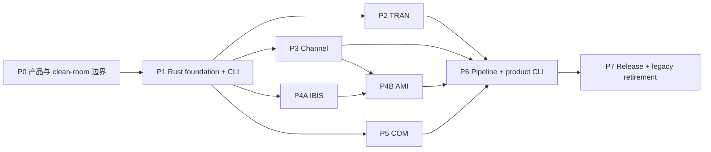

# SIPI-sim-agent 实施计划 v0.2

> 状态：执行中，替代 v0.1 作为当前主计划
> 重基线日期：2026-08-09
> 重基线仓库锚点：`9f9c76a`
> 产品规格：[SPEC.md](SPEC.md)
> 架构决策：[ADR-011](docs/adr/ADR-011-native-mit-rust-product-boundary.md)

## 1. 执行目标

把当前以 Python 控制面和旧引擎适配器为主的迁移平台，收敛为：

- 第一方可发布源码统一 MIT。
- 产品运行时和数值能力统一 Rust。
- 一个公开 `sipi` CLI 覆盖 TRAN、Channel、IBIS-AMI、COM 和跨域 pipeline。
- 三个旧项目只提供已授权 MIT 源码候选或工作树外 oracle。
- 既有示例以版本化 profile、stage compare 和预先批准容差保持准确。

v0.2 不否定已完成的 M0-M4/M5 证据；它改变这些证据的用途。契约、工件、fail-closed 和比较报告继续作为基础，Python adapter、旧 bundle、历史迁入和 fallback 则降级为迁移/验证设施。

## 2. 实施纪律

1. **纵向切片。** 每个 capability 从输入契约、Rust 内核、CLI、工件、oracle compare 到能力声明形成闭环，避免先铺满空 crate。
2. **许可先于代码 promotion。** 未进入 product allowlist 的文件不能成为最终 crate 输入；“本地能运行”不等于可发布。
3. **clean-room 两侧隔离。** 观察/规格侧和实现侧分开记录材料、人员/agent、commit 和输出。接触过受限源码的实现不能自行签署 strict clean-room。
4. **迁移与算法变化分开。** 复用/移动、机械 Rust 重构、数值行为修改、容差或 golden 变化分别提交和审计。
5. **唯一 owner。** 每个物理变换只有一个 production crate；adapter/pipeline 不写第二套 resolver、FFT、termination、均衡或符号处理。
6. **profile 级声明。** 测试通过只升级被覆盖的 profile，不能扩写为全域认证。
7. **失败关闭。** unsupported、许可缺口、来源不明、hash 漂移、partial output、timeout、panic/OOM 均不得被记为成功或 fallback。
8. **较大边界审计。** 一个内聚的大切片一个 commit；完成后同时请求 OMP/OpenCode 只读审计。任一可用审计给出 0 P1/0 P2 可继续，另一侧 quota/unavailable 必须落库并在恢复后补审。
9. **删除另行批准。** 旧 Python/adapter/oracle 的删除仍要求用户批准、Rust golden 完备、release 无依赖，并与其专属漂移门同批移除。

## 3. 当前资产处置

| 当前资产 | v0.2 用途 | 产品资格 |
| --- | --- | --- |
| `schemas/` 与 M1-M4 contract/rule ledger | Rust contracts 的兼容输入和测试基线 | 需迁为 Rust 权威并生成 schema |
| `packages/sipi-artifacts` | 原子工件和内容寻址行为参考 | 需 Rust 重做 |
| `packages/sipi-runtime` | DAG、状态、缓存、资源语义参考 | 需 Rust 重做 |
| `apps/sipi-cli` | CLI 行为原型 | 不进入终态运行时 |
| `packages/sipi-adapters` | 外部 oracle/迁移桥 | 不进入终态运行时 |
| `engines/agent-spice` | 已授权 MIT 来源与 oracle | Rust 子集逐文件审计后可复用；Python 不发布 |
| `native/crates/sipi-circuit` | TRAN candidate | 来源、依赖和行为门通过后 promotion |
| `native/crates/sipi-ami` | AMI clean-room candidate | 材料隔离、ABI 和许可门通过后 promotion |
| PyBERT source/CI/nightly/wheel evidence | Channel/AMI 外部 oracle 和稳定性证据 | 不迁入非 MIT/BSD 历史 |
| `agent-com` | 已授权 MIT 行为与源码参考 | 可直接移植到 Rust，仍需逐文件许可审计 |
| M5B AMI/RFM/S2P compare tools | scope-limited acceptance evidence | 工具本身不是产品 capability |
| M5A/M5B filter-repo preflight | 历史追溯记录 | 实际非 MIT 历史迁入路线终止 |

### 3.1 已接受但不外推的证据

- M3 checkpoint 和 M4 平台契约已接受，OMP 独立审计记录为 0 P1/0 P2。
- PyBERT 7 个 approved profile、RFM current-drive/Link、S2P handoff 和 AMI exact-fixture 报告可用于定义 v0.2 acceptance profile。
- Agent-Spice engine lock/bundle、许可分类和 COM 既有行为证据可用作来源锚。
- 这些结论不表示 Rust-only 产品、通用 AMI/Channel/COM 或 MIT release 已完成。

### 3.2 v0.2 重基线审计

- `e6e13e1` 已完成 OMP 独立只读审计，结论 0 P1/0 P2。
- OpenCode 交叉审计未等待完成；按用户授权，一个可用审计 0 P1/0 P2 后继续，未返回的结论不视为通过。
- 证据与非宣称见 [2026-08-09-spec-v0.2.md](docs/baselines/audits/2026-08-09-spec-v0.2.md)。
- P0-A `2ffeff1` 已完成 OMP 独立只读审计，结论 0 P1/0 P2；该边界仍是 provisional，不能授权 release。证据见 [2026-08-09-p0a-product-boundary.md](docs/baselines/audits/2026-08-09-p0a-product-boundary.md)。
- P0-B `70f37bc` 已完成 OMP 独立只读审计，结论 0 P1/0 P2；register 仅验证已登记证据的边界，不能证明认知或法律意义的 clean-room。证据见 [2026-08-09-p0b-clean-room-register.md](docs/baselines/audits/2026-08-09-p0b-clean-room-register.md)。
- P0-C `8e82e4c` 已完成 OMP 独立只读审计，结论 0 P1/0 P2；v2 仅是 future-release preflight，不授权 release。证据见 [2026-08-09-p0c-release-license-preflight.md](docs/baselines/audits/2026-08-09-p0c-release-license-preflight.md)。
- P0-D `6d6d820` 已完成 OMP 独立只读审计，结论 0 P1/0 P2；4 个 profile 均为 candidate/oracle-only，`required` 仍为零。证据见 [2026-08-09-p0d-acceptance-candidates.md](docs/baselines/audits/2026-08-09-p0d-acceptance-candidates.md)。
- P0-E `a30c4ca` 已完成 OMP 独立只读审计，结论 0 P1/0 P2；36 个 native candidate 全部仍是 `quarantine/unknown/pending`。证据见 [2026-08-09-p0e-native-source-map.md](docs/baselines/audits/2026-08-09-p0e-native-source-map.md)。
- P0-F `d183fb1`/`8069f64` 已完成 OMP 独立只读审计，结论 0 P1/0 P2；模板仅为 evidence scaffolding，不能替代 strict clean-room 或 release 门。证据见 [2026-08-09-p0f-clean-room-templates.md](docs/baselines/audits/2026-08-09-p0f-clean-room-templates.md)。
- P1-01 `07d4552` 已完成 OMP 独立只读审计，结论 0 P1/0 P2；仅为 quarantine 的 unsupported Rust foundation，不能宣称任何领域能力、严格 clean-room 或 release。证据见 [2026-08-09-p1a-rust-foundation.md](docs/baselines/audits/2026-08-09-p1a-rust-foundation.md)。
- P1-02 `144292a` 已完成 OMP 独立只读审计，结论 0 P1/0 P2；`sipi-types` 仅提供构造期数据不变量，未定义领域数值或 profile parity。证据见 [2026-08-09-p1b-types-foundation.md](docs/baselines/audits/2026-08-09-p1b-types-foundation.md)。
- P1-03 `856ea43` 已完成 OMP 独立只读审计，结论 0 P1/0 P2；wire contracts 仍只覆盖 P1 foundation，依赖和 release 许可均保持 pending。证据见 [2026-08-09-p1c-contracts-foundation.md](docs/baselines/audits/2026-08-09-p1c-contracts-foundation.md)。
- P1-04A `baf1b2c` 已完成 OMP 独立只读审计，结论 0 P1/0 P2；仅为 product-owned contract self-conformance，旧 fixture 保持 oracle-only。证据见 [2026-08-09-p1d-product-contract-conformance.md](docs/baselines/audits/2026-08-09-p1d-product-contract-conformance.md)。
- P1-05 `abdcc89` 已完成 OMP 独立只读审计，结论 0 P1/0 P2；`sipi-artifacts` 只提供 application-owned root 的 local immutable publication primitive，未宣称 runtime、domain、release 或 hostile filesystem containment。证据见 [2026-08-10-p1e-artifacts-foundation.md](docs/baselines/audits/2026-08-10-p1e-artifacts-foundation.md)。
- P1-06 `a5fb49c` 已完成 OMP 独立只读审计，结论 0 P1/0 P2；`sipi-runtime` 只提供同步 cooperative deadline/cancel/budget contract 与 cache-key calculation，未宣称 hard isolation、cache correctness 或 domain runtime。证据见 [2026-08-10-p1f-runtime-foundation.md](docs/baselines/audits/2026-08-10-p1f-runtime-foundation.md)。
- P1-07 `92fd319` 已完成 OMP 独立只读审计，结论 0 P1/0 P2；`sipi-pipeline` 只提供 immutable non-executing typed DAG validation 与确定性拓扑顺序，未接 runtime/artifact/cache 或领域执行。证据见 [2026-08-10-p1g-pipeline-foundation.md](docs/baselines/audits/2026-08-10-p1g-pipeline-foundation.md)。
- P1-08 `7ea8a39` 已完成 OMP 独立只读审计，结论 0 P1/0 P2；`sipi-cli` 只提供静态 discovery/self-conformance surface，未接请求/asset/runtime/domain execution，完整 process I/O contract 留给 P1-09。证据见 [2026-08-10-p1h-cli-discovery.md](docs/baselines/audits/2026-08-10-p1h-cli-discovery.md)。
- P1-09 `f67654d` 已完成 OMP 独立只读审计，结论 0 P1/0 P2；CLI 固定单请求/单响应 noninteractive contract，`validate --stdin` 只验证受限 P1 contract，`run` 仍 unsupported。证据见 [2026-08-10-p1i-cli-process-contract.md](docs/baselines/audits/2026-08-10-p1i-cli-process-contract.md)。
- P2-01 `e7fbfd4` 已完成 OMP 独立只读审计，结论 0 P1/0 P2；固定 `agent-spice@2cc92316` 未含 `native/crates/sipi-circuit` tree，29 个目标 path 全部仍为 `quarantine/unknown`，没有 promotion。证据见 [2026-08-10-p2a-tran-provenance-preflight.md](docs/baselines/audits/2026-08-10-p2a-tran-provenance-preflight.md)。
- P2-02a `ede13a3` 已完成 OMP 独立只读审计，结论 0 P1/0 P2；`sipi-tran` 仅为 std-only、显式 unsupported 的 package boundary，不导出 TRAN 领域 API 或路由。证据见 [2026-08-10-p2b-tran-package-foundation.md](docs/baselines/audits/2026-08-10-p2b-tran-package-foundation.md)。
- P2-02b `05583cb` 已完成 OMP 独立只读审计，结论 0 P1/0 P2；`rc.cir` 已作为 required external-only profile 锚定，但采样、初值、环境和容差尚未确认，任何 passed/certified 结论仍会 fail-closed。证据见 [2026-08-10-p2c-rc-pulse-acceptance-contract.md](docs/baselines/audits/2026-08-10-p2c-rc-pulse-acceptance-contract.md)。
- P2-03a `8184303` 已完成 OMP 独立只读审计，结论 0 P1/0 P2；RC/PULSE 的 index-aligned 网格、初值、backward-Euler 语义、环境和容差已冻结，但结果尚未执行或接受。证据见 [2026-08-10-p2d-rc-pulse-semantics.md](docs/baselines/audits/2026-08-10-p2d-rc-pulse-semantics.md)。
- P2-02c `5ffe75b` 已完成 OMP 独立只读审计，结论 0 P1/0 P2；`sipi-tran` 实现 fixed RC/PULSE typed library，仅有产品自有验证，尚未取得 external oracle parity。证据见 [2026-08-10-p2e-fixed-rc-pulse-library.md](docs/baselines/audits/2026-08-10-p2e-fixed-rc-pulse-library.md)。
- P2-06a `ed776264` 已完成 OMP 独立只读审计，结论 0 P1/0 P2；固定 Git object 的双次 external oracle run 可复现，且产品 typed result 在冻结的 time/`v(in)`/`v(out)` 门内通过。证据见 [2026-08-10-p2f-rc-pulse-external-comparator.md](docs/baselines/audits/2026-08-10-p2f-rc-pulse-external-comparator.md)。
- P2-08a `88d0d8f` 已完成 OMP 独立只读审计，结论 0 P1/0 P2；严格产品 owned RC/PULSE request 仅接受已认证参数，拒绝 legacy/netlist/path 与任意扩展。证据见 [2026-08-10-p2g-fixed-rc-pulse-request-contract.md](docs/baselines/audits/2026-08-10-p2g-fixed-rc-pulse-request-contract.md)。
- P2-08 `e67691a` 已完成 OMP 独立只读审计，结论 0 P1/0 P2；`sipi tran run` 已通过 typed library 发布 immutable result/provenance artifact，未接入旧 engine 或 fallback。证据见 [2026-08-10-p2h-fixed-tran-cli-artifact-run.md](docs/baselines/audits/2026-08-10-p2h-fixed-tran-cli-artifact-run.md)。
- P2-05 `f375b41` 已完成 OMP 独立只读审计，结论 0 P1/0 P2；项目自有 RC 解析解与线性 metamorphic 测试覆盖 shared solver core。证据见 [2026-08-10-p2i-owned-rc-properties.md](docs/baselines/audits/2026-08-10-p2i-owned-rc-properties.md)。
- P2-07a `104b988`/`55c6edc` 已完成 OMP 独立只读审计，结论 0 P1/0 P2；fixed RC/PULSE 已在真实路径检查 cooperative cancellation 与账户化输出预算。证据见 [2026-08-10-p2j-cooperative-tran-checkpoints.md](docs/baselines/audits/2026-08-10-p2j-cooperative-tran-checkpoints.md)。
- P2-07b `d332178` 已完成 OMP 独立只读审计，结论 0 P1/0 P2；同 artifact-id 的进程级重跑稳定失败且保持首次工件字节不变，accounted-byte 超限不发布成功工件。证据见 [2026-08-10-p2k-tran-failure-gates.md](docs/baselines/audits/2026-08-10-p2k-tran-failure-gates.md)。
- P2-09a `1864aca` 已完成 OMP 独立只读审计，结论 0 P1/0 P2；Windows installed CLI 的 fixed RC/PULSE 3 warmup/10 sample wall-time 与 PeakWorkingSet observation 可重放，但 budget 仍是 `pending`，release verifier 保持拒绝。证据见 [2026-08-10-p2l-tran-performance-observation.md](docs/baselines/audits/2026-08-10-p2l-tran-performance-observation.md)。

## 4. 工作流与依赖



- P0 是任何现有源码 promotion 的前置门。
- P1 先交付可运行但诚实返回 unsupported 的 Rust CLI；随后各领域纵向填充。
- P2/P3/P4A/P5 在 P1 稳定后可独立推进；P4B 依赖 IBIS 基础和 Channel handoff。
- P6 可在第一个领域 slice 后迭代，但只有四个领域的最小 certified profile 都接入后才能退出。
- P7 不等待“旧项目所有功能”重写，只要求本次发布声明的 capability 全闭环。

## 5. 里程碑总览

| 里程碑 | 目标 | 当前状态 |
| --- | --- | --- |
| P0 | 产品边界、许可、clean-room、示例清单 | 进行中；v0.2 基线与 P0-A 已审计 |
| P1 | Rust workspace、contracts/artifacts/runtime、统一 CLI 骨架 | P1-01 已建立 quarantine foundation；领域能力仍未开始 |
| P2 | TRAN 原生纵向切片 | fixed RC/PULSE profile 已完成 Rust library/CLI/oracle compare；general TRAN 与 release promotion 未开始 |
| P3 | Channel clean-room Rust 纵向切片 | `channel_16ghz_3db` 已选为 required profile，matched-S2P 观察/spec 预检已接受；产品实现未开始 |
| P4 | IBIS parser + AMI semantic/host | 有 `sipi-ami` candidate 和单 fixture 证据 |
| P5 | COM Rust 行为 profile | 未开始；有 MIT source/oracle |
| P6 | 跨域 pipeline、完整 CLI、AI 可发现性 | 有 Python MVP，Rust 未开始 |
| P7 | Windows release、SBOM/NOTICE、legacy retirement | 未开始 |

## 6. P0：产品与 clean-room 边界

### 6.1 目标

在继续迁代码前，机器可验证地回答：哪些字节属于产品、哪些只能作为 oracle、哪些材料实现侧绝不能读取，以及哪些旧例子必须保持。

### 6.2 任务

- [x] **P0-01** 用户确认终态：第一方 MIT、Rust-only、统一 CLI、旧项目保持示例准确性。
- [x] **P0-02** 发布 `SPEC.md`/`PLAN.md` v0.2 重基线。
- [x] **P0-03** 记录 ADR-011，明确终止非 MIT 历史迁入作为产品路线。
- [x] **P0-04a** 添加根 MIT `LICENSE` 与 scope，明确不覆盖 migration/oracle/third-party 资产。
- [x] **P0-04b** 在 P1 Rust crates 出现时统一第一方 Cargo/package metadata；不得覆盖第三方许可证。P1-01 crates 均为 `license = "MIT"`、`publish = false`，且仍处于 quarantine，未获得 release promotion。
- [x] **P0-05** 建立 `product-boundary.v1`：穷尽当前 tracked path，分类为 `product_candidate`、`migration_only`、`oracle_only`、`quarantine`、`generated`。
- [x] **P0-06** 新建 provisional `license-manifest.v2.yaml` release preflight：将 v1 legacy evidence 与未来 release 输入隔离，固定 dependency/NOTICE/owner/SBOM snapshot 的 fail-closed 字段；最终依赖和发布批准仍待录入。
- [x] **P0-07** 建立 provisional clean-room material/role register，包含观察侧、实现侧、allowlist、禁止材料和 attestation schema；strict identity/signature 与实际领域 scope 仍待逐项录入。
- [x] **P0-08** 建立 candidate acceptance profile inventory：固定 4 个 oracle-only 候选的 repo/commit/blob/SHA-256/许可证据/环境证据和 scope；所有 `required` 状态仍为零，待用户确认后才能升级。
- [x] **P0-09** 逐文件盘点现有 36 个 `native/**` tracked candidate 的 Git blob/SHA-256 与来源证据状态；全部 `quarantine/unknown/pending`，未作 promotion 或 clean-room 声明。
- [x] **P0-10** 增加 verifier：release/product path 中出现未分类、非 MIT 第一方、external-only asset、绝对用户路径或禁止来源时失败。
- [x] **P0-11** 为 observation spec、implementation commit、comparison report 定义版本化模板、保存位置和单审请求内容，并增加 heading/prohibited-marker drift verifier。

### 6.3 退出条件

- 当前 tracked paths 分类穷尽且无重叠/大小写冲突。
- 第一方产品候选均有 MIT 覆盖；第三方依赖均有 compatible 判定或被阻断。
- 非 MIT/BSD/PyAMI/vendor/source-unknown material 不可进入 product candidate。
- required 示例清单由用户确认，不能在实现中途静默删减。
- clean-room 实现侧的允许材料可机器重放。
- P0 大边界审计 0 P1/0 P2。

## 7. P1：Rust Foundation 与 CLI 骨架

### 7.1 目标

建立不依赖 Python 的可安装 Rust 产品骨架。即使领域内核尚未实现，CLI 也应能发现 schema/capabilities、校验请求并诚实返回 unsupported。

### 7.2 任务

- [x] **P1-01** 新建根 Cargo workspace，锁定 Rust toolchain、Cargo.lock 和 release profile；仅包含 std-only `sipi-cli`/`sipi-types`/`sipi-contracts` foundation，所有 Rust path 仍为 quarantine。
- [x] **P1-02** 建立 std-only `sipi-types`：SI newtypes、axis、port、complex tensor、waveform/spectrum 和 finite/shape/length validation；未定义单位换算、轴/端口领域语义、FFT 或 JSON。
- [x] **P1-03** 建立 quarantine `sipi-contracts`：versioned serde wire types、rule ledger、deterministic serialization profile 与 JSON Schema generation；所有 DTO 回调 `sipi-types` 构造器，尚不宣称跨语言 canonical JSON 或任何 domain request。
- [x] **P1-04A** 对 product-owned `sipi.contract.v1` fixture 做 Rust round-trip、schema、rule-ledger 和 negative self-conformance；语义变化新开版本。
- [ ] **P1-04B** （oracle-only）旧 `sipi.*.v1` fixture 只能在工作树外观察其 Git-object provenance；不得进入 Rust API/fixtures/实现侧，待用户确认 required profile 后再决定是否需要比较。
- [x] **P1-05** 建立 quarantine `sipi-artifacts`：有界 SHA-256 staging、seal 后重验、同根新目录 atomic publish、精确 success manifest 与 fail-closed verification；v1 只适用于无敌对写者的 application-owned root，不提供 GC/远端/CLI/runtime/domain semantics。
- [x] **P1-06** 建立 quarantine `sipi-runtime`：同步 cooperative run state、cancel request、checkpoint deadline/显式计量预算、structured error 和 deterministic cache key；不提供 executor、hard timeout/RSS/CPU isolation、cache store 或 domain semantics。
- [x] **P1-07** 建立 quarantine `sipi-pipeline`：immutable non-executing typed plan DAG，验证 source/stage/join/sink shape、typed edge、DAG/reachability 与确定性 topological order；不执行 callback、不存值、不接 runtime/artifact/cache 或领域数值。
- [x] **P1-08** 扩展 quarantine `sipi-cli` 静态 discovery/self-conformance 命令：`version/doctor/capabilities/schema/validate self/run/inspect`；不接 stdin/file/artifact/engine/domain request，完整 stdout/stderr/exit contract 留给 P1-09。
- [x] **P1-09** 固定单请求/单响应 noninteractive process contract：stdout JSON envelope、stderr JSON diagnostic、exit code 0/2/3/4/5/6，且仅 `validate --stdin` 接受受限 P1 contract request；不提供 run/file/artifact/streaming I/O。
- [x] **P1-10** release layout verifier 验证外部 staged CLI 的 closed layout、PE imports 和静态 smoke；任意命令 child-process/dynamic-load 仍不作证明。
- [x] **P1-11** Windows x86_64 locked build、fmt、clippy、test、isolated install smoke 和 exact schema drift gate；仅生成外部 provisional report，不是 twin build、archive 或 release promotion。

### 7.3 退出条件

- 从 clean checkout 可只用锁定 Rust 工具链构建 `sipi`。
- `sipi capabilities --json` 对未实现 domain 返回稳定 `unsupported`，无 silent fallback。
- schema 生成与提交快照一致，所有 v1 contract fixtures Rust conformance 通过。
- artifact failure/timeout/cancel 不发布 success。
- 发行候选不包含 Python runtime、迁移 adapter 或 external asset。
- P1 大边界审计 0 P1/0 P2。

P1 foundation 已完成。P1-04B 继续作为 oracle-only pending 项，且在用户确认 required profile 前不得成为领域实现输入。

## 8. P2：TRAN 原生能力

### 8.1 第一版 scope

第一版只承诺用户确认的 TRAN 示例所需语法、器件和 solver profile。OP/DC/AC、RFM 和拟合能力按独立 profile 增量进入，不以旧 Agent-Spice 功能总量作为一次性退出条件。

### 8.2 任务

`tran-rc-pulse-v1` 是当前唯一已接受的产品纵向切片：它只覆盖 typed
ideal-source/R/grounded-C、固定网格和显式初值。下列泛化任务仍保持未完成，
不得由该单 profile 或现有 `sipi-circuit` candidate 自动满足。

- [x] **P2-01** 审计 `agent-spice` MIT Rust 与现有 `sipi-circuit` 的逐文件来源、Cargo 依赖和 NOTICE；固定 anchor 未含 native tree，29 个 path 保持 `quarantine/unknown`，没有 promotion。
- [x] **P2-02a** 建立不导出领域 API 的 `sipi-tran` package boundary；这不能替代 P2-02，后者仍须 required TRAN profile 与 clean-room 语义规格。
- [x] **P2-02b** 冻结用户选择的 `rc.cir` external-only identity contract；数值语义与容差由 P2-03a 单独冻结。
- [x] **P2-02c** 实现仅覆盖 fixed `RcPulseTransientV1` 的 `sipi-tran` clean-room library；拒绝 netlist/parser/OP/AC/通用 MNA 与外部 fallback。
- [x] **P2-06a** 以工作树外的固定 Git object oracle 复跑 `tran-rc-pulse-v1`，并比较产品 typed result；报告仅保存身份、f64le 哈希与误差指标，不复制 fixture 或 waveform。
- [x] **P2-08a** 冻结严格的产品 owned `sipi.tran.rc-pulse-request.v1`；仅接受已认证 RC/PULSE 参数，拒绝 netlist、路径、未知字段和任意扩展参数。
- [x] **P2-03a** 冻结 RC/PULSE typed request 的独立数值语义与可执行 acceptance policy；不实现 parser、OP、AC 或通用 MNA。
- [ ] **P2-02** 将可接受内核收敛为 `sipi-tran` library；CLI/worker 只调用 library，不复制 solver。
- [ ] **P2-03** 冻结 netlist/circuit request、器件支持矩阵、solver/convergence policy 和 error taxonomy。
- [ ] **P2-04** 固定时间积分、初值、容差、step control、输出采样和 measurement 语义。
- [x] **P2-05** 建立自有 MIT 小电路、解析解/property/metamorphic 测试。
- [ ] **P2-06** 对 required Agent-Spice TRAN 例子生成 stage compare：parsed circuit、time grid、waveforms、measurements。
- [x] **P2-07** 已完成 fixed RC/PULSE profile 的适用 failure gate：cooperative cancel/deadline observation、accounted-byte output budget、不可覆盖 artifact publish failure；未知 request shape 由契约拒绝。nonconvergence 与 unsupported device 在当前无迭代/无器件分发面的闭合线性 profile 中为 `not_applicable`，不宣称 hard timeout、RSS/OOM 或进程隔离。证据见 [2026-08-10-p2k-tran-failure-gates.md](docs/baselines/audits/2026-08-10-p2k-tran-failure-gates.md)。
- [x] **P2-08** 接入 `sipi tran run`、工件和 provenance；拒绝旧 engine fallback。
- [ ] **P2-09** 在 owner-approved workload 上建立性能/RSS 基线，优化另行提交。**P2-09a** 已完成 fixed profile 的 3 warmup/10 sample observation 与 pending-budget verifier；缺 owner、阈值、统计规则和超限处置时 release 仍 fail-closed。

### 8.3 退出条件

- 至少一个明确 TRAN profile 在 Windows x86_64 达到 `certified`。
- required TRAN 示例在预先批准容差内通过且无 golden 改写。
- unsupported 语法/器件可由 `capabilities` 预先发现并稳定拒绝。
- release binary 不依赖 Agent-Spice Python/旧 executable。

## 9. P3：Channel clean-room Rust 能力

### 9.1 原则

PyBERT 和 PyAMI 不作为实现代码输入。观察侧将既有 7-profile、S2P、RFM、Link/DFE/CDR/BER 证据整理为独立行为规格；clean-room 实现侧只读取公开标准、该规格和自有 fixture。

现存 PyBERT-derived Rust 代码在来源未解决前不能被简单改名为 MIT。可以取得重许可，也可以由独立 clean-room crate 替代。

### 9.2 分段任务

#### P3A：Network 到 Channel Response

- [x] **P3A-01** 为已选 `channel_16ghz_3db` 冻结 external-only、两端口 real-50-ohm matched S2P 的端口、z0、power-wave、launch/receiver 和 termination 规格；RLGC/S4P/RFM 仍未开始。
- [x] **P3A-02** 观察侧以精确 Git object 锚定该 S2P 的结构事实，并冻结 matched-S2P 离散 V/V kernel 的 probe、DC/uniform-grid/Hermitian-IFFT/sign、对齐及容差策略。外部 observer 与产品 compare 仍未执行。
- [x] **P3A-03** clean-room `sipi-channel` 实现 matched two-port `S21` 到离散 V/V kernel 的唯一 resolver；只接收产品自有均匀矩阵，不含 adapter、Touchstone、Python 或额外数值路径。
- [x] **P3A-04** 以项目自有网络恒等式覆盖有限网格 passivity、reciprocity、losslessness 与 Parseval；causality 明确为 not-assessed，未作物理认证。
- [x] **P3A-05** `channel_16ghz_3db` required fixture 的 frozen matched-S21 discrete V/V response kernel 已完成 Git-object lineage 与 external observer→Rust compare；Link/stage、RFM、Touchstone 公共输入仍未开始。

#### P3B：Link Stages

- [x] **P3B-01** 冻结 `sipi.link-plan.v1` 的 stimulus、timebase、`direct_launch` TX、future linear-convolution、bypass RX typed stage contract；P3A periodic DFT kernel 明确不作为 causal FIR 接受，执行与 equalizer 仍未开始。证据见 [2026-08-10-p3b-link-stage-contract.md](docs/baselines/audits/2026-08-10-p3b-link-stage-contract.md)。
- [ ] **P3B-02** **P3B-02a/02b 已完成：** `sipi-link` 仅实现 product-owned causal FIR full linear convolution，`sipi link run --stdin` 将同一严格 direct-launch/bypass contract 发布为不可变 artifact；显式限制/数值溢出 fail-closed，CTLE/FFE 仍仅 bypass。equalizer 子集待明确 Link profile 与独立语义后开始；P3B-03 的 required RFM receiver charter 阻塞不受本切片影响。证据见 [2026-08-10-p3b-causal-fir-convolution.md](docs/baselines/audits/2026-08-10-p3b-causal-fir-convolution.md)、[2026-08-10-p3b-causal-fir-cli-run.md](docs/baselines/audits/2026-08-10-p3b-causal-fir-cli-run.md)。
- [ ] **P3B-03** **P3B-03a/03b/03c/03d/03e 已完成：** `channel-rfm-block-2-current-drive-v1` 已由用户标为 required；erasure amendment 规定 `0.0` feedback、继续处理与固定分母 96；`sipi-link` 已实现该 profile-scoped data-aided fixed-phase / fixed-training receiver 的 clean-room self-conformance。输入仍为 1024 点、1 ps、8 samples/UI 的单端 receive-voltage 与 CTLE/FFE bypass。受授权同源 reference-bit、external waveform handoff 与独立 charter compare 均已执行；但两个独立实现都在该 external RFM input 上按已批准的 1% unique phase-margin gate 拒绝 `cdr_ambiguous`，故 required profile 为 `blocked_cdr_ambiguous_under_approved_charter`，不宣称 RFM receiver parity。证据见 [2026-08-10-p3b-required-rfm-receiver-boundary.md](docs/baselines/audits/2026-08-10-p3b-required-rfm-receiver-boundary.md)、[2026-08-10-p3b-receiver-semantics-preparation.md](docs/baselines/audits/2026-08-10-p3b-receiver-semantics-preparation.md)、[2026-08-10-p3b-receiver-semantic-charter.md](docs/baselines/audits/2026-08-10-p3b-receiver-semantic-charter.md)、[2026-08-10-p3b-approved-receiver-charter.md](docs/baselines/audits/2026-08-10-p3b-approved-receiver-charter.md)、[2026-08-10-p3b-receiver-erasure-amendment.md](docs/baselines/audits/2026-08-10-p3b-receiver-erasure-amendment.md)、[2026-08-10-p3b-fixed-receiver-library.md](docs/baselines/audits/2026-08-10-p3b-fixed-receiver-library.md) 和 [2026-08-10-p3b-rfm-receiver-charter-compare.md](docs/baselines/audits/2026-08-10-p3b-rfm-receiver-charter-compare.md)。
- [ ] **P3B-04** 已接受 external-only same-source reference-bit provenance 与 Windows RFM receive-waveform 到 test-only product `ReceiverInputV1` handoff replay：两次 fresh external replay 的 waveform/bit hash 与单次 product boundary validation 均通过。独立、stdlib-only evaluator 与唯一产品 receiver 随后在同一双重 replay 上均 fail-closed `cdr_ambiguous`；Orca 对 compare gate 审计 `0 P1 / 0 P2`。当前状态为 `blocked_cdr_ambiguous_under_approved_charter`，下一步只能由 owner amendment 改变 phase-acquisition 语义后重跑，禁止复用 retained/old-Rust receiver。证据见 [2026-08-10-p3b-rfm-reference-bits-preflight.md](docs/baselines/audits/2026-08-10-p3b-rfm-reference-bits-preflight.md)、[2026-08-10-p3b-rfm-receiver-handoff-replay.md](docs/baselines/audits/2026-08-10-p3b-rfm-receiver-handoff-replay.md)、[2026-08-10-p3b-receiver-charter-evaluator.md](docs/baselines/audits/2026-08-10-p3b-receiver-charter-evaluator.md) 和 [2026-08-10-p3b-rfm-receiver-charter-compare.md](docs/baselines/audits/2026-08-10-p3b-rfm-receiver-charter-compare.md)。
- [ ] **P3B-05** **P3B-05a 已完成：** `sipi.link.causal-fir-request.v1` 对 seed、PRBS、noise、jitter、DFE/CDR/BER 与非 bypass stage 全部 fail-closed；machine-readable ledger 将 fixed receiver 明确为 library-only/profile-blocked。真实 deterministic seed、noise/jitter profile 和 receiver-stage 语义仍等待 required profile、注入位置、单位/随机或 time-warp 模型、seed replay、observables 与 tolerance 的 owner 决策，不能以本切片冒充实现。证据见 [2026-08-10-p3b-link-unsupported-boundary.md](docs/baselines/audits/2026-08-10-p3b-link-unsupported-boundary.md)。

#### P3C：指标与报告

- [ ] **P3C-01** 实现被 required 示例使用的 eye、jitter、bathtub 指标；每项独立 capability。
- [ ] **P3C-02** 记录 metric tolerance、数组 compare、missing/finite/shape 报告。
- [ ] **P3C-03** 接入 `sipi channel run` 和 `sipi compare`。

### 9.3 退出条件

- required Channel profiles 在同配置、同输入、同 stage 语义下通过。
- 端口、单位、termination、FFT scaling、sign 和 sample interval 全链路可追溯。
- production 只有一个 Rust resolver 和一个 receiver path，无 Python fallback。
- capability 矩阵区分 RLGC/S2P/S4P/RFM、deterministic/noisy、eye/jitter 等范围。

## 10. P4：IBIS 与 AMI

### 10.1 P4A：IBIS parser/semantics

- [ ] **P4A-01** 盘点 required IBIS 示例的版本、keyword、model selector、corner 和 table family。
  - [x] **P4A-01a** observer-only candidate inventory：在用户确认 required profile 前，冻结 `example_rx` 的外部 Git-object 元数据与 Windows x64 DLL name-binding gap；不得升级 candidate 状态或启动 parser。`0ba8d17` 已由 Orca `msg_5505b9d9cf47` 审计 0 P1/0 P2。
  - [x] **P4A-01b** receiver topology/acceptance boundary：RX 可为 electrical load、IBIS receiver model、AMI receiver algorithm 或显式 Rx chain；默认组合为零，任何组合仅 explicit profile。该边界不选择 required profile，也不启动 runtime。`2097875` 已由 Orca `msg_5fd344ba5d5f` 审计 0 P1/0 P2。
  - [x] **P4A-01c** electrical/IBIS discovery preflight：已记录候选 `Rdiff=100 ohm`，`Cload=1 pF` 保持 `pending_owner_choice`（禁止猜测跨差分、每腿对参考地或总差分等效拓扑）；本地 `example_rx` 继续 external-only candidate，公开 IBIS 仅记录来源目录，未选定资产/许可前不得进入产品。`a2057d5` 已由 Orca `msg_c1077af5a204` 审计 0 P1/0 P2，见 [2026-08-10-p4a-electrical-ibis-discovery.md](docs/baselines/audits/2026-08-10-p4a-electrical-ibis-discovery.md)。
  - [x] **P4A-01d** selected electrical endpoint semantic contract：已选择三端 `P/N/REF` 拓扑，`Rdiff=100 ohm` 跨 `P-N`，`P`、`N` 各以 `1 pF` 接 `REF`；`REF` 不默认等于全局地或节点0，尚待绑定首个 channel return/reference、stimulus/timebase、observable/tolerance 与 acceptance evidence。跨 `P-N` 电容与单端 `SIG/REF` channel 均明确为未来独立能力，不从当前 profile 推导。`93bf58b` 已由 Orca `msg_c9482356ce63` 审计 0 P1/0 P2，见 [2026-08-10-p4a-electrical-endpoint-semantics.md](docs/baselines/audits/2026-08-10-p4a-electrical-endpoint-semantics.md)。
- [ ] **P4A-02** 观察侧基于公开 IBIS 标准和授权 black-box 形成行为规格。
  - [x] **P4A-02a** observer-only IBIS 7.1 behavior-scope/candidate-fact preflight：记录公开标准索引与 `example_rx` 的有限结构事实；DLL identity blocker 下 black-box 必为 not-run，禁止把 Algorithmic Model attachment 推导成 AMI runtime 或隐式 IBIS+AMI composition。`42a2e81` 已由 Orca `msg_7a27909d2342` 审计 0 P1/0 P2，见 [2026-08-10-p4a-ibis71-behavior-scope-preflight.md](docs/baselines/audits/2026-08-10-p4a-ibis71-behavior-scope-preflight.md)。
- [ ] **P4A-03** clean-room 实现 Rust parser、typed AST 和严格 diagnostics。
  - [x] **P4A-03a** `sipi-ibis` structural parser foundation：仅解析 bounded ASCII 的物理行、注释、bracketed keyword 与 opaque data tokens，保留 source span；未知 keyword 仍 structural，拒绝 NUL/编码/line/record/keyword 结构错误。无 semantic validation、文件 I/O、CLI、IBIS electrical/AMI 行为或外部 asset fixture。`56729ac` 已由 Orca `msg_eb9a9cc99465` 审计 0 P1/0 P2，见 [2026-08-10-p4a-ibis-structural-parser-foundation.md](docs/baselines/audits/2026-08-10-p4a-ibis-structural-parser-foundation.md)。
  - [x] **P4A-03b-preflight** official pure-IBIS discovery/eligibility gate：已将 IBIS 官方站点的一项 `.ibs` 目录条目冻结为 `discovery_only` URL lead；没有下载、hash、local path、许可升级、required/profile/runtime/parser-test 或产品输入。后续 typed semantic AST 仍待明确授权、精确资产身份与 observable。`3e66b68` 已由 Orca `msg_743dbc3bf90b` 审计 0 P1/0 P2，见 [2026-08-10-p4a-official-pure-ibis-discovery-preflight.md](docs/baselines/audits/2026-08-10-p4a-official-pure-ibis-discovery-preflight.md)。
  - [x] **P4A-03b-license-identity** authorized external identity/license preflight：已在工作树外受控取得 official candidate 的 transport、length、SHA-256 与无内容的 marker 观察；许可证/复用权仍 `unverified`，外部 cleanup 被执行策略拒绝，故 custody 与 selection 都 fail-closed，禁止 required/profile/product/fixture/runtime/release。`b7e3dc6` 已由 Orca `msg_674e3ea9824f` 审计 0 P1/0 P2，见 [2026-08-10-p4a-official-pure-ibis-license-identity-preflight.md](docs/baselines/audits/2026-08-10-p4a-official-pure-ibis-license-identity-preflight.md)。
  - [x] **P4A-03b-structural-scope** owner-authorized external structural preflight：在第三方权利仍 `unverified` 的前提下，仅以行/header 结构扫描确认该精确外部对象可进入后续 owner selection review；记录仅含 counts/digests，零 AMI/DLL indicator 仅表示 declared scan scope 内未观察到。它仍非 required/profile/product/fixture/runtime/release 输入。`0ee067a` 已由 Orca `msg_5731be31b094` 审计 0 P1/0 P2，见 [2026-08-10-p4a-official-pure-ibis-structural-scope-preflight.md](docs/baselines/audits/2026-08-10-p4a-official-pure-ibis-structural-scope-preflight.md)。
  - [x] **P4A-03c** typed semantic envelope foundation：`sipi-ibis` 已在 structural parser 之上提供 lexical version、component/model declaration、`Model_type`/`Other` section role 与 block ownership；profile required-keyword rules 显式保持 unavailable，未选择 IBIS revision 或外部 selector，亦无 electrical/PVT/table/AMI/runtime/CLI 语义。`456c117` 已由 Orca `msg_d3f625cfc344` 审计 0 P1/0 P2，见 [2026-08-10-p4a-ibis-typed-semantic-envelope-foundation.md](docs/baselines/audits/2026-08-10-p4a-ibis-typed-semantic-envelope-foundation.md)。
- [ ] **P4A-04** 实现 required I-V/V-T/ramp/package 语义与显式 interpolation/extrapolation policy。
- [ ] **P4A-05** 建立公开/自有 fixture、malformed/unsupported matrix 和 oracle compare。
- [ ] **P4A-06** 接入 `sipi ibis inspect`，解析成功与电气行为认证分开报告。

### 10.2 P4B：AMI parser/host/semantics

- [ ] **P4B-01** 审计现有 `sipi-ami` 的材料来源、实现者暴露、依赖许可证和标准依据。
  - [x] **P4B-01a** quarantine provenance/license/exposure preflight：仅盘点当前 Git objects、locked dependency closure 与有限 exposure labels；不启动 host 功能，也不改变 P4A 依赖或 release 状态。`1d0d609` 已由 Orca `msg_d37b7d101fd6` 审计 0 P1/0 P2。
- [ ] **P4B-02** clean-room 实现 `.ami` 参数语义，固定 raw UTF-8 bytes、binding 和 validation。
- [ ] **P4B-03** 实现 Windows x64 标准 `long` ABI、Init/GetWave/Close 和 clock sentinel contract。
- [ ] **P4B-04** 私有 Rust host worker：hash-pinned executable、DLL/依赖 closure、timeout/cancel、atomic outputs。
- [ ] **P4B-05** 外部 asset manifest：DLL/IBIS/AMI/依赖 hash、允许用途、owner；默认不打包。
- [ ] **P4B-06** synthetic ABI stub 覆盖 success/failure/Close/partial/timeout/clock。
- [ ] **P4B-07** authorized exact fixture 覆盖 Init-only、单/多 GetWave、不同合法长度的 raw ABI output compare。
- [ ] **P4B-08** 将 raw AMI output 通过 typed edge 交给 Channel，另做 waveform/BER/eye profile；不能用 ABI 等价冒充系统 parity。
- [ ] **P4B-09** 接入 `sipi ami run`，只允许显式、已认证 profile，不注册 silent fallback。

### 10.3 退出条件

- 至少一个 IBIS profile 和一个 AMI external-asset profile 达到 `certified`。
- 标准 ABI status、lifecycle、raw samples/clocks/params 和 Close 可审计。
- vendor bytes 不在 Git/release，运行时严格绑定用户资产 identity。
- Python ctypes/PyAMI 不在产品路径；单 fixture 结果不外推为通用 AMI parity。

## 11. P5：COM Rust 行为 profile

### 11.1 原则

`agent-com` 已确认 MIT 范围可直接作为移植输入，但 source/data/oracle 仍逐项分类。Rust 实现保持明确的 behavior profile，不重新定义标准，也不将 Channel 中同名算法强行合并。

### 11.2 任务

- [x] **P5-01** 穷尽 `agent-com` source/data/workbook/MATLAB/oracle 许可与路径分类：已以 canonical `agent-com@5272ffe` 的 415 条目完成 quarantine provenance/license preflight；所有结论仍为分类事实，不构成 source promotion 或发布许可。
  - [x] **P5-01a** Git-object license/path/material preflight：canonical `agent-com@5272ffe` 的 415 条目已从 fresh clone 重放分类；root MIT 仅为证据，MATLAB/data/workbook/benchmark 仍 external/quarantine，`promotion_eligible: false`。初轮 `blocked_unreachable_source_anchor` 已由用户授权的 fast-forward `034b21b..5272ffe` 关闭；Orca 复审 `msg_3b586b2f352a` 为 0 P1 / 0 P2。见 [审计记录](docs/baselines/audits/2026-08-10-p5-agent-com-git-object-preflight-blocker.md)。
- [ ] **P5-02** 冻结 r4.80 canonical parameter JSON、默认值、消费审计和 warning contract。
  - [x] **P5-02a** required external-oracle acceptance freeze：`com-r480-envelope-v1` 已由用户选定；产品必须 clean-room Rust 重写，MATLAB/workbook/data 永远 external quarantine，仅在工作树外作结果比较。authoritative reference 仍缺失，比较 gate fail-closed，未开始参数/默认值或数值实现；Orca `msg_1ccb359f738a` 审计 0 P1 / 0 P2。见 [acceptance record](docs/baselines/com-r480-acceptance.v1.yaml) 与 [审计记录](docs/baselines/audits/2026-08-11-p5-com-r480-acceptance-boundary.md)。
  - [x] **P5-02b** authoritative-reference availability preflight：仅锚定 required R480 profile 的 Git object 与 compare 所需的外部 runner/input/default/reference bundle/tolerance 缺口；不读取或运行 MATLAB/workbook/fixture，也不创建 `sipi-com` API。当前结论为 `reference_generation_blocked`，因此 P5-03 继续等待独立 parameter/default/consumption charter 和可重放 authoritative reference。Orca `msg_aae33e3a33b0` 审计 0 P1 / 0 P2。见 [preflight](docs/baselines/com-r480-reference-availability-preflight.v1.yaml) 与 [审计记录](docs/baselines/audits/2026-08-11-p5-com-r480-reference-availability-preflight.md)。
  - [x] **P5-02c** oracle-only MATLAB runner capability preflight：本机 hash-pinned MATLAB R2024b 可在 external empty-temp builtin version probe 中启动并输出 sentinel，但 startup isolation 未被证明，故结论仍为 `indeterminate_startup_isolation_unproven`。不读取/执行 agent-com/MATLAB/workbook/fixture/R480 material，不产生产品 API、oracle 结果或 runtime dependency；P5-02 authoritative reference 仍 `reference_generation_blocked`。Orca `msg_0e014d14376f` 审计 0 P1 / 0 P2。见 [preflight](docs/baselines/com-r480-matlab-runner-capability-preflight.v1.yaml) 与 [审计记录](docs/baselines/audits/2026-08-11-p5-com-r480-matlab-runner-capability-preflight.md)。
  - [x] **P5-02d1** oracle-runner invocation-surface preflight：在 external clean `agent-com@5272ffe` clone 上仅以 Python AST 扫描已锚定 `tools/run_matlab_oracle.py` 的 invocation surface；不 import 或执行 runner，也不读取 MATLAB/workbook/fixture/input/default/result。runner interface 仅 `partially_observed`，动态执行仍 `not_authorized_or_not_safe`，R480 reference 继续 blocked。
- [ ] **P5-03** 建立 `sipi-com` crate 和 typed stage outputs。
- [ ] **P5-04** 按 stage 移植 network ingest、channel selection、equalizer search、PDF 和 metrics；每段保留 MIT 来源映射。
- [ ] **P5-05** workbook importer 与核心参数 DTO 分离，未使用字段仍进入消费报告。
- [ ] **P5-06** 对 required COM 示例比较 normalized input、选择证据、intermediate arrays、COM/ERL/TDILN 等指标和 warnings。
- [ ] **P5-07** 建立 synthetic/property/negative fixtures，避免 MATLAB oracle 成为唯一真相。
- [ ] **P5-08** 接入 `sipi com run`、工件和 provenance。
- [ ] **P5-09** 明确“行为复刻、非 IEEE 官方认证”的报告和 capability 文案。

### 11.3 退出条件

- required COM behavior profile 在冻结容差内通过。
- Rust release 不依赖 Python/MATLAB/Excel runtime。
- workbook、私有 channel 和 MATLAB oracle 均按许可留在外部。
- Channel 与 COM 的算法 owner 和 profile 互不混淆。

## 12. P6：Pipeline、统一 CLI 与 AI 可用性

### 12.1 任务

- [ ] **P6-01** 完成 Rust project/DAG contract：analysis nodes、typed artifact edges、资源、seed 和 outputs。
- [ ] **P6-02** 实现 TRAN/RFM -> Channel、IBIS/AMI -> Channel、Channel/COM 并行等首批 edge。
- [ ] **P6-03** 所有 edge 校验 schema、单位、port map、policy 和 producer/consumer hash。
- [ ] **P6-04** 完成 run status/cancel/retry/cache；retry 产生新 attempt，不改写旧证据。
- [ ] **P6-05** 完成 `tran/channel/ibis/ami/com/project/compare/inspect/report` 命令面。
- [ ] **P6-06** 稳定 JSON/NDJSON、exit code、schema discovery、example request 和 capability diagnostics。
- [ ] **P6-07** 建立 AI conformance：从 `schema + capabilities` 可构造合法请求，错误无需解析任意文本。
- [ ] **P6-08** 建立端到端 artifact/provenance viewer/report；不泄露绝对路径和私有资产内容。
- [ ] **P6-09** fail-closed 测试：缺 edge、hash 漂移、worker crash、partial output、cancel、resource limit。
- [ ] **P6-10** 保持未来 service/GUI 只调用同一 Rust contract，不创建第二套平台语义。

### 12.2 AI 验收题

在无源码上下文的干净 agent 会话中，仅给 CLI/schema/capabilities，验证其能：

1. 发现一个已认证 TRAN/Channel/AMI/COM profile。
2. 构造并校验最小请求。
3. 运行、读取结构化错误、定位字段 path。
4. 查找 stage artifacts 和 provenance。
5. 发起 reference/candidate compare 并正确描述 scope/non-claims。
6. 对 unsupported capability 停止而不是猜参数或切换旧引擎。

### 12.3 退出条件

- `sipi` 是唯一公开 CLI，快捷命令与 project run 使用同一契约。
- 首批跨域 pipeline 在 typed edge 上端到端通过。
- 人和 AI 均可机器发现支持范围、错误和结果来源。
- 无隐藏 Python/old-engine/default fallback。

## 13. P7：发布、认证与 legacy retirement

### 13.1 发布任务

- [ ] **P7-01** Windows x86_64 clean twin build、locked dependency、可复现性差异报告。
- [ ] **P7-02** 生成 SBOM、NOTICE、license report 和 PE normal/delay import closure。
- [ ] **P7-03** 扫描 release archive，拒绝 Python、vendor asset、private fixture、blocked material 和绝对路径。
- [ ] **P7-04** fresh machine/VM 安装 smoke，运行每个 certified profile 和 fail-closed case。
- [ ] **P7-05** 发布 capability matrix、acceptance report index、non-claims 和 known limitations。
- [ ] **P7-06** 对 owner-approved workload 执行性能/RSS 门；无批准预算只记录 observation。
- [ ] **P7-07** 形成 release candidate tag，绑定源码、工具链、工件和审计结论。
- [ ] **P7-08** 用户批准后删除已替代的 Python/adapter/runtime，并同批移除专属 drift gate。
- [ ] **P7-09** 旧历史保留在原仓/evidence repo，只在产品文档引用 hash；不导入非 MIT 历史。

### 13.2 发布声明

发布说明只能声明 capability matrix 中的 certified 项。以下事实不得被含糊化：

- Windows-only 首发。
- vendor AMI/IBIS/DLL 由用户提供。
- COM 是特定 behavior profile，不是 IEEE 官方认证。
- profile 之外的模型、参数范围和平台未认证。
- 第三方依赖保留自身许可证，MIT 指第一方产品源码。

### 13.3 退出条件

- G0-G6 对当前 release commit 全部通过。
- release 不需要 Python/MATLAB/旧 engine。
- 四个领域各至少一个 profile certified，跨域 pipeline 至少一个 certified。
- 安装、运行、错误、工件和卸载在干净 Windows 环境可重放。
- 用户批准的 legacy 删除范围已完成或明确保留为非发布工具。

## 14. Acceptance Profile 计划

### 14.1 清单结构

建议落点：

```text
acceptance/
├── profiles.v1.yaml
├── tolerances.v1.yaml
├── sources.v1.yaml
├── reports/                 # 只存可披露报告/哈希
└── schemas/
```

每个 profile 需有 `owner`、`required`、`license_status`、`oracle_mode`、`candidate_mode`、`stage_checks`、`tolerance_policy`、`platform`、`status` 和 `non_claims`。

### 14.2 首批 profile group

| Group | 来源 | 首要比较 | v0.2 用途 |
| --- | --- | --- | --- |
| TRAN legacy examples | Agent-Spice | time grid、V/I waveform、measure、convergence | P2 certified candidate |
| PyBERT 7 approved profiles | PyBERT | stage arrays、decisions、BER/eye/jitter | P3 core acceptance |
| S2P handoff | PyBERT + SIPI | impulse lineage、Link stages/metrics | P3 network/link boundary |
| RFM current-drive/link | Agent-Spice + PyBERT | H/I/V transfer、receiver stages/BER | P3 cross-domain boundary |
| IBIS model cases | PyBERT/PyAMI | parsed model、table semantics、waveform | P4A acceptance |
| AMI `example_rx` exact hash | authorized external fixture | raw Init/GetWave/clock/status | P4B narrow ABI acceptance |
| COM r4.80 cases | Agent-COM | normalized input、selection、PDF、metrics | P5 acceptance |

P0-08 必须把 group 展开为逐 fixture 记录。表中存在并不表示许可、oracle 独立性或数值结果已经通过。

### 14.3 状态机

```text
inventory -> specified -> runnable -> compared -> accepted
     |            |           |          |
     +----------> blocked <----+----------+
```

- `accepted` 绑定 candidate commit/build，不能跨 commit 自动沿用。
- `blocked` 必须写许可、资产、环境、数值或规格缺口。
- 用户可显式将 profile 降级为 optional/retired，但需记录理由，不能由实现者静默处理。

## 15. 测试与审计策略

### 15.1 每层测试

1. Rust unit tests：算法局部、parser、validation、errors。
2. property/metamorphic：维度、单位、稳定性、网络与信号不变量。
3. contract tests：schema snapshot、round-trip、negative/rule ledger。
4. domain integration：同 crate 完整 stage、resource/failure。
5. oracle parity：工作树外 reference/candidate compare。
6. CLI conformance：stdout/stderr/exit/schema/capability。
7. packaging：clean locked build、SBOM/NOTICE/archive/安装。
8. fault drills：panic/OOM/timeout/cancel/partial output/worker cleanup。

### 15.2 提交边界

- 规格/材料清单与实现分开。
- 源码 promotion/move 与数值修改分开。
- 数值实现与 tolerance/golden 修改分开。
- CLI 接线不复制领域算法。
- 删除与对应 drift gate 同批，但在新路径 acceptance 之后。

### 15.3 审计流程

每个较大边界：

1. clean status 和固定 HEAD。
2. 运行适用 test/gate，保存命令、结果、工件 hash。
3. 单独 commit。
4. 向 OMP 与 OpenCode 发只读审计请求，范围包含 commit、non-claims 和重点风险。
5. 至少一个可用审计 0 P1/0 P2 才继续；P1/P2 修复后重审。
6. quota/unavailable 不写成通过，记录待补审状态。
7. 结论写入 `docs/baselines/audits/`，不靠聊天记录作为唯一证据。

## 16. v0.1 任务的处置

### 16.1 继续保留

- M3/M4 accepted contract、DTO、artifact、resolution 和 vertical evidence。
- M5A Agent-Spice MIT 来源、Rust candidate 和许可证据。
- M5B 已形成的 S2P/RFM/AMI scope-limited compare reports。
- PyBERT nightly/history verifier可继续观察 oracle 稳定性。

### 16.2 不再作为产品完成路径

- M5B-01 30-day nightly 不再是 Rust 产品 release 的总阻塞；只有依赖该 oracle 的 profile 才引用它。
- M5B-06/07 不执行 PyBERT 非 MIT/BSD 历史 filter-repo 迁入。
- Python -> auto -> Rust 分档不再是终态切换方案。
- Agent-Spice/PyBERT/Agent-COM bundle 不进入默认 release resolver。

### 16.3 归档原则

旧 PLAN v0.1 可从 Git 历史和现有审计文档复原。新文档不改写旧审计结论，只重分类其产品意义。需要保留的旧工具在对应 Rust profile accepted 前继续可运行；此后按 P7 删除门处理。

## 17. 风险登记

| 风险 | 影响 | 处理 |
| --- | --- | --- |
| 实现者已读非 MIT 源码 | clean-room 声明失效 | 独立实现者/agent、材料 allowlist、attestation；否则重许可或 unsupported |
| 把 compatible dependency 称为 MIT | 许可虚假陈述 | 第一方 MIT 与第三方许可分开，SBOM/NOTICE/closure verifier |
| 现有 Rust code 有 BSD 派生 | 无法作为 MIT 产品发布 | quarantine；来源审计、重许可或 clean-room 替代 |
| 为 parity 调高容差 | 掩盖数值回归 | tolerance 先冻结，变更独立审批，stage 定位 |
| 旧 oracle 自身不稳定 | 错误 golden 或假漂移 | 固定环境/commit/hash，多种独立正确性测试 |
| 单一 CLI 变成 god crate | 领域耦合和二次实现 | CLI 只构造 contract，数值 owner 在 domain crates |
| 外部 AMI DLL 不可信 | 崩溃、依赖劫持、泄露 | 私有 worker、hash/closure、受控 env、资源/路径策略 |
| COM/Channel 同名算法被错误复用 | 标准语义漂移 | 独立 behavior profile 和 owner crate |
| Windows 通过被外推跨平台 | 虚假能力广告 | profile 带 platform，Linux/macOS 默认 uncertified |
| legacy 永久不退场 | 双路径漂移 | product release 禁止依赖；P7 用户批准后同批移除 drift gate |

## 18. 接下来十个大切片

按依赖顺序推进，不用更多诊断切片替代产品代码：

1. **P0-A：product-boundary + 根 MIT + verifier。** 穷尽当前仓库路径，明确 release allowlist。
2. **P0-B：clean-room material/role register。** 固定三旧仓材料访问与 attestation。
3. **P0-C：acceptance profile inventory。** 展开所有 required examples、hash、许可和 stage/tolerance。
4. **P1-A：根 Cargo workspace + types/contracts。** 生成 schema，跑现有 v1 conformance。
5. **P1-B：Rust artifacts/runtime。** 原子发布、错误、取消、资源和 provenance。
6. **P1-C：`sipi` CLI 骨架。** schema/capabilities/validate/run，未实现项 fail closed。
7. **P2-A：TRAN source promotion。** 审计并收编可接受的 MIT Rust 内核，不改数值。
8. **P2-B：首个 TRAN certified profile。** CLI 到 waveform/measure 的纵向闭环。
9. **P3-A：Channel observation spec。** 由旧 profiles 形成 clean-room 输入，不交付实现源码。
10. **P3-B：Channel response clean-room slice。** 新 Rust resolver + 独立正确性 + 首个 oracle compare。

P4/P5 可在 P1 稳定后开独立纵向支线，但同一主工作树仍保持一个较大边界一个提交和审计。

## 19. 完成定义

本计划完成时：

- G0-G6 对 release commit 全绿。
- 第一方产品源码 MIT，第三方依赖 NOTICE/SBOM 完整，external/blocked bytes 不在发行物。
- 产品 runtime、domain cores、pipeline、contracts、artifacts 和 CLI 均为 Rust。
- `sipi` 是唯一公开入口，AI 可通过 schema/capabilities/errors 安全使用。
- TRAN、Channel、IBIS-AMI、COM 各有至少一个 Windows x86_64 certified profile。
- 用户确认的 required legacy examples 全部通过或有显式降级决议。
- 跨域 pipeline 使用 typed artifact、唯一 resolver 和完整 provenance。
- 旧 Python/adapter/bundle 不在产品依赖；其保留或删除已按用户批准处理。
- 所有发布声明精确到 profile，未认证能力不被广告。

这条路线优先交付一个范围有限但许可、语言、准确性和接口都闭环的原生平台，而不是一个功能表很长、内部仍依赖旧项目的包装层。
