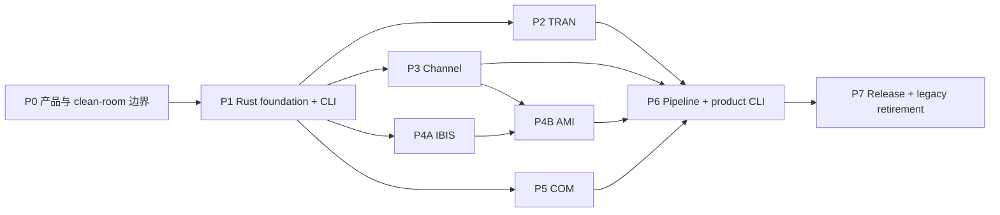

# SIPI-sim-agent 实施计划 v0.2

> 状态：执行中，替代 v0.1 作为当前主计划
> 重基线日期：2026-08-09
> 重基线仓库锚点：`9f9c76a`
> 产品规格：[SPEC.md](SPEC.md)
> 架构决策：[ADR-011](docs/adr/ADR-011-native-mit-rust-product-boundary.md)

## 1. 执行目标

把当前以 Python 控制面和旧引擎适配器为主的迁移平台，收敛为：

- 第一方可发布源码统一 MIT。
- 产品运行时和数值能力统一 Rust。
- 一个公开 `sipi` CLI 覆盖 TRAN、Channel、IBIS-AMI、COM 和跨域 pipeline。
- 三个旧项目只提供已授权 MIT 源码候选或工作树外 oracle。
- 既有示例以版本化 profile、stage compare 和预先批准容差保持准确。

v0.2 不否定已完成的 M0-M4/M5 证据；它改变这些证据的用途。契约、工件、fail-closed 和比较报告继续作为基础，Python adapter、旧 bundle、历史迁入和 fallback 则降级为迁移/验证设施。

## 2. 实施纪律

1. **纵向切片。** 每个 capability 从输入契约、Rust 内核、CLI、工件、oracle compare 到能力声明形成闭环，避免先铺满空 crate。
2. **许可先于代码 promotion。** 未进入 product allowlist 的文件不能成为最终 crate 输入；“本地能运行”不等于可发布。
3. **clean-room 两侧隔离。** 观察/规格侧和实现侧分开记录材料、人员/agent、commit 和输出。接触过受限源码的实现不能自行签署 strict clean-room。
4. **迁移与算法变化分开。** 复用/移动、机械 Rust 重构、数值行为修改、容差或 golden 变化分别提交和审计。
5. **唯一 owner。** 每个物理变换只有一个 production crate；adapter/pipeline 不写第二套 resolver、FFT、termination、均衡或符号处理。
6. **profile 级声明。** 测试通过只升级被覆盖的 profile，不能扩写为全域认证。
7. **失败关闭。** unsupported、许可缺口、来源不明、hash 漂移、partial output、timeout、panic/OOM 均不得被记为成功或 fallback。
8. **较大边界审计。** 一个内聚的大切片一个 commit；完成后同时请求 OMP/OpenCode 只读审计。任一可用审计给出 0 P1/0 P2 可继续，另一侧 quota/unavailable 必须落库并在恢复后补审。
9. **删除另行批准。** 旧 Python/adapter/oracle 的删除仍要求用户批准、Rust golden 完备、release 无依赖，并与其专属漂移门同批移除。

## 3. 当前资产处置

| 当前资产 | v0.2 用途 | 产品资格 |
| --- | --- | --- |
| `schemas/` 与 M1-M4 contract/rule ledger | Rust contracts 的兼容输入和测试基线 | 需迁为 Rust 权威并生成 schema |
| `packages/sipi-artifacts` | 原子工件和内容寻址行为参考 | 需 Rust 重做 |
| `packages/sipi-runtime` | DAG、状态、缓存、资源语义参考 | 需 Rust 重做 |
| `apps/sipi-cli` | CLI 行为原型 | 不进入终态运行时 |
| `packages/sipi-adapters` | 外部 oracle/迁移桥 | 不进入终态运行时 |
| `engines/agent-spice` | 已授权 MIT 来源与 oracle | Rust 子集逐文件审计后可复用；Python 不发布 |
| `native/crates/sipi-circuit` | TRAN candidate | 来源、依赖和行为门通过后 promotion |
| `native/crates/sipi-ami` | AMI clean-room candidate | 材料隔离、ABI 和许可门通过后 promotion |
| PyBERT source/CI/nightly/wheel evidence | Channel/AMI 外部 oracle 和稳定性证据 | 不迁入非 MIT/BSD 历史 |
| `agent-com` | 已授权 MIT 行为与源码参考 | 可直接移植到 Rust，仍需逐文件许可审计 |
| M5B AMI/RFM/S2P compare tools | scope-limited acceptance evidence | 工具本身不是产品 capability |
| M5A/M5B filter-repo preflight | 历史追溯记录 | 实际非 MIT 历史迁入路线终止 |

### 3.1 已接受但不外推的证据

- M3 checkpoint 和 M4 平台契约已接受，OMP 独立审计记录为 0 P1/0 P2。
- PyBERT 7 个 approved profile、RFM current-drive/Link、S2P handoff 和 AMI exact-fixture 报告可用于定义 v0.2 acceptance profile。
- Agent-Spice engine lock/bundle、许可分类和 COM 既有行为证据可用作来源锚。
- 这些结论不表示 Rust-only 产品、通用 AMI/Channel/COM 或 MIT release 已完成。

### 3.2 v0.2 重基线审计

- `e6e13e1` 已完成 OMP 独立只读审计，结论 0 P1/0 P2。
- OpenCode 交叉审计未等待完成；按用户授权，一个可用审计 0 P1/0 P2 后继续，未返回的结论不视为通过。
- 证据与非宣称见 [2026-08-09-spec-v0.2.md](docs/baselines/audits/2026-08-09-spec-v0.2.md)。
- P0-A `2ffeff1` 已完成 OMP 独立只读审计，结论 0 P1/0 P2；该边界仍是 provisional，不能授权 release。证据见 [2026-08-09-p0a-product-boundary.md](docs/baselines/audits/2026-08-09-p0a-product-boundary.md)。
- P0-B `70f37bc` 已完成 OMP 独立只读审计，结论 0 P1/0 P2；register 仅验证已登记证据的边界，不能证明认知或法律意义的 clean-room。证据见 [2026-08-09-p0b-clean-room-register.md](docs/baselines/audits/2026-08-09-p0b-clean-room-register.md)。
- P0-C `8e82e4c` 已完成 OMP 独立只读审计，结论 0 P1/0 P2；v2 仅是 future-release preflight，不授权 release。证据见 [2026-08-09-p0c-release-license-preflight.md](docs/baselines/audits/2026-08-09-p0c-release-license-preflight.md)。
- P0-D `6d6d820` 已完成 OMP 独立只读审计，结论 0 P1/0 P2；4 个 profile 均为 candidate/oracle-only，`required` 仍为零。证据见 [2026-08-09-p0d-acceptance-candidates.md](docs/baselines/audits/2026-08-09-p0d-acceptance-candidates.md)。
- P0-E `a30c4ca` 已完成 OMP 独立只读审计，结论 0 P1/0 P2；36 个 native candidate 全部仍是 `quarantine/unknown/pending`。证据见 [2026-08-09-p0e-native-source-map.md](docs/baselines/audits/2026-08-09-p0e-native-source-map.md)。
- P0-F `d183fb1`/`8069f64` 已完成 OMP 独立只读审计，结论 0 P1/0 P2；模板仅为 evidence scaffolding，不能替代 strict clean-room 或 release 门。证据见 [2026-08-09-p0f-clean-room-templates.md](docs/baselines/audits/2026-08-09-p0f-clean-room-templates.md)。
- P1-01 `07d4552` 已完成 OMP 独立只读审计，结论 0 P1/0 P2；仅为 quarantine 的 unsupported Rust foundation，不能宣称任何领域能力、严格 clean-room 或 release。证据见 [2026-08-09-p1a-rust-foundation.md](docs/baselines/audits/2026-08-09-p1a-rust-foundation.md)。
- P1-02 `144292a` 已完成 OMP 独立只读审计，结论 0 P1/0 P2；`sipi-types` 仅提供构造期数据不变量，未定义领域数值或 profile parity。证据见 [2026-08-09-p1b-types-foundation.md](docs/baselines/audits/2026-08-09-p1b-types-foundation.md)。
- P1-03 `856ea43` 已完成 OMP 独立只读审计，结论 0 P1/0 P2；wire contracts 仍只覆盖 P1 foundation，依赖和 release 许可均保持 pending。证据见 [2026-08-09-p1c-contracts-foundation.md](docs/baselines/audits/2026-08-09-p1c-contracts-foundation.md)。
- P1-04A `baf1b2c` 已完成 OMP 独立只读审计，结论 0 P1/0 P2；仅为 product-owned contract self-conformance，旧 fixture 保持 oracle-only。证据见 [2026-08-09-p1d-product-contract-conformance.md](docs/baselines/audits/2026-08-09-p1d-product-contract-conformance.md)。
- P1-05 `abdcc89` 已完成 OMP 独立只读审计，结论 0 P1/0 P2；`sipi-artifacts` 只提供 application-owned root 的 local immutable publication primitive，未宣称 runtime、domain、release 或 hostile filesystem containment。证据见 [2026-08-10-p1e-artifacts-foundation.md](docs/baselines/audits/2026-08-10-p1e-artifacts-foundation.md)。
- P1-06 `a5fb49c` 已完成 OMP 独立只读审计，结论 0 P1/0 P2；`sipi-runtime` 只提供同步 cooperative deadline/cancel/budget contract 与 cache-key calculation，未宣称 hard isolation、cache correctness 或 domain runtime。证据见 [2026-08-10-p1f-runtime-foundation.md](docs/baselines/audits/2026-08-10-p1f-runtime-foundation.md)。
- P1-07 `92fd319` 已完成 OMP 独立只读审计，结论 0 P1/0 P2；`sipi-pipeline` 只提供 immutable non-executing typed DAG validation 与确定性拓扑顺序，未接 runtime/artifact/cache 或领域执行。证据见 [2026-08-10-p1g-pipeline-foundation.md](docs/baselines/audits/2026-08-10-p1g-pipeline-foundation.md)。
- P1-08 `7ea8a39` 已完成 OMP 独立只读审计，结论 0 P1/0 P2；`sipi-cli` 只提供静态 discovery/self-conformance surface，未接请求/asset/runtime/domain execution，完整 process I/O contract 留给 P1-09。证据见 [2026-08-10-p1h-cli-discovery.md](docs/baselines/audits/2026-08-10-p1h-cli-discovery.md)。
- P1-09 `f67654d` 已完成 OMP 独立只读审计，结论 0 P1/0 P2；CLI 固定单请求/单响应 noninteractive contract，`validate --stdin` 只验证受限 P1 contract，`run` 仍 unsupported。证据见 [2026-08-10-p1i-cli-process-contract.md](docs/baselines/audits/2026-08-10-p1i-cli-process-contract.md)。
- P6-01 `4fca0a3` 建立 quarantine 的 `sipi.project.v1` 声明式计划与非执行 planner：固定节点 catalog、typed artifact contract edge、资源、32-byte seed、requested output、确定性拓扑和 digest。它不执行节点、不接 CLI/project run/artifact/worker/外部资产；审计整改和证据见 [2026-08-11-p6-project-dag-contract.md](docs/baselines/audits/2026-08-11-p6-project-dag-contract.md)。
- P2-01 `e7fbfd4` 已完成 OMP 独立只读审计，结论 0 P1/0 P2；固定 `agent-spice@2cc92316` 未含 `native/crates/sipi-circuit` tree，29 个目标 path 全部仍为 `quarantine/unknown`，没有 promotion。证据见 [2026-08-10-p2a-tran-provenance-preflight.md](docs/baselines/audits/2026-08-10-p2a-tran-provenance-preflight.md)。
- P2-02a `ede13a3` 已完成 OMP 独立只读审计，结论 0 P1/0 P2；`sipi-tran` 仅为 std-only、显式 unsupported 的 package boundary，不导出 TRAN 领域 API 或路由。证据见 [2026-08-10-p2b-tran-package-foundation.md](docs/baselines/audits/2026-08-10-p2b-tran-package-foundation.md)。
- P2-02b `05583cb` 已完成 OMP 独立只读审计，结论 0 P1/0 P2；`rc.cir` 已作为 required external-only profile 锚定，但采样、初值、环境和容差尚未确认，任何 passed/certified 结论仍会 fail-closed。证据见 [2026-08-10-p2c-rc-pulse-acceptance-contract.md](docs/baselines/audits/2026-08-10-p2c-rc-pulse-acceptance-contract.md)。
- P2-03a `8184303` 已完成 OMP 独立只读审计，结论 0 P1/0 P2；RC/PULSE 的 index-aligned 网格、初值、backward-Euler 语义、环境和容差已冻结，但结果尚未执行或接受。证据见 [2026-08-10-p2d-rc-pulse-semantics.md](docs/baselines/audits/2026-08-10-p2d-rc-pulse-semantics.md)。
- P2-02c `5ffe75b` 已完成 OMP 独立只读审计，结论 0 P1/0 P2；`sipi-tran` 实现 fixed RC/PULSE typed library，仅有产品自有验证，尚未取得 external oracle parity。证据见 [2026-08-10-p2e-fixed-rc-pulse-library.md](docs/baselines/audits/2026-08-10-p2e-fixed-rc-pulse-library.md)。
- P2-06a `ed776264` 已完成 OMP 独立只读审计，结论 0 P1/0 P2；固定 Git object 的双次 external oracle run 可复现，且产品 typed result 在冻结的 time/`v(in)`/`v(out)` 门内通过。证据见 [2026-08-10-p2f-rc-pulse-external-comparator.md](docs/baselines/audits/2026-08-10-p2f-rc-pulse-external-comparator.md)。
- P2-08a `88d0d8f` 已完成 OMP 独立只读审计，结论 0 P1/0 P2；严格产品 owned RC/PULSE request 仅接受已认证参数，拒绝 legacy/netlist/path 与任意扩展。证据见 [2026-08-10-p2g-fixed-rc-pulse-request-contract.md](docs/baselines/audits/2026-08-10-p2g-fixed-rc-pulse-request-contract.md)。
- P2-08 `e67691a` 已完成 OMP 独立只读审计，结论 0 P1/0 P2；`sipi tran run` 已通过 typed library 发布 immutable result/provenance artifact，未接入旧 engine 或 fallback。证据见 [2026-08-10-p2h-fixed-tran-cli-artifact-run.md](docs/baselines/audits/2026-08-10-p2h-fixed-tran-cli-artifact-run.md)。
- P2-05 `f375b41` 已完成 OMP 独立只读审计，结论 0 P1/0 P2；项目自有 RC 解析解与线性 metamorphic 测试覆盖 shared solver core。证据见 [2026-08-10-p2i-owned-rc-properties.md](docs/baselines/audits/2026-08-10-p2i-owned-rc-properties.md)。
- P2-07a `104b988`/`55c6edc` 已完成 OMP 独立只读审计，结论 0 P1/0 P2；fixed RC/PULSE 已在真实路径检查 cooperative cancellation 与账户化输出预算。证据见 [2026-08-10-p2j-cooperative-tran-checkpoints.md](docs/baselines/audits/2026-08-10-p2j-cooperative-tran-checkpoints.md)。
- P2-07b `d332178` 已完成 OMP 独立只读审计，结论 0 P1/0 P2；同 artifact-id 的进程级重跑稳定失败且保持首次工件字节不变，accounted-byte 超限不发布成功工件。证据见 [2026-08-10-p2k-tran-failure-gates.md](docs/baselines/audits/2026-08-10-p2k-tran-failure-gates.md)。
- P2-09a `1864aca` 已完成 OMP 独立只读审计，结论 0 P1/0 P2；Windows installed CLI 的 fixed RC/PULSE 3 warmup/10 sample wall-time 与 PeakWorkingSet observation 可重放，但 budget 仍是 `pending`，release verifier 保持拒绝。证据见 [2026-08-10-p2l-tran-performance-observation.md](docs/baselines/audits/2026-08-10-p2l-tran-performance-observation.md)。

## 4. 工作流与依赖



- P0 是任何现有源码 promotion 的前置门。
- P1 先交付可运行但诚实返回 unsupported 的 Rust CLI；随后各领域纵向填充。
- P2/P3/P4A/P5 在 P1 稳定后可独立推进；P4B 依赖 IBIS 基础和 Channel handoff。
- P6 可在第一个领域 slice 后迭代，但只有四个领域的最小 certified profile 都接入后才能退出。
- P7 不等待“旧项目所有功能”重写，只要求本次发布声明的 capability 全闭环。

## 5. 里程碑总览

| 里程碑 | 目标 | 当前状态 |
| --- | --- | --- |
| P0 | 产品边界、许可、clean-room、示例清单 | 进行中；v0.2 基线与 P0-A 已审计 |
| P1 | Rust workspace、contracts/artifacts/runtime、统一 CLI 骨架 | P1-01 已建立 quarantine foundation；领域能力仍未开始 |
| P2 | TRAN 原生纵向切片 | fixed RC/PULSE profile 已完成 Rust library/CLI/oracle compare；general TRAN 与 release promotion 未开始 |
| P3 | Channel clean-room Rust 纵向切片 | 限定 matched-S21 periodic kernel、严格 Touchstone 输入和 `channel run` 已实现；`channel_16ghz_3db` 的 kernel core external compare 已接受，Link/eye/BER/receiver 仍未完成 |
| P4 | IBIS parser + AMI semantic/host | 有 `sipi-ami` candidate 和单 fixture 证据 |
| P5 | COM Rust 行为 profile | 未开始；有 MIT source/oracle |
| P6 | 跨域 pipeline、完整 CLI、AI 可发现性 | 有 Python MVP，Rust 未开始 |
| P7 | Windows release、SBOM/NOTICE、legacy retirement | 未开始 |

## 6. P0：产品与 clean-room 边界

### 6.1 目标

在继续迁代码前，机器可验证地回答：哪些字节属于产品、哪些只能作为 oracle、哪些材料实现侧绝不能读取，以及哪些旧例子必须保持。

### 6.2 任务

- [x] **P0-01** 用户确认终态：第一方 MIT、Rust-only、统一 CLI、旧项目保持示例准确性。
- [x] **P0-02** 发布 `SPEC.md`/`PLAN.md` v0.2 重基线。
- [x] **P0-03** 记录 ADR-011，明确终止非 MIT 历史迁入作为产品路线。
- [x] **P0-04a** 添加根 MIT `LICENSE` 与 scope，明确不覆盖 migration/oracle/third-party 资产。
- [x] **P0-04b** 在 P1 Rust crates 出现时统一第一方 Cargo/package metadata；不得覆盖第三方许可证。P1-01 crates 均为 `license = "MIT"`、`publish = false`，且仍处于 quarantine，未获得 release promotion。
- [x] **P0-05** 建立 `product-boundary.v1`：穷尽当前 tracked path，分类为 `product_candidate`、`migration_only`、`oracle_only`、`quarantine`、`generated`。
- [x] **P0-06** 新建 provisional `license-manifest.v2.yaml` release preflight：将 v1 legacy evidence 与未来 release 输入隔离，固定 dependency/NOTICE/owner/SBOM snapshot 的 fail-closed 字段；最终依赖和发布批准仍待录入。
- [x] **P0-07** 建立 provisional clean-room material/role register，包含观察侧、实现侧、allowlist、禁止材料和 attestation schema；strict identity/signature 与实际领域 scope 仍待逐项录入。
- [x] **P0-08** 建立 candidate acceptance profile inventory：固定 4 个 oracle-only 候选的 repo/commit/blob/SHA-256/许可证据/环境证据和 scope；所有 `required` 状态仍为零，待用户确认后才能升级。
- [x] **P0-09** 逐文件盘点现有 36 个 `native/**` tracked candidate 的 Git blob/SHA-256 与来源证据状态；全部 `quarantine/unknown/pending`，未作 promotion 或 clean-room 声明。
- [x] **P0-10** 增加 verifier：release/product path 中出现未分类、非 MIT 第一方、external-only asset、绝对用户路径或禁止来源时失败。
- [x] **P0-11** 为 observation spec、implementation commit、comparison report 定义版本化模板、保存位置和单审请求内容，并增加 heading/prohibited-marker drift verifier。

### 6.3 退出条件

- 当前 tracked paths 分类穷尽且无重叠/大小写冲突。
- 第一方产品候选均有 MIT 覆盖；第三方依赖均有 compatible 判定或被阻断。
- 非 MIT/BSD/PyAMI/vendor/source-unknown material 不可进入 product candidate。
- required 示例清单由用户确认，不能在实现中途静默删减。
- clean-room 实现侧的允许材料可机器重放。
- P0 大边界审计 0 P1/0 P2。

## 7. P1：Rust Foundation 与 CLI 骨架

### 7.1 目标

建立不依赖 Python 的可安装 Rust 产品骨架。即使领域内核尚未实现，CLI 也应能发现 schema/capabilities、校验请求并诚实返回 unsupported。

### 7.2 任务

- [x] **P1-01** 新建根 Cargo workspace，锁定 Rust toolchain、Cargo.lock 和 release profile；仅包含 std-only `sipi-cli`/`sipi-types`/`sipi-contracts` foundation，所有 Rust path 仍为 quarantine。
- [x] **P1-02** 建立 std-only `sipi-types`：SI newtypes、axis、port、complex tensor、waveform/spectrum 和 finite/shape/length validation；未定义单位换算、轴/端口领域语义、FFT 或 JSON。
- [x] **P1-03** 建立 quarantine `sipi-contracts`：versioned serde wire types、rule ledger、deterministic serialization profile 与 JSON Schema generation；所有 DTO 回调 `sipi-types` 构造器，尚不宣称跨语言 canonical JSON 或任何 domain request。
- [x] **P1-04A** 对 product-owned `sipi.contract.v1` fixture 做 Rust round-trip、schema、rule-ledger 和 negative self-conformance；语义变化新开版本。
- [ ] **P1-04B** （oracle-only）旧 `sipi.*.v1` fixture 只能在工作树外观察其 Git-object provenance；不得进入 Rust API/fixtures/实现侧，待用户确认 required profile 后再决定是否需要比较。
- [x] **P1-05** 建立 quarantine `sipi-artifacts`：有界 SHA-256 staging、seal 后重验、同根新目录 atomic publish、精确 success manifest 与 fail-closed verification；v1 只适用于无敌对写者的 application-owned root，不提供 GC/远端/CLI/runtime/domain semantics。
- [x] **P1-06** 建立 quarantine `sipi-runtime`：同步 cooperative run state、cancel request、checkpoint deadline/显式计量预算、structured error 和 deterministic cache key；不提供 executor、hard timeout/RSS/CPU isolation、cache store 或 domain semantics。
- [x] **P1-07** 建立 quarantine `sipi-pipeline`：immutable non-executing typed plan DAG，验证 source/stage/join/sink shape、typed edge、DAG/reachability 与确定性 topological order；不执行 callback、不存值、不接 runtime/artifact/cache 或领域数值。
- [x] **P1-08** 扩展 quarantine `sipi-cli` 静态 discovery/self-conformance 命令：`version/doctor/capabilities/schema/validate self/run/inspect`；不接 stdin/file/artifact/engine/domain request，完整 stdout/stderr/exit contract 留给 P1-09。
- [x] **P1-09** 固定单请求/单响应 noninteractive process contract：stdout JSON envelope、stderr JSON diagnostic、exit code 0/2/3/4/5/6，且仅 `validate --stdin` 接受受限 P1 contract request；不提供 run/file/artifact/streaming I/O。
- [x] **P1-10** release layout verifier 验证外部 staged CLI 的 closed layout、PE imports 和静态 smoke；任意命令 child-process/dynamic-load 仍不作证明。
- [x] **P1-11** Windows x86_64 locked build、fmt、clippy、test、isolated install smoke 和 exact schema drift gate；仅生成外部 provisional report，不是 twin build、archive 或 release promotion。

### 7.3 退出条件

- 从 clean checkout 可只用锁定 Rust 工具链构建 `sipi`。
- `sipi capabilities --json` 对未实现 domain 返回稳定 `unsupported`，无 silent fallback。
- schema 生成与提交快照一致，所有 v1 contract fixtures Rust conformance 通过。
- artifact failure/timeout/cancel 不发布 success。
- 发行候选不包含 Python runtime、迁移 adapter 或 external asset。
- P1 大边界审计 0 P1/0 P2。

P1 foundation 已完成。P1-04B 继续作为 oracle-only pending 项，且在用户确认 required profile 前不得成为领域实现输入。

## 8. P2：TRAN 原生能力

### 8.1 第一版 scope

第一版只承诺用户确认的 TRAN 示例所需语法、器件和 solver profile。OP/DC/AC、RFM 和拟合能力按独立 profile 增量进入，不以旧 Agent-Spice 功能总量作为一次性退出条件。

### 8.2 任务

`tran-rc-pulse-v1` 是当前唯一已接受的产品纵向切片：它只覆盖 typed
ideal-source/R/grounded-C、固定网格和显式初值。下列泛化任务仍保持未完成，
不得由该单 profile 或现有 `sipi-circuit` candidate 自动满足。

- [x] **P2-01** 审计 `agent-spice` MIT Rust 与现有 `sipi-circuit` 的逐文件来源、Cargo 依赖和 NOTICE；固定 anchor 未含 native tree，29 个 path 保持 `quarantine/unknown`，没有 promotion。
- [x] **P2-02a** 建立不导出领域 API 的 `sipi-tran` package boundary；这不能替代 P2-02，后者仍须 required TRAN profile 与 clean-room 语义规格。
- [x] **P2-02b** 冻结用户选择的 `rc.cir` external-only identity contract；数值语义与容差由 P2-03a 单独冻结。
- [x] **P2-02c** 实现仅覆盖 fixed `RcPulseTransientV1` 的 `sipi-tran` clean-room library；拒绝 netlist/parser/OP/AC/通用 MNA 与外部 fallback。
- [x] **P2-02d** 将 fixed wrapper 收敛到唯一、参数化但拓扑固定的一节点 RC/PULSE library core；该 core 仍不开放 CLI/wire request、netlist或通用电路模型。整改后的 Orca 只读复审为 0 P1/0 P2，见 [evidence](docs/baselines/audits/2026-08-11-p2-one-node-rc-pulse.md)。
- [x] **P2-02e** 将该唯一内核接为独立 `sipi tran one-node-rc-pulse --stdin` artifact route：严格 product-owned request 仅允许显式 axis、R、C、初值与周期 PULSE；固定 4096 output / 16384 breakpoint bounds，仍拒绝 netlist、节点、器件、积分策略和任何 fallback。它不改变 externally accepted fixed wrapper，见 [evidence](docs/baselines/audits/2026-08-11-p2-one-node-rc-pulse-cli.md)。
- [x] **P2-06a** 以工作树外的固定 Git object oracle 复跑 `tran-rc-pulse-v1`，并比较产品 typed result；报告仅保存身份、f64le 哈希与误差指标，不复制 fixture 或 waveform。
- [x] **P2-06b** 当前 candidate 的 `sipi-tran` source/lock 漂移后重新以 clean archives 构建固定 external oracle 与 product harness；双次 oracle replay、三组数组比较和 source-tree/lock/executable/report binding 均通过。历史 attestation 保留，release ledger 只引用此 current-candidate evidence；范围仍仅 fixed RC/PULSE wrapper。
- [x] **P2-06c** 后续产品 source/lock 漂移后，保留 v1 historical attestation，并以 clean Git archive product harness 与 clean detached oracle worktree 重放固定 profile。v2 evidence 绑定当前 source tree、Cargo lock、可执行文件、双次 oracle replay 与外部 report；范围仍仅 fixed RC/PULSE wrapper，见 [evidence](docs/baselines/audits/2026-08-11-p2-fixed-tran-current-evidence-rebinding-v2.md)。
  - [x] **P2-06d** source-drift reconciliation：P3C-04e 新增 `faer` 导致 `Cargo.lock` 不再等于 P2-06c v2 的 bound object。v2 external compare 保留为 historical observed evidence；release TRAN row 移除 active evidence/accepted claim，并要求 `current_external_compare_evidence_source_drift` 精确成立。没有新的 clean-archive/external custody compare 前，不得恢复 TRAN external-oracle acceptance。
- [x] **P2-08a** 冻结严格的产品 owned `sipi.tran.rc-pulse-request.v1`；仅接受已认证 RC/PULSE 参数，拒绝 netlist、路径、未知字段和任意扩展参数。
- [x] **P2-03a** 冻结 RC/PULSE typed request 的独立数值语义与可执行 acceptance policy；不实现 parser、OP、AC 或通用 MNA。
- [x] **P2-03b** 冻结一节点 RC/PULSE 的显式 PULSE、输出轴、backward-Euler、breakpoint/资源与 cooperative checkpoint 语义；fixed `tran-rc-pulse-v1` 的 external acceptance 范围不变。
- [ ] **P2-02** 将可接受内核收敛为 `sipi-tran` library；CLI/worker 只调用 library，不复制 solver。
- [ ] **P2-03** 冻结 netlist/circuit request、器件支持矩阵、solver/convergence policy 和 error taxonomy。
- [ ] **P2-04** 固定时间积分、初值、容差、step control、输出采样和 measurement 语义。
- [x] **P2-05** 建立自有 MIT 小电路、解析解/property/metamorphic 测试。
- [ ] **P2-06** 对 required Agent-Spice TRAN 例子生成 stage compare：parsed circuit、time grid、waveforms、measurements。
- [x] **P2-07** 已完成 fixed RC/PULSE profile 的适用 failure gate：cooperative cancel/deadline observation、accounted-byte output budget、不可覆盖 artifact publish failure；未知 request shape 由契约拒绝。nonconvergence 与 unsupported device 在当前无迭代/无器件分发面的闭合线性 profile 中为 `not_applicable`，不宣称 hard timeout、RSS/OOM 或进程隔离。证据见 [2026-08-10-p2k-tran-failure-gates.md](docs/baselines/audits/2026-08-10-p2k-tran-failure-gates.md)。
- [x] **P2-08** 接入 `sipi tran run`、工件和 provenance；拒绝旧 engine fallback。
- [ ] **P2-09** 在 owner-approved workload 上建立性能/RSS 基线，优化另行提交。**P2-09a** 已完成 fixed profile 的 3 warmup/10 sample observation 与 pending-budget verifier；缺 owner、阈值、统计规则和超限处置时 release 仍 fail-closed。

### 8.3 退出条件

- 至少一个明确 TRAN profile 在 Windows x86_64 达到 `certified`。
- required TRAN 示例在预先批准容差内通过且无 golden 改写。
- unsupported 语法/器件可由 `capabilities` 预先发现并稳定拒绝。
- release binary 不依赖 Agent-Spice Python/旧 executable。

## 9. P3：Channel clean-room Rust 能力

### 9.1 原则

PyBERT 和 PyAMI 不作为实现代码输入。观察侧将既有 7-profile、S2P、RFM、Link/DFE/CDR/BER 证据整理为独立行为规格；clean-room 实现侧只读取公开标准、该规格和自有 fixture。

现存 PyBERT-derived Rust 代码在来源未解决前不能被简单改名为 MIT。可以取得重许可，也可以由独立 clean-room crate 替代。

### 9.2 分段任务

#### P3A：Network 到 Channel Response

- [x] **P3A-01** 为已选 `channel_16ghz_3db` 冻结 external-only、两端口 real-50-ohm matched S2P 的端口、z0、power-wave、launch/receiver 和 termination 规格；RLGC/S4P/RFM 仍未开始。
- [x] **P3A-02** 观察侧以精确 Git object 锚定该 S2P 的结构事实，并冻结 matched-S2P 离散 V/V kernel 的 probe、DC/uniform-grid/Hermitian-IFFT/sign、对齐及容差策略。外部 observer 与产品 compare 仍未执行。
- [x] **P3A-03** clean-room `sipi-channel` 实现 matched two-port `S21` 到离散 V/V kernel 的唯一 resolver；只接收产品自有均匀矩阵，不含 adapter、Touchstone、Python 或额外数值路径。
- [x] **P3A-04** 以项目自有网络恒等式覆盖有限网格 passivity、reciprocity、losslessness 与 Parseval；causality 明确为 not-assessed，未作物理认证。
- [x] **P3A-05** `channel_16ghz_3db` required fixture 的 frozen matched-S21 discrete V/V response kernel 已完成 Git-object lineage 与 external observer→Rust compare；Link/stage、RFM、Touchstone 公共输入仍未开始。
- [x] **P3A-06** clean-room `sipi-touchstone` 只接受 bounded in-memory `# Hz S RI R 50.0` two-port ASCII/RI rows，并在 DC、bit-exact uniform Hz grid 与 real-50-ohm 条件下直接映射到既有 matched spectrum；无文件/CLI/Link/外部资产输入，也不提升 selected-profile acceptance。证据见 [2026-08-11-p3a-touchstone-parser.md](docs/baselines/audits/2026-08-11-p3a-touchstone-parser.md)。
- [x] **P3A-07** `sipi channel run --stdin` 只接收 product-owned inline UTF-8 text，经唯一 strict Touchstone parser、matched admission 与 `S21` periodic-kernel resolver 输出有界 V/V kernel；无文件/URL/artifact、termination/reflection、causalization 或 Link simulation，caller input 始终 `unattested`。证据见 [2026-08-11-p3a-matched-channel-cli-run.md](docs/baselines/audits/2026-08-11-p3a-matched-channel-cli-run.md)。
- [x] **P3A-08** selected `channel_16ghz_3db` 的历史 policy/preflight 不改写；新增 hash-only external evidence，重新绑定当前 matched-kernel product source、两次 standard-DFT observer、external Git object 与误差门。该 profile 仅在 matched-S21 periodic discrete V/V kernel core 范围 accepted；`channel run` caller input、Link、general Touchstone 与 release status 不升级。见 [2026-08-11-p3a-matched-s2p-evidence-reconciliation.md](docs/baselines/audits/2026-08-11-p3a-matched-s2p-evidence-reconciliation.md)。
- [x] **P3A-09** selected `channel_16ghz_3db` 的 exact external-only S2P text 已在两个 fresh custody 中经独立 DFT observer、clean-archive `sipi channel run --stdin`、严格 P1 JSON process contract 与逐点 tolerance compare 验证。运行时仍将任何普通 caller input 标为 unattested；这不扩展为 general Touchstone、reflection/termination、Link/eye/BER、artifact 或 release acceptance。见 [2026-08-11-p3a-matched-s2p-cli-e2e-evidence.md](docs/baselines/audits/2026-08-11-p3a-matched-s2p-cli-e2e-evidence.md)。
- [x] **P3A-10** current-candidate CLI evidence rebinding：P2-02e 改变 `sipi-cli` tree 后，历史 P3A-09 attestation 不再自动代表当前二进制。新的 hash-only current evidence 绑定 clean-archive `d875433`、五个 `channel run` product tree、Cargo.lock、两次 external custody DFT observer 与严格 CLI response；release ledger 仅将其列为 exact-profile observed evidence，普通 caller input 仍 unattested。见 [2026-08-11-p3a-matched-s2p-cli-current-evidence-rebinding.md](docs/baselines/audits/2026-08-11-p3a-matched-s2p-cli-current-evidence-rebinding.md)。
- [x] **P3A-11** current-candidate CLI evidence rebinding：P3C-03a 再次改变 `sipi-cli` tree 后，P3A-10 保留为历史记录，不得自动继承。新的 v2 hash-only record 绑定 clean-archive `4bdd4d7`、五个 `channel run` product tree、Cargo.lock、两次 external custody DFT observer 与严格 CLI response；release ledger 只引用该 exact-profile observed evidence，普通 caller input 仍 unattested。见 [2026-08-11-p3a-matched-s2p-cli-current-evidence-rebinding-v2.md](docs/baselines/audits/2026-08-11-p3a-matched-s2p-cli-current-evidence-rebinding-v2.md)。
- [x] **P3A-12** current-candidate CLI evidence rebinding：P3B-03g 改变 `sipi-cli` 与 `sipi-contracts` tree 后，P3A-11 保留为历史记录，不得自动继承。新的 v3 hash-only record 绑定 clean-archive `58802b6`、五个 `channel run` product tree、Cargo.lock、两次 external custody DFT observer 与严格 CLI response；release ledger 仅引用这个 exact-profile observed evidence，普通 caller input 仍 unattested。见 [2026-08-11-p3a-matched-s2p-cli-current-evidence-rebinding-v3.md](docs/baselines/audits/2026-08-11-p3a-matched-s2p-cli-current-evidence-rebinding-v3.md)。
- [x] **P3A-13** evidence source-drift reconciliation：后续 `sipi-contracts` schema inventory 变更使 P3A-12 v3 的 product tree 不再匹配当前候选。v3 作为历史 observed record 保留；release publication 现以 `current_external_compare_evidence_source_drift` 明确阻断 Channel active evidence，且 verifier 要求该精确漂移结果。除非新的 clean-archive/external-custody compare 生成可验证 current record，否则不得恢复其 active 引用。
  - [x] **P3A-14** current-candidate CLI evidence rebinding：同一 exact external-only `channel_16ghz_3db.s2p` 在两次 fresh temporary custody 中由独立 DFT observer 重放，并通过 clean-archive `6340550` 的 locked release `sipi channel run` 比较。v4 绑定当前五个 product crate tree、Cargo.lock、executable 与外部 hash-only report；v1/v2/v3 保留 historical source-drift。该记录只恢复 selected matched-S21 periodic kernel 的 observed evidence，不升级 caller input、Link/eye/BER、general Touchstone 或 release。见 [2026-08-11-p3a-matched-s2p-cli-current-evidence-rebinding-v4.md](docs/baselines/audits/2026-08-11-p3a-matched-s2p-cli-current-evidence-rebinding-v4.md)。
  - [x] **P3A-15** source-drift reconciliation：P3C-04a 改变 `sipi-channel` 与 `sipi-touchstone` product trees 后，P3A-14 v4 继续保留为 historical observed record，不能代表当前 candidate。release channel row 现移除 v4 active evidence、保留 `current_external_compare_evidence_source_drift` blocker，并要求 verifier 精确观察该漂移；新的 clean-archive/external-custody S2P compare 之前不得恢复 external oracle claim。

#### P3B：Link Stages

- [x] **P3B-01** 冻结 `sipi.link-plan.v1` 的 stimulus、timebase、`direct_launch` TX、future linear-convolution、bypass RX typed stage contract；P3A periodic DFT kernel 明确不作为 causal FIR 接受，执行与 equalizer 仍未开始。证据见 [2026-08-10-p3b-link-stage-contract.md](docs/baselines/audits/2026-08-10-p3b-link-stage-contract.md)。
- [ ] **P3B-02** **P3B-02a/02b 已完成：** `sipi-link` 仅实现 product-owned causal FIR full linear convolution，`sipi link run --stdin` 将同一严格 direct-launch/bypass contract 发布为不可变 artifact；显式限制/数值溢出 fail-closed，CTLE/FFE 仍仅 bypass。equalizer 子集待明确 Link profile 与独立语义后开始；P3B-03 的 required RFM receiver charter 阻塞不受本切片影响。证据见 [2026-08-10-p3b-causal-fir-convolution.md](docs/baselines/audits/2026-08-10-p3b-causal-fir-convolution.md)、[2026-08-10-p3b-causal-fir-cli-run.md](docs/baselines/audits/2026-08-10-p3b-causal-fir-cli-run.md)。
- [ ] **P3B-03** **P3B-03a/03b/03c/03d/03e/03f/03g 已完成：** `channel-rfm-block-2-current-drive-v1` 已由用户标为 required；erasure amendment 规定 `0.0` feedback、继续处理与固定分母 96；`sipi-link` 已实现该 profile-scoped data-aided fixed-phase / fixed-training receiver 的 clean-room self-conformance。输入仍为 1024 点、1 ps、8 samples/UI 的单端 receive-voltage 与 CTLE/FFE bypass。v2 delegated amendment 在 unique 赢家路径保持原 lock 语义，并仅为已限定的相位歧义选择最低 phase；两个 fresh external RFM handoff 上的 Rust 与独立 evaluator 均取得 `delegated_policy_semantic_agreement_observed`。P3B-03g 另提供严格 caller-supplied 的 `sipi link receiver run --stdin` 诊断 artifact 路由，结果恒标为 `policy_selected_not_locked`、非 external RFM、非 acceptance。它们都不是 CDR lock、RFM receiver parity 或 required-profile acceptance。证据见 [2026-08-10-p3b-required-rfm-receiver-boundary.md](docs/baselines/audits/2026-08-10-p3b-required-rfm-receiver-boundary.md)、[2026-08-10-p3b-receiver-semantics-preparation.md](docs/baselines/audits/2026-08-10-p3b-receiver-semantics-preparation.md)、[2026-08-10-p3b-approved-receiver-charter.md](docs/baselines/audits/2026-08-10-p3b-approved-receiver-charter.md)、[2026-08-10-p3b-rfm-receiver-charter-compare.md](docs/baselines/audits/2026-08-10-p3b-rfm-receiver-charter-compare.md)、[2026-08-11-p3b-delegated-phase-policy.md](docs/baselines/audits/2026-08-11-p3b-delegated-phase-policy.md) 和 [2026-08-11-p3b-receiver-diagnostic-cli.md](docs/baselines/audits/2026-08-11-p3b-receiver-diagnostic-cli.md)。
- [ ] **P3B-04** 已接受 external-only same-source reference-bit provenance 与 Windows RFM receive-waveform 到 test-only product `ReceiverInputV1` handoff replay：两次 fresh external replay 的 waveform/bit hash 与单次 product boundary validation 均通过。独立、stdlib-only evaluator 与唯一产品 receiver 随后在同一双重 replay 上均 fail-closed `cdr_ambiguous`；Orca 对 compare gate 审计 `0 P1 / 0 P2`。当前状态为 `blocked_cdr_ambiguous_under_approved_charter`，下一步只能由 owner amendment 改变 phase-acquisition 语义后重跑，禁止复用 retained/old-Rust receiver。证据见 [2026-08-10-p3b-rfm-reference-bits-preflight.md](docs/baselines/audits/2026-08-10-p3b-rfm-reference-bits-preflight.md)、[2026-08-10-p3b-rfm-receiver-handoff-replay.md](docs/baselines/audits/2026-08-10-p3b-rfm-receiver-handoff-replay.md)、[2026-08-10-p3b-receiver-charter-evaluator.md](docs/baselines/audits/2026-08-10-p3b-receiver-charter-evaluator.md) 和 [2026-08-10-p3b-rfm-receiver-charter-compare.md](docs/baselines/audits/2026-08-10-p3b-rfm-receiver-charter-compare.md)。
- [ ] **P3B-05** **P3B-05a 已完成：** `sipi.link.causal-fir-request.v1` 对 seed、PRBS、noise、jitter、DFE/CDR/BER 与非 bypass stage 全部 fail-closed；machine-readable ledger 将 fixed receiver 明确为 library-only/profile-blocked。真实 deterministic seed、noise/jitter profile 和 receiver-stage 语义仍等待 required profile、注入位置、单位/随机或 time-warp 模型、seed replay、observables 与 tolerance 的 owner 决策，不能以本切片冒充实现。证据见 [2026-08-10-p3b-link-unsupported-boundary.md](docs/baselines/audits/2026-08-10-p3b-link-unsupported-boundary.md)。

#### P3C：指标与报告

- [ ] **P3C-01** `blocked_missing_metric_profile_semantics_and_accepted_receiver_stage`：已 required 的 S2P 仅认证 matched kernel，RFM profile 又在批准的 CDR unique-margin gate 处 `cdr_ambiguous`；均未冻结 eye folding/bin、jitter/TIE reference 或 bathtub/BER estimator/tolerance。禁止自行引入默认 PRBS、clock、bins 或 metric 语义。
  - [x] **P3C-01a** PRBS9 waveform/jitter policy preflight：仅固化用户给出的 `x9+x5+1`、`{-1,+1}`、OSR=32、reference/candidate 同 seed、固定 UI、strict-index/no-alignment 与 waveform 1% relative-RMS 门限；NRZ jitter 仅限 crossing-time TIE RMS observable，SNR 排除，statistical-eye contour 继续 blocked。LFSR convention/seed/period hash、UI/window/reference/stage、RMS formula、crossing/matching/tolerance 和 accepted receiver 均未给定，因而状态固定为 `specified_preflight_only_pending_generator_reference_and_jitter_tolerance`，不得运行 ADS/AMI/PyBERT 或改变 release compare blocker。Orca OpenCode 两轮只读审计均为 0 P1/0 P2，首轮 P3 的 publication 漂移负测已补齐，见 [验收记录](docs/baselines/audits/2026-08-12-p3c-prbs9-waveform-jitter-preflight.md)。
  - [x] **P3C-01b** owner-confirmed PRBS9 metric contract：Fibonacci `x9+x5+1`、seed `0x1a5`、511-bit period digest、`+/-1 V` differential rectangular NRZ、32 GT/s/OSR=32、三周期窗口的第三周期 compare、strict-index NRMSE `<=1%`、fixed-fold sampled eye height/width `<=1%` relative error、raw crossing-time TIE 与 crossing-time RMS error `<=0.01 UI` 均已固定。contract 仅使 metric semantics ready；ADS bench/waveform/stage identity 与 accepted receiver 仍 absent，statistical contour 继续 blocked，ADS/AMI/PyBERT runtime、asset/worker/release admission 均不得提升。Orca OpenCode 两轮只读审计均为 0 P1/0 P2，首轮 P3 的 P4B-drift 分支负测已补齐，见 [验收记录](docs/baselines/audits/2026-08-12-p3c-prbs9-waveform-jitter-contract.md)。
  - [x] **P3C-01c** external ADS ideal-load reference attempt：在两个 fresh external custody 中，ADS Python API 只运行显式 PRBS9 bit sequence、`channel_gen5_highloss.s4p` 四端口、两路内部 50-ohm source 与接收端两路 50-ohm-to-ground load；无 IBIS/AMI/DLL/CDR/equalizer。输出严格为 32 GT/s/OSR=32 的 inclusive 49057 点，端点以合同半开窗口规则排除后，两次 canonical waveform/third-period hash 一致。然而 ADS `PRBSsrc` 将请求的零 rise/fall clamp 到 100 as，与已冻结 rectangular-NRZ contract 不一致；故状态固定 `external_ads_runtime_observed_reference_contract_rejected`，不产生 external reference/accepted receiver/release promotion。见 `docs/baselines/p3c-external-ads-prbs9-reference-attempt.v1.yaml`。
  - [x] **P3C-01d** owner-authorized ADS 100 as source-edge amendment and external oracle reference：历史 v1 rejected attempt 原样保留；v2 仅将 source semantics 改为 `ads_prbssrc`、`EdgeShape=0`、rise/fall 均为 100 as，semantic diff guard 锁定 PRBS、窗口、metric 与 tolerance 不变。使用 v2 clean archive 的显式 100 as runner 进行两次 fresh ADS run，canonical waveform 与第三周期 hash 均复现历史 waveform identity；external ADS oracle reference 因而 observed。candidate waveform/eye/jitter comparator、accepted receiver、statistical contour、P4B/AMI/product runtime 与 release compare 均仍 blocked，见 `docs/baselines/p3c-external-ads-prbs9-reference.v1.yaml`。
  - [x] **P3C-02b** PRBS9 v2 waveform NRMSE core：`sipi-compare` 仅接收调用者提供的 full three-period finite strict-grid waveforms，严格只计算第三周期 `[32704,49056)` 的无对齐 NRMSE 和 1% gate；profile identity 绑定 v2 contract hash，拒绝长度、非有限、零 reference norm 与溢出。它不接 CLI/file/artifact/oracle 读取，且 eye/TIE 的离散边界语义仍未实现；candidate/receiver/release 均不提升，见 `docs/baselines/p3c-prbs9-waveform-nrmse-core.v1.yaml`。
  - [x] **P3C-02c** owner-approved PRBS9 sampled-eye/TIE metric core：在同一 strict-grid 输入边界实现冻结 PRBS9 period、第三周期 sampled eye（phase 16 的非环绕连续正 opening width）与按同一 ideal transition index 的 raw crossing-time TIE；零平台、缺失/多 crossing、零 reference eye metric、非有限和溢出均 fail-closed。历史 NRMSE-only v1 evidence 保留并由 verifier 显式标为 current source-drift；新的 v2 core 仍不读取 ADS/oracle、不接 CLI/artifact/axis/seed/tolerance surface，external binding、candidate/receiver/release acceptance 与 statistical contour 均不提升，见 `docs/baselines/p3c-prbs9-metric-core.v2.yaml`。
  - [x] **P3C-03b** PRBS9 sealed-artifact metric CLI：`sipi compare prbs9-metrics --stdin --artifact-root <root>` 仅接收两个 opaque 已发布 artifact identity 与 manifest hash，并严格消费各自 exact `success.json`、`waveform.json`、little-endian binary64 waveform payload。两完整 artifact 必须在同次 bounded read 中完成 hash/length/finite 验证，才调用既有 strict-grid waveform/eye/TIE core；输入、输出均不暴露 waveform、axis、seed、tolerance、alignment、root 或内部文件名。该 route 仅证明 caller-selected SIPI published root 的 local integrity（仍非 hostile-writer-safe），不绑定 ADS reference、不形成 candidate/receiver/profile/release acceptance，P4B/AMI 与统计眼图继续 blocked。见 `docs/baselines/p3c-prbs9-metric-artifact-cli.v1.yaml`。
  - [x] **P3C-04a** selected four-port static bench core：产品侧新增严格 `# Hz S RI R 50.0` 四端口 lexical parser，并在固定端口顺序 `TX+, RX+, TX-, RX-`、两路内部 50-ohm source 与两路 50-ohm-to-ground load 的唯一 bench 下计算静态差分频域 transfer `(S21-S23-S41+S43)/4`。该核心只接受 product-owned in-memory bytes 和显式频率样本；不读取外部 S4P、不产生时域/PRBS9 waveform、不调用现有 two-port periodic resolver，亦不补 DC、插值、high-frequency extension、causality/passivity repair 或任意网络求解。external static custody、time-domain network policy、candidate waveform/reference binding、receiver/statistical eye/release 继续 blocked，见 `docs/baselines/p3c-selected-four-port-static-bench.v1.yaml`。
  - [x] **P3C-04b** ADS transient policy-surface observation：对本机 ADS 2026 Update1 的受限帮助文档 allowlist 与已授权 100 as PRBS9 oracle netlist 做两次 fresh、hash-only 只读观察。确认 oracle 使用 `ImpLFEOn=yes`、`ImpApprox=no`、`ImpMode=1`、controller passivity enforcement、无初始条件及固定 strobe；帮助表面同时表明 low-frequency sampling、impulse response construction 和最高频率选择由 ADS transient engine adaptive 决定。产品侧未因此自造 IFFT、DC/high-frequency fill、interpolation、causalization/passivity repair 或 startup policy；六项 deterministic time-domain policy 仍显式缺失，candidate waveform/reference binding/receiver/P4B/release 均不提升，见 `docs/baselines/p3c-ads-transient-policy-surface-observation.v1.yaml`。
  - [x] **P3C-04c** ADS explicit-convolution sweep：基于 ADS documented controller surface，在 exact DC-to-40-GHz selected S4P 上对六个显式 `ImpMaxFreq=40 GHz`/`ImpDeltaFreq=2*fmax/N` grid 做两次 fresh external sweep。仅 `N=2048`、`Δf=39.0625 MHz` 在 strict-index third-period NRMSE 下与 adaptive oracle 的 canonical waveform identity 一致；其余五个候选均超过 1% gate。该结果仅锁定一个 external ADS candidate，不披露或重做 proprietary convolution；产品 input-to-impulse-grid、output-strobe、interpolation/extrapolation、causality/passivity 算法仍 blocked，candidate waveform/receiver/P4B/release 均不提升，见 `docs/baselines/p3c-ads-explicit-convolution-sweep-observation.v1.yaml`。
  - [x] **P3C-04d** product rational candidate policy preflight：用户已选择固定 `Hdiff` 的 product rational/state-space route，但本切片只冻结 continuous-time real SISO strictly-proper pole-residue 为未来 identity authority，state-space 只能确定性派生。精确 fit 算法/数值、40 GHz 以外 policy、100 as source 在 OSR32 strobe 间的连续语义、边界/初态/strobe/recurrence 仍均为 pending owner policy，故不写 fitter、系数、state-space runtime、waveform 或 CLI；不得将 ADS `N=2048` grid/waveform 当产品输入。candidate/reference/receiver/P4B/release 均不提升，见 `docs/baselines/p3c-product-rational-candidate-policy-preflight.v1.yaml`。
  - [x] **P3C-04e** fixed-pole rational identification core：为避免未观察的 pole relocation/stabilization 伪装成产品语义，`sipi-channel` 先只实现 fixed `Hdiff` pole-residue basis 的 fit-only core：DC-to-40-GHz product-owned in-memory spectrum、orders 8/12/16、SVD rank precheck、single-thread no-Rayon column-pivoted QR residue solve 与三项独立 fit gate 均固定。它禁止 D/E/delay、pole relocation/reflection/repair、文件/artifact/CLI 和 waveforms；这不是 full vector fitting，sealed external S4P admission、out-of-band、source/strobe/recurrence、candidate/reference/receiver/P4B/release 继续 blocked，见 `docs/baselines/p3c-fixed-pole-rational-identification-core.v1.yaml`。
  - [x] **P3C-04f** owner-confirmed fixed-rational execution contract：selected profile 固定以 8/12/16 fixed-pole route 为最终 fit policy；全局严格真有理 continuation、100 as linear-ramp source、zero-state first symbol、half-open strobe、共轭对 analytic piecewise-affine recurrence 与所有禁止项均已冻结。该 contract 同时指出 04e 当前 complex residue fit 尚未构成 real-runtime model，要求后续以 real-constrained pair basis hardening；未接 S4P、未生成系数/波形/CLI，candidate/reference/receiver/P4B/release 继续 blocked，见 `docs/baselines/p3c-fixed-rational-execution-contract.v1.yaml`。
  - [x] **P3C-04g** real-constrained fixed-pole fit hardening：产品核心现将 complex response 的实部/虚部堆叠为单一 real-valued least-squares system，仅保存 positive-imaginary pole/residue canonical members，negative member 只能 exact-conjugate 派生。它保留 04e 的 orders、weighting、rank、QR 与 fit gates，拒绝 post-fit repair；未接 external S4P、没有 direct stepping/waveform/CLI，candidate/reference/receiver/P4B/release 继续 blocked，见 `docs/baselines/p3c-real-constrained-fixed-pole-fit.v1.yaml`。
  - [x] **P3C-04h** sealed selected-S4P static admission：新增 workspace-internal `sipi-p3c` 组合层；调用者只能提供已发布 artifact 的 opaque id 与 manifest hash，内部严格消费 exact `channel.s4p`，再固定 length/hash、`# Hz S RI R 50.0` parser、port map 与 `Hdiff` reduction。它明确沿用 ArtifactRoot 的 no-hostile-writer 假设，synthetic 测试不得伪造 external success；尚无两次 fresh external custody observation，未调用 fit/stepping、未生成 waveform/CLI，candidate/reference/receiver/P4B/release 继续 blocked，见 `docs/baselines/p3c-sealed-selected-s4p-static-admission.v1.yaml`。
  - [x] **P3C-04i** selected S4P lexical mismatch remediation and custody：首轮 fresh v1 admission 由 exact `channel_gen5_highloss.s4p` 的真实 `# Hz S RI R 50` option line 在 v1 `R 50.0` lexical gate 处拒绝；该 hash-only rejected observation 保留。独立 v2 entry 只接受 exact `R 50` 与 `R 50.0`，不进行 numeric/case/whitespace normalization，v1 行为保持冻结。随后 clean archive `6e66684` 在两个独立 temp ArtifactRoot 中完整 seal/admit 同一 exact source，两个 manifest identity 不同、record count 均为 2002，并通过 source-before/stage/after identity 与 cleanup gate；因此仅 selected external static custody/admission 已 observed。fit/stepping/waveform/reference/receiver/P4B/release 继续 blocked，见 `docs/baselines/p3c-selected-s4p-external-static-custody-evidence.v1.yaml`。
  - [x] **P3C-04j** selected external S4P frozen-fit observation：clean archive `848df45` 在两次独立 sealed v2 static admission 后调用既有 orders `8/12/16` real-constrained fixed-pole fit；两次均为 `NoOrderMeetsAdmission`，因此仅记录 hash-only rejected observation，绝不放宽 order、threshold 或将其写为 waveform/stepping 成功。见 `docs/baselines/p3c-selected-s4p-real-constrained-fit-rejected-observation.v1.yaml`。
  - [x] **P3C-04l** Agent-COM S-parameter direct-port source authorization preflight：用户已选择“逐路径审计通过后才采用混合许可 direct-port”。对 `interpolation.py`、`fd_to_td.py` 与 `causality.py` 的 immutable Git blobs 做静态 identity、imports 与 declared R4.80-lineage review；三者均因声明 R4.80 port 而保持 `direct_port_admitted: false`，等待逐路径 upstream provenance/relicense/NOTICE/dependency 决议与独立产品数值 policy。未读取 MATLAB/workbook/fixture/oracle，未迁入任何实现，不改变 P5 reference、历史 rational rejection、source-drift 或 release gate。见 `docs/baselines/p3c-agent-com-sparam-source-authorization-preflight.v1.yaml`。
  - [x] **P3C-04m** selective IEEE 802-COM BSD-3-Clause lineage observation：以官方 802-COM GitLab 初始 commit 的 root/per-file BSD-3-Clause notice、immutable object identity 和 Agent-COM declared R4.80 markers，逐路径观察 `interp_Sparam.m` 与 `s21_to_impulse_DC.m` 为未来 direct-port 的 source-input eligible；并明确 `calculate_delay_CausalityEnforcement.m` 因 named-author chain 仍 blocked。新增 `bsd3_source` 的 fail-closed registry kind 和 ADR-014，但不创建 Rust implementation scope、不选择 S-parameter policy、不提升 P5/reference/candidate/release。见 `docs/baselines/p3c-agent-com-sparam-ieee-bsd-lineage-observation.v1.yaml`。
  - [x] **P3C-04n** exact-grid impulse causality diagnostic evidence：以 `bc331c8` clean archive 对 exact selected S4P 做两次 external sealed-custody/no-repair quadrature replay，稳定记录约半数负时能量、近全峰值负时内容与 peak index。由于运行前未冻结阈值，这只是 raw finite-band diagnostic observed，不是 hindsight causality-gate failure；不提升 causal impulse、passivity、direct-port implementation、waveform/reference/receiver/P5/release。该结果使 exact-grid trapezoid lane 保持 diagnostic-only，后续若 direct-port 继续，只能先从 IEEE BSD `interp_Sparam.m` leaf 的独立 policy/scope 开始。见 `docs/baselines/p3c-selected-s4p-impulse-causality-diagnostic-evidence.v1.yaml`。
  - [x] **P3C-04o** selected IEEE BSD interpolation leaf direct-port：用户冻结 `512 GHz` uniform grid、`linear_trend_to_DC_log_trend_to_inf` magnitude、`trend_and_shift_to_DC` phase、phase unwrap/anti-causal reject 且无 bypass。新增独立 BSD-3-Clause crate，仅移植已准 `interp_Sparam.m` 的固定分支并保留 SPDX/NOTICE/source map；它只产出 uniform spectrum，不实现 IFFT、causality、delay、truncation、convolution、waveform 或任何 acceptance/release 提升。见 `docs/baselines/p3c-ieee-bsd-interp-direct-port.v1.yaml`。
  - [x] **P3C-04p** selected exact-S4P uniform-spectrum fresh observation：从 clean archive 对同一外部 `channel.s4p` 做两次独立 sealed custody、v2 static admission 与冻结 IEEE BSD interpolation。两次均 admitted，得到 25,601-bin 的 hash-only spectrum summary；这只确认该输入通过 interpolation leaf，IFFT/raw periodic response、causality、delay、passivity、truncation、convolution、waveform 与任何 acceptance 仍 fail-closed。见 `docs/baselines/p3c-selected-s4p-uniform-spectrum-observation-evidence.v1.yaml`。
  - [x] **P3C-04q** selected IEEE BSD raw-periodic inverse-transform direct-port：用户冻结 Hermitian endpoint bounded projection、positive-sign `1/N` IFFT、inverse imaginary-residual gate、half-open unshifted time axis 与 full-period/no-truncation。独立 BSD-3-Clause leaf 只将 fixed uniform spectrum 转为 `SelectedP3cRawPeriodicResponseV1`；不引入 causal impulse/FIR、delay、passivity repair、convolution、waveform 或 external-input success。真实 selected-input raw-periodic observation 仍缺失，见 `docs/baselines/p3c-ieee-bsd-raw-periodic-direct-port.v1.yaml`。
  - [x] **P3C-04r** selected S4P raw-periodic external custody observation：以 `ffb2958` clean archive 对 selected S4P 做两次独立 fresh ArtifactRoot materialization，均经 sealed v2 admission、冻结 BSD interpolation 与 raw-periodic inverse transform；25601-bin spectrum 与51200-sample response的域分隔摘要一致。该观察只提升该外部 raw-periodic leaf 的调用/准入/观察事实；不把 full periodic response 当 causal impulse/FIR，不提升 delay、passivity、truncation、convolution、candidate waveform/reference/receiver/P5/AMI/release。见 `docs/baselines/p3c-selected-s4p-raw-periodic-observation-evidence.v1.yaml`。
  - [x] **P3C-04s** IEEE BSD inline-causality source preflight：核验已准 `s21_to_impulse_DC.m` 的 Alternating Projections loop（lines 66--94）只直接依赖 `interp_Sparam` 与 FFT/IFFT，并不调用仍由 named-author chain 阻塞的 `calculate_delay_CausalityEnforcement.m`。该新事实仅解除“helper 必经”的错误推断；必须先冻结 tolerance、迭代上限、索引与失败语义才可移植，truncation/delay/passivity/convolution/waveform/reference/receiver/P5/AMI/release 不提升。见 `docs/baselines/p3c-ieee-bsd-inline-causality-source-preflight.v1.yaml`。
  - [x] **P3C-04t** selected IEEE BSD bounded inline-causality direct-port：用户确认启用 causality、`EC_PULSE_TOL=0.05`、`EC_REL_TOL=0.006`、`EC_DIFF_TOL=1e-4`、256 次 fail-closed 上限，以及全零/no-crossing/非正分母/非收敛拒绝。清零窗精确翻译 IEEE 源的 one-based `1:start_ind` 与 `floor(L/2):end` 为 zero-based `[0,start]` 与 `[floor(L/2)-1,L)`。独立 BSD leaf 仅移植 `s21_to_impulse_DC.m` inline loop，保留 source pre-projection stop-output；不移植 delay helper、truncation、passivity repair 或 convolution。external selected-input observation、causal impulse admission、candidate waveform/reference/receiver/P5/AMI/release 仍 blocked。见 `docs/baselines/p3c-ieee-bsd-inline-causality-direct-port.v1.yaml`。
  - [x] **P3C-04u** selected S4P bounded-causality external custody observation：以 `8e5d33d` clean archive 对 selected S4P 做两次独立 sealed custody、v2 static admission、冻结 BSD interpolation 与 bounded inline-causality 调用；两次均在 32 次内以 successive-error-difference 停止，且 hash-only causal response摘要一致。这只提升该外部 causality leaf 的调用/准入/观察事实；它不是 causal impulse/FIR admission，不提升 delay、passivity、truncation、convolution、candidate waveform/reference/receiver/P5/AMI/release。见 `docs/baselines/p3c-selected-s4p-causality-observation-evidence.v1.yaml`。
  - [x] **P3C-04v** selected IEEE BSD truncation direct-port：用户确认固定 `1e-3` 阈值。独立 BSD leaf 精确保留到最后一个严格 `abs(tap) > peak*1e-3` 的 tap，同时保存前导零与原始 `dt`；仅报告 dropped/total L2 与 zero-tail 结构诊断，不移植 delay extraction、shift、normalization、passivity/convolution 或 waveform。真实 selected-input truncation observation、causal impulse/FIR admission 与所有 candidate/reference/receiver/P5/AMI/release gate 继续 blocked。见 `docs/baselines/p3c-ieee-bsd-truncation-direct-port.v1.yaml`。
  - [x] **P3C-04w** selected S4P truncation external custody observation：以 `aa5da66` clean archive 对 selected S4P 做两次独立 fresh ArtifactRoot materialization，并按 sealed v2 admission、冻结 BSD interpolation、bounded causality和固定 `1e-3` truncation 顺序执行；两次均保留 10,871 samples，且 domain-separated response摘要、tail 诊断和所有计数一致。该观察只提升 external truncation leaf 的调用/准入/观察事实；它不是 causal impulse/FIR admission，不提升 delay、passivity、linear convolution、PRBS9 candidate waveform/reference/receiver/P5/AMI/release。见 `docs/baselines/p3c-selected-s4p-truncation-observation-evidence.v1.yaml`。
  - [x] **P3C-04x** selected S4P historical-observation source-drift reconciliation：将 04i static custody、04p uniform spectrum、04r raw periodic 与04u bounded causality 的当前 verifier 精确失败状态固化为 historical source drift；不改写其历史报告或将其继续用作 current evidence。04w truncation-chain evidence是当前唯一通过的下游链观察，但仍不提升 causal impulse/FIR、delay、passivity、convolution、candidate waveform/reference/receiver/release。见 `docs/baselines/p3c-selected-s4p-historical-observation-source-drift.v1.yaml`。
  - [x] **P3C-04y** fixed PRBS9 impulse candidate bridge：用户确认 100 as 在 OSR32 lane 的 UI-boundary right-continuous 离散投影。内部 `sipi-p3c` 只接 selected truncation type、固定 10,871 taps 与 PRBS9 seed/period/OSR32，复用 P3B 的 direct full-linear convolution 生成完整 59,926 点 tail及其 strict-grid 49,056 点 prefix；无 `dt` scaling、FFT、wrap、alignment或公共 CLI。真实 selected kernel/candidate external invocation、reference binding、metric/receiver/release仍 blocked。见 `docs/baselines/p3c-prbs9-impulse-candidate-bridge.v1.yaml`。
  - [x] **P3C-04z** selected S4P PRBS9 candidate external custody observation：以 `1af5c23` clean archive 两次独立 sealed custody 运行 selected admission、IEEE interpolation、bounded causality、truncation 与固定 UI-boundary right-continuous PRBS9 direct convolution；两次 candidate full/prefix/third-period hash、诊断与计数一致。该观察只确认当前外部 candidate waveform；04w truncation observation 以精确 fail-closed token 记录为 historical source drift。physical causal FIR、100 as ADS parity、reference/metric/receiver/P4B/P5/release均不提升。见 `docs/baselines/p3c-selected-s4p-candidate-observation-evidence.v1.yaml`。
  - [x] **P3C-04aa** external ADS reference metric-rejection observation：以 `0e397ef` clean archive 的 release CLI，对两个独立 fresh selected-S4P candidate chain 分别读取 immutable ADS v2 canonical triple payload 的 RX differential 列、封存两个不同 waveform artifact，并调用固定 PRBS9 metric route。两次均得到 CLI exit `3` contract rejection；该拒绝仅记录为 provenance-bound metric-evaluation rejection，未观察 waveform/eye/TIE 数值或 acceptance。reference binding 与 CLI invocation 已 evaluated，candidate metric/receiver/profile/release acceptance、physical causality/FIR/passivity、100 as ADS parity、P4B/P5 均继续 blocked。见 `docs/baselines/p3c-external-ads-reference-metric-observation-evidence.v1.yaml`。
  - [x] **P3C-04ab** external ADS reference metric rejection-reason observation：04aa 的 CLI-only rejection 原样保留并因后续 runner/Cargo source 漂移继续作为 cause-unobserved historical evidence。新的 clean archive `0e90bce` 对两个独立 fresh custody 重跑同一 ADS RX reference 与 current selected candidate chain；direct metric core 与 sealed-artifact CLI 都稳定指向 `zero_reference_eye_width`。这只定位 current fixed-fold contract 下 reference eye-width denominator 的结构性拒绝，不能把它写成 candidate metric rejection，也不实施 alignment、delay/fold-origin、crossing-window、极性、DC/gain、tolerance 或任何 reference/candidate 语义修复；NRMSE/eye/TIE 数值、receiver/profile/release 仍未 evaluated。后续必须由 owner 明确决定保持 zero-width structural reject，或制定新的 delay-aware sampled-eye contract 后重新生成 ADS/candidate evidence。见 `docs/baselines/p3c-external-ads-reference-metric-rejection-reason-evidence.v1.yaml`。
  - [x] **P3C-04ac** selected high-loss waveform-only v3 core and sealed CLI：用户针对 exact selected high-loss raw post-channel profile确认“闭眼则只比较 waveform”。新 v3 contract 绑定同一 selected S4P、ADS RX payload、PRBS9/timebase/third-period与 strict no-transform NRMSE `<=1%`，仅将 sampled eye 和 crossing TIE 标为 excluded/not evaluated；v2 waveform-eye-TIE profile 未改写。`sipi-compare` 与独立 `sipi compare prbs9-waveform-only` sealed-artifact route 均只执行 strict NRMSE，不能以 runtime profile 参数绕过 v2 gate。external ADS reference/candidate 双 fresh compare、receiver/statistical eye/P4B/P5/release 仍 pending，见 `docs/baselines/p3c-selected-highloss-prbs9-waveform-only-contract.v3.yaml`。
  - [x] **P3C-04ad** selected high-loss waveform-only external runner preparation：新增 ignored external harness，单次 run 独立 materialize selected S4P candidate chain、重读 hash-bound ADS RX column、以 v3 metadata 封存不同 reference/candidate artifacts，并调用独立 waveform-only CLI。该 runner仅报告 hashes/counts/NRMSE bit patterns与接受布尔；尚未从 clean archive 执行，未产生任何 external evidence 或 gate promotion。
  - [x] **P3C-04ae** waveform-only runner envelope correction：首次 external smoke 证明 CLI 成功结果位于 `sipi.cli.response.v1.result`，而非 outer envelope。runner 现先严格验证 envelope protocol/command/status/diagnostic count，再读取 inner v3 result；所有 strict NRMSE、artifact binding 与 excluded eye/TIE checks 保持 fail-closed。尚无通过该修正 runner 的 external observation/evidence 或 gate promotion。
  - [x] **P3C-04af** selected high-loss waveform-only observation attempt：clean archive `e3df411` 的两次 fresh run 已得到同一 NRMSE 事实，但 runner 末尾将 JSON 换行错误编码为 literal `\\n`；该报告不可解析，未被收作 evidence 或用于 gate promotion。随后仅修正报告序列化，不改变 candidate、reference、contract 或 NRMSE 语义。
  - [x] **P3C-04ag** selected high-loss waveform-only external observation：clean archive `8302258` 两次独立 fresh custody 运行 selected S4P candidate chain、immutable ADS RX reference、v3 sealed artifacts 与 waveform-only CLI；两份有效 JSON 报告均为 NRMSE `0.02759256547865314`（约 `2.7593%`），高于冻结 `1%`。结果诚实记录为 `observed_not_accepted`：只提升 v3 reference binding/CLI/NRMSE evaluated；eye/TIE、receiver、causal FIR/passivity、P4B/P5/release 仍保持 false，见 `docs/baselines/p3c-external-ads-selected-highloss-waveform-only-observation-evidence.v3.yaml`。
  - [x] **P3C-04ag-source-drift** selected high-loss waveform-only historical evidence reconciliation：后续 strict-index residual diagnostic 修改了 04ag inventory 中的 compare source；04ag verifier 现以精确 `waveform_only_product_source_drift` 拒绝。因此历史 `observed_not_accepted` 报告原样保留，但不再作为当前 v3 external-reference binding 或 NRMSE evidence；未创建替代 observation，当前 external binding/NRMSE/profile acceptance 全部保持 false。v3 contract/CLI 与 release publication（原本未引用该 external observation）均未放宽，见 `docs/baselines/p3c-external-ads-selected-highloss-waveform-only-historical-source-drift.v1.yaml`。
  - [ ] **P3C-04ah** strict-index time-domain residual diagnostic core：为定位不合格的 waveform-only NRMSE，`sipi-compare` 已实现 exact selected-v3 诊断 leaf，固定分割三个 16,352-sample period，记录未经变换的 reference/candidate/residual RMS、signed mean、NRMSE、residual digest与最大误差；第三周期再固定 511 个 UI 的 residual-energy digest/最小索引 tie-break。第三周期 NRMSE 必须 bit-exact 等于 v3 结果。无 CLI、外部读取、FFT、lag/phase/fold search、对齐、resample、gain/DC/polarity 修正或 adjusted acceptance；当前 OpenCode 审查员在只读审计中发生本地启动失败，故实现和两次 fresh external diagnostic observation 均待该审计恢复后再完成。
  - [ ] **P3C-04ai** selected `>40 GHz` zero-extension sensitivity diagnostic：基于 04ah 结果中第二、第三周期均为约 `2.7593%`，新增唯一固定的单变量诊断 leaf：当前 20 MHz、25,601-bin、512 GHz uniform spectrum 的 `0..40 GHz` bins 逐 bit保留，仅严格大于40 GHz的 `2001..25600` bins 写为正零；后续只能走同一 bounded causality、truncation、UI-boundary right-continuous PRBS9 与 direct convolution。它不是 ADS `N=2048`/policy 导入，不允许 cutoff sweep、taper、window、causality bypass或按最优结果选策略。`1ac62e1` clean archive 已在两次 fresh custody 中稳定重现 baseline `2.759256547865314%`；zero-OOB 为 `2.75925618562771%`，差异约 `3.62e-9`，仍高于固定 1% 且绝不构成 policy/acceptance 选择。结果 hash-only 保留，OpenCode 审计仍因既有终端本地启动失败而 pending，见 `docs/baselines/p3c-selected-oob-zero-extension-sensitivity-observation-evidence.v1.yaml`。
  - [x] **P3C-04aj** selected OOB sensitivity runner preparation and execution：ignored release runner 已从含该 runner 的 `1ac62e1` clean archive 执行；每个 fresh root 只 sealed/admit 一次 exact selected S4P，再对同一 admitted 20 MHz spectrum 分别执行未变 baseline 与严格 `>40 GHz` positive-zero branch，随后调用完全相同的 causality/truncation/source/convolution/NMRSE 链。baseline bit-exact 重现 `3f9c4139b95fcc93`，两次 run 使用不同 manifest 且所有 variant facts一致；结果不改变产品 policy 或 acceptance，见 `docs/baselines/p3c-selected-oob-zero-extension-sensitivity-observation-evidence.v1.yaml`。
  - [ ] **P3C-04ak** selected truncation waveform sensitivity diagnostic：OOB zero-extension 对第三周期 NRMSE 的影响仅约 `3.62e-9`，因此新增固定 full bounded-causality 51,200-sample kernel 的第三周期 direct convolution diagnostic。它只计算 `[32704,49056)`、zero-prehistory 的 right-continuous PRBS9 输出，kernel index递增、固定 `668477936` MAC；无 FFT、circular/tail selection、alignment 或 policy change。修正 work-count 整数除法次序后，`4df6d89` clean archive 的两次 fresh observation 均重现 current 1e-3 truncation baseline `2.759256547865314%`；完整 bounded-response diagnostic 为 `2.753858088186683%`，仍远高于固定1%且只说明当前 truncation 对残差的有限敏感性。完整 response仍是未准入诊断 kernel；OpenCode 审计仍因既有终端本地启动失败而 pending，见 `docs/baselines/p3c-selected-truncation-waveform-sensitivity-observation-evidence.v1.yaml`。
  - [x] **P3C-04al** selected truncation sensitivity runner preparation and execution：ignored release runner 从含 runner 与修正 work-count 的 `4df6d89` clean archive 执行；每个 fresh root 都从 exact selected S4P 独立生成同一 bounded response、fixed 1e-3 truncation baseline 与 full-response third-period diagnostic，并以同一 hash-bound ADS RX reference 计算 strict v3 NRMSE。baseline必须复现 `3f9c4139b95fcc93`，两 run 的 manifest不同而所有结果摘要一致；结果不改变 truncation policy、candidate或 acceptance，见 `docs/baselines/p3c-selected-truncation-waveform-sensitivity-observation-evidence.v1.yaml`。
  - [ ] **P3C-04am** ADS PRBSsrc source-only matched-load observation：OOB 与 truncation 两个单变量诊断均未解释约 `2.76%` strict-index residual，故 owner 确认独立 source-only 拓扑：两路互补 explicit PRBSsrc、各自 internal 50 ohm Rout 和独立50 ohm-to-ground load，观察 `V(txp)-V(txm)`，不含 S4P/RX/AMI/IBIS/DLL。`e7488ee` clean archive 的两次 ADS fresh run稳定显示：固定 Thevenin `0.5x` 映射在 31 个 UI interior strobe 样本逐 bit一致，但 UI boundary 样本因100 as edge仍为旧电平，第三周期 strict NRMSE为约`25.024%`、boundary NRMSE约`141.56%`。这是 source-only strobe 语义事实，不自动改变 product source policy、candidate或release；必须由 owner决定离散 source policy，见 `docs/baselines/p3c-ads-prbssrc-source-only-matched-load-observation-evidence.v1.yaml`。
  - [x] **P3C-04an** source-only ADS runner preparation：owner 已确认 matched-load 拓扑、固定 Thevenin half-scale mapping 与诊断分区。新增 external-only ADS executor 与 observer，均只允许 explicit PRBS9、两路 50 ohm load 和 `V(txp)-V(txm)`；输出为 hash-only canonical source payload和固定 period/boundary/interior摘要，拒绝 channel/S4P/RX/AMI/IBIS/DLL、alignment、gain fitting 或 source-policy mutation。必须从含 runner 的 clean archive 作两次 fresh ADS replay后才提升任何 observation gate，见 `docs/baselines/p3c-ads-prbssrc-source-only-matched-load-charter.v1.yaml`。
  - [ ] **P3C-04ao** finite-edge candidate source projection v2：source-only ADS evidence已隔离出 boundary strobe仍取旧电平、interior取新电平。拟新增 additive v2 selected generator，冻结 phase0 prior/phase1--31 current、sample0首symbol、产品幅度仍±1V、v1历史保留且无runtime选择器；不变更metric v3、CLI或1% gate。该四项产品policy仍待owner明确确认，未写Rust实现或重跑candidate，见 `docs/baselines/p3c-prbs9-impulse-candidate-source-projection.v2.yaml`。
- [ ] **P3C-02** **P3C-02a 已完成：** `sipi-compare` 对调用者已对齐的 finite array 提供严格、单向 reference-to-candidate absolute/relative tolerance report；shape、unit、semantic binding、missing、finite 与算术溢出均 fail-closed，且不做任何对齐/转换或外部比较。eye/jitter/bathtub metric 与 profile compare 仍未实现。证据见 [2026-08-11-p3c-array-compare.md](docs/baselines/audits/2026-08-11-p3c-array-compare.md)。
- [ ] **P3C-03** **P3C-03a 已完成：** `sipi compare run --stdin` 仅执行 product-owned 的显式 aligned-array request；数值 mismatch 是 `passed=false` 的正常结果，结构/容量/finite/tolerance 违规均 fail-closed。它不做 source/profile/file/URL/artifact/oracle 输入、对齐或单位变换，也不实现 channel binding、eye/jitter/bathtub/BER。见 [2026-08-11-p3c-aligned-array-compare-cli.md](docs/baselines/audits/2026-08-11-p3c-aligned-array-compare-cli.md)。

### 9.3 退出条件

- required Channel profiles 在同配置、同输入、同 stage 语义下通过。
- 端口、单位、termination、FFT scaling、sign 和 sample interval 全链路可追溯。
- production 只有一个 Rust resolver 和一个 receiver path，无 Python fallback。
- capability 矩阵区分 RLGC/S2P/S4P/RFM、deterministic/noisy、eye/jitter 等范围。

## 10. P4：IBIS 与 AMI

### 10.1 P4A：IBIS parser/semantics

- [ ] **P4A-01** 盘点 required IBIS 示例的版本、keyword、model selector、corner 和 table family。
  - [x] **P4A-01a** observer-only candidate inventory：在用户确认 required profile 前，冻结 `example_rx` 的外部 Git-object 元数据与 Windows x64 DLL name-binding gap；不得升级 candidate 状态或启动 parser。`0ba8d17` 已由 Orca `msg_5505b9d9cf47` 审计 0 P1/0 P2。
  - [x] **P4A-01b** receiver topology/acceptance boundary：RX 可为 electrical load、IBIS receiver model、AMI receiver algorithm 或显式 Rx chain；默认组合为零，任何组合仅 explicit profile。该边界不选择 required profile，也不启动 runtime。`2097875` 已由 Orca `msg_5fd344ba5d5f` 审计 0 P1/0 P2。
  - [x] **P4A-01c** electrical/IBIS discovery preflight：已记录候选 `Rdiff=100 ohm`，`Cload=1 pF` 保持 `pending_owner_choice`（禁止猜测跨差分、每腿对参考地或总差分等效拓扑）；本地 `example_rx` 继续 external-only candidate，公开 IBIS 仅记录来源目录，未选定资产/许可前不得进入产品。`a2057d5` 已由 Orca `msg_c1077af5a204` 审计 0 P1/0 P2，见 [2026-08-10-p4a-electrical-ibis-discovery.md](docs/baselines/audits/2026-08-10-p4a-electrical-ibis-discovery.md)。
  - [x] **P4A-01d** selected electrical endpoint semantic contract：已选择三端 `P/N/REF` 拓扑，`Rdiff=100 ohm` 跨 `P-N`，`P`、`N` 各以 `1 pF` 接 `REF`；`REF` 不默认等于全局地或节点0，尚待绑定首个 channel return/reference、stimulus/timebase、observable/tolerance 与 acceptance evidence。跨 `P-N` 电容与单端 `SIG/REF` channel 均明确为未来独立能力，不从当前 profile 推导。`93bf58b` 已由 Orca `msg_c9482356ce63` 审计 0 P1/0 P2，见 [2026-08-10-p4a-electrical-endpoint-semantics.md](docs/baselines/audits/2026-08-10-p4a-electrical-endpoint-semantics.md)。
  - [x] **P4A-01e** selected differential R-C constitutive core：`sipi-rx-load` 以连续、无状态 relation 实现已选 `100 ohm P-N + 1 pF P/REF + 1 pF N/REF`，调用方必须显式提供相对 `REF` 的电压与导数；它不选择积分法、不绑定 channel return、不从 waveform 差分，且无 IBIS/AMI/CLI/default 路由。Orca `msg_d07c5640bbd1` 审计 0 P1/0 P2。后续 channel/termination integration 与 acceptance 仍独立，见 [审计记录](docs/baselines/audits/2026-08-11-p4a-selected-differential-rc-load.md)。
  - [x] **P4A-01f** selected differential R-C CLI vertical slice：`sipi rx-load differential-rc-evaluate --stdin` 仅公开已选固定 P/N/REF 100 ohm 与两腿 1 pF 连续 relation。调用者必须显式提供 P/REF、N/REF 电压及二者斜率；响应固定报告 branch/terminal currents 与 positive-into-load-terminal 符号，不能覆盖拓扑、隐含 global ground、求解 channel termination 或积分瞬态。外部 profile acceptance 仍未评估。Orca 单审查员无 P1/P2，见 [审计记录](docs/baselines/audits/2026-08-11-p4a-selected-differential-rc-load-cli.md)。
- [ ] **P4A-02** 观察侧基于公开 IBIS 标准和授权 black-box 形成行为规格。
  - [x] **P4A-02a** observer-only IBIS 7.1 behavior-scope/candidate-fact preflight：记录公开标准索引与 `example_rx` 的有限结构事实；DLL identity blocker 下 black-box 必为 not-run，禁止把 Algorithmic Model attachment 推导成 AMI runtime 或隐式 IBIS+AMI composition。`42a2e81` 已由 Orca `msg_7a27909d2342` 审计 0 P1/0 P2，见 [2026-08-10-p4a-ibis71-behavior-scope-preflight.md](docs/baselines/audits/2026-08-10-p4a-ibis71-behavior-scope-preflight.md)。
- [ ] **P4A-03** clean-room 实现 Rust parser、typed AST 和严格 diagnostics。
  - [x] **P4A-03a** `sipi-ibis` structural parser foundation：仅解析 bounded ASCII 的物理行、注释、bracketed keyword 与 opaque data tokens，保留 source span；未知 keyword 仍 structural，拒绝 NUL/编码/line/record/keyword 结构错误。无 semantic validation、文件 I/O、CLI、IBIS electrical/AMI 行为或外部 asset fixture。`56729ac` 已由 Orca `msg_eb9a9cc99465` 审计 0 P1/0 P2，见 [2026-08-10-p4a-ibis-structural-parser-foundation.md](docs/baselines/audits/2026-08-10-p4a-ibis-structural-parser-foundation.md)。
  - [x] **P4A-03b-preflight** official pure-IBIS discovery/eligibility gate：已将 IBIS 官方站点的一项 `.ibs` 目录条目冻结为 `discovery_only` URL lead；没有下载、hash、local path、许可升级、required/profile/runtime/parser-test 或产品输入。后续 typed semantic AST 仍待明确授权、精确资产身份与 observable。`3e66b68` 已由 Orca `msg_743dbc3bf90b` 审计 0 P1/0 P2，见 [2026-08-10-p4a-official-pure-ibis-discovery-preflight.md](docs/baselines/audits/2026-08-10-p4a-official-pure-ibis-discovery-preflight.md)。
  - [x] **P4A-03b-license-identity** authorized external identity/license preflight：已在工作树外受控取得 official candidate 的 transport、length、SHA-256 与无内容的 marker 观察；许可证/复用权仍 `unverified`，外部 cleanup 被执行策略拒绝，故 custody 与 selection 都 fail-closed，禁止 required/profile/product/fixture/runtime/release。`b7e3dc6` 已由 Orca `msg_674e3ea9824f` 审计 0 P1/0 P2，见 [2026-08-10-p4a-official-pure-ibis-license-identity-preflight.md](docs/baselines/audits/2026-08-10-p4a-official-pure-ibis-license-identity-preflight.md)。
  - [x] **P4A-03b-structural-scope** owner-authorized external structural preflight：在第三方权利仍 `unverified` 的前提下，仅以行/header 结构扫描确认该精确外部对象可进入后续 owner selection review；记录仅含 counts/digests，零 AMI/DLL indicator 仅表示 declared scan scope 内未观察到。它仍非 required/profile/product/fixture/runtime/release 输入。`0ee067a` 已由 Orca `msg_5731be31b094` 审计 0 P1/0 P2，见 [2026-08-10-p4a-official-pure-ibis-structural-scope-preflight.md](docs/baselines/audits/2026-08-10-p4a-official-pure-ibis-structural-scope-preflight.md)。
  - [x] **P4A-03c** typed semantic envelope foundation：`sipi-ibis` 已在 structural parser 之上提供 lexical version、component/model declaration、`Model_type`/`Other` section role 与 block ownership；profile required-keyword rules 显式保持 unavailable，未选择 IBIS revision 或外部 selector，亦无 electrical/PVT/table/AMI/runtime/CLI 语义。`456c117` 已由 Orca `msg_d3f625cfc344` 审计 0 P1/0 P2，见 [2026-08-10-p4a-ibis-typed-semantic-envelope-foundation.md](docs/baselines/audits/2026-08-10-p4a-ibis-typed-semantic-envelope-foundation.md)。
- [ ] **P4A-04** 实现 required I-V/V-T/ramp/package 语义与显式 interpolation/extrapolation policy。
  - [x] **P4A-04a** 已按用户授权自行冻结首个 required profile：official sample1 的 external-only、single-ended input、typical-corner static clamp scope。它只比较固定 `SIG/REF` 电压点的 ground/power-clamp 总 shunt current，线性插值、越界拒绝；`C_comp` 在 DC 为零，V-T/ramp/package/pin/differential/AMI 均未纳入本 profile。随后实现与 oracle compare 仍待执行。Orca `msg_bc5c727d7893` 审计 0 P1 / 0 P2。见 [审计记录](docs/baselines/audits/2026-08-11-p4a-ibis-input-typ-static-profile.md)。
  - [x] **P4A-04b** typed DC clamp evaluator core：`sipi-ibis` 以产品自有 `DcIvTableV1`、`InputClampDcModelV1` 和显式双驱动 probe 实现两张 signed I-V 表的线性插值、越界拒绝与 branch/total DC current；`C_comp` current 固定为零。它不解码 IBIS text 或外部资产，未实现 package/pin/PVT/V-T/ramp/differential/AMI/network。外部 profile decoder 与 compare 仍待执行。Orca `msg_6c7ff9ccc63f` 审计 0 P1 / 0 P2。见 [审计记录](docs/baselines/audits/2026-08-11-p4a-ibis-dc-clamp-evaluator.md)。
  - [x] **P4A-04c** selected DC clamp decoder/protocol：`sipi-ibis` 已将产品自有 structural/semantic document 严格解码为 caller-selected Typical Input 的 `C_comp` 与 ground/power clamp typed tables，缺失/重复/算法模型 attachment 均拒绝；仅冻结 observer exchange protocol，two-fresh-custody external comparison 留待 P4A-04d。Orca `msg_bca6241020e0` 审计发现的 stale boundary P1 已在本 acceptance update 修复；无 decoder P1/P2。见 [审计记录](docs/baselines/audits/2026-08-11-p4a-ibis-selected-dc-clamp-decoder.md)。
  - [x] **P4A-04d** two-fresh-custody external compare：oracle-only orchestrator 将两份 external-only asset materialization 分别交给独立 raw-table observer 与 test-only Rust runner；仅保留 hashes/aggregate metrics 的外部报告。两次 fresh custody 的 asset/selector/table/raw/product identity 一致，六点 current comparison 的 max abs/rel error 均为 0。Orca `msg_056ba9347723` 的唯一 P1（stale product-boundary inventory）已在本 acceptance update 修复；无 P2。见 [evidence](docs/baselines/p4a-ibis-input-typ-static-compare-evidence.v1.yaml)。
  - [x] **P4A-04e** quasi-static Input clamp + `C_comp` constitutive core：`sipi-ibis` 在已验收 DC tables 之上接收显式 SIG/REF 电压导数，计算 memoryless clamp currents 与 `C_comp*dV/dt`；无 time step/state/integration、supply derivation、PVT/package/V-T/ramp/AMI/CLI 或 external transient parity。Orca `msg_dfb46e7cfa64` 审计 0 P1/0 P2。该连续扩展不扩大 P4A-04d 的 DC acceptance，见 [审计记录](docs/baselines/audits/2026-08-11-p4a-ibis-quasi-static-clamp-ccomp.md)。
- [ ] **P4A-05** 建立公开/自有 fixture、malformed/unsupported matrix 和 oracle compare。
  - [x] **P4A-05a** selected Input/TYP conformance + unsupported matrix：版本化 matrix 统一记录 external-only accepted DC scope、产品自有 parser/decoder/evaluator/continuous C_comp 与 differential R-C self-test scopes，以及 non-Input/PVT/package/network/AMI/file/CLI/default/general-certification 的拒绝或未评估状态。matrix verifier 拒绝无证据的 promotion、外部路径和 unsupported route；Orca `msg_5b1b8b9ae8ce` 审计 0 P1/0 P2。04d evidence 仅作为 DC identity index，不扩大 transient 或 generic IBIS claim，见 [matrix](docs/baselines/p4a-ibis-conformance-matrix.v1.yaml)。
- [ ] **P4A-06** **P4A-06a 已完成：** `sipi ibis inspect` 仅接受严格的 `--stdin` 产品自有 UTF-8 JSON text 请求，运行 bounded structural parser + typed envelope，并固定 electrical behavior 与 external acceptance 为 `not_evaluated`。**P4A-06b 已完成：** `sipi ibis dc-evaluate --stdin` 仅对 caller-provided Input/TYP text 的显式双 clamp drive 运行已存在的 selected decoder + in-domain linear DC evaluator；结果明确为 `caller_input_unattested`。**P4A-06c 已完成：** `sipi ibis quasi-static-evaluate --stdin` 在同一 caller-provided Input/TYP text 上接收显式 `SIG-REF` slope 并仅计算 memoryless clamp + `C_comp` constitutive current；结果固定 `external_profile_acceptance=not_evaluated`，无 time step/history/integration、source/table 回显、file/URL、PVT fallback、package/network/AMI 或 artifact 路由。**P4A-06d 已完成：** `sipi rx-load differential-rc-evaluate --stdin` 仅计算选定固定 P/N/REF 100 ohm + 每腿 1 pF 连续 relation；无隐式参考节点、拓扑/元件覆盖、channel/IBIS/AMI composition、time step/history/integration、file/URL 或 artifact 路由。通用 IBIS electrical evaluation 与 external caller-input acceptance 仍未实现。

### 10.2 P4B：AMI parser/host/semantics

- [ ] **P4B-01** 审计现有 `sipi-ami` 的材料来源、实现者暴露、依赖许可证和标准依据。
  - [x] **P4B-01a** quarantine provenance/license/exposure preflight：仅盘点当前 Git objects、locked dependency closure 与有限 exposure labels；不启动 host 功能，也不改变 P4A 依赖或 release 状态。`1d0d609` 已由 Orca `msg_d37b7d101fd6` 审计 0 P1/0 P2。
- [ ] **P4B-02** clean-room 实现 `.ami` 参数语义，固定 raw UTF-8 bytes、binding 和 validation。
  - [x] **P4B-02a** clean-room `.ami` text structural foundation：`sipi-ami-text` 仅解析 bounded UTF-8 的 parenthesized forms、opaque atom/quoted spelling、`|` comments 与 spans；unknown identifiers 不解释，semantic rules 恒 unavailable。无参数/default/binding/IBIS/DLL/ABI/file/CLI/runtime 或外部兼容性 claim；它只是 P4B preparatory parser boundary，不满足 IBIS basic 依赖。Orca `msg_58aa8652d528` 审计 0 P1 / 0 P2。见 [审计记录](docs/baselines/audits/2026-08-11-p4b-ami-text-structural-foundation.md)。
  - [x] **P4B-02b0** raw-parameter-text identity/binding foundation：`parse_and_bind_v1` 只将 caller-provided raw UTF-8 bytes 与其 structural AST 以精确内存字节绑定；`verify_binding_v1` 要求同一 bytes 并重新 structural parse。无任何 line ending/Unicode/case/escape/token spelling 归一化；不定义 parameter/default/reserved/model-specific/IBIS/DLL/ABI 语义。真正 P4B-02 继续等待 profile、IBIS binding 与 parameter contract。Orca `msg_957a50f186b6` 审计 0 P1 / 0 P2。见 [审计记录](docs/baselines/audits/2026-08-11-p4b-ami-raw-text-binding-foundation.md)。
- [ ] **P4B-03** 实现 Windows x64 标准 `long` ABI、Init/GetWave/Close 和 clock sentinel contract。
  - [x] **P4B-03a** clean-room standard-ABI host + product-owned mock-DLL conformance：仅验证显式 absolute-path、hash-pinned Windows x64 DLL 的 `AMI_Init`/optional `AMI_GetWave`/`AMI_Close` mechanics、bounded buffers、strict `status == 1`、clock sentinel 与 error-path Close；无真实 vendor/DLL、AMI 参数语义、IBIS composition、worker timeout/cancel、CLI/default 路由或数值 claim。`b51c025` 经 Orca `msg_dea46936dffa` 审计 0 P1/0 P2，见 [审计记录](docs/baselines/audits/2026-08-11-p4b-ami-standard-abi-host.md)。
- [ ] **P4B-04** 私有 Rust host worker：hash-pinned executable、DLL/依赖 closure、timeout/cancel、atomic outputs。
  - [x] **P4B-04a** Windows x64 one-job private worker + test-only supervisor：只消费 hash-pinned、job-root-contained inputs，使用 P4B-03a host 并经 artifact staging 原子发布成功结果；parent timeout 终止 worker 仅保证主进程恢复与无成功 artifact，不声称 sandbox、Close-on-kill、完整动态依赖 closure 或真实 vendor runtime。`7fb39e0` 经 Orca `msg_48d12a7e2af8` 审计 0 P1/0 P2，见 [审计记录](docs/baselines/audits/2026-08-11-p4b-ami-private-worker.md)。
- [x] **P4B-05** 外部 asset manifest：DLL/IBIS/AMI/依赖 hash、允许用途、owner；默认不打包。`c5de38d` 将当前 `example_rx` 资产集固定为 Windows x64、external-only、`packaging=prohibited`，并以 M5B/P4A 先前证据的精确 hash/identity 交叉核验；声明 DLL 名与授权资产名不符及非系统依赖 closure 均保持 blocked，任何 worker admission、默认路由、发布资产或第三方权利升级都会被拒绝。Orca `msg_8ebc476b4e8a` 审计 0 P1/0 P2，见 [验收记录](docs/baselines/audits/2026-08-11-p4b-external-ami-asset-set.md)。
  - [x] **P4B-05b** observer-only ADS PCIe Gen5 dual-AMI preflight：用户提供的共享 IBIS、TX/RX AMI 与 TX/RX Windows x64 DLL 仅以 unversioned hash-only 身份在一次 fresh private materialization 中观察；五项 exact allowlist、TOCTOU、IBIS binding、AMI root/version、PE architecture/required exports 和静态 import surface 均已检查。状态固定为 `external_only_identity_observed_worker_blocked`；rights、runtime/dynamic closure、IBIS 5.1/AMI 6.1 compatibility、TX→RX composition、GetWave/PRBS/CDR/DFE 与数值 parity 均未提升。Orca OpenCode 两轮只读审计均为 0 P1/0 P2，首轮四项 P3 均已补齐，见 [验收记录](docs/baselines/audits/2026-08-12-p4b-ads-pcie-gen5-dual-ami-asset-preflight.md)。
  - [x] **P4B-05c** dual-AMI PE static loader-declaration observation：在两次 fresh private copy 中仅静态解析已由 05b 绑定的 TX/RX DLL，记录逐模块 import symbol/ordinal 面、delay/bound import、export forwarder、embedded manifest、TLS/CLR 和 direct loader API indicators；报告保留在 external custody。两个 DLL 均无 delay/bound import、export forwarder、embedded manifest 或已声明 loader API，但 TX/RX 的 symbol manifest hash 分别独立绑定，且 TLS present/CLR absent。该负向声明面绝不等同 dependency closure：状态固定 `external_only_static_loader_declarations_observed_dynamic_runtime_closure_and_worker_admission_blocked`，不加载 DLL、不纳入 sidecar、不提升 worker/AMI/product/release。
- [x] **P4B-06** synthetic ABI stub 覆盖 success/failure/Close/partial/timeout/clock。`dd6a3cc` 以产品自有 mock DLL 的故障矩阵验证 Init failure、GetWave 写入 partial buffer 后失败、clock NaN 与 Close failure：均丢弃输出、无 success artifact，并按生命周期只 Close 一次；既有 timeout 行仍只验证 supervisor recovery，不声称 kill 后 Close。Orca `msg_d112bb0dddbb` 审计 0 P1/0 P2，见 [验收记录](docs/baselines/audits/2026-08-11-p4b-ami-synthetic-fault-matrix.md)。
- [ ] **P4B-07** authorized exact fixture 覆盖 Init-only、单/多 GetWave、不同合法长度的 raw ABI output compare。
- [ ] **P4B-08** 将 raw AMI output 通过 typed edge 交给 Channel，另做 waveform/BER/eye profile；不能用 ABI 等价冒充系统 parity。
- [ ] **P4B-09** 接入 `sipi ami run`，只允许显式、已认证 profile，不注册 silent fallback。

### 10.3 退出条件

- 至少一个 IBIS profile 和一个 AMI external-asset profile 达到 `certified`。
- 标准 ABI status、lifecycle、raw samples/clocks/params 和 Close 可审计。
- vendor bytes 不在 Git/release，运行时严格绑定用户资产 identity。
- Python ctypes/PyAMI 不在产品路径；单 fixture 结果不外推为通用 AMI parity。

## 11. P5：COM Rust 行为 profile

### 11.1 原则

`agent-com` 已确认 MIT 范围可直接作为移植输入，但 source/data/oracle 仍逐项分类。Rust 实现保持明确的 behavior profile，不重新定义标准，也不将 Channel 中同名算法强行合并。

### 11.2 任务

- [x] **P5-01** 穷尽 `agent-com` source/data/workbook/MATLAB/oracle 许可与路径分类：已以 canonical `agent-com@5272ffe` 的 415 条目完成 quarantine provenance/license preflight；所有结论仍为分类事实，不构成 source promotion 或发布许可。
  - [x] **P5-01a** Git-object license/path/material preflight：canonical `agent-com@5272ffe` 的 415 条目已从 fresh clone 重放分类；root MIT 仅为证据，MATLAB/data/workbook/benchmark 仍 external/quarantine，`promotion_eligible: false`。初轮 `blocked_unreachable_source_anchor` 已由用户授权的 fast-forward `034b21b..5272ffe` 关闭；Orca 复审 `msg_3b586b2f352a` 为 0 P1 / 0 P2。见 [审计记录](docs/baselines/audits/2026-08-10-p5-agent-com-git-object-preflight-blocker.md)。
  - [x] **P5-01b** selected S-parameter direct-port authorization preflight：用户授权逐路径审计，并只在审计通过后采用混合许可 direct-port。三个 Agent-COM S-parameter modules 的 source identity、imports 和 R4.80-lineage markers 已冻结；root MIT 及 owner authorization 均不足以证明 MATLAB/R4.80-derived parts 的上游再许可权，因此结论仍为 blocked，不产生 source promotion、mixed-license release 或 COM/Channel implementation。见 `docs/baselines/p3c-agent-com-sparam-source-authorization-preflight.v1.yaml`。
- [ ] **P5-02** 冻结 r4.80 canonical parameter JSON、默认值、消费审计和 warning contract。
  - [x] **P5-02a** required external-oracle acceptance freeze：`com-r480-envelope-v1` 已由用户选定；产品必须 clean-room Rust 重写，MATLAB/workbook/data 永远 external quarantine，仅在工作树外作结果比较。authoritative reference 仍缺失，比较 gate fail-closed，未开始参数/默认值或数值实现；Orca `msg_1ccb359f738a` 审计 0 P1 / 0 P2。见 [acceptance record](docs/baselines/com-r480-acceptance.v1.yaml) 与 [审计记录](docs/baselines/audits/2026-08-11-p5-com-r480-acceptance-boundary.md)。
  - [x] **P5-02b** authoritative-reference availability preflight：仅锚定 required R480 profile 的 Git object 与 compare 所需的外部 runner/input/default/reference bundle/tolerance 缺口；不读取或运行 MATLAB/workbook/fixture，也不创建 `sipi-com` API。当前结论为 `reference_generation_blocked`，因此 P5-03 继续等待独立 parameter/default/consumption charter 和可重放 authoritative reference。Orca `msg_aae33e3a33b0` 审计 0 P1 / 0 P2。见 [preflight](docs/baselines/com-r480-reference-availability-preflight.v1.yaml) 与 [审计记录](docs/baselines/audits/2026-08-11-p5-com-r480-reference-availability-preflight.md)。
  - [x] **P5-02c** oracle-only MATLAB runner capability preflight：本机 hash-pinned MATLAB R2024b 可在 external empty-temp builtin version probe 中启动并输出 sentinel，但 startup isolation 未被证明，故结论仍为 `indeterminate_startup_isolation_unproven`。不读取/执行 agent-com/MATLAB/workbook/fixture/R480 material，不产生产品 API、oracle 结果或 runtime dependency；P5-02 authoritative reference 仍 `reference_generation_blocked`。Orca `msg_0e014d14376f` 审计 0 P1 / 0 P2。见 [preflight](docs/baselines/com-r480-matlab-runner-capability-preflight.v1.yaml) 与 [审计记录](docs/baselines/audits/2026-08-11-p5-com-r480-matlab-runner-capability-preflight.md)。
  - [x] **P5-02d1** oracle-runner invocation-surface preflight：在 external clean `agent-com@5272ffe` clone 上仅以 Python AST 扫描已锚定 `tools/run_matlab_oracle.py` 的 invocation surface；不 import 或执行 runner，也不读取 MATLAB/workbook/fixture/input/default/result。runner interface 仅 `partially_observed`，动态执行仍 `not_authorized_or_not_safe`，R480 reference 继续 blocked。Orca `msg_0c42cb1982f3` 审计 0 P1 / 0 P2。见 [preflight](docs/baselines/com-r480-oracle-invocation-surface-preflight.v1.yaml) 与 [审计记录](docs/baselines/audits/2026-08-11-p5-com-r480-oracle-invocation-surface-preflight.md)。
- [ ] **P5-03** 建立 `sipi-com` crate 和 typed stage outputs。
- [ ] **P5-04** 按 stage 移植 network ingest、channel selection、equalizer search、PDF 和 metrics；每段保留 MIT 来源映射。
- [ ] **P5-05** workbook importer 与核心参数 DTO 分离，未使用字段仍进入消费报告。
- [ ] **P5-06** 对 required COM 示例比较 normalized input、选择证据、intermediate arrays、COM/ERL/TDILN 等指标和 warnings。
- [ ] **P5-07** 建立 synthetic/property/negative fixtures，避免 MATLAB oracle 成为唯一真相。
- [ ] **P5-08** 接入 `sipi com run`、工件和 provenance。
- [ ] **P5-09** 明确“行为复刻、非 IEEE 官方认证”的报告和 capability 文案。

### 11.3 退出条件

- required COM behavior profile 在冻结容差内通过。
- Rust release 不依赖 Python/MATLAB/Excel runtime。
- workbook、私有 channel 和 MATLAB oracle 均按许可留在外部。
- Channel 与 COM 的算法 owner 和 profile 互不混淆。

## 12. P6：Pipeline、统一 CLI 与 AI 可用性

### 12.1 任务

- [x] **P6-01** 完成 Rust project/DAG contract：analysis nodes、typed artifact edges、资源、seed 和 outputs；当前仅声明/验证，不执行跨域 edge 或 project run。
- [ ] **P6-02** **P6-02a 已完成：** 固定 `tran-rc-pulse-v1` 的 `voltage_in` 可经严格四点/`1 us` axis admission 原样成为 DirectLaunch causal-FIR stimulus，并复用唯一 TRAN solver 和 causal-FIR convolution；无重采样、S2P periodic kernel、RFM/IBIS/AMI/COM、project executor、CLI 或 artifact route。其余首批 edge 继续等待对应产品能力与 profile。
- [ ] **P6-03** **P6-03a 已完成：** 现有 fixed TRAN→causal-FIR edge 具有专用 schema、单端 voltage/common-reference map、单位/axis admission、policy 与 canonical f64-bit SHA-256 input/output identity record，并可从 typed values重算校验；它不是通用 edge schema、artifact/provenance、project executor 或外部连接。其余 edge 待能力到位后分别纳入。
- [ ] **P6-04** **P6-04a/04b/04c 已完成：** 唯一 fixed TRAN→causal-FIR edge 可在调用者提供的协作式 `RunContext` 中执行 attempt `1`，并可由一个严格的 composite project CLI route 调用、以原子 artifact 发布。取消、deadline、资源、计算或发布失败均不产生成功 artifact。generic dispatch、multi-edge、retry、cache、持久状态与任何其他 project topology 仍未实现。
- [ ] **P6-05** **P6-05a/05b 已完成：** 版本化 command manifest 成为当前命令发现、capabilities 与 dispatcher 的单一来源；`sipi project run --stdin` 只激活该唯一 fixed composite。其他 `channel/ami/com/project.validate/compare/report` route 继续以稳定 `capability_unavailable` fail-closed。channel resolver、AMI/COM、compare/report workflow 与通用 project execution 仍待各自能力完成。
- [x] **P6-06** **P6-06a 已完成：** `protocols --json`/`example <command-id> --json` 将 available command、request schema SHA-256、产品自有最小 request、所需 invocation options 和稳定 diagnostic registry 关联；schema discovery 保持 inventory 顺序，unavailable route 不获得示例或执行路径。
- [ ] **P6-07** **P6-07a 已完成：** AI 可从 catalog/schema/example 构造 `constructible` request，并显式区分 artifact root/id 等 caller binding 成立后的 `admitted` 与实际 `executed`；所有 process diagnostics 提供稳定 `code/stage/pointer/rule_id`，无需解析消息文本。通用 agent API、project executor、外部 compare 与 unavailable domain 仍未实现。
- [ ] **P6-08** **P6-08a 已完成：** `report inspect --stdin` 只对 caller-owned root 中已封存并重新验证的 artifact 输出路径/文件名/payload 均隐藏的完整性 metadata 投影；manifest/payload hash、sealed 集合和固定预算任一不符均 fail-closed。它不是 payload viewer、provenance graph、project report、external compare 或授权声明。
- [ ] **P6-09** **P6-09a 已完成：** 当前 fixed TRAN→causal-FIR attempt→P1 artifact/report 拓扑已建立跨 crate 负向集成门：错误 project cross-domain edge、record policy drift、cancel/resource、未封存 staging 与篡改发布内容均 fail-closed；正向 control 仍可验证 record 与受限 integrity report。worker crash 对当前 P6 无 worker dispatch 的拓扑为 `not_applicable_current_topology`，仅由 P4B 独立覆盖；multi-edge/project executor/AMI/COM 集成待后续真实运行路径出现后再纳入。
- [ ] **P6-10** 保持未来 service/GUI 只调用同一 Rust contract，不创建第二套平台语义。

### 12.2 AI 验收题

在无源码上下文的干净 agent 会话中，仅给 CLI/schema/capabilities，验证其能：

1. 发现一个已认证 TRAN/Channel/AMI/COM profile。
2. 构造并校验最小请求。
3. 运行、读取结构化错误、定位字段 path。
4. 查找 stage artifacts 和 provenance。
5. 发起 reference/candidate compare 并正确描述 scope/non-claims。
6. 对 unsupported capability 停止而不是猜参数或切换旧引擎。

### 12.3 退出条件

- `sipi` 是唯一公开 CLI，快捷命令与 project run 使用同一契约。
- 首批跨域 pipeline 在 typed edge 上端到端通过。
- 人和 AI 均可机器发现支持范围、错误和结果来源。
- 无隐藏 Python/old-engine/default fallback。

## 13. P7：发布、认证与 legacy retirement

### 13.1 发布任务

- [ ] **P7-01** **P7-01a 已完成（provisional）：** Windows x86_64 clean twin build gate 从同一 Git `HEAD` archive 物化两份外部源码，使用独立 target、`--release --locked --offline` 和固定 `/Brepro` 构建 `sipi-cli`，仅在 size 与 SHA-256 精确相同才接受，并生成脱敏差异报告。它不构成 release/archive/SBOM/PE closure/fresh-machine 认证。
- [ ] **P7-02** **P7-02a 已完成（provisional）：** 对外部 Windows x86_64 stage 绑定 P7-01a twin-build、当前锁定 Cargo resolution、provisional license manifest 和 P1 layout observation，生成 composition/NOTICE-gap/static normal-import evidence report。该报告固定 `promotion_status=blocked`；SPDX/CycloneDX SBOM、授权 NOTICE、license compatibility，以及 PE dynamic/runtime closure 仍是 release blocker。
- [ ] **P7-03** **P7-03a 已完成（provisional）：** 对外部 ZIP 做 bounded/no-extract archive-admission scan，只接受 `sipi.exe` 与 root `LICENSE` 的闭合两文件 capsule，并把前者绑定 P7-02a stage、后者绑定同一 source commit。未知文件、Python/vendor/IBIS/AMI/fixture、Windows 路径绕过与不受支持 ZIP 特性全部拒绝；报告固定 `promotion_status=blocked`。最终 archive、SBOM/NOTICE、签名和 release approval 仍未完成。
- [ ] **P7-04** **P7-04a 已完成（provisional）：** 在同一宿主的新建外部安装前缀中重验 P7-03a archive，再直接执行已安装的 `sipi.exe`，覆盖产品发现、TRAN artifact/report 与 recognized-unavailable 拒绝；报告固定 `fresh_machine=false`、`fresh_user=not_assessed`、`promotion_status=blocked`。实际 fresh machine/VM、fresh user、系统 loader/runtime 与每个 certified profile 的最终安装 smoke 仍待完成。
- [ ] **P7-05** **P7-05a 已完成（provisional）：** 发布由 product command manifest 绑定的 pre-release capability/evidence ledger，逐项列出 command surface、acceptance state、安全 evidence index、blocker 与 non-claim；顶层固定 `release_ready=false` 与 `promotion_status=blocked`。**P7-05b / P2-06 evidence reconciliation 已完成：** 历史 fixed-wrapper evidence 不因后续 source/lock 漂移而自动继承；P2-06c 的 current-candidate v2 record 已以 clean archive product harness、clean detached oracle worktree、双次 oracle replay 和 hash-only external report 重新绑定。`tran-rc-pulse-v1` 仅在该记录绑定的 fixed profile 范围 accepted；真正 release capability matrix 仍等待法律/NOTICE、fresh-machine 和其余 profile gates。
- [ ] **P7-06** **P7-06a 已完成（delegated policy/provisional）：** 为固定 Windows x86_64 `tran-rc-pulse-v1` 工作负载绑定外部 3+10 baseline observation，并记录项目 owner 对数值政策的委托授权。v1 仅比较 10 次测量的 wall-time median（<= 30,000,000 ns）与 child `PeakWorkingSetSize` median（<= 5,000,000 bytes）；超限阻止 candidate，绝不自动重试、放宽阈值或替换 baseline。**P7-06b 已完成（current candidate evidence/provisional）：** external-only wrapper 已严格链结 P7-01 twin、P7-02 composition、P7-03 archive、P7-04 direct-installed executable 和新的 P2 observation；commit `5edced5` 的中位数为 18,040,400 ns / 4,259,840 bytes，结果为 `within_policy`，但始终固定 `promotion_status=blocked`。这不是 RSS/资源强制或整体 release approval。
- [ ] **P7-07** `release candidate` 仍被 strict license/NOTICE、fresh-machine、四域/跨域 certified profile 等门阻断，禁止创建或命名 `rc` tag。**P7-07a 已完成（non-release evidence anchor）：** 以 `record_commit=aae3f9f` 与 `candidate_source_commit=5edced5` 明确区分外部证据记录和被测源码，固定 P7-01/02/03/04/06b、policy、binary/locked-input hashes 与全局 blocker；它不是 release candidate 或 promotion。
- [ ] **P7-08** `blocked_no_path_scoped_replacement_and_retirement_approval`：现有 Rust CLI 仅覆盖窄 TRAN、causal-FIR 与 IBIS structural/DC；Python platform、adapter、engine、fixture 与 M0-M5 drift evidence 仍是 migration/oracle/non-product evidence。未具备逐路径 replacement mapping、required profile accepted、同批 drift-gate removal、release/license/fresh-machine gates 和明确 retirement approval 前禁止删除。
- [ ] **P7-09** **P7-09a 已完成（provisional）：** P7 publication docs 的 external-history registry 只允许 `alias + immutable full hash` marker，拒绝 local/source path、branch/tag、镜像与产品材料 promotion。它不迁移、删除或法律清洗既有历史；P7-08 owner-approved deletion 和最终 release audit 仍待完成。

### 13.2 发布声明

发布说明只能声明 capability matrix 中的 certified 项。以下事实不得被含糊化：

- Windows-only 首发。
- vendor AMI/IBIS/DLL 由用户提供。
- COM 是特定 behavior profile，不是 IEEE 官方认证。
- profile 之外的模型、参数范围和平台未认证。
- 第三方依赖保留自身许可证，MIT 指第一方产品源码。

### 13.3 退出条件

- G0-G6 对当前 release commit 全部通过。
- release 不需要 Python/MATLAB/旧 engine。
- 四个领域各至少一个 profile certified，跨域 pipeline 至少一个 certified。
- 安装、运行、错误、工件和卸载在干净 Windows 环境可重放。
- 用户批准的 legacy 删除范围已完成或明确保留为非发布工具。

## 14. Acceptance Profile 计划

### 14.1 清单结构

建议落点：

```text
acceptance/
├── profiles.v1.yaml
├── tolerances.v1.yaml
├── sources.v1.yaml
├── reports/                 # 只存可披露报告/哈希
└── schemas/
```

每个 profile 需有 `owner`、`required`、`license_status`、`oracle_mode`、`candidate_mode`、`stage_checks`、`tolerance_policy`、`platform`、`status` 和 `non_claims`。

### 14.2 首批 profile group

| Group | 来源 | 首要比较 | v0.2 用途 |
| --- | --- | --- | --- |
| TRAN legacy examples | Agent-Spice | time grid、V/I waveform、measure、convergence | P2 certified candidate |
| PyBERT 7 approved profiles | PyBERT | stage arrays、decisions、BER/eye/jitter | P3 core acceptance |
| S2P handoff | PyBERT + SIPI | impulse lineage、Link stages/metrics | P3 network/link boundary |
| RFM current-drive/link | Agent-Spice + PyBERT | H/I/V transfer、receiver stages/BER | P3 cross-domain boundary |
| IBIS model cases | PyBERT/PyAMI | parsed model、table semantics、waveform | P4A acceptance |
| AMI `example_rx` exact hash | authorized external fixture | raw Init/GetWave/clock/status | P4B narrow ABI acceptance |
| COM r4.80 cases | Agent-COM | normalized input、selection、PDF、metrics | P5 acceptance |

P0-08 必须把 group 展开为逐 fixture 记录。表中存在并不表示许可、oracle 独立性或数值结果已经通过。

### 14.3 状态机

```text
inventory -> specified -> runnable -> compared -> accepted
     |            |           |          |
     +----------> blocked <----+----------+
```

- `accepted` 绑定 candidate commit/build，不能跨 commit 自动沿用。
- `blocked` 必须写许可、资产、环境、数值或规格缺口。
- 用户可显式将 profile 降级为 optional/retired，但需记录理由，不能由实现者静默处理。

## 15. 测试与审计策略

### 15.1 每层测试

1. Rust unit tests：算法局部、parser、validation、errors。
2. property/metamorphic：维度、单位、稳定性、网络与信号不变量。
3. contract tests：schema snapshot、round-trip、negative/rule ledger。
4. domain integration：同 crate 完整 stage、resource/failure。
5. oracle parity：工作树外 reference/candidate compare。
6. CLI conformance：stdout/stderr/exit/schema/capability。
7. packaging：clean locked build、SBOM/NOTICE/archive/安装。
8. fault drills：panic/OOM/timeout/cancel/partial output/worker cleanup。

### 15.2 提交边界

- 规格/材料清单与实现分开。
- 源码 promotion/move 与数值修改分开。
- 数值实现与 tolerance/golden 修改分开。
- CLI 接线不复制领域算法。
- 删除与对应 drift gate 同批，但在新路径 acceptance 之后。

### 15.3 审计流程

每个较大边界：

1. clean status 和固定 HEAD。
2. 运行适用 test/gate，保存命令、结果、工件 hash。
3. 单独 commit。
4. 向 OMP 与 OpenCode 发只读审计请求，范围包含 commit、non-claims 和重点风险。
5. 至少一个可用审计 0 P1/0 P2 才继续；P1/P2 修复后重审。
6. quota/unavailable 不写成通过，记录待补审状态。
7. 结论写入 `docs/baselines/audits/`，不靠聊天记录作为唯一证据。

## 16. v0.1 任务的处置

### 16.1 继续保留

- M3/M4 accepted contract、DTO、artifact、resolution 和 vertical evidence。
- M5A Agent-Spice MIT 来源、Rust candidate 和许可证据。
- M5B 已形成的 S2P/RFM/AMI scope-limited compare reports。
- PyBERT nightly/history verifier可继续观察 oracle 稳定性。

### 16.2 不再作为产品完成路径

- M5B-01 30-day nightly 不再是 Rust 产品 release 的总阻塞；只有依赖该 oracle 的 profile 才引用它。
- M5B-06/07 不执行 PyBERT 非 MIT/BSD 历史 filter-repo 迁入。
- Python -> auto -> Rust 分档不再是终态切换方案。
- Agent-Spice/PyBERT/Agent-COM bundle 不进入默认 release resolver。

### 16.3 归档原则

旧 PLAN v0.1 可从 Git 历史和现有审计文档复原。新文档不改写旧审计结论，只重分类其产品意义。需要保留的旧工具在对应 Rust profile accepted 前继续可运行；此后按 P7 删除门处理。

## 17. 风险登记

| 风险 | 影响 | 处理 |
| --- | --- | --- |
| 实现者已读非 MIT 源码 | clean-room 声明失效 | 独立实现者/agent、材料 allowlist、attestation；否则重许可或 unsupported |
| 把 compatible dependency 称为 MIT | 许可虚假陈述 | 第一方 MIT 与第三方许可分开，SBOM/NOTICE/closure verifier |
| 现有 Rust code 有 BSD 派生 | 无法作为 MIT 产品发布 | quarantine；来源审计、重许可或 clean-room 替代 |
| 为 parity 调高容差 | 掩盖数值回归 | tolerance 先冻结，变更独立审批，stage 定位 |
| 旧 oracle 自身不稳定 | 错误 golden 或假漂移 | 固定环境/commit/hash，多种独立正确性测试 |
| 单一 CLI 变成 god crate | 领域耦合和二次实现 | CLI 只构造 contract，数值 owner 在 domain crates |
| 外部 AMI DLL 不可信 | 崩溃、依赖劫持、泄露 | 私有 worker、hash/closure、受控 env、资源/路径策略 |
| COM/Channel 同名算法被错误复用 | 标准语义漂移 | 独立 behavior profile 和 owner crate |
| Windows 通过被外推跨平台 | 虚假能力广告 | profile 带 platform，Linux/macOS 默认 uncertified |
| legacy 永久不退场 | 双路径漂移 | product release 禁止依赖；P7 用户批准后同批移除 drift gate |

## 18. 接下来十个大切片

按依赖顺序推进，不用更多诊断切片替代产品代码：

1. **P0-A：product-boundary + 根 MIT + verifier。** 穷尽当前仓库路径，明确 release allowlist。
2. **P0-B：clean-room material/role register。** 固定三旧仓材料访问与 attestation。
3. **P0-C：acceptance profile inventory。** 展开所有 required examples、hash、许可和 stage/tolerance。
4. **P1-A：根 Cargo workspace + types/contracts。** 生成 schema，跑现有 v1 conformance。
5. **P1-B：Rust artifacts/runtime。** 原子发布、错误、取消、资源和 provenance。
6. **P1-C：`sipi` CLI 骨架。** schema/capabilities/validate/run，未实现项 fail closed。
7. **P2-A：TRAN source promotion。** 审计并收编可接受的 MIT Rust 内核，不改数值。
8. **P2-B：首个 TRAN certified profile。** CLI 到 waveform/measure 的纵向闭环。
9. **P3-A：Channel observation spec。** 由旧 profiles 形成 clean-room 输入，不交付实现源码。
10. **P3-B：Channel response clean-room slice。** 新 Rust resolver + 独立正确性 + 首个 oracle compare。

P4/P5 可在 P1 稳定后开独立纵向支线，但同一主工作树仍保持一个较大边界一个提交和审计。

## 19. 完成定义

本计划完成时：

- G0-G6 对 release commit 全绿。
- 第一方产品源码 MIT，第三方依赖 NOTICE/SBOM 完整，external/blocked bytes 不在发行物。
- 产品 runtime、domain cores、pipeline、contracts、artifacts 和 CLI 均为 Rust。
- `sipi` 是唯一公开入口，AI 可通过 schema/capabilities/errors 安全使用。
- TRAN、Channel、IBIS-AMI、COM 各有至少一个 Windows x86_64 certified profile。
- 用户确认的 required legacy examples 全部通过或有显式降级决议。
- 跨域 pipeline 使用 typed artifact、唯一 resolver 和完整 provenance。
- 旧 Python/adapter/bundle 不在产品依赖；其保留或删除已按用户批准处理。
- 所有发布声明精确到 profile，未认证能力不被广告。

这条路线优先交付一个范围有限但许可、语言、准确性和接口都闭环的原生平台，而不是一个功能表很长、内部仍依赖旧项目的包装层。
