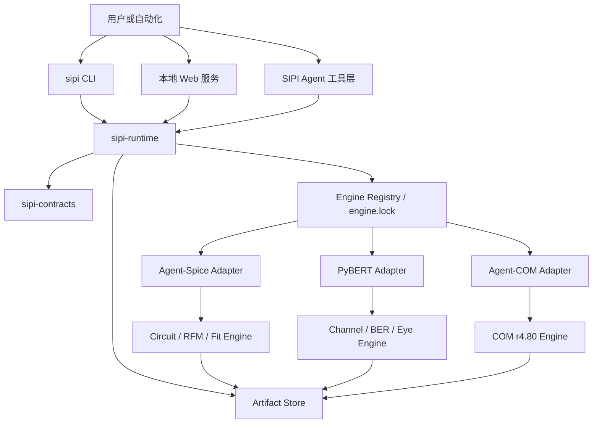

# SIPI-sim-agent 平台技术规格 v0.1

> 状态：设计基线，待按 `PLAN.md` 实施  
> 日期：2026-08-04  
> 目标读者：平台架构、Circuit/Channel/COM 引擎开发者、测试与发布维护者

## 1. 结论

`agent-spice`、`Py-bert-agent` 和 `agent-com` 应收敛为一个 ADS 风格的轻量级 SI/PI 平台，但不能直接把三个源码目录复制到一起。平台采用以下决策：

1. **新路径立即成为目标治理与产品集成仓。** M0-M2 在这里冻结设计、契约、证据和适配器；M3 的 Platform MVP 通过后，它才成为可运行的统一产品入口。
2. **目标是 monorepo，迁移方式是渐进迁入。** 第一阶段通过锁定版本的进程协议调用旧引擎；源码只从 clean tag 带历史迁入，禁止复制当前 dirty working tree。
3. **单仓多包、独立发布。** 平台控制面、Circuit、Channel、COM、Python binding 和应用不强制塞进一个 wheel，也不要求依赖锁步升级。
4. **最小稳定边界是运行信封，不是万能仿真对象。** 先统一请求、结果、进度、错误、工件、provenance 和 capabilities；保留各引擎已经验证的领域请求。
5. **只共享完整表达物理语义的数据。** 轴、端口、网络张量、波形和工件引用可以共享；同名的插值、混模、FFT、被动性、均衡、PDF、眼图和 BER 算法不能因代码相似就合并。
6. **继承现有成果，不重新设计 PyBERT core。** `SimulationBackend`、`SimulationInputV1/OutputV1`、compare/fallback、AMI host handoff 和 `agent-spice.rfm-response.v1` 均作为迁移起点；PyBERT `RunEventV1/ArtifactRefV1/ChannelResponseV1` 保持不可变，由平台新 schema 显式映射，不能原地扩展。
7. **Agent 是受约束的产品层。** Agent 只通过版本化平台工具运行、比较和解释仿真，不能直接调用私有 solver 符号、任意执行 shell 或覆盖原始设计。

## 2. 背景与当前事实

### 2.1 三个项目的真实定位

| 项目 | 当前能力 | 可复用资产 | 当前缺口 |
| --- | --- | --- | --- |
| `agent-spice` | HSPICE deck 编排，OP/DC/AC/TRAN，RFM N-port，S/Y 参数拟合、passivity 和工件导出 | Rust sparse solver、版本化 RFM 进程协议、HSPICE/RFM oracle、大量拟合质量门禁 | Rust 仍是 binary crate；Python 公共 facade 较弱；多套有理模型和结果 schema 尚未统一 |
| `Py-bert-agent` | Channel、TX/RX、DFE/CDR、BER、jitter、bathtub、统计眼图、IBIS-AMI、Web/CLI/GUI | `pybert-core`、PyO3、backend registry、compare/auto、RFM consumer、ADS/Python golden | native Web parity 尚未完成，默认仍是 Python；S2P/完整 jitter/GUI/optimizer 和发布故障演练未闭环 |
| `agent-com` | IEEE 802.3 COM r4.80 可观察行为复刻，XLSX 配置、S 参数、均衡搜索、PDF、COM/ERL/TDILN 等 | 不可变 typed API、behavior profile、配置消费审计、JSON/NPZ/HTML 工件、MATLAB oracle | 当前 HEAD 与旧 capability 测试有策略漂移；大型 oracle 需独立存储；仓库缺少正式分发许可证 |

### 2.2 审计基线

- `agent-spice`：审计锚点 `90f0374`。收集到 1106 个 pytest 测试，但未完整运行；CI 目前主要覆盖 wheel 构建和 smoke，Rust/Python 全回归门禁仍需补齐。
- `Py-bert-agent`：审计锚点 `5bf6d7e`。现有基线文档记录 `325 passed, 4 skipped, 1 xfailed, 2 failed, 32 errors`，其中包含外部 PyAMI/IBIS-AMI 缺失和既有问题；GitNexus 索引落后当前提交。
- `agent-com`：审计锚点 `034b21b`。本次 collect-only 得到 562 个测试；历史文档记录过 263 项完整回归。审计时一个聚焦测试仍期待旧 fingerprint 拒绝策略，而当前代码已进入数值分派，说明代码、测试和文档尚未重新冻结为同一基线。
- 三个项目的 Python/NumPy/SciPy/scikit-rf 认证环境不一致。第一阶段不得通过一个 editable/path dependency 环境强行求交集。
- 当前命令环境中 Rust toolchain 不在 `PATH`，不能假定新 workspace 已完成 `cargo test`。

### 2.3 问题定义

继续独立演进会造成：

- Touchstone、端口、频率轴、波形、工件和运行状态重复建模。
- Agent-Spice 与 PyBERT 已经互通，却仍靠跨仓库 commit/artifact 固定维持一致性。
- COM 和 PyBERT 存在同名信号处理功能，但算法默认值和标准语义不同，容易被错误去重。
- 用户必须理解三个命令、三种配置和三套结果目录，无法在一个项目中复现、比较和追踪分析。
- Agent 若直接绑定私有实现，会把未版本化的内部状态放大成长期公共 API。

平台要解决的是统一产品体验和可信契约，不是追求源码目录数量最少。

## 3. 产品目标

### 3.1 目标

1. 一个 `sipi` 入口可验证、运行、取消、比较和报告三类分析。
2. 一个项目可以声明多个分析及其显式依赖，并生成同一 provenance 下的结果集合。
3. Circuit、Channel、COM 保持独立 capability 和行为 profile，unsupported 输入必须 fail closed。
4. 所有运行均可复现：记录解析后配置、输入哈希、引擎 build、behavior profile、随机输入、依赖和环境。
5. 统一开放数据平面：网络、频谱、波形和大数组用有版本的元数据加内容寻址工件传递。
6. 先通过黑盒适配器获得平台闭环，再以数值和性能证据驱动源码及算法收敛。
7. 提供 Agent 工具层，支持结果解释、差异定位、参数扫描和诊断建议，并始终引用真实运行证据。

### 3.2 非目标

- v0.1 不实现 HFSS/EM 场求解器、版图提取或完整 ADS schematic editor。
- 不承诺完整 HSPICE/ngspice 器件和语法兼容。
- 不把 COM r4.80 复刻描述成 IEEE 官方认证或规范性实现。
- 不在第一阶段重写 GUI、FastAPI、Redis、Traits 或供应商 IBIS-AMI DLL loader。
- 不创建一个包含所有依赖的巨型 Python wheel。
- 不要求三种 Touchstone reader、混模、插值、passivity 或 BER 算法得到相同结果。
- 不在迁移提交中顺便修正物理算法；行为迁移和算法改进必须分开评审。
- 不删除旧仓库、旧结果 reader、Python reference backend 或 oracle，直到切换门禁完成。

### 3.3 首批用户场景

1. **PI/Circuit**：从 HSPICE deck、RFM 或拟合后的多端口模型运行 OP/DC/AC/TRAN，提取电压、电流、阻抗和 `.measure`。
2. **Channel**：从 RLGC、S2P/S4P、RFM response 或 IBIS-AMI 运行时域/统计链路仿真，输出 BER、眼图、jitter、bathtub 和 stage 波形。
3. **COM**：从 r4.80 workbook、victim/crosstalk 通道运行可审计 COM 分析，输出 typed metrics、选择证据、warnings 和兼容工件。
4. **跨引擎**：Agent-Spice 生成的版本化 RFM/频率响应经显式端口、符号和单位映射进入 Channel，引擎间逐 stage 对照。
5. **多分析项目**：同一组模型并行运行 Channel 和 COM，统一展示来源和差异，但不暗示两个指标应相等。

## 4. 架构原则

### 4.1 控制面与数据面分离

- 控制面负责项目解析、能力协商、调度、取消、错误、缓存、provenance 和工件发布。
- 数据面由领域引擎执行数值计算，平台不重新解释领域私有 payload。
- 大数组不放进进度事件或普通 JSON；JSON 只承载控制、索引、小型指标和诊断。

### 4.2 依赖方向

```text
apps -> runtime -> contracts
runtime -> adapter SPI -> process/PyO3 adapter -> engine
binding/CLI -> engine core -> shared value types
engine core -X-> runtime/apps/Web/Agent/Python/PyO3
```

`-X->` 表示禁止依赖。数值 core 不得导入平台 runtime、Web、Redis、GUI 或 Agent。

### 4.3 显式语义优先

- 内部单位使用 SI。Python 字段使用 `_s/_hz/_v/_a/_ohm` 后缀，Rust 使用受约束 newtype。
- 端口必须包含 ID、顺序、参考、差分极性、basis 和外部 index-base 映射。
- S 参数必须声明 wave definition、参考阻抗和矩阵布局。
- 频时转换必须声明单双边谱、FFT 缩放、DC 外推、插值、因果化和裁剪 policy。
- fallback、修复、conditioning 和近似均必须进入结果，不允许隐式发生。

### 4.4 失败关闭

- strict backend 不支持 capability 时返回 `UnsupportedCapability`。
- `auto` 的候选顺序由 resolved request 和 `engine.lock` 固定，只允许在预检阶段的 `EngineUnavailable` 或 `UnsupportedCapability` 上 fallback。引擎开始数值执行后的 crash、timeout、resource limit 或 `NumericFailure` 默认终止运行，不得伪装成旧引擎成功。
- backend selection 的优先级为：显式 CLI/API override > analysis 配置 > project 默认 > `engine.lock` 默认。任何 override 都展开为完整的 discriminated selection 并写入 resolved request，因而产生新的 cache identity。
- `compare` 明确 reference/candidate 角色并保留两份领域结果；candidate 失败不改写 reference，但整次 compare 的状态必须表明候选未完成。
- 引擎崩溃、取消、超时或部分工件不得被包装成成功。
- 缓存是内容寻址，不是执行身份寻址。key 必须包含 canonical payload、绑定输入/上游 artifact hash、schema、完整 resolved selection、实际选中 instance/bundle、behavior profile、资源/随机性及数值策略；必须排除 `run_id`、`analysis_id`、`attempt_id`、`backend_execution_id`、`retry_of`、提交幂等键、时间戳和绝对 staging 路径。

## 5. 总体架构



### 5.1 目标仓库形态

```text
SIPI-sim-agent/
├── apps/
│   ├── sipi-cli/
│   ├── sipi-service/
│   └── sipi-agent/
├── packages/
│   ├── sipi-contracts/
│   ├── sipi-runtime/
│   ├── sipi-artifacts/
│   └── sipi-adapters/
├── engines/                       # 仅在迁入门禁通过后出现
│   ├── agent-spice/
│   ├── py-bert-agent/
│   └── agent-com/
├── native/
│   └── crates/
│       ├── sipi-types/
│       ├── sipi-circuit/
│       ├── sipi-link/
│       ├── sipi-pipeline/
│       └── sipi-python/
├── schemas/
├── fixtures/
├── tests/
│   ├── contract/
│   ├── adapters/
│   ├── parity/
│   ├── integration/
│   └── packaging/
├── docs/adr/
├── engine.lock
└── pyproject.toml                 # workspace tooling，不打包全部引擎
```

### 5.2 多包原则

- `sipi-platform` 只依赖 contracts、runtime、artifacts 和用户选择的 adapter。
- 三个领域引擎保留独立版本、依赖锁、wheel/executable 和测试认证环境。
- release 不允许依赖 `../agent-spice` 等 sibling editable/path dependency。
- 开发覆盖只能写入未提交的本地配置，`engine.lock` 必须固定可验证的发布工件。
- 最终 monorepo 统一源码治理和 CI，不等于同进程、同 wheel 或同发布节奏。

## 6. 平台契约

### 6.1 运行信封

平台定义 `sipi.run-request.v1`，而不是替换各引擎已有请求。最小字段：

```text
schema
run_id
project_id
analysis_id
attempt_id
operation
payload_schema
payload 或 payload_artifact
backend_selection
resource_limits
randomness
artifact_policy
extensions
```

标识层级固定如下：`run_id` 表示一次 `sipi run PROJECT` 创建的 project execution；`analysis_id` 是该 execution 中稳定的 DAG node key；`attempt_id` 表示该 node 的一次不可变调度尝试；每次实际 strict engine 调用另有 `backend_execution_id`。自动 retry 只能在 node 仍为 `active` 且 retry policy 尚未耗尽时创建新的 `attempt_id`；已经进入终态的 node/execution 永不 reopen。用户显式 `sipi retry` 必须创建新的 `run_id`，并用 `retry_of` 引用旧 run/analysis/attempt。compare 的 reference/candidate 在同一 attempt 下各有自己的 `backend_execution_id`。`sipi.run-request.v1` 是单个 node attempt 的信封。四层 ID 进入事件、provenance 和路径，但明确不进入内容寻址 cache key。

`backend_selection` 是严格的 discriminated union，不能用模糊 engine family 名代替实例：

```yaml
# 三者只能选一个
mode: strict
instance: pybert-python              # engine.lock 中的 strict instance ID

mode: auto
candidates: [pybert-rust, pybert-python]
fallback_on: [EngineUnavailable, UnsupportedCapability]  # 固定集合

mode: compare
reference: pybert-python
candidate: pybert-rust
comparison_profile: pybert-native-parity-v1
```

runtime 在预检阶段把 selection 完全解析并冻结：strict 正好一个 instance；auto 保留有序 candidate 列表且最多一个 candidate 进入数值执行；compare 正好创建 `reference` 和 `candidate` 两个 backend execution。instance ID 必须逐字匹配 `engine.lock`，例如 `pybert` 这种 family alias 不能出现在 resolved request。adapter 永远只接收一个 strict instance request，不能自行 auto/compare。`allow_experimental` 只允许出现在 strict/compare 且默认 false；auto schema 必须拒绝该字段。`allow_internal` 还要求本地 internal policy/身份通过，不能由项目文件单方面开启。

`resource_limits` 是 `sipi.run-request.v1` 的内嵌对象，至少支持 `wall_time_s`、`cpu_time_s`、`memory_bytes`、`process_count`、`artifact_bytes` 和 `enforcement: required | monitor`。`wall_time_s` 是平台 timeout policy 的唯一请求来源，命中后返回 `Timeout`；其余资源限制命中返回 `ResourceLimit`。`required` 表示每个非空限制都必须在预检时证明可由选中执行模式强制；任一限制只能观测、不能硬执行时，必须以 `UnsupportedCapability` 失败关闭。`monitor` 允许有界轮询和终止，但必须记录采样周期、最大可能超调和实际 enforcement。Agent 和无人值守 sweep 只能使用 `required`。

首批 operation ID：

| Operation | 领域 payload |
| --- | --- |
| `circuit.solve.v1` | Agent-Spice deck/RFM 请求，分析类型由 payload 明确 |
| `network.fit.v1` | Agent-Spice S/Y 参数拟合请求 |
| `link.simulate.v1` | 继承 PyBERT `SimulationInputV1` 或兼容适配 payload |
| `com.r480.run.v1` | `ComConfig + ChannelSet + RunOptions` 的文件化适配请求 |

`sipi.run-result.v1` 是统一外层信封，至少包含：

```text
schema, run_id, analysis_id, attempt_id, operation, status
selection_requested
backend_executions[]:
  backend_execution_id, role, engine_instance_id, bundle_hash
  status, domain_result_schema, artifacts[], error
fallback_trace, comparison
payload_schema
metrics_summary
artifacts[]
events[] 或 event_log_artifact
warnings[]
provenance
timings
resource_usage
error
```

strict/auto 的数值执行使用 `role: primary`；compare 使用 `role: reference | candidate`。auto 预检拒绝的 instance 只进入 `fallback_trace`，不能伪造成已运行的 backend execution。领域结果保持原 schema 并作为对应 backend execution 的 artifact 或 namespaced payload 挂载；attempt 顶层只放聚合摘要。平台不得把 COM、BER 和 Circuit 指标压平成含义不明的公共键。

`sipi.run-request.v1/sipi.run-result.v1` 只属于 runtime orchestration，不能直接作为 strict adapter SPI。runtime 完成选择和预算切分后，为每次实际调用生成 `sipi.backend-execution-request.v1`：

```text
schema
run_id, analysis_id, attempt_id, backend_execution_id
role: primary | reference | candidate
engine_instance_id, bundle_hash
operation, payload_schema, payload 或 payload_artifact, bound_inputs
resource_limits              # 本次 backend execution 的预算切片
artifact_policy, randomness, selection_hash
```

adapter 返回 `sipi.backend-execution-result.v1`，包含同一组 ID、exact instance/bundle、单个 strict execution status、领域 result schema/artifacts、events、warnings、timings、resource usage 和 error。它不得包含 `backend_selection`、`fallback_trace` 或 `comparison`。runtime 是唯一聚合者：auto 将预检轨迹和至多一个 execution result 封装为 `RunResultV1`；compare 将 reference/candidate 两个 execution result 和 comparator evidence 封装为一个 `RunResultV1`。

### 6.2 能力协商

每个 adapter 实现：

```text
capabilities() -> EngineCapabilitiesV1
validate(request: BackendExecutionRequestV1) -> ValidationReportV1
run(request: BackendExecutionRequestV1,
    cancellation, progress_sink) -> BackendExecutionResultV1
```

`EngineCapabilitiesV1` 包含 producer/version/build、支持的 operation/schema、行为 profile、平台、外部模型能力、最大规模、执行模式和逐资源 enforcement。能力不匹配必须在长计算前报告。

M0 尚未冻结平台 schema，只生成非公共的 `docs/baselines/capability-inventory.yaml`：它记录 source tag、旧工件、环境锁、已有 fixture 和证据缺口，不能用于 advertise。M1 在 authority schema 固化后才把 inventory 转为 `capabilities.baseline.v1.json`。M2/G2a 在 hermetic engine bundle 与 attestation 存在后生成首批 `capabilities.certified.v1.json`；M3/G2b 再为通过生命周期和资源故障测试的 execution mode 增加 hard-enforcement 证据。runtime 只发布 certified 文件中有最近通过证据的组合。认证键至少为 `operation + payload_schema + engine_instance + behavior_profile + OS/architecture + execution_mode`，证据包含 fixture ID、engine bundle hash、测试 run、有效期、限制及 enforcement。

能力状态使用正交字段，禁止把角色、实现完成度和证据成熟度混成一个枚举：

| 维度 | 允许值 | 含义 |
| --- | --- | --- |
| `role` | `reference`、`candidate`、`hybrid` | 该实例在比较中的职责，不表示质量高低 |
| `implementation_state` | `full`、`partial`、`absent` | 对该精确 capability key 的实现覆盖 |
| `evidence_state` | `unverified`、`baseline_passed`、`certified`、`expired`、`blocked` | 当前证据成熟度与时效 |
| `release_channel` | `stable`、`experimental`、`internal` | 可见范围，不改变证据事实 |

默认公开 advertise 和默认 `auto` 仅允许 `release_channel=stable`，且同时满足 `implementation_state=full`、`evidence_state=certified`、许可/bundle 状态允许、证据未过期。`experimental` 不进入默认 advertise/auto，只能由用户以 exact instance 在 strict/compare 中显式设置 `allow_experimental: true`；该 opt-in 进入 resolved request 与 provenance。`internal` 只在受控内部 build/身份下可见，永不进入公开 advertise/auto，并要求独立 `allow_internal` policy。文档中的 “unsupported” 等价于该 capability key 的 `implementation_state=absent`；“uncertified”只表示 `evidence_state != certified`，不得据此推断实现是否存在。

这里的 `RunResultV1` 是 runtime 聚合语言绑定，对应 `sipi.run-result.v1`；`BackendExecutionRequestV1/ResultV1` 才是 adapter SPI 语言绑定。领域 adapter 可以在内部继续使用 PyBERT `BackendRunResult` 或 COM `RunResult`，但跨 SPI 前必须封装为单执行结果并保留原领域 schema。

### 6.3 事件、取消与状态

project execution、DAG node、attempt 是三套不同状态。顶层 `run_id` 的 project execution 状态机是：

```text
queued -> resolving -> active -> succeeded | failed | cancelled
```

顶层只在 DAG 达到 quiescent、所有仍可运行的独立分支完成或被回收后聚合终态，不能在后台仍有 active node 时提前终止。analysis 的 `required` 默认 true；任何被 required node 直接或间接依赖的节点都自动成为 `effective_required`，schema validation 至少要求一个 selected node 为 effective required。聚合顺序固定为：

| 条件 | Project execution 终态 |
| --- | --- |
| project-wide cancel 已提交 | `cancelled`；已成功 manifest 保留，其余 node 取消/阻断 |
| analysis-scoped cancel 已提交且命中 effective-required node | `cancelled`；独立分支按 policy 收尾 |
| 无上述 cancel，任一 effective-required node 为 `failed` 或因非 cancel 原因 `blocked` | `failed` |
| 所有 effective-required node `succeeded`/cache hit | `succeeded`；optional node 的 failed/cancelled/blocked 只令 `degraded=true` 并产生 warning |

没有对应已提交 cancel 请求却收到领域 `cancelled` 的 backend execution 视为 `EngineProtocolFailure`，按失败聚合，不能把项目伪装成用户取消。

单个 attempt 的状态机是：

```text
queued -> validating -> staging -> running -> publishing -> succeeded
  \____________ 任一非终态 -- failure ------------> failed
   \___________ 任一非终态 -- accepted cancel ----> cancelled
```

运行终态只有 `succeeded`、`failed`、`cancelled`。`blocked` 不是运行状态，而是项目 DAG 节点在没有创建 run attempt 时的调度终态：

```text
pending -> ready -> active -> succeeded | failed | cancelled
   |         |
   +---------+---- unmet required dependency -> blocked
ready -- validated cache hit ----------------> succeeded
```

每个 `active` 节点按时间顺序绑定一个或多个不可变 attempt；同一时刻最多一个 attempt 可 active。attempt 失败后，若自动 retry policy 仍允许，node 保持 `active` 并追加下一 attempt；只有成功、retry 耗尽或已接受 cancel 后 node 才进入终态。terminal node/execution 不允许追加 attempt。cache hit 不伪造 engine run，而在 node record 中引用原 success manifest。`sipi.project-execution-record.v1` 带可选 `retry_of` lineage；DAG node 使用 `sipi.dag-node-record.v1`，实际 attempt 使用 `sipi.run-record.v1`，三者不得混用。

平台事件的 canonical schema 是 `sipi.run-event.v1`；其 Python 类型名为 `SipiRunEventV1`。它借鉴但不直接别名 PyBERT `RunEventV1` 或 COM `ProgressEvent`，两个现有类型由 adapter 映射并作为 domain event 保留。平台事件必须有 `run_id`、在该 project execution 内单调递增的序号、stage、elapsed time 和可选进度；node/attempt/backend 事件还必须分别携带 `analysis_id`、`attempt_id`、`backend_execution_id`，项目级事件允许后三者为空。取消要求：

- project cancel 对所有 pending/active node 生效；analysis cancel 只针对该 node，并按 dependency policy 阻断下游。一个 attempt 内的 cancel 必须 fan out 到 compare 的全部 active backend execution。
- 进程 adapter 终止整个子进程树，等待受控宽限期后强制清理。
- PyO3 使用原子 token，在 stage 和长循环边界检查。
- 已取消或失败运行只保留诊断 staging，不发布 success manifest。

### 6.4 错误分类

统一外层错误：

- `InvalidRequest`
- `EngineUnavailable`
- `UnsupportedCapability`
- `InputNotFound`
- `ExternalModelFailure`
- `ResourceLimit`
- `Timeout`
- `Cancelled`
- `NumericFailure`
- `EngineProtocolFailure`
- `InternalInvariant`

领域错误原文和代码作为 `cause` 保留，但 adapter 必须映射到稳定外层类别。不得把 stderr 文本当作结果协议。

### 6.5 工件

平台工件的 canonical schema 是 `sipi.artifact-ref.v1`，Python/Rust 绑定名为 `SipiArtifactRefV1`。PyBERT 现有 `ArtifactRefV1` 是设计来源而不是同名别名；adapter 显式映射字段并保留原 domain artifact reference。平台格式至少包含：

```text
relative_path
schema
mime_type
sha256
byte_length
producer
role
shape / dtype / byte_order / layout（数组时）
```

要求：

- 工件路径必须相对运行根目录，禁止逃逸。
- 先写临时目录，完成校验与 hash 后原子发布。
- JSON 放指标与索引；NPZ/NPY 或后续批准的开放容器放大数组；CSV 只作交换或人工审阅。
- MATLAB oracle、私有模型和超过仓库预算的大型 fixture 使用外部 artifact store 或 LFS，并由 manifest 固定 hash。

### 6.6 Provenance

每次运行记录：

- 平台、adapter、引擎和算法版本/commit/build profile/dirty flag。
- 请求 schema、behavior profile、输入文件 hash、解析后配置 hash。
- Python/Rust/OS/CPU/BLAS/线程数及关键依赖锁摘要。
- 随机 seed 与显式随机数组来源。
- fallback、conditioning、修复、截断和近似策略。
- 生成工件的 schema、hash 和 producer 链。

### 6.7 Schema 演化规则

- schema ID 一经发布即保持语义不变，例如 `sipi.run-result.v1` 不得原地改变既有字段含义。
- request 默认严格验证；未知的行为字段必须拒绝，供应商或实验扩展只能放进有 namespace 的 `extensions`。
- result consumer 必须容忍未知的可选字段，但不得忽略未知 schema ID、缺失必需字段或无法识别的 artifact layout。
- v1 内只允许不改变旧 consumer 语义的可选扩展；删除、重命名、单位变化或默认行为变化必须发布 v2。
- adapter 的 capabilities 明确声明可消费和可生产的 schema 集合；升级 `engine.lock` 时执行新旧 producer/consumer 双向 fixture。
- Python 类型名使用 `RunRequestV1/RunResultV1`，其线格式 schema 分别为 `sipi.run-request.v1/sipi.run-result.v1`，避免把语言绑定名称误当作另一套契约。

### 6.8 Schema 权威矩阵

M1 编码前必须把下表固化为机器可读 `schemas/authority.v1.yaml`。任何未列入矩阵的 schema 不能出现在公共 API。

| Schema ID | Owner/source of truth | 兼容方向 | 平台处理 |
| --- | --- | --- | --- |
| `sipi.run-request.v1` | `sipi-contracts` | 平台输入，严格验证 | 外层运行信封 |
| `sipi.run-result.v1` | `sipi-contracts` | 平台输出，容忍未知可选字段 | 包装领域结果，不压平领域语义 |
| `sipi.backend-execution-request.v1` | `sipi-contracts` | runtime 单向发给 strict adapter | 单一 exact instance/role/预算，不含 selector |
| `sipi.backend-execution-result.v1` | `sipi-contracts` | strict adapter 单向返回 runtime | 单一 engine execution；由 runtime 聚合进 run result |
| `sipi.run-event.v1` | `sipi-contracts` | COM/PyBERT event 单向映射到平台 | 不别名现有 `RunEventV1/ProgressEvent` |
| `sipi.artifact-ref.v1` | `sipi-contracts` | 领域 artifact ref 单向映射到平台 | 校验相对路径、hash、layout 和 producer |
| `sipi.project.v1` | `sipi-contracts` | 项目输入，严格验证 | DAG、analysis、binding 与 project failure policy |
| `sipi.engine-capabilities.v1` / `sipi.validation-report.v1` | `sipi-contracts` | adapter 输出映射到平台 | 预检、选择和认证证据的稳定结构 |
| `sipi.project-execution-record.v1` / `sipi.dag-node-record.v1` / `sipi.run-record.v1` | `sipi-runtime` + `sipi-contracts` | 运行时写、consumer 只读 | 分离顶层 run、DAG node 与实际 attempt；`blocked` 只属于 node |
| `sipi.success-manifest.v1` | `sipi-artifacts` + `sipi-contracts` | 仅成功运行产生 | cache 和下游唯一可消费的成功证明 |
| `sipi.engine-lock.v1` | `sipi-runtime` + `sipi-contracts` | 人工/工具生成，runtime 严格读取 | 固定 bundle、hash、protocol 与认证摘要 |
| `sipi.capabilities-baseline.v1` | `quality` + `sipi-contracts` | M1 从 M0 非公共 inventory 转换 | 不可 advertise，不要求尚不存在的 bundle hash |
| `sipi.capabilities-certified.v1` | `quality` + release owner | M2/G2a 从 bundle attestation 生成，M3/G2b 补 lifecycle evidence | runtime 唯一可 advertise 的能力集合 |
| `sipi.axis.v1` | `sipi-contracts` | Python/Rust 双向 conformance | 小型描述内嵌；非均匀 values 可引用 artifact |
| `sipi.port-map.v1` | `sipi-contracts` | Python/Rust 双向 conformance | 作为小型对象内嵌在 network/waveform DTO |
| `sipi.network-tensor.v1` | `sipi-contracts` | reader 输出映射到平台 | 内嵌 `AxisV1` 与 `PortMapV1`，数据引用 artifact |
| `sipi.waveform.v1` / `sipi.spectrum.v1` | `sipi-contracts` | engine 输出映射到平台 | 内嵌 `AxisV1` 与 `PortMapV1` |
| `sipi.channel-resolution-policy.v1` | `sipi-contracts` | resolver 输入，严格验证 | 固定 reader、端口、负载、插值、DC/FFT 和脉冲策略 |
| `sipi.channel-resolution-report.v1` | `sipi-adapters` + `sipi-contracts` | resolver 输出，容忍未知可选诊断 | 记录每个显式转换和输入/输出 hash |
| `sipi.adapter.agent-spice.rfm-response-request.v1` | `agent-spice` adapter | 平台到旧 CLI 的单向适配 | M2/M3 运输请求，不能取代领域 response v1 |
| `sipi.adapter.agent-com.r480.v1` | `agent-com` adapter | 平台到旧 CLI 的单向适配 | 文件化 `ComConfig + ChannelSet + RunOptions` |
| `pybert.simulation.v1` | PyBERT/迁入后的 `sipi-link` | 保持 v1 不可变 | `link.simulate.v1` 的领域 payload/result |
| PyBERT `ChannelResponseV1` | PyBERT/迁入后的 `sipi-link` | 保持 v1 不可变 | 由显式 channel resolver 生成，不扩字段 |
| `agent-spice.rfm-response.v1` | Agent-Spice/迁入后的 `sipi-circuit` | 保持现有 consumer contract | M3 运输协议；M4 后可映射为平台 DTO |
| Agent-COM result v1 / behavior schemas | `agent-com` | 保持领域 schema 不可变 | 作为 `com.r480.run.v1` 的领域工件 |

权威矩阵还必须记录 JSON Schema 文件、语言绑定、owner、当前版本、producer/consumer fixture 和 deprecation 状态。领域 v1 不因进入 monorepo 而改名或扩义。

## 7. 共享数据模型

### 7.1 抽取原则

首阶段共享 DTO 和验证，不共享默认算法。只有当两个实现对覆盖边界的 fixture 完成逐 stage parity，才允许把一个算法提升为共享实现。

这里的“首阶段”指共享数据阶段 M4。更早的 Platform MVP（M3）仍复用现有 `agent-spice.rfm-response.v1` 和 PyBERT v1 artifact bridge；M4 才用通用 DTO 替换临时运输约定，避免在平台尚未跑通前同时设计数据内核。

### 7.2 `AxisV1`

必须表达：

- `kind`: time/frequency/phase/index。
- SI 单位、dtype、长度、单调性、均匀性。
- start/step 或 values artifact，禁止两者矛盾。
- 采样点代表 sample、bin center 还是 edge。
- 单双边谱和 Nyquist/DC 是否存在。

### 7.3 `NetworkTensorV1`

必须表达：

- parameter kind：S/Y/Z/H 或明确扩展。
- 形状和布局：统一规范化为 `[frequency, output_port, input_port]`。
- 复数编码、dtype、byte order、C/F layout。
- 每频点/每端口参考阻抗。
- wave definition：power/pseudo/traveling 等。
- 端口稳定 ID、标签、外部顺序和 index-base。
- basis：single-ended/mixed-mode；差分对、极性、common-mode 和参考节点。
- 来源 reader、reader semantics 和任何端口重排记录。

组合关系固定为：`NetworkTensorV1` 内嵌一个 `AxisV1` 和一个 `PortMapV1` 小对象，矩阵数据通过 `SipiArtifactRefV1` 引用。`PortMapV1` 不单独保存一份可漂移的隐式全局状态。

COM r4.80 reader、PyBERT/scikit-rf reader 和 Agent-Spice reader都可以产生该 DTO，但其数据不因此被宣称数值相同。

### 7.4 `WaveformV1` 与 `SpectrumV1`

必须表达：

- 轴引用、signal intent、单位和参考定义。
- 电压是单端、差分、开路还是负载后；电流方向和正号约定。
- sample scaling、FFT normalization 和窗函数元数据。
- 多通道顺序、端口映射和 shape。
- 有效区间、warm-up、裁剪、尾部补零和初始状态。

两者同样内嵌 `AxisV1` 和 `PortMapV1`，数组通过 `SipiArtifactRefV1` 引用。单通道数据仍使用一个显式 port/signal entry，不能靠 shape 推断参考和极性。

### 7.5 `ChannelResponseV1`

PyBERT Rust `ChannelResponseV1` 保持原 v1 字段和语义不变。平台不把 `NetworkTensorV1` 直接别名为它，而是定义一个显式、可审计的 resolver：

```text
NetworkTensorV1
  + sipi.channel-resolution-policy.v1
  -> PyBERT ChannelResponseV1
  + sipi.channel-resolution-report.v1
```

resolution policy 固定 reader semantics、端口选择/终端、插值、DC、因果性、IFFT、裁剪和归一化；report 固定源 artifact hash、policy hash、输出 hash 和 warnings。Agent-Spice 阻抗传递必须显式记录：

M4-M8 的唯一 production 实现 owner 是 `packages/sipi-adapters/channel_resolver`。`sipi-link` 只消费不可变 `ChannelResponseV1`，`sipi-pipeline` 只编排已解析的 artifact；两者不得各自复制 S2P/S4P 转换。未来 Rust 加速必须通过独立 ADR 和同一 resolver conformance 后，在该逻辑 owner 背后替换实现，不能形成第二个可选 production producer。

```text
V(f) = current_to_voltage_sign * H_ohm(f) @ I_a(f)
```

端口方向、负载和校准 sign 没有 golden 时，不得直接投影为链路电压响应。

### 7.6 组件与设计图

ADS 风格 `DesignGraph` 是目标能力，但不作为 v0.1 adapter 闭环的前置条件。后续模型采用组合和 capability，而不是万能基类：

- `ComponentSpec`：实例 ID、端口、参数、模型引用。
- `CircuitStampProvider`：可编译为 MNA stamp。
- `FrequencyNetworkProvider`：可提供网络张量。
- `TimeResponseProvider`：可提供时域响应。
- `ExternalModelProvider`：由隔离 host 执行 IBIS-AMI 等模型。

一个组件只声明它真实拥有的 capability。AMI model 不需要伪造 MNA stamp，电阻也不需要伪造 AMI 接口。

## 8. 引擎规格

### 8.1 Circuit Engine

来源：`agent-spice`。

首批能力：

- HSPICE deck 审计、`.alter`、`.measure` 和 backend 选择。
- OP/DC/AC/TRAN，RFM N-port 和 current-driven response。
- Touchstone/S/Y 参数拟合、质量报告和 RFM/Touchstone/SPICE 导出。

边界：

- 初期以现有 CLI/JSON/CSV 协议运行，不 import 私有 Python 或 Rust 符号。
- 在原仓先把 `agent-spice-sim` 拆为 library + thin CLI，保持二进制协议不变；通过门禁后再迁入 `sipi-circuit`。
- C# 引擎、ngspice、Xyce/XDM 和 HSPICE 保持 oracle/可选 adapter，不进入无条件共享发行包。
- 多套 pole-residue 表示先做 versioned adapter，不在迁移时强行统一。

### 8.2 Channel Engine

来源：`Py-bert-agent`。

平台需要路由的能力族：

- Python reference 和 Rust candidate 双后端。
- RLGC/S2P/S4P/RFM channel、FFE/CTLE、DFE/CDR、BER、jitter、bathtub、统计眼图。
- Python host 驱动的 IBIS-AMI Init/GetWave 混合路径。

这不是统一的已认证能力声明。M0 只把当前事实盘点进非公共 capability inventory：Python backend 的 `role=reference`，Rust backend 的 `role=candidate`；strict NRZ/RLGC 的 Rust `evidence_state=blocked`；S2P/S4P、完整 TX jitter、PAM4/Duo-binary statistical-eye、AMI 和 GUI/optimizer 分别记录自己的 `implementation_state`、`evidence_state` 与 `release_channel`，不再用一个模糊标签代替三者。M1 才生成 baseline schema，M2/G2a 才能把通过 bundle/fixture 的组合晋级为 certified；任何声称 hard enforcement 的 execution mode 还必须等待 M3/G2b 证据。

边界：

- 继续使用已落地的 `SimulationBackend`、v1 Rust contract、compare/auto 和 fail-closed capability。
- PyBERT 内部 compare/auto 作为迁移证据保留，但平台 adapter 只暴露 strict `pybert-python/pybert-rust/pybert-hybrid-ami/pybert-agent-spice-rfm` 实例；平台 runtime 是唯一 selector，禁止 auto 套 auto。
- 在完整结果 parity 解锁前，默认仍使用 Python reference；平台不能越权把 `auto` 当作已签核 native。
- 供应商 DLL 生命周期留在隔离 Python host，不从长时间运行的 Rust core 反向回调 Python。
- 现有 `pybert-core` 是 link 数值 source of truth；最终带历史迁为 `sipi-link`，不复制另一份实现。

### 8.3 COM Engine

来源：`agent-com`。

首批能力：

- `BehaviorProfile.r480()` 与显式 standard reader semantics。
- XLSX/CSV/MAT 配置、victim/FEXT/NEXT、C2C/C2M、ERL 和已支持指标。
- typed `RunResult`、配置消费台账、candidate evidence、JSON/NPZ/HTML 工件。

边界：

- 第一阶段原样保留 `agent_com` namespace、`com8023` CLI、运行顺序、rounding、strict comparison 和 golden。
- COM 的 reader、混模、插值、因果性、candidate order、FFT/direct convolution、PDF、COM/BER/eye 语义是独立 profile。
- 只先接入公共运行信封、provenance、progress、artifact 和 `NetworkTensorV1` adapter。
- 配置策略漂移修复并冻结绿基线之前，不执行源码迁入。
- 输出文案必须说明其为 r4.80 行为复刻/工程工具，不宣称官方 IEEE 合规认证。

### 8.4 跨引擎流水线

第一个必须签核的跨引擎切片：

```text
RFM/deck + loads
  -> Agent-Spice frequency response
  -> NetworkTensorV1 / ChannelResponseV1
  -> 显式 current sign、端口、终端和 FFT policy
  -> PyBERT link simulation
  -> stage arrays + eye/BER
  -> 新旧路径 compare report
```

COM 在 v0.1 作为同项目中的独立 operation 运行。除非存在标准允许且有 golden 的转换，不把 Channel 的 eye result 直接作为 COM 内部输入，也不以最终标量相近替代逐 stage parity。

## 9. 项目与运行模型

### 9.1 项目文件

建议的外层项目格式：

```yaml
schema: sipi.project.v1
project:
  name: pcie-link-study

runtime:
  engine_lock: engine.lock

analyses:
  - id: channel-response
    operation: circuit.solve.v1
    backend_selection:
      mode: strict
      instance: agent-spice-process
    payload_schema: sipi.adapter.agent-spice.rfm-response-request.v1
    payload:
      rfm: models/channel.rfm
      fft_size: 32768
      sample_interval_s: 1.0e-12
      input_ports: [1]
      output_ports: [2]
    exports:
      - role: channel-response
        schema: agent-spice.rfm-response.v1

  - id: link-eye
    operation: link.simulate.v1
    backend_selection:
      mode: strict
      instance: pybert-python
    payload_schema: pybert.simulation.v1
    payload_artifact: requests/link-input.json
    depends_on: [channel-response]
    inputs:
      channel_response:
        from_analysis: channel-response
        artifact_role: channel-response
        expected_schema: agent-spice.rfm-response.v1

  - id: com-r480
    operation: com.r480.run.v1
    backend_selection:
      mode: strict
      instance: agent-com-process
    payload_schema: sipi.adapter.agent-com.r480.v1
    payload:
      workbook: configs/com.xlsx
      thru: models/channel.s4p
```

所有路径相对项目根目录。`sipi validate` 生成只读 resolved request，补齐 hash、默认值、producer 和行为 profile；原始文件不被覆盖。

项目如需默认 backend selection，必须在 `runtime.backend_defaults` 中按 operation 写完整的 strict/auto/compare 对象；不能只写 `mode` 或 family alias。analysis override 同样必须是完整对象，因此每个 resolved node 的选择没有继承歧义。

DAG 规则：

- analysis ID 唯一，`depends_on` 必须指向同一 resolved project 中的已声明节点。
- analysis 的 `required` 默认 true；required node 的完整 dependency closure 都标为 `effective_required`，optional node 不得通过错误标注削弱必需上游。
- `inputs` 必须通过 `from_analysis + artifact_role + expected_schema` 绑定，禁止读取某目录中的“最新结果”。
- runtime 把已校验 binding 放入平台信封的 `bound_inputs`，不直接改写不可变的领域 payload；adapter 负责显式转换并产出 mapping report。
- validation 阶段检测环、缺失 producer、重复 role、schema/capability 不匹配和不确定 fan-in。
- 上游 `failed/cancelled` 时，依赖节点标记 `blocked`；无依赖的节点可按 project failure policy 继续。默认策略是 `block-dependents, continue-independent`。
- 自动 retry 仅在 node 为 `active` 时创建新的 attempt ID，耗尽后一次性提交 node 终态；手工 retry 创建新的 project execution/run ID 并写 `retry_of`，旧 execution/node/attempt 永不改变。只有 canonical payload、输入/上游 artifact hash、完整 resolved backend selection、实际 instance/bundle、schema/profile、资源/随机性和数值策略全部一致时才允许 cache reuse。auto 先预检得到 actual selected instance 再查 cache；compare 的两角色都进入 key。四层执行 ID 和 lineage 一律排除。
- 上游 artifact 绑定和实际 hash 进入下游 resolved request、provenance 和 cache identity。

### 9.2 `engine.lock`

每个引擎条目记录：

```text
instance_id, engine_family, version, source_commit
artifact URL/path, sha256, signature（可选）
protocol schemas, capabilities digest
runtime kind, platform, Python/Rust ABI
dependency lock digest
license/provenance status
bundle manifest: wheel/executable, managed venv, native DLL closure
可选的 per-operation default selection（必须是完整 discriminated object）
```

release 不解析浮动分支或“最新”版本。Python engine 必须从 wheel 安装到平台管理的隔离 venv，并禁用 user-site、editable、`PYTHONPATH` 和 sibling repo；native engine 必须校验 executable 与动态库闭包。许可状态为 `blocked_unknown` 的 bundle 拒绝加载。更新 lock 必须重跑 adapter contract、领域 golden 和受影响的跨引擎 fixture。

### 9.3 运行目录

```text
runs/<run-id>/
├── project.original.yaml
├── project.resolved.json
├── execution-record.json
├── events.jsonl
└── nodes/<analysis-id>/
    ├── dag-node-record.json
    └── attempts/<attempt-id>/
        ├── request.resolved.json
        ├── run-record.json
        ├── success-manifest.json   # 仅该 attempt succeeded 时存在
        ├── provenance.json
        ├── checksums.json
        ├── inputs/
        └── backends/<backend-execution-id>/
            ├── domain-result.json
            ├── arrays.npz
            ├── diagnostics.npz
            └── report.html
```

`run-id` 目录表示一次 project execution，不是单个 engine attempt。`analysis-id` 受 schema 限制为可安全映射的稳定 ID；所有 attempt 目录只追加、不覆盖。平台 staging 与发布目录分开。实际 attempt 的 `run-record.json` 对 `succeeded/failed/cancelled` 都会原子导出，用来保留错误和诊断证据；没有创建 attempt 的 `blocked` 节点只写 `dag-node-record.json`。`success-manifest.json` 只有在该 attempt 的所有必需 backend 工件 hash 校验后才创建。cache 和下游 DAG 只接受 success manifest，不能把 execution/node/失败记录当作成功产物。

### 9.4 本地 Supervisor

Platform MVP 采用持久本地 supervisor，而不是靠一次 CLI 进程维持运行状态：

- `sipi run` 连接本地单用户 supervisor，默认等待并流式显示事件；`--detach` 立即返回 run ID。
- supervisor 用本地 SQLite registry 的 `executions`、`nodes`、`attempts`、`backend_executions` 表分别保存四层身份、状态、lease、child identity 和工件目录；CLI 的 `status/cancel` 通过本地 IPC 访问它。SQLite 是运行协调的唯一权威，execution/node/run record 和 manifest 是可重建的不可变证据，不参与并发仲裁。
- 每个用户/平台数据目录只允许一个 supervisor writer。启动时必须先取得 OS 级 named mutex/file lock，再原子绑定 IPC endpoint；第二实例只能作为 client 或失败退出。SQLite 使用单写者事务，不能用“最后写入获胜”覆盖状态。
- execution row 包含 `run_id`、project hash、可选 `retry_of`、单调 `version` 和 submission idempotency key；node row 以 `run_id + analysis_id` 唯一；attempt row 以全局唯一 `attempt_id` 追加；backend execution row 绑定 role 与 exact instance。所有状态变更使用 `WHERE version = expected` 的 compare-and-swap。同一 submission key 与相同 project hash 的提交重放返回原 run ID，与不同 hash 重用则拒绝。自动 retry 只能对 active node 追加 attempt；CLI 手工 retry 创建新 execution/run ID 和新目录，原终态记录不可变。
- Windows 使用 Job Object 管理完整进程树；POSIX 使用独立 process group。child identity 至少包含 PID、进程 start time、run token 和 executable hash，避免 PID 重用误杀。
- IPC 使用当前用户可访问的 named pipe/Unix domain socket；不开放未经认证的网络端口。
- supervisor 持续写 heartbeat/lease。重启后，v0.1 不尝试无证据 reattach：缺失 child 的运行标为 `EngineProtocolFailure`；身份匹配的 orphan 被终止并回收后标为 failed；身份不匹配时只告警，不误杀其他进程。
- `cancel` 以 `run_id` 加可选 `analysis_id` 确定作用域，先在单写者事务中对 execution/node/active attempt CAS 写入 `cancel_requested`，再向其全部 active backend execution 发送领域取消或软终止，超过 grace period 后终止各自受管进程树；所有状态变化写入 execution event log。
- project aggregation 也必须在单写者事务中完成：确认 DAG quiescent、按聚合表计算终态，并对 execution version/CAS 检查 cancel flag 后一次提交。execution cancel commit 先发生则聚合只能得到 `cancelled`；terminal aggregation commit 先发生则后续 cancel 返回 already-terminal。analysis cancel 与 node success 使用同样的 node-version 顺序，禁止“取消已接受但 node 仍发布成功”。
- 每个 attempt 的成功发布采用 prepare/commit 协议：先在 staging 完成全部 backend 工件 hash；随后持有 SQLite writer transaction，CAS 校验 attempt 仍为 `publishing` 且 execution/node/attempt 均没有已接受 cancel，原子安装 success manifest，再把 manifest hash 和 attempt `succeeded` 一起提交。SQLite commit 是成功的线性化点。cancel commit 先发生时 publisher 必须回滚并删除/隔离未提交 manifest；success commit 先发生时后续针对该 attempt 的 cancel 返回 already-terminal，不能改写成功。
- restart reconciliation 先取得 singleton lock，再扫描过期 lease 和 publish journal。数据库非终态但磁盘已有 manifest 的目录视为未提交并隔离；数据库已成功的记录重验 manifest hash 并重建缺失的只读导出；匹配 run identity 的 orphan 先回收，再按已提交 cancel 决定 `cancelled`，否则以 `EngineProtocolFailure` 失败。reconciliation 自身也通过 version CAS，保证重复执行幂等。
- 前台 fallback 只用于 `sipi run --foreground` 调试，取消方式为 Ctrl-C，不能承诺独立 `status/cancel` 或 restart recovery，也不满足 Platform MVP。

### 9.5 资源强制矩阵

进程树管理不等于资源隔离。M0 的 platform support ADR 和 M2 bundle attestation 必须按下表把每个组合标为 `hard`、`monitor` 或 `unsupported`；表中“可 hard”仍需在目标 OS 的故障 fixture 通过后才能进入 certified capabilities。

| 限制 | Windows managed worker | Linux managed worker | macOS managed worker | 同进程 PyO3 |
| --- | --- | --- | --- | --- |
| wall time | supervisor 单调时钟 + Job Object 整树终止，可 hard | 单调时钟 + process group/cgroup，可 hard | 单调时钟 + process group，可 hard | 仅 cooperative token，非 hard |
| memory | Job Object job memory limit，可 hard | cgroup v2 `memory.max`，可 hard | 默认 unsupported；仅经独立 `rlimit` fixture 认证后开放 | unsupported |
| CPU time | Job Object CPU time/rate，可 hard | cgroup v2/`rlimit`，可 hard | `rlimit` 通过 fixture 后可 hard | unsupported |
| process count | Job Object active-process limit，可 hard | cgroup v2 `pids.max`，可 hard | 默认 unsupported | unsupported |
| aggregate artifact bytes | 仅专用卷 quota 或受认证的受控 writer 可 hard | project/cgroup 配套 quota 或受控 writer 可 hard | quota/受控 writer 经认证后可 hard | 仅受控 writer；任意文件 I/O 时 unsupported |

规则固定如下：

- 请求 `enforcement: required` 时，runtime 必须为所有非空限制选择 certified hard execution mode；不存在组合时在启动数值计算前返回 `UnsupportedCapability`，不得降为轮询。
- 任何要求 hard wall-time、memory、CPU 或 process limit 的 PyO3 运行必须放入平台管理的独立 `sipi-python-worker` 进程；直接同进程调用只允许显式 `monitor`，且不能用于 Agent、无人值守 sweep 或签核结果。
- artifact budget 同时覆盖 staging、日志和临时派生文件。没有 filesystem quota 或所有写入均经过受控 writer 的证明时，aggregate hard budget 必须标为 unsupported。
- `wall_time_s` 命中返回 `Timeout`；memory、CPU、process count 或 artifact bytes 命中返回 `ResourceLimit`。两者都记录限制、观测值、enforcer 和终止证据；峰值 RSS 观测不能冒充 hard memory enforcement。

## 10. 产品接口

### 10.1 CLI

首批命令：

```text
sipi doctor
sipi capabilities [--instance ID]
sipi validate PROJECT
sipi run PROJECT [--analysis ID] [selection override]
sipi status RUN_ID [--analysis ID] [--attempt ATTEMPT_ID]
sipi cancel RUN_ID [--analysis ID]
sipi retry RUN_ID --analysis ID [--from-attempt ATTEMPT_ID]
sipi compare RUN_A RUN_B [--analysis ID] --profile COMPARATOR_PROFILE
sipi report RUN_ID [--analysis ID] [--attempt ATTEMPT_ID]
sipi engine lock
```

`sipi run` 返回 project execution 的 `RUN_ID`；不传 `--analysis` 时运行完整 DAG，传入时运行该 node 的 dependency closure。`sipi retry` 总是返回新的 RUN_ID，在新 execution 中记录 `retry_of` 并通过 cache 引用仍有效的上游成功工件，不会 reopen 或覆盖旧 run。selection override 也必须保持 discriminated：strict 使用 `--policy strict --engine INSTANCE [--allow-experimental]`，auto 使用 `--policy auto --candidates A,B`，compare 使用 `--policy compare --reference A --candidate B --comparison-profile P [--allow-experimental]`；auto 不接受 experimental opt-in。`sipi compare RUN_A RUN_B` 只比较两个既有 execution/analysis 的结果，不参与 backend selection。

兼容期保留 `agent-spice`、`pybert`、`pybert-web`、`com8023` 命令。`sipi` 不复制这些 CLI 的所有研究选项，只暴露稳定 operation。

### 10.2 服务与 Web

- v0.1 以本地单用户 supervisor + 子进程/PyO3 adapter 为准；CLI 默认同步等待只是展示行为，运行所有权属于 supervisor。
- 后续服务复用 PyBERT 已有 FastAPI/Redis/arq 经验，但 Web 只调用 runtime，不直接构造 `PyBERT` 上帝对象。
- 本地单用户模式先于多租户云；远程执行、权限和配额需另立安全规格。

### 10.3 Agent 工具

首批稳定工具：

- `validate_project`
- `list_capabilities`
- `run_analysis`
- `get_run_summary`
- `inspect_artifact`
- `compare_runs`
- `propose_sweep`
- `run_sweep`

约束：

- 工具参数使用与 CLI 相同的 schema。
- Agent 默认只读；参数扫描创建新 revision/run，不覆盖原文件或结果。
- `propose_sweep` 只生成计划；`run_sweep` 必须接收显式批准的 plan hash、总运行数、并发、时间和内存预算，并强制 `enforcement: required`；缺少 certified enforcer 或超出预算时拒绝执行。
- 每个解释必须引用 `run_id`、`analysis_id`、必要时的 `attempt_id/backend_execution_id`、exact engine instance/profile、输入 hash 和具体 artifact/metric。
- Agent 不拥有任意 shell、动态 Python eval 或私有 solver import 能力。
- 资源上限、超时、模型路径 allowlist 和外部 DLL 隔离由 runtime 强制执行，不能由提示词保证。

## 11. 非功能要求

### 11.1 正确性与确定性

- 相同 resolved request、engine lock、显式随机输入和平台 profile 应得到满足领域 tolerance 的相同结果。
- bits、端口顺序、candidate 选择、错误索引、schema、shape 和 dtype 按要求精确一致。
- 浮点/FFT/PDF 容差按 fixture 定义，禁止在测试代码中临时扩大统一阈值。
- 比较必须覆盖关键中间 stage，不只比较最终 COM、BER、眼高或眼宽。

### 11.2 性能

- 保留各项目已有预算，不用一个全局数字覆盖不同规模。
- 平台单独记录 adapter 启动、staging、marshal、engine、publish 和 report 时间。
- 只有 profiling 证明进程边界是主要瓶颈时才把某 adapter 提前改为 FFI。
- 记录峰值 RSS、线程数、BLAS 配置、CPU 和输入 hash；不可比较的测量明确标记。

### 11.3 可靠性

- 超时/取消后不得遗留子进程树、锁或被误认成成功的半成品。
- PyO3/嵌入路径使用可捕获 panic 的 profile；CLI 的 `panic=abort` 偏好不得污染 Python host。
- 结果发布和 cache 写入原子化。
- 引擎不可用或损坏时 strict 模式明确失败，auto 模式记录 fallback。

### 11.4 安全

- 项目路径、include、模型和工件必须限制在允许根目录或显式 allowlist。
- 不对网表、工作簿、AMI 参数或模型元数据执行任意代码。
- 供应商 IBIS-AMI DLL 视为不可信 native code，必要时运行于隔离进程。
- 运行环境变量使用 allowlist；秘密不写入 provenance、日志或 cache key 明文。

### 11.5 可移植性

- 第一签核平台由 M0 决定，建议 Windows x86_64/CPython 3.12 作为现有交集基线。
- pure Rust/Python contracts 应覆盖 Windows/Linux/macOS；涉及 HSPICE、Xyce、AMI DLL 和 MATLAB oracle 的 lane 可按平台条件启用。
- wheel 安装测试必须在无源码、无 sibling repo 的干净环境执行。

### 11.6 许可与来源

- `agent-spice` 和 `agent-com` 顶层缺少与全部 Python 源/数据相匹配的正式许可证，是源码迁入与公开发布的硬门禁。
- PyBERT 的 BSD-3-Clause notice 必须随源码和二进制保留。
- MATLAB 源、COM workbook、图像、golden、第三方 solver 和私有 S 参数 corpus 分别记录 provenance 和分发权限。
- `docs/data-license-decision.md` 一类内部决定不能替代正式授权文本。
- M0/G0a 只要求完成逐资产分类、证据引用、owner 和机器拒绝策略；未取得授权的项保持 `blocked_unknown`。这不阻断不含该资产的 M1 contracts/runtime 开发，但会阻断对应 engine bundle、源码历史迁入和公开发布。

## 12. 验证门禁

| Gate | 对应里程碑 | 证据 | 退出条件 |
| --- | --- | --- | --- |
| G0a 基线与治理 | M0，M1 前置 | source/fixture/license inventory、非公共 capability inventory | 三仓各有 clean baseline tag；已知失败和资产状态被分类；工具链可复现；不要求尚不存在的平台 schema、bundle hash 或未到达的外部授权 |
| G0b Bundle 资格 | M0-M2，按 engine 独立关闭 | license manifest、bundle manifest/attestation、required fixture | 对应资产不是 `blocked_unknown`；bundle 可合法消费且环境封存；required fixture 零未解释 skip |
| G0c 迁入/分发资格 | M5-M8，按资产独立关闭 | 正式 license/NOTICE、SBOM、source/data provenance | 对应源码可迁入；待分发资产有明确授权；`external_reference_only` 不进入发行物 |
| G1 契约 | M1 | schema authority、Python/Rust conformance report | attempt 与 strict adapter SPI 分离；四层 ID、三层状态机、retry lineage/聚合表、selection union、release channel 及异常字段 fixture 全通过 |
| G2a Adapter | M2 | engine bundle attestation、adapter/failure report | 对应 strict engine instance 经隔离 adapter 运行并保持领域结果等价；缺失、hash、崩溃和半工件 fixture 通过 |
| G2b Runtime lifecycle | M3 | supervisor/concurrency/resource report | singleton、IPC、CAS/idempotency、cancel/publish、restart/reap 和 advertised hard resource enforcement 通过 |
| G3 DTO | M4 | DTO matrix、resolver report | S/Y/Z、频变 z0、多端口、端口置换、混模、非均匀轴、DC 缺失等 fixture 完整 |
| G4 数值 | M3-M6，每个 vertical slice 独立关闭 | domain comparator、stage parity、performance evidence | 该 slice 的 required stage、离散选择、最终指标和 golden 零未解释 skip；未关闭能力不得 advertise |
| G5 历史迁入 | M5-M6 | old/new commit+tree map、tag equivalence、rollback record | 历史可追溯；新旧 tag 等价；目标仓成为迁入 producer 的唯一活跃开发源，旧副本冻结 |
| G6 发布与切换 | M8 | 两个 RC、跨平台包、故障注入、SBOM/license、回滚演练 | 两个 RC 无 P0/P1；安装、panic/cancel、进程树、RSS/耗时、许可与回滚全部通过 |

`quality/severity-policy.yaml` 是 gate、任务、证据和 waiver 的唯一机器可读映射。P0/P1 不允许 waiver 后切换；P2 waiver 必须有 owner、原因和到期日。缺失的外部 fixture 只能让对应 capability 保持 uncertified，不能让 required gate 假绿。

## 13. 版本验收

### 13.1 Platform MVP

1. `sipi validate/run/status/cancel/retry/compare/report` 可工作，RUN_ID/analysis/attempt/backend execution 的层级行为通过契约测试。
2. 三个引擎通过 `engine.lock` 和黑盒 adapter 可独立运行。
3. 同一项目可运行至少一个 Circuit、一个 Channel、一个 COM fixture。
4. 领域结果与旧入口在各自 tolerance/比较器下等价。
5. 运行工件、事件、错误、fallback 和 provenance 完整，失败不会发布成功结果。
6. Agent-Spice RFM 到 PyBERT Channel 的已有跨仓链路可由平台复现。

### 13.2 Shared Data MVP

1. `AxisV1/PortMapV1/NetworkTensorV1/WaveformV1/SipiArtifactRefV1` 有语言无关 schema 和 Python/Rust conformance。
2. 三个 reader 的输出可适配为 DTO，并保留各自 semantics/profile。
3. 端口、单位、reference、mixed-mode 和频时转换策略均可审计。
4. 跨引擎链路用 DTO 替代临时约定，数值门禁不退化。

### 13.3 Native Workspace MVP

1. Agent-Spice circuit library 和 PyBERT link core 带历史进入目标 Rust workspace。
2. 两个 core 只依赖共享 value types；组合由 `sipi-pipeline` 完成。
3. 原有 CLI/protocol 继续兼容，PyO3 binding 不因 panic 终止 host。
4. 一个 production source of truth，不存在长期复制的 Rust 算法目录。

### 13.4 Agent MVP

1. Agent 只通过稳定工具完成验证、运行、比较、结果解释和受限扫描。
2. 所有结论可追溯到 run/artifact/provenance。
3. Agent 无法绕过资源、路径、capability 和发布门禁。

## 14. 决策记录

- **ADR-001**：新仓立即作为产品入口，源码分阶段迁入。
- **ADR-002**：目标 monorepo 使用多包独立发布，不做单一巨型 wheel。
- **ADR-003**：先统一运行信封，领域请求保持版本化独立。
- **ADR-004**：共享带完整物理语义的 DTO，不共享未经 parity 证明的默认算法。
- **ADR-005**：Circuit、Link、COM 为独立引擎；runtime 依赖 adapter，engine core 不反向依赖产品层。
- **ADR-006**：PyBERT 已有 Rust v1 和 AMI/RFM handoff 直接继承；原计划最终迁入 Agent-Spice 的目标改为本仓。
- **ADR-007**：COM 长期保留 r4.80 behavior profile，迁移优先于算法去重。
- **ADR-008**：进程隔离是默认边界，FFI 由 profiling 和可靠性门禁驱动。

## 15. 开放项与硬阻断

本节编号按主题组织，不表示执行先后。唯一执行优先级以 `PLAN.md` 第 17 节为准：先保护工作树和恢复工具链，再依次关闭许可、COM 绿基线、PyBERT/Agent-Spice 基线与工件存储问题。以下条目在对应迁入或发布 gate 前均为硬阻断。

1. 明确 `agent-spice`、`agent-com` Python 源和 COM/MATLAB 数据的正式分发许可。
2. 修复并冻结 `agent-com` 当前 capability policy 的代码、测试和文档一致性。
3. 重建 PyBERT GitNexus 索引，分类并冻结外部依赖导致的 baseline errors。
4. 为 Agent-Spice 建立可重复的完整 Python/Rust 回归 lane，而不只依赖 wheel smoke。
5. 安装并锁定 Rust toolchain，运行所有现有 crate tests 后才能设计目标 workspace lock。
6. 决定大型 MATLAB/ADS/private corpus 使用 LFS 还是外部 artifact store，并建立 hash manifest。
7. 确认首个正式支持平台和发布渠道；本规格暂按本地 Windows x86_64/CPython 3.12 优先。

## 16. 来源映射

实施时应优先复用以下现有边界：

| 目标能力 | 现有来源 |
| --- | --- |
| Backend SPI | `Py-bert-agent/src/pybert/engine/api.py` |
| Link v1 contracts | `Py-bert-agent/native/pybert-core/src/input.rs`、`output.rs`、`event.rs` |
| Agent-Spice RFM consumer | `Py-bert-agent/src/pybert/engine/agent_spice_channel.py` |
| AMI host handoff | `Py-bert-agent/src/pybert/engine/hybrid_ami.py` |
| Circuit process adapter | `agent-spice/src/agent_spice/backend/base.py`、`native.py` |
| RFM/circuit core | `agent-spice/native/agent-spice-sim` |
| Network DTO 参考 | `agent-com/src/agent_com/network/model.py` |
| Provenance/progress 参考 | `agent-com/src/agent_com/runtime.py` |
| Atomic JSON/NPZ artifacts | `agent-com/src/agent_com/reporting.py`、PyBERT Web storage |
| COM public API | `agent-com/src/agent_com/api.py`、`models.py` |

详细实施顺序、工期和回滚见 [PLAN.md](PLAN.md)。
