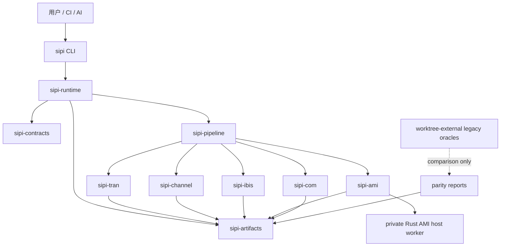

# SIPI-sim-agent 平台技术规格 v0.2

> 状态：已接受的产品重基线
> 日期：2026-08-09
> 目标读者：平台架构、TRAN/Channel/IBIS-AMI/COM 开发者、测试与发布维护者
> 决策记录：[ADR-011](docs/adr/ADR-011-native-mit-rust-product-boundary.md)

## 1. 结论

`SIPI-sim-agent` 的终态不是三个旧项目的进程编排器，而是一个拥有自身数值能力的原生 SIPI 仿真平台：

1. **一个公开产品入口。** 用户和自动化只需要 `sipi` CLI；TRAN、Channel、IBIS-AMI、COM 和跨域流水线通过稳定、可发现、版本化的命令与 JSON 契约暴露。
2. **一个 Rust 产品实现。** 发布运行时、领域内核、契约、工件管理、流水线和 CLI 均由同一 Rust workspace 提供。允许内部隔离 worker，但不把 Python、MATLAB 或旧项目可执行文件作为产品运行依赖。
3. **第一方源码采用 MIT。** 最终产品仓中的第一方可发布源码统一为 MIT。MIT-compatible 第三方依赖保留其原许可证、NOTICE 和 SBOM；供应商 DLL、IBIS/AMI 模型及不可再分发 oracle 默认由用户外部提供，不进入发行包。
4. **非 MIT 第一方实现采用可审计 clean-room 重做。** 非 MIT 源码不能被翻译、搬运或通过 history rewrite 进入产品实现。旧实现只可在隔离的观察侧充当黑盒 oracle；实现侧只接收公开标准、授权材料和独立行为规格。
5. **准确性按已定义 profile 认证。** 三个旧项目已经通过的例子成为带来源、输入哈希、stage、容差和非宣称范围的验收 profile。通过一个例子只认证该 profile，不能外推为整个标准或所有模型的准确性。
6. **旧平台代码降级为迁移设施。** 当前 Python contracts/runtime/adapters、旧 engine bundle、PyBERT CI/nightly 和跨仓比较器可继续产生证据，但不是终态产品架构。删除仍受用户批准、golden 完备和漂移门同批移除约束。

本规格中的“MIT-only 产品”专指第一方产品源码和发行边界，不虚构第三方依赖也采用 MIT。任何随发行物分发的第三方组件都必须具有明确、兼容的分发许可。

## 2. 产品边界

### 2.1 最终发行物

最终发行物包含：

- 一个公开的 `sipi` CLI。
- Rust 领域内核：TRAN、Channel、IBIS、AMI、COM。
- Rust 契约、校验、工件、比较、流水线和运行时。
- 由 Rust 契约生成并随版本发布的 JSON Schema。
- 许可证、NOTICE、SBOM、能力矩阵和 profile 级认证报告。
- 必要时由同一源码和工具链构建的私有 worker，例如 AMI DLL host；worker 不是第二套用户 API。

### 2.2 不属于最终产品的材料

以下材料可留作迁移或验证设施，但不得成为正式运行依赖：

- `agent-spice`、`Py-bert-agent`、`agent-com` 的 Python/MATLAB 运行时。
- Python process adapter、兼容 CLI、editable/path dependency 和旧 `engine.lock` 路由。
- 非 MIT 源码及其派生翻译、非 MIT 历史、来源不明的 fixture/golden。
- 用户或供应商提供的 DLL、IBIS、AMI、Touchstone、workbook 和私有模型。
- 只在旧项目环境中可运行的 oracle、GUI、Web 服务和 optimizer。

这些材料必须位于产品发布边界之外，并由哈希、来源和用途清单引用。仓库中现存的迁移设施在 Rust 替代路径通过退出门前不被草率删除，但 release verifier 必须能证明正式包不依赖它们。

### 2.3 平台认证范围

- 首个认证平台为 Windows x86_64。
- Linux/macOS 可构建或可运行不等于已认证；在专门 profile 通过前必须显示为 `uncertified` 或 `unsupported`。
- 能力声明精确到 `domain + mode + input family + behavior profile + platform`，禁止只写宽泛的“支持 Channel”或“支持 AMI”。

## 3. 产品目标与非目标

### 3.1 目标

1. 原生运行 TRAN、Channel、IBIS-AMI 和 COM 分析，并能组成显式跨域流水线。
2. 保持三个旧项目已选定示例在预先冻结的数值容差内一致。
3. 让人和 AI 都能发现 schema、校验请求、运行分析、检查能力、追踪工件和比较结果。
4. 对单位、端口、参考阻抗、符号、频时变换、随机性和近似策略给出机器可读语义。
5. 对 unsupported、资源限制、数值失败、外部模型失败和部分输出统一 fail closed。
6. 每次成功结果可追溯到源码构建、输入、外部资产、算法 profile、平台和比较证据。
7. 领域内核保持独立，避免为“统一”而合并语义不同的算法。

### 3.2 非目标

- 不实现完整 ADS schematic、HFSS/EM 场求解或版图提取。
- 不承诺完整 HSPICE/ngspice 语法和器件兼容；TRAN 只认证明确列出的子集。
- 不把 COM 行为复刻描述成 IEEE 官方认证。
- 不把供应商 AMI 模型或其依赖打包进默认发行物。
- 不把自然语言猜测、隐式默认或 silent fallback 当作“AI 友好”。
- 不为了让比较通过而重录旧 golden、改变物理算法或事后放宽容差。
- 不在没有 clean-room 证据时把“重新用 Rust 写了一遍”宣称为 clean-room。
- 不因 Rust workspace 统一而宣称 Linux/macOS、所有 S 参数、所有 AMI 模型或所有 COM case 已认证。

## 4. 许可与 clean-room

### 4.1 许可政策

| 材料 | 产品仓策略 | 可否进入发行物 |
| --- | --- | --- |
| 本项目新写的第一方源码 | MIT，文件与包元数据一致 | 可以 |
| 已确认 MIT 的旧项目源码 | 可直接复用或移植，保留版权与来源 | 通过来源审计后可以 |
| BSD/Apache-2.0 等 MIT-compatible 依赖 | 作为第三方依赖使用，不改写其许可证 | 完成 NOTICE/SBOM 后可以 |
| 非 MIT 第一方实现 | clean-room 行为重做，原源码不迁入 | 原源码不可以；新实现通过审计后可以 |
| 用户/供应商模型与 DLL | 外部引用，逐项 hash 和授权用途 | 默认不可以 |
| 来源或授权不明的代码/数据/模型 | `blocked_unknown` | 不可以 |

“用户允许测试某个资产”不自动等于允许公开分发。私有运行许可、公开分发许可和源码迁入许可必须分别记录。

### 4.2 材料分类

所有可能影响实现或验收的材料必须进入版本化清单，并归入以下一种状态：

- `mit_source`：已核验为 MIT，可直接复用。
- `compatible_dependency`：可分发的第三方依赖，保留其许可证和 NOTICE。
- `public_standard`：公开标准或公开、可引用的技术资料。
- `oracle_black_box`：只允许观察输入/输出，不向实现侧暴露源码。
- `external_reference_only`：允许在用户提供的位置运行或校验，不复制进仓库/发行物。
- `blocked_unknown`：来源、权利或范围不足，只能盘点。
- `prohibited_implementation_input`：非 MIT 源码或受限材料，clean-room 实现者不得读取。

清单至少记录：逻辑 ID、repo/ref/path 或外部标识、blob/hash、许可表达、允许动作、owner、证据、过期条件和目标 capability。

### 4.3 clean-room 角色与流程

严格 clean-room 采用两侧隔离：

1. **观察/规格侧**可运行经授权的旧实现，阅读公开标准，并产出独立行为规格。规格只描述输入、输出、单位、状态机、边界条件、已观察行为、容差和非宣称，不能包含受限源码片段、控制流翻译或可识别实现细节。
2. **实现侧**只读取 allowlist 中的 `public_standard`、`mit_source`、自有测试和独立行为规格，在 Rust 中独立设计实现。
3. **比较侧**在工作树外运行旧 oracle 与 Rust candidate，生成内容寻址的结构化报告；受限输入/输出只有在许可允许时才存储。
4. **审计侧**核验材料清单、角色记录、提交 provenance、依赖许可和行为比较，不以代码“看起来不同”替代来源证据。

若实现者或生成实现的工具已接触对应非 MIT 源码，则该实现不能自行声明严格 clean-room。处理方式只有：独立实现者重做、取得重许可/双许可，或把能力保持为未支持。

### 4.4 旧项目的默认处置

- `agent-spice`：已确认 MIT 的 Rust 源码可作为 TRAN 候选，仍需逐文件来源、依赖和构建审计；Python 层不是终态依赖。
- `agent-com`：已确认 MIT 的源码可作为行为参考或直接移植依据；最终产品实现仍必须是 Rust。
- `Py-bert-agent` 主源码和 PyAMI：不进入 MIT 第一方实现历史。它们只作为外部 oracle/规格来源；既有 BSD 派生 Rust 代码必须隔离，除非取得重许可或由合格 clean-room 实现替代。
- 供应商 IBIS/AMI/DLL、私有模型和 MATLAB corpus：默认 `external_reference_only`，不随产品发布。

### 4.5 发布许可门

任何发布必须同时满足：

- 第一方 product allowlist 中每个源码文件均由根 MIT 许可证覆盖。
- 每个 Cargo 依赖存在锁定版本、许可证表达、来源和分发判定。
- NOTICE/SBOM 与二进制实际闭包一致。
- release archive 不含 `blocked_unknown`、`external_reference_only` 或禁止材料。
- dynamic load 的外部 DLL 在结果中记录身份，但不被误列为产品自带能力。
- 许可 verifier 对缺失、冲突或未覆盖路径 fail closed。

## 5. 总体架构



### 5.1 Rust workspace

目标形态：

```text
SIPI-sim-agent/
├── Cargo.toml
├── crates/
│   ├── sipi-types/
│   ├── sipi-contracts/
│   ├── sipi-artifacts/
│   ├── sipi-runtime/
│   ├── sipi-tran/
│   ├── sipi-channel/
│   ├── sipi-ibis/
│   ├── sipi-ami/
│   ├── sipi-com/
│   ├── sipi-pipeline/
│   └── sipi-cli/
├── schemas/                 # 由已版本化 Rust contracts 生成并冻结
├── examples/                # 仅含可再分发输入
├── acceptance/              # profile、容差、来源与报告索引
├── docs/clean-room/
├── docs/adr/
└── legacy/ 或工作树外工具    # 过渡期，不进入正式发行物
```

现有 `native/crates/sipi-circuit` 和 `native/crates/sipi-ami` 是候选输入，不因位于 Rust 目录就自动取得最终产品资格。迁入目标 workspace 前必须通过来源和行为门。

### 5.2 依赖方向

```text
sipi-cli -> sipi-runtime -> sipi-pipeline -> domain crates
                    |              |
                    v              v
              sipi-artifacts   sipi-contracts -> sipi-types

domain crates -> sipi-contracts / sipi-types
domain crates -X-> CLI / Python / Web / Agent / legacy oracle
```

- 每个物理变换只有一个 production owner crate。
- adapter 只能转换契约和传输数据，不能重采样、IFFT、termination、均衡、符号翻转或另写 resolver。
- 公共 CLI 不直接暴露私有 solver 符号。
- 领域 crate 不依赖产品展示层，也不读取隐式全局配置。

### 5.3 一个 CLI，不强求一个进程

`sipi` 是唯一公开入口。为了隔离不可信供应商 DLL、限制资源或提高崩溃可恢复性，运行时可以启动由同一 workspace 构建、版本绑定的私有 worker。worker：

- 只能通过版本化内部协议调用。
- 必须绑定 executable hash/build ID。
- 不可被 PATH 搜索或作为第二套用户命令宣传。
- 崩溃、超时、取消和部分输出必须由 `sipi` 统一分类。

## 6. 契约与数据模型

### 6.1 契约权威

- Rust `sipi-contracts` 中的版本化类型和校验规则是执行权威。
- 发布 JSON Schema 由该 crate 确定性生成并提交快照；CI 拒绝手改漂移。
- 现有 `sipi.*.v1` schema 在兼容模块中保持已认证 wire 行为。语义变化必须新版本，不得原地改写。
- 跨字段物理规则必须进入版本化 rule ledger 和机器测试，不能只写在 prose。

### 6.2 共享语义类型

最小共享类型包括：

- `Axis`：值、单位、单调性、采样约束。
- `PortMap`：端口 ID、顺序、单端/差分 basis、极性、外部 index base。
- `NetworkTensor`：频率轴、复数矩阵、参数类型、wave definition、参考阻抗、布局。
- `Waveform` / `Spectrum`：轴、单位、通道、布局和内容哈希。
- `ChannelResponse`：sample interval、响应单位、端口/termination/符号 provenance。
- `TransformPolicy`：插值、DC、窗口、因果化、FFT 缩放、裁剪、归一化。
- `ArtifactRef`：内容地址、媒体类型、schema、大小和逻辑角色。
- `Provenance`：构建、输入、外部资产、算法 profile、随机性、平台和依赖。

所有内部物理量使用 SI；CLI 允许带单位输入，但 resolved request 必须写出规范化 SI 值。布尔值不得被数值字段接受，NaN/Inf 默认拒绝。

### 6.3 运行请求与结果

公开运行使用 discriminated request：

- `schema`
- `analysis.kind`
- `analysis.profile`
- `input`
- `options`
- `resources`
- `randomness`
- `outputs`

结果至少包含：

- `schema`、`status`、`analysis`、`capability_claim`
- resolved request hash
- metrics 和诊断
- stage artifact references
- warnings、approximations 和 unsupported 边界
- 完整 provenance
- success manifest hash

`success` 只能在所有必需工件完成校验并原子发布后出现。失败或取消不得留下可被下一阶段当作成功消费的 manifest。

### 6.4 能力协商

`sipi capabilities --json` 返回 profile 级矩阵：

- `certified`：许可、契约、数值、集成和发布门均通过。
- `experimental`：可显式运行，但至少一个认证门未关闭。
- `unsupported`：明确拒绝，不尝试 fallback。
- `external_asset_required`：能力实现存在，但需要用户提供已校验资产。

默认路由只能选择 `certified` profile。`experimental` 必须由用户显式请求；不存在从 Rust 失败后静默退回 Python/旧引擎的产品路径。

### 6.5 错误、取消与资源

稳定错误类别至少包括：

- `InvalidRequest`
- `UnsupportedCapability`
- `ExternalAssetMissing`
- `ExternalAssetRejected`
- `NumericFailure`
- `ConvergenceFailure`
- `ResourceLimitExceeded`
- `Timeout`
- `Cancelled`
- `WorkerFailure`
- `InternalError`

错误对象包含稳定 code、字段 path、可重试性、简短 message、诊断和相关 artifact；不得要求 AI 从任意 stderr 文本猜测状态。取消、wall time、内存和进程树限制由 Rust runtime 统一执行。

### 6.6 工件与 provenance

- 大数组使用带 schema 和 SHA-256 的二进制/NPZ 等工件，JSON 只放描述符和小型指标。
- 所有写入采用 staging -> validate/hash -> atomic publish。
- portable report 不记录用户绝对路径，只记录逻辑 ID、内容哈希和必要环境信息。
- cache key 包含 canonical request、所有输入/上游 artifact、实现 build、profile、数值 policy、随机输入和外部资产；不含 run ID、时间戳或绝对路径。
- 同一输入若更换 DLL、模型、transform policy、端口映射或 executable build，必须产生不同 identity。

## 7. 领域引擎规格

### 7.1 TRAN

`sipi-tran` 负责明确列出的 SPICE/网络瞬态分析子集，并可逐步承接 OP/DC/AC：

- 输入：版本化 netlist/电路 DTO、模型、stimulus、solver policy、资源限制。
- 输出：时间轴、电压/电流波形、测量值、收敛报告和 solver provenance。
- 必须显式声明器件、语法、积分方法和收敛策略支持矩阵。
- 不支持的语法/器件直接拒绝，不调用旧 Agent-Spice 兜底。
- Agent-Spice 中已确认 MIT 的 Rust 内核可在逐文件审计后复用；数值重构与迁移提交分开。

### 7.2 Channel

`sipi-channel` 拥有唯一 production Channel 数据通路：

1. RLGC/Touchstone/已解析网络到规范化 channel response。
2. TX stimulus 和 channel convolution。
3. RX FFE/CTLE、DFE/CDR、decision、BER、eye/jitter 等已认证 stage。

每一步必须固定单位、端口、source/load、wave definition、FFT scaling、sign 和时间基准。禁止 adapter 或 pipeline 再实现第二套 S 参数 resolver。PyBERT 只作为隔离 oracle；非 MIT/BSD 派生实现不能直接进入本 crate。

### 7.3 IBIS

`sipi-ibis` 负责 clean-room Rust IBIS 解析和已声明语义：

- 文件解析、model/selector/corner 选择。
- I-V、V-T、ramp、package parasitic 等已支持表的规范化。
- 明确的插值、外推、单位和 warning policy。
- 对 unsupported keyword、歧义选择和不完整模型 fail closed。

支持矩阵按 IBIS 版本和 keyword family 声明；解析成功不等于模型电气行为已认证。

### 7.4 AMI

`sipi-ami` 负责 clean-room Rust `.ami` 语义和标准 ABI host：

- `.ami` 解析、参数树、合法性和绑定。
- Windows x64 动态加载与标准 `Init -> optional GetWave -> Close` 生命周期。
- 原始 waveform、clock、status、message 和 parameter 字节的无损传递。
- 不可信 DLL 使用私有 Rust worker 隔离，绑定 DLL/依赖 closure 和请求哈希。
- timeout/cancel/partial output/Close failure 均不可发布成功结果。

供应商 DLL 和模型由用户提供，不进入发行包。单一 fixture 的 ABI 输出等价只认证该 fixture 和调用序列，不等于 AMI waveform、BER 或眼图的通用认证。

### 7.5 COM

`sipi-com` 在 Rust 中实现明确版本的 COM behavior profile：

- 参数 JSON 是规范输入；workbook importer 是独立、可审计的输入适配层。
- 通道选择、equalizer search、PDF、metrics 和报告 stage 均有 typed output。
- 与 `agent-com` 既有 MIT 行为 profile 逐 stage 对比，保留 warning 和选择证据。
- profile 名必须包含标准/实现版本；不得宣称 IEEE 官方一致性认证。

### 7.6 跨域流水线

`sipi-pipeline` 只编排 typed artifact edge，例如：

- TRAN/RFM network response -> Channel response
- IBIS model -> Channel TX/RX stage
- AMI raw output -> Channel receiver stage
- 同一 network/project -> Channel 与 COM 并行分析

每条 edge 都有 producer schema、consumer schema、单位/端口 policy 和 hash。pipeline 不执行隐藏的物理修复；需要变换时调用唯一 owner crate，并把 report 作为工件。

## 8. CLI 与 AI 接口

### 8.1 命令面

```text
sipi version --json
sipi doctor --json
sipi capabilities --json
sipi schema list --json
sipi schema show <id> --json
sipi validate --request <file|-> --json
sipi tran run --request <file|-> --json
sipi channel run --request <file|-> --json
sipi ibis inspect --request <file|-> --json
sipi ami run --request <file|-> --json
sipi com run --request <file|-> --json
sipi project run --request <file|-> --json
sipi compare --request <file|-> --json
sipi inspect --artifact <path> --json
sipi report --run <path> --json
```

领域快捷命令和 `sipi project run` 使用同一底层 request/result schema，不形成两套行为。

### 8.2 机器友好规则

- `--json` 时 stdout 只输出一个 JSON 文档；日志、进度和诊断写 stderr 或显式 NDJSON event stream。
- 非交互环境不弹提示、不读取 GUI 状态、不猜测工作目录中的模型。
- schema、enum、默认值、unsupported 原因和 example request 可由命令发现。
- 所有外部路径必须显式给出，并在 resolved request 中转为内容 identity。
- 稳定 exit code 与结构化 error code 一一映射。
- CLI option 只是构造同一版本化 request，不绕过 contract validation。
- AI 工具只封装这些命令/契约，不获得任意 shell、任意文件扫描或私有 solver API。

### 8.3 易用性原则

- 常见分析提供短命令和最小必需参数，但 resolved request 永远完整。
- 错误指出字段路径、允许值、缺失 capability 和下一步，不输出模糊 traceback 作为主要界面。
- `schema show` 和 `capabilities` 是 AI 规划调用前的权威信息源。
- 相同请求在 CLI、CI 和未来服务层具有相同语义与 provenance。

## 9. 准确性与既有示例

### 9.1 验收 profile

三个旧项目的每个被保留例子都必须形成 `sipi.acceptance-profile.v1`，至少记录：

- profile ID、domain、scope 和 required/optional 等级。
- 来源 repo/commit/tree/path/blob/SHA-256。
- fixture 许可和存储策略。
- oracle executable/package/build/environment identity。
- canonical SIPI request 和输入映射。
- stage 列表、数组/指标比较规则和预先批准容差。
- 离散值 exact 规则、浮点 max-abs/max-rel/ULP 或领域指标规则。
- 平台、随机种子、重复次数和确定性要求。
- 已知 unsupported、近似和 non-claims。

### 9.2 比较层级

比较按定位能力从内到外执行：

1. contract/shape/dtype/unit/finite。
2. 解析与 normalized input。
3. 领域中间 stage。
4. 最终 waveform/spectrum/decision。
5. BER、eye、jitter、COM 等指标。
6. provenance 和 artifact chain。

bits、decision、indices、状态机和选择结果原则上 exact；连续数组使用 profile 预先批准的容差。性能只在独立预算中判定，不混入数值容差。

### 9.3 Golden 规则

- 不覆盖或“修正”旧 golden 来让 candidate 通过。
- 不在实现失败后同一变更中放宽容差。
- golden 变更必须说明上游输入/标准/bug 修复原因，经用户批准，并保留旧值和差异报告。
- 可再分发 fixture 才能进入仓库；外部 fixture 只存 manifest/hash 和重放工具。
- 若 oracle 输出不可存储，只保留授权环境中的 compare report、hash 和最小可披露指标。
- 一个 profile 通过只允许声明“该 profile 通过”，不可写成全域数值等价。

### 9.4 独立正确性

旧实现不是唯一真相。每个领域还必须有适用的：

- 公共标准例题或解析规则。
- 自有 MIT 小型 fixture。
- property/metamorphic tests。
- conservation、causality、passivity、维度、稳定性等领域不变量。
- 负例和 fail-closed 测试。

oracle parity 与独立正确性门同时存在，避免忠实复制旧 bug。

## 10. 非功能要求

### 10.1 确定性

- 随机性必须显式 seed；并行归约、FFT 和 solver profile 进入 provenance。
- 同一认证环境和请求应产生相同离散结果及容差内连续结果。
- canonical serialization 与 artifact hash 跨进程稳定。

### 10.2 可靠性

- worker crash、panic、OOM、timeout、cancel 和 output commit failure 不发布 success。
- release 路径必须使用锁定依赖和隔离构建目录。
- 部分工件不可被缓存命中或下游消费。
- 所有外部模型在受控路径、环境和资源策略下运行。

### 10.3 性能

- 先冻结 workload、基线、采样方法、重复规则和 owner-approved 预算，再判 pass/fail。
- 性能优化不得与行为迁移或 golden 变更混在同一提交。
- stage profiling 只记录已定义测量，不以一次本机观察宣传性能。

### 10.4 安全

- CLI 不执行请求中任意 shell。
- 外部 DLL、模型和输入采用 allowlist、hash、路径 containment 和大小限制。
- AMI DLL 默认进程隔离；kill-on-close 和进程树清理可审计。
- 报告不泄露用户绝对路径、环境秘密或私有模型内容。

### 10.5 可移植性

- 数值 core 避免不必要的平台 API；平台专用 host/资源控制放在窄模块。
- Windows x86_64 是首个认证目标。
- Linux/macOS 只有在各自完整 profile 门通过后才升级状态。

## 11. 验证门禁

| Gate | 目的 | 最小退出条件 |
| --- | --- | --- |
| G0 Product Boundary | 许可与来源 | product allowlist 穷尽、无未知/禁止材料、MIT/NOTICE/SBOM 一致 |
| G1 Contracts | wire 与物理语义 | schema 生成无漂移、跨字段 rule ledger、Rust round-trip/负例通过 |
| G2 Domain Core | 独立正确性 | unit/property/metamorphic/资源与 fail-closed 测试通过 |
| G3 Oracle Parity | 保持既有例子 | required profile 的来源、stage、容差、报告和 non-claims 完整且通过 |
| G4 Integration | 跨域数据通路 | typed edge、唯一 resolver、artifact/provenance chain 端到端通过 |
| G5 CLI | 用户与 AI 可用 | schema/capability 可发现、稳定 JSON/error/exit code、无隐式 fallback |
| G6 Release | 可分发产品 | locked clean build、Windows package、SBOM/NOTICE、安装 smoke、release archive 扫描通过 |

任何 capability 只有在其适用的 G0-G6 全部通过后才可标为 `certified`。Gate 报告必须绑定确切 commit 和工件 hash，旧 commit 的成功不能替代当前 commit。

## 12. 迁移处置

### 12.1 可复用基础

以下 v0.1 成果可继续使用，但需进入 Rust 终态或重新认证：

- 版本化 run/result/artifact/capability 契约思想。
- SI 单位、端口、网络张量、transform policy 和 provenance 规则。
- 单 resolver、fail-closed、原子工件发布和资源隔离纪律。
- M3/M4 已接受的纵向证据和跨域 DTO，可作为新 Rust contract 的兼容基线。
- `sipi-circuit`、`sipi-ami` 的候选 Rust 实现，前提是来源与 clean-room 审计通过。
- 现有 compare、replay、license verifier 和独立审计流程。

### 12.2 仅作迁移/oracle 的资产

- Python `apps/`、`packages/sipi-runtime`、`sipi-adapters` 和旧 Web/CLI。
- Agent-Spice/PyBERT/Agent-COM process bundle 与旧 engine lock。
- PyBERT source acceptance、nightly、wheel/fault drill。
- AMI candidate process adapter、授权 fixture replay 和跨仓比较器。
- 跨仓历史迁入 preflight。

这些资产可继续提供证据，但不能作为“Rust 产品已完成”的依据。

### 12.3 终止的迁入路线

- 不把 PyBERT BSD/非 MIT 历史通过 `filter-repo` 迁入最终 MIT 产品仓。
- 不把 Python -> auto -> Rust fallback 作为终态默认切换策略。
- 不把三个独立 wheel/环境作为最终产品发布形态。

如需保留旧历史，使用独立的 evidence/quarantine repo 或原仓 tag；最终产品只引用 commit/hash 和审计报告。

### 12.4 删除门

删除旧 Python/adapter/漂移门只能在以下条件同批满足时进行：

1. 用户明确批准删除范围。
2. 对应 Rust capability 已通过 required profiles 和 release 门。
3. release/build/runtime 不再依赖旧路径。
4. golden、oracle replay 和差异证据可追溯。
5. 旧实现及其专属漂移门在同一变更中移除，不能留下两套 production resolver。

## 13. 决策与开放项

### 13.1 已接受决策

- 产品终态为单一 Rust workspace 和单一公开 `sipi` CLI。
- 第一方可发布源码统一 MIT；compatible 依赖保留自身许可。
- 非 MIT 第一方实现走严格 clean-room，否则保持 unsupported。
- 旧项目只作外部 oracle 或 MIT 源码候选，不是运行依赖。
- 供应商模型/DLL 默认外部提供且不打包。
- Windows x86_64 优先认证，Linux/macOS 暂缓。
- 示例准确性按 profile/stage/tolerance 限定声明。

### 13.2 仍需逐项关闭

- 当前仓库每个路径的 product/migration/quarantine 分类。
- `sipi-circuit` 和 `sipi-ami` 的逐文件来源与实现者材料审计。
- 三个旧项目 required acceptance profile 的完整清单和许可状态。
- 各领域第一版 certified capability 的最小子集。
- AMI 代表性外部 fixture 范围和动态依赖 closure。
- TRAN/Channel/COM 的 owner-approved 性能预算。
- 最终 Windows 安装包格式与签名策略。

## 14. 完成定义

项目达到本规格的首个正式版本，必须同时满足：

1. 正式发行物中的第一方源码和包元数据均为 MIT，第三方依赖许可、NOTICE 和 SBOM 完整。
2. 产品运行、契约、工件、流水线、领域内核和 CLI 均为 Rust；无 Python/MATLAB/旧引擎运行依赖。
3. `sipi` 是唯一公开入口，并提供稳定 JSON schema、capabilities、errors、provenance 和非交互行为。
4. TRAN、Channel、IBIS-AMI、COM 各至少一个明确 capability profile 达到 `certified`。
5. 三个旧项目中被列为 required 的示例全部在预先批准范围内通过，或由用户明确降级/移除并保留理由。
6. 跨域流水线使用 typed artifact 和唯一物理 owner，无第二 resolver 或 silent fallback。
7. Windows x86_64 的 clean locked build、安装、运行、故障和 release archive 门通过。
8. 所有能力声明均带 scope 和 non-claims；未认证能力在 CLI 中明确拒绝或标 experimental。

这一定义不要求一次性实现旧项目的所有功能。它要求首个发布的每一项能力都在许可、实现语言、准确性和接口上诚实闭环。
